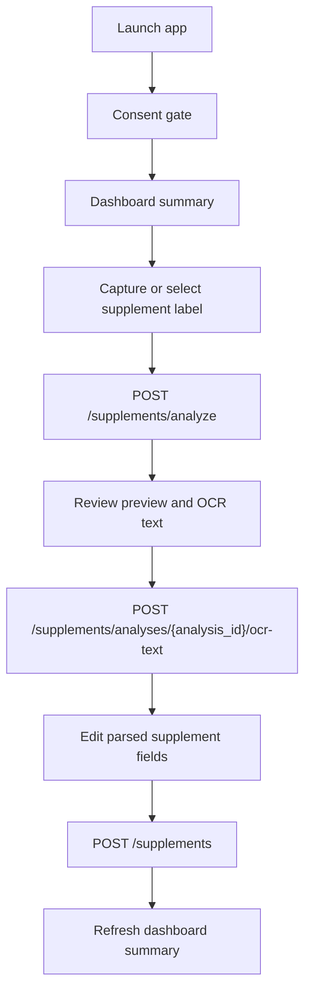

# 04. P2 Mobile/Frontend Minimum Screen Connection Plan

> Status: implemented as minimum Flutter MVP
> Date: 2026-05-15
> Scope: `mobile/flutter_app` first, with web frontend reuse deferred until the mobile demo flow is working
> Implementation stance: thin client over the existing Nutrition backend contract

## 1. Objective

`mobile/flutter_app` started as empty platform and source directories. P2 creates demo value by connecting a minimal Flutter UI to the already implemented backend path:

1. Capture or select a supplement label image.
2. Upload the image for a temporary supplement analysis preview.
3. Let the user review OCR text and parsed candidates.
4. Register only user-confirmed supplement data.
5. Refresh the dashboard summary.

This plan intentionally avoids claiming OCR accuracy. Provider quality must stay evidence-gated by fixture evaluation. The UI should present OCR and parser output as candidates requiring user confirmation, not as final truth.

## 1.1 Implementation Checkpoint

Implemented path:

- `mobile/flutter_app/` is now a real Flutter project.
- Runtime config is loaded from `LEMON_API_BASE_URL` and optional `LEMON_API_TOKEN`.
- The mobile app includes:
  - consent gate for `ocr_image_processing` and `sensitive_health_analysis`
  - dashboard summary tab
  - supplement image capture/gallery upload
  - OCR text review
  - user-confirmed supplement registration
- Root mobile CI now detects `mobile/flutter_app/pubspec.yaml` and runs the existing Flutter quality job.

Verification completed:

- `dart format --output=none --set-exit-if-changed .`
- `flutter analyze`
- `flutter test`

## 2. Official References Checked

The implementation should use only verified APIs from the official framework and package documentation below.

| Area | Source | Design implication |
| --- | --- | --- |
| Flutter HTTP GET and JSON parsing | https://docs.flutter.dev/cookbook/networking/fetch-data | Build a small `ApiClient` that parses successful JSON responses into typed Dart models and maps non-2xx responses to UI errors. |
| Flutter HTTP POST and JSON body | https://docs.flutter.dev/cookbook/networking/send-data | Use `Content-Type: application/json; charset=UTF-8` for OCR text parse and supplement registration requests. |
| Flutter authenticated requests | https://docs.flutter.dev/cookbook/networking/authenticated-requests | Keep optional bearer-token support through the standard `Authorization` header. Local `AUTH_MODE=disabled` demo can run without a token. |
| Dart `http.MultipartRequest` | https://pub.dev/documentation/http/latest/http/MultipartRequest-class.html | Use multipart form upload for `POST /api/v1/supplements/analyze`; do not manually override the multipart `Content-Type`. |
| Flutter `image_picker` package | https://pub.dev/packages/image_picker | Use `pickImage` for camera/gallery, add iOS permission strings, and handle Android lost data with `retrieveLostData` at startup. |
| Flutter integration tests | https://docs.flutter.dev/testing/integration-tests | Add `integration_test/` only after the basic UI exists; keep initial verification at `flutter analyze` and widget/model tests. |
| FastAPI file upload contract | https://fastapi.tiangolo.com/tutorial/request-files/ | The backend upload route expects file and form fields as `multipart/form-data`, not JSON. |

## 3. Current Repository Facts

### 3.1 Client folders

- Before this P2 implementation, `mobile/flutter_app/` had `android/`, `ios/`, `lib/`, and `test/` directories, but no files. It now contains a minimal Flutter app with backend API wiring.
- `frontend/` currently has only `.DS_Store` and `README.md`; there is no active web app implementation to connect.
- Existing mobile guide docs are useful historical context, but `docs/Nutrition-docs/dev-guides/11-mobile-camera-screen.md` assumes image upload directly to `POST /api/v1/supplements`. The current backend contract uses `POST /api/v1/supplements/analyze` first, so P2 must not copy that older endpoint assumption.

### 3.2 Backend endpoints to consume

All endpoints below are under `api_router = APIRouter(prefix="/api/v1")`.

| UI step | Endpoint | Request shape | Success response | Required backend gate |
| --- | --- | --- | --- | --- |
| Consent gate | `GET /api/v1/me/privacy/consents` | none | active consent state | `privacy:read` |
| Grant OCR consent | `POST /api/v1/me/privacy/consents/ocr_image_processing` | path param only | consent action | `privacy:write` |
| Grant health-analysis consent | `POST /api/v1/me/privacy/consents/sensitive_health_analysis` | path param only | consent action | `privacy:write` |
| Capture upload | `POST /api/v1/supplements/analyze` | multipart field `image`, optional form field `client_request_id` | `SupplementAnalysisPreview`, `202` | `supplement:write`, `ocr_image_processing`, optional `external_ocr_processing` when external OCR is enabled |
| OCR text review | `POST /api/v1/supplements/analyses/{analysis_id}/ocr-text` | JSON: `ocr_text`, `ocr_provider`, `ocr_confidence` | updated `SupplementAnalysisPreview`, `200` | `supplement:write`, `ocr_image_processing` |
| Confirm registration | `POST /api/v1/supplements` | JSON: `UserSupplementCreate` with `user_confirmed: true` | `UserSupplementResponse`, `201` | `supplement:write`, `sensitive_health_analysis` |
| Dashboard | `GET /api/v1/dashboard/summary?days=30` | query params | `DashboardSummaryResponse`, `200` | `dashboard:read`, `sensitive_health_analysis` |

Local development can use `AUTH_MODE=disabled`, which returns a deterministic local principal with development scopes. JWT mode still needs `Authorization: Bearer <token>`.

## 4. Brainstorming and Decision

### Option A - Flutter MVP over current backend contract

Use the empty `mobile/flutter_app` directory to build a small Flutter app that calls the current Nutrition backend endpoints. The first version keeps state in memory, uses hand-written model classes, and avoids generated-code dependencies.

Decision: adopt.

Why:

- It directly addresses the empty mobile app risk.
- It gives demo value without changing the stable backend.
- It keeps the OCR flow honest by forcing user confirmation before persistence.
- It can be validated with `flutter analyze`, `flutter test`, and local backend smoke calls.

### Option B - Web frontend first

Create a browser demo instead of mobile, using the same backend endpoints.

Decision: defer.

Why:

- The user specifically identified `mobile/flutter_app` as empty.
- Camera/gallery capture has stronger product value on mobile.
- The web frontend folder has no implementation foundation, so starting there would create another scaffold instead of reducing the current gap.

### Option C - Full mobile architecture upfront

Introduce Dio, Riverpod, Freezed, route generation, secure storage, camera cropper, charts, and full dashboard pages in the first pass.

Decision: reject for P2 minimum.

Why:

- It would spend the first implementation cycle on framework structure instead of proving end-to-end backend connectivity.
- Generated-code dependencies add setup and CI risk before the contract is stable on the client.
- The backend already has most domain complexity; the first client should be a thin integration layer.

### Option D - Native iOS or Android only

Build a single-platform native demo.

Decision: reject.

Why:

- The repository already allocates `mobile/flutter_app` for cross-platform mobile work.
- Flutter can cover camera/gallery, HTTP, and tests with fewer project-specific branches for this demo.

## 5. Target Product Flow



The UI should not imply medical diagnosis or OCR certainty. It should show supplement extraction as an intake workflow and require explicit user confirmation before registration.

## 6. Screen Design

### 6.1 Consent Gate

Purpose:

- Explain that image OCR and sensitive health analysis are separate backend consent gates.
- Let the user explicitly grant `ocr_image_processing` and `sensitive_health_analysis`.
- Show a clear error if the backend returns `403 consent_required`.

Minimal controls:

- Two consent rows with current granted/not granted state.
- A primary action that grants missing required consents.
- A retry action for dashboard load after consent changes.

Implementation notes:

- Do not silently grant consents on launch.
- In local demo mode, this still calls the same privacy endpoints so the demo matches backend behavior.
- If external OCR is enabled later, add `external_ocr_processing` to this gate only when the backend requires it.

### 6.2 Dashboard Summary

Purpose:

- Prove that the mobile app can read the backend aggregate state.
- Provide a visible before/after signal when supplement registration succeeds.

Fields to display first:

- `supplements.registered_count`
- `supplements.requires_review_count`
- `nutrition.data_status`
- `activity.data_status`
- `weight.data_status`
- `disclaimers`

Deferred:

- Charts.
- Full nutrient detail pages.
- Weight projection chart.
- Activity recommendation detail pages.

### 6.3 Capture and Upload

Purpose:

- Let the user take a photo or choose a gallery image.
- Upload the selected image to `POST /api/v1/supplements/analyze`.
- Show preview status, warnings, candidate counts, and expiration time.

Implementation notes:

- Use `image_picker` `pickImage` for camera/gallery.
- Add iOS `NSCameraUsageDescription` and `NSPhotoLibraryUsageDescription`.
- Run `ImagePicker.retrieveLostData()` at startup to handle Android activity recreation.
- Use `http.MultipartRequest` with:
  - multipart file field: `image`
  - form field: `client_request_id`
- The mobile client must not store the raw image permanently. The selected file can remain in app cache for the active screen only.

### 6.4 OCR Text Confirmation

Purpose:

- Keep the product useful when OCR providers are fail-closed or unavailable.
- Let the user paste or edit OCR text from the label.
- Send the text to the backend parser without persisting raw OCR text.

Payload:

```json
{
  "ocr_text": "Vitamin D 25 ug ...",
  "ocr_provider": "manual_demo",
  "ocr_confidence": null
}
```

Implementation notes:

- Use `POST /api/v1/supplements/analyses/{analysis_id}/ocr-text`.
- Keep the text in a transient `TextEditingController`.
- Clear the controller after successful registration or when the user restarts capture.
- Never log raw OCR text.

### 6.5 Supplement Registration

Purpose:

- Convert preview candidates into editable user-confirmed data.
- Persist only fields the user confirms.

Minimum editable fields:

- Product display name.
- Manufacturer.
- Ingredient rows:
  - `display_name`
  - `amount`
  - `unit`
  - optional `nutrient_code`
  - `confidence` retained from preview or set to `1.0` for manual entries
  - `source` as `ocr_llm_preview` or `user_confirmed`
- Serving:
  - `amount`
  - `unit`
  - `daily_servings`
- Intake schedule:
  - `frequency`
  - `time_of_day`

Payload rule:

- Always send `user_confirmed: true`.
- Include `analysis_id` when registration came from an uploaded preview.

### 6.6 Minimal Web Frontend Position

The `frontend/` folder should not be implemented before the mobile path proves the API contract. After P2 mobile succeeds, the same API contract can support a browser-only demo with:

- Dashboard summary screen.
- Manual OCR text input screen.
- Supplement registration form.

Camera/gallery upload can remain mobile-first unless a later browser demo explicitly needs file input.

## 7. Client Architecture

### 7.1 Dependency stance

Initial dependencies:

- `http` for JSON and multipart calls.
- `image_picker` for camera/gallery selection.

Initial non-goals:

- Dio.
- Riverpod.
- Freezed/json_serializable.
- Secure token storage.
- Chart packages.
- Camera cropper.

Reasoning:

- The first client should prove backend connectivity with the smallest dependency surface.
- Hand-written model classes are acceptable for the first endpoint set and avoid `build_runner` churn.
- A generated OpenAPI client can be reconsidered after the backend OpenAPI contract is exported and locked in CI.

### 7.2 Proposed file layout

```text
mobile/flutter_app/
├── pubspec.yaml
├── analysis_options.yaml
├── lib/
│   ├── main.dart
│   ├── app.dart
│   ├── core/
│   │   ├── api/
│   │   │   ├── api_client.dart
│   │   │   ├── api_error.dart
│   │   │   └── api_paths.dart
│   │   └── config/
│   │       └── app_config.dart
│   ├── features/
│   │   ├── consent/
│   │   │   ├── consent_models.dart
│   │   │   └── consent_gate_screen.dart
│   │   ├── dashboard/
│   │   │   ├── dashboard_models.dart
│   │   │   └── dashboard_screen.dart
│   │   └── supplements/
│   │       ├── supplement_models.dart
│   │       ├── supplement_repository.dart
│   │       ├── capture_screen.dart
│   │       ├── ocr_text_review_screen.dart
│   │       └── supplement_registration_screen.dart
│   └── shared/
│       ├── app_shell.dart
│       ├── error_panel.dart
│       └── loading_panel.dart
└── test/
    ├── api_client_test.dart
    ├── supplement_models_test.dart
    └── dashboard_screen_test.dart
```

### 7.3 Configuration

Use compile-time configuration for the backend base URL:

```text
--dart-define=LEMON_API_BASE_URL=http://127.0.0.1:8000/api/v1
```

Recommended local targets:

| Runtime | Base URL |
| --- | --- |
| iOS simulator | `http://127.0.0.1:8000/api/v1` |
| macOS desktop debug | `http://127.0.0.1:8000/api/v1` |
| Android emulator | `http://10.0.2.2:8000/api/v1` |
| Physical device | host machine LAN URL, with backend bound appropriately |

The app should also accept an optional token:

```text
--dart-define=LEMON_API_TOKEN=<dev-token>
```

If `LEMON_API_TOKEN` is empty, the client should omit the `Authorization` header. This supports the current local `AUTH_MODE=disabled` backend path without faking authentication behavior.

## 8. Error Handling Contract

| Backend status | Expected UI behavior |
| --- | --- |
| `401` | Show authentication required and do not retry automatically. |
| `403` with `consent_required` | Route to Consent Gate and list required consent names. |
| `409` from analyze | Explain that the idempotency key conflicted; generate a new `client_request_id` and retry only after user action. |
| `409` from register | Explain that the preview expired or is no longer confirmable; restart capture. |
| `413` | Ask the user to select a smaller or clearer image. |
| `415` | Ask the user to choose a supported image file. |
| `422` | Highlight invalid form fields and preserve user input. |
| `429` | Show retry-after guidance if the backend provides it, otherwise ask the user to wait. |
| `502` from OCR text parse | Keep manual registration available and do not claim parser success. |

## 9. Privacy and Safety Rules

- Do not store raw supplement images outside the active picker/cache path.
- Do not persist raw OCR text in the client.
- Do not log image paths, OCR text, supplement label text, or user-confirmed ingredient details.
- Do not auto-register OCR candidates.
- Do not show dosage-change advice.
- Show backend `disclaimers` on the dashboard and registration confirmation surface.
- Treat `confidence` as extraction confidence only, not medical correctness.

## 10. Detailed Implementation Plan

### P2-MF-0: Flutter project bootstrap

Tasks:

- Run Flutter project creation inside the existing empty `mobile/flutter_app` directory.
- Add `http` and `image_picker`.
- Add `analysis_options.yaml`.
- Add a minimal `main.dart` and app shell.

Expected verification:

- `flutter pub get`
- `flutter analyze`
- `flutter test`

### P2-MF-1: API client and typed models

Tasks:

- Implement `AppConfig` from `String.fromEnvironment`.
- Implement `ApiClient` with JSON GET/POST and multipart upload.
- Implement `ApiError` with status code, backend `detail.code`, message, and required consents.
- Add typed models for:
  - consent state/action
  - supplement analysis preview
  - OCR text parse request
  - supplement registration request/response
  - dashboard summary

Expected verification:

- Model parsing unit tests with sample JSON shaped from backend schemas.
- API error mapping unit tests for `401`, `403`, `409`, `422`, and `502`.

### P2-MF-2: Consent gate and dashboard summary

Tasks:

- Build Consent Gate.
- Build Dashboard Summary screen.
- Load dashboard after required consents are granted.
- Display backend disclaimers.

Expected verification:

- Widget tests for consent-required and dashboard-ready states.
- Local backend smoke:
  - grant `ocr_image_processing`
  - grant `sensitive_health_analysis`
  - get dashboard summary

### P2-MF-3: Capture/upload screen

Tasks:

- Add camera/gallery actions.
- Add iOS permission strings.
- Add Android lost-data recovery call.
- Upload selected image to `POST /supplements/analyze`.
- Show preview warnings, `analysis_id`, expiration, and candidate count.

Expected verification:

- Widget test for upload success and upload failure states.
- Manual simulator/device smoke with a small fixture image.

### P2-MF-4: OCR text review screen

Tasks:

- Add OCR text entry/editing screen.
- Call `POST /supplements/analyses/{analysis_id}/ocr-text`.
- Display parsed product and ingredient candidates.
- Keep parser failure recoverable.

Expected verification:

- Unit test for request body serialization.
- Widget test for preview update state.

### P2-MF-5: User-confirmed registration

Tasks:

- Add editable supplement confirmation form.
- Send `UserSupplementCreate` with `user_confirmed: true`.
- On `201`, clear transient OCR text state and refresh dashboard.

Expected verification:

- Widget test that registration is disabled until required fields are present.
- Local smoke showing dashboard `registered_count` changes after registration.

### P2-MF-6: CI and docs alignment

Tasks:

- Add root CI mobile job only after `pubspec.yaml` exists.
- Run `flutter analyze` and `flutter test` in CI.
- Document local run commands and backend prerequisites.
- Update older mobile docs or mark them as superseded where endpoint assumptions conflict.

Expected verification:

- Root CI passes with backend jobs and Flutter mobile jobs.
- No stale docs still instruct image upload to `POST /api/v1/supplements`.

### P2-MF-7: Optional web demo after mobile succeeds

Tasks:

- Decide whether `frontend/` should be a browser-only summary and manual OCR review app.
- Reuse the same endpoint contract and error handling semantics.
- Keep camera/gallery upload as optional unless explicitly needed.

Expected verification:

- Separate web build/test target, not bundled into the first mobile CI gate.

## 11. Acceptance Criteria

P2 minimum is complete when all criteria below are true:

- `mobile/flutter_app` is a real Flutter project with runnable source files.
- A local developer can run the app with `LEMON_API_BASE_URL` pointing at the Nutrition backend.
- The UI can grant required consents, load dashboard summary, upload an image preview, submit OCR text, register a user-confirmed supplement, and refresh dashboard summary.
- OCR and parser output is always displayed as review-required candidate data.
- Raw image and raw OCR text are not intentionally persisted by the client.
- `flutter analyze` passes.
- `flutter test` passes.
- Root CI includes mobile checks after the Flutter project is committed.

## 12. Recommended Commit Plan

Use separate commits rather than mixing this with the earlier P0 rename/migration work.

1. `docs(frontend): plan P2 mobile minimum screen connection`
   - Why: preserve the design decision and backend contract before implementation starts.
2. `feat(mobile): bootstrap Flutter supplement demo shell`
   - Why: turn the empty mobile folder into a runnable app with verified local tooling.
3. `feat(mobile): connect supplement intake and dashboard APIs`
   - Why: prove demo value through the existing backend contract without backend rewrites.
4. `ci(mobile): add Flutter analyze and test gate`
   - Why: keep the new client from regressing once the scaffold exists.

## 13. Open Decisions Before Implementation

- Whether to run the first demo on iOS simulator, Android emulator, macOS desktop, or all three.
- Whether the first registration form should support multiple ingredient rows or a capped small list such as 5 rows.
- Whether to add a temporary manual-only supplement registration path when `analysis_id` is unavailable.
- Whether to update or supersede `docs/Nutrition-docs/dev-guides/11-mobile-camera-screen.md` during the implementation pass.
- Whether root CI should fail when Flutter is unavailable, or skip mobile checks unless `mobile/flutter_app/pubspec.yaml` exists.
