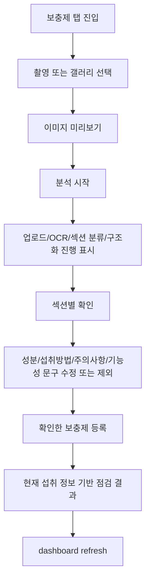

# 06. Phase 5 Mobile UX 연결 상세 설계 및 구현 플랜

- 작성일: 2026-05-17
- 범위: `mobile/flutter_app` 보충제 라벨 촬영/갤러리 UX, OCR 진행 상태, 섹션별 확인, Phase 4 점검 결과 화면 연결
- 상태: Phase 5-1 상세 구현 완료
- 선행 기준: [04. P2 Mobile/Frontend Minimum Screen Connection Plan](./04-p2-mobile-frontend-minimum-screen-plan.md), [05. P2 Mobile Device Build and Simulator Run Plan](./05-p2-mobile-device-build-run-plan.md), [52. Phase 4 Recommendation Service](../Nutrition-docs/52-phase4-recommendation-service-design-plan.md)

## 1. 목표

Phase 5의 목표는 현재 동작하는 최소 모바일 플로우를 제품 수준의 보충제 라벨 확인 UX로 올리는 것이다.

현재 Flutter 앱은 camera/gallery 선택, multipart 업로드, 수동 OCR 텍스트 파싱, 사용자 확인 후 등록까지는 연결되어 있다. 하지만 사용자가 촬영한 이미지가 실제로 어떤 분석 단계에 있는지, 라벨의 어떤 섹션이 어떻게 해석되었는지, confidence가 낮은 값이 무엇인지, 등록 후 보충제가 현재 영양 분석에 어떤 영향을 주는지까지는 제품 흐름으로 묶이지 않았다.

Phase 5는 다음 원칙을 지킨다.

1. 촬영/갤러리 선택 후 즉시 이미지 미리보기를 보여준다.
2. Android lost data 복구 이미지는 자동 업로드하지 않고, 복구 배너와 사용자 확인 후 분석한다.
3. 업로드, OCR, 섹션 분류, 구조화, 사용자 확인 단계를 한 화면 안에서 추적 가능하게 만든다.
4. 낮은 confidence 항목은 기본 선택 해제 또는 "확인 필요" 상태로 표시한다.
5. 섹션별 확인 UI는 성분, 섭취방법, 주의사항, 기능성 문구를 분리한다.
6. 추천 화면 문구는 "복용 지시"가 아니라 "현재 섭취 정보 기반 점검 결과"로 제한한다.

## 2. 공식 기준과 확인한 전제

### 2.1 `image_picker`

공식 문서:

- https://pub.dev/packages/image_picker

확인한 기준:

- `image_picker`는 image library 선택과 camera 촬영을 모두 지원한다.
- iOS는 `NSPhotoLibraryUsageDescription`, `NSCameraUsageDescription`을 `Info.plist`에 포함해야 한다.
- Android는 low memory 상황에서 `MainActivity`가 종료될 수 있으며, 이 경우 `ImagePicker.retrieveLostData()`를 startup에서 실행해 lost data를 회수해야 한다.
- camera로 선택한 이미지는 앱 local cache에 저장되며 임시 파일로 간주해야 한다. 영구 보관이 필요하면 앱이 직접 이동해야 하지만, 본 프로젝트는 raw image 미저장을 원칙으로 하므로 영구 이동하지 않는다.
- Android 13 이상은 Android Photo Picker를 사용한다.
- `launchMode: singleInstance`는 결과가 항상 취소될 수 있으므로 피해야 한다.

현재 로컬 확인:

- `pubspec.yaml`은 `image_picker: ^1.2.2`를 사용한다.
- iOS `Info.plist`에는 `NSCameraUsageDescription`, `NSPhotoLibraryUsageDescription`이 있다.
- Android main manifest는 `launchMode="singleTop"`이므로 `singleInstance` 문제에 해당하지 않는다.
- 현재 `SupplementFlowScreen`은 `retrieveLostData()`를 호출하지만, 복구 이미지를 곧바로 `analyzeImage()`에 넘긴다. Phase 5에서는 이 동작을 사용자 확인 기반으로 바꿔야 한다.

## 3. 현재 구현 진단

| 영역 | 현재 상태 | Phase 5 판단 |
| --- | --- | --- |
| 이미지 선택 | `ImagePicker.pickImage(ImageSource.camera/gallery)` 사용 | camera/gallery 기본 연결은 구현됨 |
| Android lost data | `retrieveLostData()` 호출 후 첫 파일을 즉시 분석 | 위험함. 복구 이미지는 미리보기 후 사용자 확인이 필요 |
| 이미지 미리보기 | 선택된 파일 경로를 UI state로 보존하지 않음 | 미구현. 업로드 전 확인 경험이 없음 |
| 진행 상태 | `controller.busy` 단일 상태 | 부족함. 업로드/OCR/섹션/구조화/확인 단계가 구분되지 않음 |
| OCR 텍스트 | `TextEditingController`로 수동 입력 가능 | 동작하지만 raw text가 긴 시간 화면 state에 남을 수 있음 |
| 섹션 확인 | 성분 후보 중심 등록 폼 | 섭취방법, 주의사항, 기능성 문구 확인 UI 없음 |
| confidence 처리 | ingredient confidence는 draft에 보존되지만 UI에 표시하지 않음 | 낮은 confidence 기본 비선택/확인 필요 표시가 없음 |
| backend preview schema | 모바일 모델은 제품/성분/low confidence 일부만 파싱 | Phase 1/2의 `label_sections`, `intake_method`, `precautions`, `functional_claims`, `evidence_spans`가 모바일에 노출되지 않음 |
| 추천/점검 화면 | 등록 후 dashboard refresh만 수행 | Phase 4 `supplement-impact/preview` 연결이 필요 |

비판적 결론: 현재 모바일은 "데모 입력 폼"으로는 동작하지만, 사용자가 라벨 해석 결과를 신뢰 가능한 단위로 검토하기에는 부족하다. 특히 lost data 자동 분석은 사용자의 명시적 확인 없이 이전 선택 이미지를 처리할 수 있으므로 Phase 5에서 반드시 수정해야 한다.

## 3.1 구현 체크포인트

2026-05-17 Phase 5-1 구현 반영 범위:

- backend `SupplementAnalysisPreview`가 `layout_available`, `layout_fallback_reason`, `label_sections`, `intake_method`, `precautions`, `functional_claims`, `evidence_spans`를 반환한다.
- backend preview 변환은 `SupplementParsedSnapshotV3`와 `SupplementLayoutContextV1`에서 bounded section/evidence만 매핑한다. raw OCR full text는 response에 추가하지 않았다.
- Flutter 모델이 legacy preview와 확장 preview를 모두 파싱한다.
- Flutter 보충제 화면은 이미지 선택 후 즉시 업로드하지 않고, 미리보기와 `Start label analysis` 명시 액션을 거친다.
- Android lost data 복구 이미지는 자동 분석하지 않고, 복구 배너와 사용자 확인 후 분석한다.
- 분석 timeline이 업로드, OCR, 섹션, 구조화, 확인 단계를 표시한다.
- 성분 후보는 confidence가 낮거나 `low_confidence_fields`에 걸리면 기본 unchecked로 시작한다.
- 섭취방법, 주의사항, 기능성 문구는 섹션별 review panel로 분리 표시한다.
- 등록 성공 후 Phase 4 `supplement-impact/preview`를 호출하고 "현재 섭취 정보 기반 점검 결과" 카드에 표시한다.
- explain API 연결은 기본 deterministic 설명 호출만 사용하며 local LLM opt-in은 서버 옵션으로 남겼다.

검증:

```sh
cd yeong-Lemon-Aid/mobile/flutter_app
dart format --output=none --set-exit-if-changed .
flutter analyze
flutter test

cd yeong-Lemon-Aid/backend
../.venv/bin/python -m ruff check Nutrition-backend/src/models/schemas/supplement.py Nutrition-backend/src/services/supplement_intake.py Nutrition-backend/src/api/v1/examples.py Nutrition-backend/tests/unit/services/test_supplement_intake.py
../.venv/bin/python -m black --check Nutrition-backend/src/models/schemas/supplement.py Nutrition-backend/src/services/supplement_intake.py Nutrition-backend/src/api/v1/examples.py Nutrition-backend/tests/unit/services/test_supplement_intake.py
../.venv/bin/python -m mypy Nutrition-backend/src
../.venv/bin/python -m pytest Nutrition-backend/tests -q --no-cov
```

## 4. UX 원칙

### 4.1 라벨 해석은 후보이며 사용자가 최종 확인한다

모바일 문구는 다음 표현을 피한다.

- "추천 복용량"
- "복용하세요"
- "복용량을 늘리세요"
- "복용량을 줄이세요"
- "치료", "예방", "완치", "질병 개선"을 단정하는 문장

대신 다음 표현을 사용한다.

- "라벨에서 읽은 후보"
- "확인 필요"
- "현재 섭취 정보 기반 점검 결과"
- "중복 가능성 확인"
- "전문가와 상담할 항목"

### 4.2 낮은 confidence는 눈에 띄게 보수적으로 처리한다

정책:

- `confidence < 0.75` 또는 backend `low_confidence_fields`에 포함된 항목은 기본 선택 해제한다.
- 선택 해제된 성분은 등록 payload에 포함하지 않는다.
- 사용자가 체크하면 source는 유지하되 UI confirmation state를 별도로 관리한다.
- 필수 등록 필드가 낮은 confidence면 저장 전 확인 dialog를 보여준다.

### 4.3 진행 상태는 실제 backend 계약을 과장하지 않는다

현재 `POST /api/v1/supplements/analyze`는 단일 multipart 요청으로 처리된다. 클라이언트가 OCR, 섹션 분류, 구조화의 실제 완료 시점을 서버에서 실시간으로 받는 구조는 아니다.

따라서 Phase 5-1의 진행 UI는 다음처럼 표현한다.

- `업로드`: multipart 요청 생성 및 전송 시작 시 active
- `OCR`: 서버 분석 중으로 표시하되 완료 단정은 response 수신 후에만 completed
- `섹션 분류`: response의 `label_sections` 또는 `layout_available` 기준으로 completed/review_needed
- `구조화`: response의 parsed fields 수신 기준으로 completed/review_needed
- `확인`: 사용자 화면 진입 시 active

진짜 단계별 progress polling이 필요하면 Phase 5-2에서 별도 job status endpoint를 설계한다. Phase 5-1에서는 없는 backend 상태를 만들어 표시하지 않는다.

## 5. 대상 사용자 흐름



## 6. API 계약 설계

### 6.1 기존 endpoint 유지

기존 endpoint는 유지한다.

| UI 단계 | Endpoint | 유지 이유 |
| --- | --- | --- |
| 이미지 분석 | `POST /api/v1/supplements/analyze` | FastAPI multipart 업로드 계약을 이미 따른다 |
| 수동 OCR 텍스트 파싱 | `POST /api/v1/supplements/analyses/{analysis_id}/ocr-text` | OCR provider 실패 시 수동 보정 경로가 필요하다 |
| 사용자 확인 등록 | `POST /api/v1/supplements` | preview와 confirmed supplement를 분리한다 |
| 보충제 영향도 점검 | `POST /api/v1/nutrition/supplement-impact/preview` | Phase 4 deterministic service를 사용한다 |
| 최신 점검 결과 | `GET /api/v1/supplements/recommendations/latest` | 추천 탭/등록 후 결과 화면에 사용한다 |
| 설명 보조 | `POST /api/v1/supplements/recommendations/explain` | 기본은 deterministic explanation이며 local LLM은 opt-in이다 |

### 6.2 `SupplementAnalysisPreview` 모바일 확장 필요

현재 모바일이 섹션별 확인 UI를 만들려면 backend response가 다음 정보를 노출해야 한다. 원본 OCR text 전체가 아니라, Phase 2에서 만든 bounded section summary와 short evidence만 내려야 한다.

권장 추가 필드:

```json
{
  "layout_available": true,
  "layout_fallback_reason": null,
  "label_sections": [
    {
      "section_id": "section-001",
      "section_type": "ingredients",
      "heading_text": "영양정보",
      "text_bundle": "비타민 D 25 ug ...",
      "confidence": 0.88,
      "requires_review": false,
      "evidence_refs": ["span-001"]
    }
  ],
  "intake_method": {
    "text": "1일 1회, 1회 1정",
    "structured": {
      "frequency": "daily",
      "times_per_day": 1,
      "amount_per_time": 1,
      "amount_unit": "tablet",
      "time_of_day": [],
      "with_food": null
    },
    "confidence": 0.82,
    "evidence_refs": ["span-010"]
  },
  "precautions": [
    {
      "text": "임산부는 전문가와 상담하십시오.",
      "category": "pregnancy",
      "confidence": 0.9,
      "evidence_refs": ["span-020"]
    }
  ],
  "functional_claims": [
    {
      "text": "뼈 건강에 도움을 줄 수 있음",
      "confidence": 0.84,
      "evidence_refs": ["span-030"]
    }
  ],
  "evidence_spans": [
    {
      "span_id": "span-001",
      "section_type": "ingredients",
      "text_excerpt": "비타민 D 25 ug"
    }
  ]
}
```

설계 제약:

- raw OCR full text는 내려보내지 않는다.
- `text_bundle`과 `text_excerpt`는 서버 schema의 bounded length를 따른다.
- `evidence_refs`는 UI의 "근거 보기"에만 사용한다.
- `layout_available=false`이면 UI는 기존 product/ingredient preview와 수동 OCR text 보정 경로로 graceful fallback 한다.

### 6.3 등록 payload 확장 여부

Phase 5-1에서는 기존 `UserSupplementCreate`를 유지한다.

- 성분, serving, intake schedule은 저장한다.
- 주의사항/기능성 문구는 등록 전 확인 UI에 표시하되, 영구 저장은 하지 않는다.
- `analysis_id`가 `source_analysis_run_id`로 연결되므로 서버에는 bounded parsed snapshot이 남아 있다.

Phase 5-2에서 제품 상세 화면에 주의사항/기능성 문구를 계속 보여줘야 한다면 다음 중 하나를 선택한다.

1. `user_supplements.confirmed_label_snapshot` JSONB 추가
2. `GET /api/v1/supplements/{id}/label-snapshot` endpoint 추가
3. `UserSupplementResponse`에 safe section summary를 선택적으로 포함

권장안은 1번이다. 분석 run은 preview lifecycle 성격이 강하므로 사용자 확인 후 오래 보여줄 정보는 confirmed supplement 쪽에 복사하는 편이 낫다.

## 7. Flutter 상태 설계

### 7.1 상태 모델

권장 파일:

- `mobile/flutter_app/lib/features/supplements/supplement_flow_state.dart`

권장 타입:

```dart
enum SupplementFlowStage {
  idle,
  imageSelected,
  uploading,
  ocrProcessing,
  sectionClassifying,
  structuring,
  confirmationRequired,
  registering,
  registered,
  impactReady,
}

class SelectedLabelImage {
  const SelectedLabelImage({
    required this.path,
    required this.source,
    required this.recoveredFromLostData,
  });

  final String path;
  final String source; // camera, gallery, android_lost_data
  final bool recoveredFromLostData;
}
```

상태는 `AppController`에 모두 넣기보다 보충제 feature 전용 state로 분리한다. 현재 `AppController`가 dashboard, consent, supplement flow를 모두 들고 있으므로 Phase 5에서 계속 비대해지면 테스트와 회귀 위험이 커진다.

Phase 5-1의 현실적인 선택:

- `AppController`에는 backend repository 호출과 마지막 preview만 유지한다.
- `SupplementFlowScreen` 또는 새 `SupplementFlowController`가 선택 이미지, progress stage, checkbox state, section expansion state를 관리한다.

### 7.2 확인 항목 모델

권장 타입:

```dart
class ConfirmableField<T> {
  const ConfirmableField({
    required this.value,
    required this.selected,
    required this.requiresReview,
    required this.confidence,
    required this.evidenceRefs,
  });

  final T value;
  final bool selected;
  final bool requiresReview;
  final double? confidence;
  final List<String> evidenceRefs;
}
```

적용:

- 성분 row: checkbox + editable fields
- 섭취방법: raw label text + structured candidate fields
- 주의사항: category chip + raw label text, 기본 read-only
- 기능성 문구: raw label text, 기본 read-only

## 8. 화면 설계

### 8.1 Capture/Preview 영역

현재 `_CaptureCard`를 다음 구조로 바꾼다.

- 상단: selected image preview
- 액션: camera, gallery, reset
- 복구 배너: "이전에 선택한 이미지가 복구되었습니다. 분석을 계속하려면 확인하세요."
- primary CTA: "분석 시작"

중요 정책:

- 이미지 선택 즉시 업로드하지 않는다.
- lost data 복구 이미지는 더더욱 자동 업로드하지 않는다.
- reset 시 selected image path, OCR text controller, preview, checkbox state를 모두 정리한다.

### 8.2 Processing timeline

권장 widget:

- `SupplementProcessingTimeline`

표시 단계:

1. 업로드
2. OCR
3. 섹션 분류
4. 구조화
5. 확인

표시 규칙:

- 현재 진행 단계는 spinner 또는 progress indicator.
- response 수신 전 OCR/섹션/구조화는 "서버 분석 중"으로 묶어서 보여도 된다.
- `layout_available=false` 또는 section confidence 낮음이면 섹션 분류 단계에 "확인 필요" badge를 붙인다.
- 실패 시 provider 내부 오류를 그대로 표시하지 않고 backend sanitized warning만 보여준다.

### 8.3 Section confirmation

권장 widget:

- `SupplementSectionReview`
- 내부는 `ExpansionPanelList` 또는 `TabBar` 중 하나를 선택한다.

모바일 좁은 화면에서는 `ExpansionPanelList`를 권장한다. 화면 전체 이동 없이 성분, 섭취방법, 주의사항, 기능성 문구를 순서대로 확인할 수 있다.

섹션:

| 섹션 | UI | 등록 반영 |
| --- | --- | --- |
| 성분 | checkbox row + editable name/amount/unit/nutrient_code | 선택된 row만 `ingredients`에 포함 |
| 섭취방법 | 원문 + 구조화 후보 + frequency/time fields | `serving`, `intake_schedule`에 반영 |
| 주의사항 | category chip + 원문 + 확인 필요 badge | Phase 5-1 저장 제외, Phase 5-2 저장 후보 |
| 기능성 문구 | 원문 표시, disease claim 단정 금지 안내 | Phase 5-1 저장 제외, 추천 판단에 사용하지 않음 |

### 8.4 Low confidence UI

정책:

- low confidence row는 unchecked로 시작한다.
- row title 옆에 `확인 필요` badge를 표시한다.
- 근거가 있으면 "근거" 버튼으로 short evidence excerpt만 보여준다.
- confidence 숫자를 그대로 크게 강조하지 않는다. 사용자는 모델 점수보다 확인 필요 여부를 이해해야 한다.

등록 조건:

- 성분이 하나도 선택되지 않으면 등록 불가.
- display name이 비어 있으면 등록 불가.
- low confidence 성분을 선택한 경우 저장 전 "선택한 항목은 확인 필요로 표시된 값입니다" dialog를 표시한다.

### 8.5 Supplement impact screen

권장 위치:

- 등록 성공 후 `_RegisteredCard` 아래
- 또는 보충제 탭 안의 "점검 결과" section

화면 제목:

- "현재 섭취 정보 기반 점검 결과"

금지 제목:

- "추천 복용량"
- "AI 복용 지시"
- "치료 추천"

표시 영역:

- `current_supplement_contributions`: 현재 보충제가 더하는 영양소
- `deficiency_support_candidates`: 부족 가능성과 겹치는 성분
- `excess_or_duplicate_risks`: 중복 또는 상한 확인 대상
- `missing_profile_fields`: 개인화 판단에 필요한 누락 정보
- `safe_user_message`
- `clinical_disclaimer`

버튼:

- "점검 결과 새로고침": `GET /api/v1/supplements/recommendations/latest`
- "설명 보기": `POST /api/v1/supplements/recommendations/explain`, 기본 `use_local_llm=false`

## 9. 상세 구현 플랜

### Phase 5-0. 계약 정렬

목표: 모바일 섹션 UI가 필요한 데이터를 받을 수 있게 backend/mobile schema를 맞춘다.

작업:

1. backend `SupplementAnalysisPreview`에 bounded section preview fields 추가.
2. `supplement_analysis_run_to_preview()`에서 `snapshot_v3`의 `label_sections`, `intake_method`, `precautions`, `functional_claims`, `evidence_spans`, layout availability를 response로 매핑.
3. 모바일 `supplement_models.dart`에 같은 필드 추가.
4. OpenAPI contract test에 새 필드가 raw OCR text가 아님을 검증.

완료 기준:

- 기존 모바일 파싱 테스트가 깨지지 않는다.
- section fields가 없는 legacy response도 파싱 가능하다.
- raw OCR full text 필드가 response schema에 추가되지 않는다.

### Phase 5-1. 이미지 미리보기와 lost data 수정

목표: 선택 이미지를 사용자가 확인한 뒤 분석하게 만든다.

작업:

1. `SelectedLabelImage` state 추가.
2. `_pickImage()`는 `analyzeImage()`를 바로 호출하지 않고 selected image state만 세팅.
3. `_recoverLostImage()`는 selected image state와 recovery banner만 세팅.
4. "분석 시작" 버튼에서만 `analyzeImage(path)` 호출.
5. reset 시 selected image, OCR text, preview, section confirmation state를 모두 clear.

완료 기준:

- camera/gallery 선택 후 preview가 보인다.
- lost data 복구 후 자동 업로드가 발생하지 않는다.
- reset 후 raw image path와 OCR text가 화면 state에서 제거된다.

### Phase 5-2. 진행 상태 timeline

목표: 사용자가 분석 상태를 이해할 수 있게 한다.

작업:

1. `SupplementFlowStage` enum 추가.
2. `analyzeImage` 호출 전후 stage 전환.
3. `parseOcrText` 호출 전후 stage 전환.
4. `SupplementProcessingTimeline` widget 추가.
5. backend warning과 low confidence count를 timeline badge로 연결.

완료 기준:

- busy spinner 하나만 보이는 상태를 제거한다.
- response 수신 전 OCR/섹션/구조화 완료를 단정하지 않는다.
- 실패 시 stage가 error panel과 함께 멈춘다.

### Phase 5-3. 섹션별 확인 UI

목표: 성분, 섭취방법, 주의사항, 기능성 문구를 분리 확인한다.

작업:

1. `_RegistrationCard`를 `SupplementSectionReview` 중심으로 재구성.
2. ingredient draft에 `selected`, `requiresReview`, `evidenceRefs` 추가.
3. intake method section을 serving/intake schedule fields와 연결.
4. precautions/functional claims section을 read-only review card로 표시.
5. evidence span dialog는 bounded excerpt만 표시.

완료 기준:

- low confidence ingredient는 기본 unchecked.
- 선택된 ingredient만 등록 payload에 포함된다.
- 주의사항/기능성 문구는 추천이나 복용 지시로 변환되지 않는다.

### Phase 5-4. 등록 후 점검 결과 연결

목표: Phase 4 deterministic impact API를 모바일에 붙인다.

작업:

1. `SupplementImpactPreviewResponse` 모바일 모델 추가.
2. repository에 `previewSupplementImpact()`, `fetchLatestSupplementRecommendation()`, `explainSupplementRecommendation()` 추가.
3. 등록 성공 후 `previewSupplementImpact()` 호출.
4. `SupplementImpactResultCard` 추가.
5. UI 문구를 "현재 섭취 정보 기반 점검 결과"로 고정.

완료 기준:

- 등록 성공 후 dashboard refresh와 impact preview가 모두 수행된다.
- API가 partial/not_ready를 반환해도 UI가 실패로 오해하지 않는다.
- 복용량 변경/치료 표현이 화면에 없다.

### Phase 5-5. 테스트

목표: UX 회귀를 코드로 막는다.

테스트 범위:

1. `SupplementAnalysisPreview.fromJson()` legacy/new schema parsing.
2. low confidence ingredient 기본 unchecked.
3. selected image preview state와 reset.
4. lost data recovery가 자동 분석을 호출하지 않는지.
5. section review에서 선택된 성분만 `UserSupplementCreate`에 포함되는지.
6. impact response의 partial/not_ready 렌더링.
7. forbidden wording snapshot test.

권장 검증 명령:

```sh
cd yeong-Lemon-Aid/mobile/flutter_app
dart format --output=none --set-exit-if-changed .
flutter analyze
flutter test
```

backend contract 확장 시:

```sh
cd yeong-Lemon-Aid/backend
.venv/bin/python -m ruff check Nutrition-backend/src Nutrition-backend/tests
.venv/bin/python -m mypy Nutrition-backend/src
.venv/bin/python -m pytest Nutrition-backend/tests/integration/api/test_p1_api_contract.py Nutrition-backend/tests/integration/api/test_openapi_examples.py -q --no-cov
```

### Phase 5-6. 디바이스 smoke

목표: 제품 흐름이 iOS Simulator와 Android Emulator에서 유지되는지 확인한다.

확인 시나리오:

1. iOS Simulator에서 gallery 선택 이미지 미리보기.
2. Android Emulator에서 gallery 선택 이미지 미리보기.
3. Android lost data는 단위/위젯 테스트로 먼저 확인하고, 가능하면 실제 emulator low-memory 시나리오를 별도 수동 검증.
4. backend local URL:
   - iOS: `http://127.0.0.1:8000/api/v1`
   - Android emulator: `http://10.0.2.2:8000/api/v1`
5. 등록 후 "현재 섭취 정보 기반 점검 결과" 표시.

## 10. 보안 및 개인정보 조건

1. raw image는 영구 저장하지 않는다.
2. raw OCR text는 로그에 남기지 않고, 등록/리셋 후 controller를 clear한다.
3. lost data 복구 이미지를 자동 업로드하지 않는다.
4. 외부 OCR이 backend에서 가능하면 consent gate가 `external_ocr_processing` 요구를 표시할 수 있어야 한다.
5. API key, OCR secret, LLM endpoint secret은 모바일 앱에 넣지 않는다.
6. recommendation explain은 기본 deterministic response를 사용하고, local LLM opt-in도 서버에서만 수행한다.
7. 화면 문구는 치료/진단/예방/복용량 변경 단정을 만들지 않는다.

## 11. 성공 기준

| 기준 | 완료 조건 |
| --- | --- |
| 이미지 UX | camera/gallery 선택 후 분석 전 preview가 표시된다 |
| lost data | Android lost data가 복구되어도 자동 업로드하지 않는다 |
| 진행 상태 | 업로드, OCR, 섹션 분류, 구조화, 확인 단계가 표시된다 |
| 섹션 확인 | 성분, 섭취방법, 주의사항, 기능성 문구가 분리 표시된다 |
| confidence | low confidence 항목은 기본 unchecked 또는 확인 필요로 표시된다 |
| 등록 | 사용자 선택/확인된 성분만 저장된다 |
| 점검 결과 | 등록 후 Phase 4 deterministic impact 결과를 표시한다 |
| 안전 문구 | 복용 지시, 치료/예방, 약물 상호작용 단정 표현이 없다 |
| 개인정보 | raw image/text가 영구 저장, 로그, DB에 남지 않는다 |

## 12. 구현 순서 권장

1. backend preview response에 safe section fields 추가.
2. 모바일 모델 parsing을 legacy-compatible하게 확장.
3. 이미지 미리보기와 lost data 자동 분석 제거.
4. progress timeline 추가.
5. section confirmation UI 추가.
6. low confidence default unchecked 적용.
7. Phase 4 impact preview 모델/Repository/API 연결.
8. 등록 성공 후 impact result card 표시.
9. Flutter unit/widget test 추가.
10. backend contract test와 mobile device smoke 수행.

## 13. 예상 리스크와 대응

| 리스크 | 영향 | 대응 |
| --- | --- | --- |
| backend preview가 section fields를 아직 노출하지 않음 | 섹션별 UX 구현 불가 | Phase 5-0에서 bounded section response를 먼저 추가 |
| 단일 analyze request라 실제 OCR 단계별 progress를 모름 | 허위 progress 표시 위험 | "서버 분석 중" 표현과 response 기반 완료 처리 사용 |
| lost data 자동 분석 | 사용자 확인 없는 이미지 처리 가능성 | 복구 이미지는 preview + explicit CTA로 변경 |
| low confidence 값을 사용자가 무심코 저장 | 잘못된 영양 계산 | 기본 unchecked, 저장 전 확인 dialog |
| 주의사항/기능성 문구 저장 위치 없음 | 제품 상세 재표시 어려움 | Phase 5-1은 review-only, Phase 5-2에서 confirmed label snapshot 설계 |
| 추천 화면이 의료 조언처럼 보임 | 규제/안전 리스크 | 제목과 action label을 점검/확인 중심으로 제한 |
