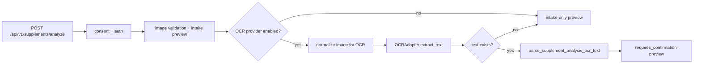

# 26. OT-S2 OCR Provider Adapter Implementation Plan

작성일: 2026-05-13
범위: `POST /api/v1/supplements/analyze` 한 번으로 이미지 intake, OCR, structured parse preview까지 실행
상태: 구현 전 상세 설계

## 1. 목표

OT-S2의 목표는 기존 supplement image intake 계약을 깨지 않고 실제 OCR provider adapter를 주입해 업로드 한 번으로 다음 흐름을 완료하는 것이다.



비목표:

- 원본 이미지 또는 raw OCR text 저장을 시작하지 않는다.
- 복용량 변경, 의료 조언, 처방전/검사표 OCR intake와 섞지 않는다.
- YOLO label detector 또는 multimodal LLM을 같이 켜지 않는다.
- provider 성능 수치, 정확도 수치, 비용 절감률을 임의로 만들지 않는다.

## 2. 공식 문서 확인 결과

| 영역 | 확인한 공식 문서 | OT-S2 적용점 |
| --- | --- | --- |
| FastAPI upload | FastAPI `Request Files` 문서: `UploadFile`은 async `read`, `seek`를 제공하고 파일은 form data로 업로드된다. | 현재 `UploadFile` 기반 route를 유지하고, validation 뒤 `await image.seek(0)`로 OCR용 bytes를 다시 읽는 구조는 유지 가능하다. |
| FastAPI form + file | FastAPI `Request Forms and Files` 문서: `File`과 `Form`을 같은 path operation에서 함께 선언할 수 있다. | 기존 `image: UploadFile` + `client_request_id: Form` 계약 유지가 타당하다. |
| Google Cloud Vision OCR | Cloud Vision OCR 문서: `TEXT_DETECTION`과 `DOCUMENT_TEXT_DETECTION`이 OCR을 지원하고, language hints는 optional이며 빈 값이 더 나은 경우가 많다. | Google adapter는 후보로 유지하되, Python client 또는 REST 인증 의존성을 별도 검토한 뒤 OT-S2b로 분리한다. |
| Naver CLOVA OCR | CLOVA OCR overview: API Gateway invoke URL과 `X-OCR-SECRET` header가 필요하고, JSON 또는 multipart form request를 지원한다. | 현재 `CLOVA_OCR_API_URL`, `CLOVA_OCR_SECRET` 설정과 잘 맞는다. |
| Naver CLOVA General OCR | General OCR 문서: `POST /general`, `version`, `requestId`, `timestamp`, `lang`, `images.data`, `images.format` request와 `fields[].inferText`, `fields[].inferConfidence` response를 제공한다. | OT-S2 1차 실제 provider는 `ClovaGeneralOCRAdapter`를 권장한다. |
| HTTPX async client | HTTPX async 문서: async web framework에서는 `AsyncClient`를 사용하고, request method를 `await`해야 한다. timeout 문서는 기본 timeout과 세부 timeout 설정을 제공한다. | CLOVA adapter는 `httpx.AsyncClient` 또는 주입 가능한 async client protocol로 구현하고 timeout을 Settings에서 제한한다. |
| Pydantic Settings | Pydantic Settings 문서: `BaseSettings`는 기본값과 환경변수 override를 지원한다. | provider 선택, 외부 OCR 허용 여부, timeout을 `Settings` 필드로 관리한다. |

참조 URL:

- FastAPI Request Files: https://fastapi.tiangolo.com/tutorial/request-files/
- FastAPI Request Forms and Files: https://fastapi.tiangolo.com/tutorial/request-forms-and-files/
- Google Cloud Vision OCR: https://cloud.google.com/vision/docs/ocr
- Naver CLOVA OCR overview: https://api.ncloud-docs.com/docs/en/ai-application-service-ocr
- Naver CLOVA General OCR: https://api.ncloud-docs.com/docs/en/ai-application-service-ocr-ocr
- HTTPX async: https://www.python-httpx.org/async/
- HTTPX timeouts: https://www.python-httpx.org/advanced/timeouts/
- Pydantic Settings: https://docs.pydantic.dev/latest/concepts/pydantic_settings/

## 3. 현재 기준선

이미 연결된 구현:

- `backend/src/api/v1/supplements.py`의 `analyze_supplement_label`은 `POST /api/v1/supplements/analyze`에서 `UploadFile`, `Form`, consent, auth, audit를 처리한다.
- `backend/src/services/supplement_image_analysis.py`의 `analyze_supplement_image`는 `SupplementImageAnalysisAdapters(ocr, parser, vision)`를 받을 수 있다.
- `OCRAdapter.extract_text(OCRImageInput) -> OCRResult` 계약이 `backend/src/ocr/base.py`에 존재한다.
- OCR text가 있으면 `_parse_ocr_if_available`이 `parse_supplement_analysis_ocr_text`를 호출한다.
- `POST /api/v1/supplements/analyses/{analysis_id}/ocr-text`는 수동 OCR text를 structured preview로 바꾸는 OT-S1 기준선을 제공한다.

남은 gap:

- API route가 아직 `SupplementImageAnalysisAdapters` dependency를 주입하지 않는다.
- 실제 provider는 `NoopOCRAdapter`뿐이며 외부 OCR adapter가 없다.
- `normalize_image_for_ocr`는 존재하지만 현재 `analyze_supplement_image`의 provider 호출 직전에 사용되지 않는다.
- 설정 파일에는 `CLOVA_OCR_API_URL`, `CLOVA_OCR_SECRET`, `GOOGLE_APPLICATION_CREDENTIALS`가 있으나 backend `Settings`에는 provider 선택값과 외부 OCR 전송 허용 게이트가 없다.
- provider 실패 시 이미 만들어진 intake preview를 `failed`로 남길지에 대한 구현 정책이 아직 없다.

## 4. 구현 원칙

1. 기본값은 계속 OCR provider 미사용이다.
   - `POST /api/v1/supplements/analyze`의 기존 intake-only 테스트가 그대로 통과해야 한다.
   - CI, local dev, demo 기본값은 외부 네트워크를 호출하지 않는다.

2. 외부 OCR 전송은 명시적 2중 게이트로만 허용한다.
   - `SUPPLEMENT_OCR_PROVIDER=none|clova_general|google_vision`
   - `ALLOW_EXTERNAL_OCR=false` 기본값 유지
   - `clova_general` 또는 `google_vision` 선택 시 `ALLOW_EXTERNAL_OCR=true`가 아니면 adapter factory가 설정 오류를 낸다.

3. raw data 저장 금지 정책을 유지한다.
   - raw image bytes 저장 금지
   - raw OCR text DB 저장 금지
   - audit metadata에는 provider, confidence 존재 여부, raw 저장 여부 같은 비민감 metadata만 기록
   - OCR text는 기존 OT-S1처럼 HMAC hash만 저장

4. provider fallback은 OT-S2 1차 범위에서 제외한다.
   - 자동 fallback은 예측 불가능한 외부 전송 횟수를 만들 수 있다.
   - 1차는 단일 provider를 명시적으로 선택한다.
   - fallback은 provider별 지연시간, 비용, 개인정보 처리 계약을 확인한 뒤 OT-S2b 또는 OT-S5로 분리한다.

5. OCR 실패와 empty OCR은 다르게 처리한다.
   - provider 미설정: 기존 `202 requires_confirmation` intake-only preview
   - provider 성공 but empty text: `202 requires_confirmation` intake-only preview + 기존 intake warning 유지
   - provider timeout, 인증 실패, invalid response: intake record를 `failed`로 표시하고 `502 ocr_unavailable`
   - parser unavailable 또는 invalid schema: record를 `failed`로 표시하고 기존 parser error code로 `502`

## 5. 권장 provider 순서

### OT-S2 1차: `ClovaGeneralOCRAdapter`

권장 이유:

- 현재 backend 설정에 `clova_ocr_api_url`, `clova_ocr_secret`이 이미 있다.
- 공식 General OCR API가 whole image text extraction에 맞다.
- `httpx`로 구현 가능해 Google Cloud Python client 같은 새 vendor SDK 의존성을 즉시 추가하지 않아도 된다.
- 한국어 라벨 OCR에 필요한 `lang="ko"` 요청이 공식 문서상 가능하다.

구현 방식:

- `backend/src/ocr/providers/clova.py`
- `ClovaGeneralOCRAdapter(api_url, secret, timeout_sec, http_client=None)`
- request:
  - `POST {CLOVA_OCR_API_URL}`
  - header: `X-OCR-SECRET`
  - JSON body: `version="V2"`, `requestId`, `timestamp`, `lang="ko"`, `images=[{"format":"png","name":"supplement-label","data": base64_png}]`, `enableTableDetection=false`
- response normalization:
  - `images[].fields[].inferText`를 순서대로 newline join
  - `inferConfidence` 값은 0.0-1.0 범위만 평균 또는 min으로 정규화
  - text가 모두 비어 있으면 `OCRResult(text="", provider="clova_general", confidence=normalized_confidence)`

주의:

- 공식 문서가 `images.data` base64를 지원하므로 public URL 업로드 방식은 사용하지 않는다.
- `CLOVA_OCR_API_URL`은 이미 `/general`까지 포함된 invoke URL로 취급한다. adapter에서 임의로 path를 붙이지 않는다.
- secret, image bytes, OCR text는 log에 남기지 않는다.

### OT-S2b 후보: `GoogleVisionOCRAdapter`

Google Cloud Vision은 공식 문서상 `TEXT_DETECTION` 또는 `DOCUMENT_TEXT_DETECTION`을 지원한다. 다만 실제 Python 구현은 인증 방식과 client dependency 선택이 필요하므로 OT-S2 1차에는 factory enum과 문서만 열어두고 adapter 구현은 분리하는 것이 낫다.

세부 검토 항목과 착수 조건은 `docs/Nutrition-docs/27-ot-s2b-google-vision-ocr-review-plan.md`를 기준으로 한다.

추후 구현 시 결정해야 할 항목:

- `google-cloud-vision` client dependency를 추가할지, REST + `google-auth`로 갈지
- `TEXT_DETECTION`과 `DOCUMENT_TEXT_DETECTION` 중 라벨 이미지 기본값을 무엇으로 할지
- `languageHints`를 비울지, `ko`를 줄지
- region endpoint를 `global`, `us`, `eu` 중 어떻게 제한할지

## 6. 파일별 변경 플랜

| 파일 | 변경 내용 |
| --- | --- |
| `backend/src/config.py` | `supplement_ocr_provider`, `allow_external_ocr`, `ocr_timeout_sec`, `clova_ocr_language` 필드 추가. runtime validator 또는 provider factory에서 external provider 선택 시 `ALLOW_EXTERNAL_OCR=true`와 provider credential을 검증한다. |
| `config/implementation-readiness.settings.json` | OCR 기본값을 실제 안전 기본값에 맞춰 `SUPPLEMENT_OCR_PROVIDER=none`, `ALLOW_EXTERNAL_OCR=false`로 보정한다. 기존 `OCR_PRIMARY_PROVIDER=google_vision` 기본값은 문서상 잔여 불일치로 제거하거나 후속 후보로 낮춘다. |
| `backend/src/ocr/base.py` | `OCRConfigurationError`, `OCRProviderUnavailableError`, `OCRProviderResponseError`를 추가한다. `OCRError` 하위 타입으로 묶어 route error mapping을 단순화한다. |
| `backend/src/ocr/preprocessing.py` | `NormalizedOCRImage` dataclass를 추가하고 `normalize_image_for_ocr`가 PNG bytes, MIME `image/png`, width, height를 함께 반환하도록 변경한다. |
| `backend/src/ocr/providers/clova.py` | `ClovaGeneralOCRAdapter` 구현. request body 생성, HTTP call, response schema normalization, confidence validation, provider error mapping을 담당한다. |
| `backend/src/ocr/providers/__init__.py` | `ClovaGeneralOCRAdapter` export. |
| `backend/src/ocr/factory.py` | `build_supplement_ocr_adapter(settings) -> OCRAdapter | None` 추가. provider `none`은 `None`, `clova_general`은 credential/gate 검증 후 adapter 반환. |
| `backend/src/services/supplement_image_analysis.py` | OCR adapter가 있을 때만 validated bytes를 읽고 `normalize_image_for_ocr`를 적용한다. normalized PNG metadata로 `OCRImageInput`을 만든다. provider/parser 실패 후 record를 `failed` 처리하는 helper를 추가한다. |
| `backend/src/api/v1/supplements.py` | `get_supplement_image_analysis_adapters` dependency를 추가하고 `analyze_supplement_image(..., adapters=adapters)`로 전달한다. OCR/parser domain error를 안정적 HTTP code로 mapping하고 audit metadata에 provider 설정 상태를 남긴다. |
| `backend/tests/unit/test_config.py` | OCR provider default, external OCR gate, missing credential validation 테스트. |
| `backend/tests/unit/ocr/test_clova_provider.py` | 공식 문서 형태의 mocked response로 text join, confidence normalization, empty result, invalid response, timeout mapping 테스트. |
| `backend/tests/unit/services/test_supplement_image_analysis.py` | normalized PNG가 OCR adapter로 전달되는지, OCR success 후 parser까지 이어지는지, provider failure가 failed status로 남는지 테스트. |
| `backend/tests/integration/api/test_supplement_intake_api.py` | 기본 provider `none`에서 기존 `/analyze` 계약이 유지되는지 회귀 테스트. |
| `backend/tests/integration/api/test_supplement_analyze_ocr_provider_api.py` | dependency override 또는 settings override로 fake OCR adapter를 주입해 `/analyze` 한 번으로 parsed preview가 채워지는 happy path 테스트. |
| `docs/Nutrition-docs/dev-guides/07-ocr-pipeline.md` | 현행 provider 상태를 `ClovaGeneralOCRAdapter` 1차 구현 기준으로 업데이트. Google/CLOVA 자동 fallback 표현은 아직 미구현으로 명확히 표시. |
| `docs/Nutrition-docs/dev-guides/09-supplement-registration-api.md` | `/analyze` one-shot OCR+parse preview 동작, 실패 code, empty OCR 정책 추가. |

## 7. 설정 상세안

`Settings` 필드 제안:

```python
supplement_ocr_provider: Literal["none", "clova_general", "google_vision"] = "none"
allow_external_ocr: bool = Field(default=False)
ocr_timeout_sec: int = Field(default=15, ge=1, le=60)
clova_ocr_language: Literal["ko", "ja", "zh-TW"] = "ko"
```

검증 규칙:

- `supplement_ocr_provider == "none"`이면 credential이 있어도 adapter를 만들지 않는다.
- `supplement_ocr_provider != "none"`이고 `allow_external_ocr is False`이면 `OCRConfigurationError`.
- `clova_general` 선택 시 `clova_ocr_api_url`, `clova_ocr_secret`이 필수다.
- `google_vision` 선택 시 이번 OT-S2 1차에서는 `OCRConfigurationError("google_vision adapter is not implemented in OT-S2.")`로 fail closed 처리한다.
- production에서는 위 오류가 startup 또는 request dependency 단계에서 명확히 드러나야 한다.

환경변수 예시:

```dotenv
SUPPLEMENT_OCR_PROVIDER=clova_general
ALLOW_EXTERNAL_OCR=true
CLOVA_OCR_API_URL=https://.../general
CLOVA_OCR_SECRET=...
OCR_TIMEOUT_SEC=15
CLOVA_OCR_LANGUAGE=ko
```

## 8. API 동작 계약

### 기본값: provider 없음

- Request: 기존 multipart/form-data 그대로
- Response: `202 Accepted`
- `status`: `requires_confirmation`
- `ocr_provider`: DB record에는 기존 intake provider 또는 preview metadata 기준 `intake-only`
- `parsed_product`, `ingredient_candidates`: 비어 있거나 intake placeholder
- 기존 모바일/테스트 호환 유지

### CLOVA provider 성공 + OCR text 있음

- Request: 기존 multipart/form-data 그대로
- 내부 처리:
  - 이미지 validation
  - intake preview row 생성 또는 idempotency reuse
  - OCR용 PNG normalization
  - CLOVA General OCR call
  - `parse_supplement_analysis_ocr_text`
- Response: `202 Accepted`
- `status`: `requires_confirmation`
- `ingredient_candidates`: parser 결과 후보
- `warnings`: 사용자 확인 필수 warning 포함
- 저장:
  - `ocr_provider="clova_general"`
  - `ocr_confidence`: CLOVA `inferConfidence` 정규화 값
  - `ocr_text_hash`: HMAC hash
  - raw OCR text 저장 없음

### CLOVA provider 성공 + OCR text 없음

- Response: `202 Accepted`
- record는 intake-only preview로 유지
- `warnings`는 기존 intake warning 유지
- audit metadata에 `ocr_provider="clova_general"`, `ocr_text_present=false`

### provider 실패

- Response: `502 Bad Gateway`
- error detail:

```json
{
  "code": "ocr_unavailable",
  "message": "OCR provider is unavailable. Try again later or use manual entry."
}
```

- DB:
  - intake row가 이미 생성된 경우 `status="failed"`
  - `warnings=["OCR provider failed before user confirmation."]`처럼 안전한 문구만 저장
  - raw OCR text와 raw image는 저장하지 않음

### parser 실패

- Response: 기존 OT-S1 error code 재사용
  - `parser_unavailable`
  - `parser_schema_invalid`
- DB:
  - OCR text raw 저장 없음
  - row는 `failed` 처리

## 9. 상세 구현 순서

### S2-0: 기준선 고정

1. 현재 backend test를 먼저 실행해 기준선을 확인한다.
2. OpenAPI path에 `/api/v1/supplements/analyze`가 유지되는지 smoke check를 실행한다.
3. `docs/25`의 OT-S2 TODO와 이 문서의 계획을 서로 맞춘다.

검증:

```bash
cd yeong-Lemon-Aid/backend
.venv/bin/python -m pytest tests/integration/api/test_supplement_intake_api.py tests/unit/services/test_supplement_image_analysis.py
.venv/bin/python -c "from src.main import create_app; schema=create_app().openapi(); assert '/api/v1/supplements/analyze' in schema['paths']"
```

### S2-1: Settings와 readiness config

1. `Settings`에 OCR provider 선택 필드와 external OCR gate를 추가한다.
2. `config/implementation-readiness.settings.json`의 OCR 기본값을 `none`/`false`로 보정한다.
3. 설정 테스트를 추가한다.

완료 조건:

- 아무 env 없이 `Settings()`는 성공한다.
- `SUPPLEMENT_OCR_PROVIDER=clova_general` + `ALLOW_EXTERNAL_OCR=false`는 실패한다.
- `SUPPLEMENT_OCR_PROVIDER=clova_general` + gate true + missing secret/url은 실패한다.

### S2-2: Provider factory와 dependency 주입

1. `backend/src/ocr/factory.py`에 `build_supplement_ocr_adapter`를 만든다.
2. `backend/src/api/v1/supplements.py`에 `get_supplement_image_analysis_adapters`를 추가한다.
3. route signature에 `adapters: Annotated[SupplementImageAnalysisAdapters, Depends(...)]`를 추가한다.
4. `analyze_supplement_image(..., adapters=adapters)`로 전달한다.

완료 조건:

- 기본 provider `none`에서는 route 결과와 기존 test snapshot이 변하지 않는다.
- test dependency override로 fake OCR adapter를 넣으면 route 한 번으로 parser까지 호출된다.

### S2-3: OCR preprocessing metadata 보강

1. `normalize_image_for_ocr`를 `NormalizedOCRImage` 반환으로 변경한다.
2. normalized PNG bytes의 width/height를 dataclass에 담는다.
3. OCR adapter 호출 시 original metadata가 아니라 normalized metadata를 `OCRImageInput`에 넣는다.
4. DB의 original image metadata는 기존 `ValidatedSupplementImage` 값을 유지한다.

완료 조건:

- WebP/JPEG input이어도 OCR provider에는 `image/png`가 전달된다.
- original image size/hash는 기존 intake record와 동일하게 저장된다.

### S2-4: `ClovaGeneralOCRAdapter`

1. request builder를 분리한다.
2. response parser를 분리한다.
3. provider error mapping을 분리한다.
4. HTTP client는 테스트에서 mock 가능한 protocol 또는 callable로 주입한다.

예상 class 형태:

```python
class ClovaGeneralOCRAdapter(OCRAdapter):
    """NAVER Cloud CLOVA General OCR adapter for supplement labels."""

    async def extract_text(self, image: OCRImageInput) -> OCRResult:
        ...
```

완료 조건:

- HTTP 2xx + fields text -> `OCRResult(text=..., provider="clova_general", confidence=...)`
- HTTP 401/403 -> `OCRProviderUnavailableError`
- HTTP 429/5xx/timeout -> `OCRProviderUnavailableError`
- response shape 불일치 -> `OCRProviderResponseError`
- `inferConfidence` 범위 밖 값 -> `OCRProviderResponseError`

### S2-5: 실패 상태 처리

1. `supplement_image_analysis.py`에 `_mark_analysis_failed` helper를 추가한다.
2. OCR provider error 또는 parser provider error가 발생하면 intake row를 `failed`로 update한다.
3. route는 해당 error를 `502`로 mapping한다.

주의:

- image validation 실패는 intake row 생성 전이므로 기존 `4xx`만 반환한다.
- idempotency conflict는 기존 `409` 유지.
- failed row가 같은 `client_request_id`로 재시도될 때 재사용할지 새 분석을 만들지는 별도 결정이 필요하다. OT-S2 1차에서는 기존 idempotency semantics를 유지하되, failed row 재시도 UX는 문서화한다.

### S2-6: API/audit metadata

1. 성공 audit metadata:
   - `client_request_id_present`
   - `image_mime_type`
   - `image_size_bytes`
   - `reused_existing`
   - `ocr_provider`
   - `ocr_text_present`
   - `ocr_confidence_present`
   - `parser_used`
   - `raw_image_stored=false`
   - `raw_ocr_text_stored=false`
2. 실패 audit metadata:
   - provider label
   - failure code
   - raw content 없음

완료 조건:

- audit test 또는 DB inspection에서 raw OCR text가 없어야 한다.
- secret 값은 exception message와 log에 나오지 않아야 한다.

### S2-7: 문서와 OpenAPI 보정

1. `/analyze` response 설명에 OCR enabled one-shot preview를 추가한다.
2. `x-contract-status`는 기존 P1 status를 깨지 않되, description에 OT-S2 capability를 반영한다.
3. Google/CLOVA 자동 fallback 구현 완료처럼 읽히는 잔여 표현을 제거한다.

## 10. 테스트 플랜

필수 단위 테스트:

- `Settings` default는 provider `none`, external OCR false
- `build_supplement_ocr_adapter` provider none -> `None`
- `build_supplement_ocr_adapter` clova + gate false -> configuration error
- `ClovaGeneralOCRAdapter` happy path
- `ClovaGeneralOCRAdapter` empty fields
- `ClovaGeneralOCRAdapter` timeout
- `ClovaGeneralOCRAdapter` invalid confidence
- `normalize_image_for_ocr` returns PNG metadata
- `analyze_supplement_image` OCR success -> parser invoked
- `analyze_supplement_image` OCR failure -> failed status

필수 통합 테스트:

- 기본 `/api/v1/supplements/analyze`는 기존 intake-only `202`
- fake OCR adapter override 시 `/api/v1/supplements/analyze` 한 번으로 `ingredient_candidates`가 채워짐
- fake OCR empty text 시 intake warning 유지
- fake OCR error 시 `502 ocr_unavailable`
- parser error 시 `502 parser_unavailable` 또는 `parser_schema_invalid`
- raw OCR text가 response, DB, audit metadata에 남지 않음

전체 검증 명령:

```bash
cd yeong-Lemon-Aid/backend
.venv/bin/python -m black --check src tests alembic
.venv/bin/python -m ruff check src tests alembic
.venv/bin/python -m mypy src tests --strict
.venv/bin/python -m pytest
.venv/bin/python -m pytest --cov=src --cov-report=term-missing
.venv/bin/python -c "from src.main import create_app; schema=create_app().openapi(); assert '/api/v1/supplements/analyze' in schema['paths']"
```

문서/정합성 검증:

```bash
git diff --check
rg -n "Google Cloud Vision.*완료|CLOVA.*자동 폴백.*완료|YoloLabelDetector|OllamaAdapter" yeong-Lemon-Aid/docs
```

## 11. 수용 기준

OT-S2 완료로 판단하는 조건:

- provider 미설정 기본값에서 기존 `/api/v1/supplements/analyze` 동작이 바뀌지 않는다.
- `SUPPLEMENT_OCR_PROVIDER=clova_general`과 `ALLOW_EXTERNAL_OCR=true`가 모두 설정된 경우에만 실제 CLOVA OCR adapter가 주입된다.
- `/api/v1/supplements/analyze` 한 번으로 OCR text가 parser preview까지 이어진다.
- 반환 preview는 항상 사용자 확인 전 상태인 `requires_confirmation`이다.
- raw image와 raw OCR text는 DB, response, audit log에 저장되지 않는다.
- provider 실패는 조용히 intake-only 성공으로 숨기지 않고 `502 ocr_unavailable`로 드러난다.
- full backend test, mypy strict, OpenAPI smoke가 통과한다.

## 12. 권장 commit 분리

1. `feat(config): add explicit supplement OCR provider gate`
   - 왜: 외부 OCR 전송을 기본 OFF로 보장하고 운영자가 명시적으로 provider를 선택하게 하기 위해.

2. `feat(ocr): implement CLOVA general OCR adapter`
   - 왜: OCR provider별 request/response 차이를 `OCRAdapter` 내부로 격리해 API/service 계약을 안정적으로 유지하기 위해.

3. `feat(api): wire OCR adapter into supplement analyze preview`
   - 왜: 이미지 업로드 한 번으로 OCR+structured parse preview를 생성하되 기존 intake-only 호환성을 유지하기 위해.

4. `test(supplements): cover one-shot OCR parse preview flow`
   - 왜: provider enabled/disabled/failed 경로가 raw text 저장 없이 동작하는지 회귀 방지하기 위해.

5. `docs(ocr): document OT-S2 provider adapter rollout`
   - 왜: 실제 구현 상태와 provider/fallback 문서 표현을 맞춰 후속 팀원이 미구현 기능을 완료 기능으로 오해하지 않게 하기 위해.
