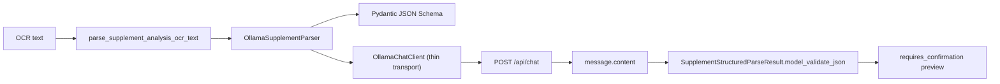

# 28. Ollama Local LLM Connection Implementation Plan

작성일: 2026-05-13
범위: `OllamaSupplementParser` 중심의 로컬 LLM 연결 안정화, structured output 검증, 구현 플랜
상태: 상세 설계 및 1차 구현 반영

## 1. 목적

이 문서는 OCR text를 로컬 Ollama LLM으로 구조화 parsing하는 연결을 안정화하기 위한 상세 설계다. 현재 구현된 `OllamaSupplementParser`를 중심으로 유지하고, 필요할 때만 얇은 adapter/transport 계층을 추가한다.

1차 구현 반영:

- `OllamaChatClient` thin transport 추가
- `check_ollama_readiness`와 `OllamaReadiness` 추가
- malformed response, malformed JSON, extra/internal field, invalid confidence 테스트 보강
- OCR text parse audit metadata에 `raw_llm_response_stored=false`, parser model/schema metadata 추가
- retry/repair loop는 기본 OFF 원칙에 따라 미구현

핵심 결론:

- 현재 `OllamaSupplementParser`는 유지한다.
- 넓은 `LLMAdapter` 전면 마이그레이션은 지금 하지 않는다.
- 얇은 transport 계층은 readiness check, retry, metrics, test isolation이 필요할 때만 추가한다.
- Ollama structured output의 `format` schema만 믿지 않고, 반드시 Pydantic schema로 재검증한다.
- LLM 결과는 확정 데이터가 아니라 사용자 확인 전 preview 후보로만 저장한다.
- raw OCR text, prompt 전문, raw LLM response는 저장하지 않는다.

## 2. 공식 문서 확인 결과

| 영역 | 공식 문서 확인 내용 | 설계 반영 |
| --- | --- | --- |
| API base URL | Ollama 설치 후 기본 API는 `http://localhost:11434/api`에서 제공된다. | 기본 `OLLAMA_BASE_URL=http://127.0.0.1:11434` 유지. |
| Chat endpoint | `POST /api/chat`는 `model`, `messages`, `format`, `options`, `stream`, `think` 등을 받는다. 응답에는 `message.content`, `done`, duration/count metadata가 포함된다. | 현재 `OllamaSupplementParser`의 `/api/chat` 호출을 유지한다. |
| Streaming | Ollama 일부 endpoint는 기본 streaming이며, `stream=false`로 JSON response를 받을 수 있다. 공식 문서는 structured output에는 non-streaming이 더 단순하다고 설명한다. | structured parse는 항상 `stream=false`로 고정한다. |
| Structured outputs | `format`에 `json` 또는 JSON Schema를 줄 수 있고, Pydantic `model_json_schema()`를 전달한 뒤 `model_validate_json()`으로 검증하는 예시가 제공된다. | `SupplementStructuredParseResult.model_json_schema()`를 `format`에 넣고 응답을 다시 Pydantic 검증한다. |
| Prompt grounding | structured output 문서는 JSON Schema를 prompt에도 문자열로 넣는 것이 모델 응답을 grounding하는 데 좋다고 설명한다. | 현재처럼 prompt에 schema를 포함한다. |
| Determinism | structured output tips는 더 결정적인 결과를 위해 낮은 temperature, 예: `0`, 사용을 권장한다. | 기본 `OLLAMA_TEMPERATURE=0` 유지. |
| Cloud limitation | Ollama Cloud는 현재 structured outputs를 지원하지 않는다. | 식별 가능 health data는 local Ollama만 사용하고 cloud model은 차단한다. |
| Model inventory | `GET /api/tags`는 로컬 모델 목록을 반환한다. | readiness check에서 configured model 존재 여부를 검증한다. |
| Errors | Ollama API error는 HTTP status와 `{"error": "..."}` 구조로 반환된다. | provider 오류는 raw error를 노출하지 않고 `parser_unavailable`로 mapping한다. |

참조 URL:

- Ollama API Introduction: https://docs.ollama.com/api
- Ollama Chat API: https://docs.ollama.com/api/chat
- Ollama Streaming: https://docs.ollama.com/api/streaming
- Ollama Errors: https://docs.ollama.com/api/errors
- Ollama List Models: https://docs.ollama.com/api/tags
- Ollama Structured Outputs: https://docs.ollama.com/capabilities/structured-outputs

## 3. 현재 구현 지도

| 구간 | 현재 파일 | 상태 |
| --- | --- | --- |
| Runtime settings | `backend/src/config.py` | `llm_provider="ollama"`, `ollama_base_url`, `ollama_model`, timeout, temperature 구현됨 |
| Parser entrypoint | `backend/src/services/supplement_parser.py` | `parser` 미주입 시 `OllamaSupplementParser(settings)` 직접 사용 |
| Ollama parser | `backend/src/llm/ollama.py` | `/api/chat`, `format=schema`, `stream=false`, `think=false`, Pydantic 재검증 구현됨 |
| Ollama transport/readiness | `backend/src/llm/ollama.py` | `OllamaChatClient`, `check_ollama_readiness` 구현됨 |
| Output schema | `backend/src/models/schemas/supplement_parser.py` | `extra="forbid"`, confidence range, `nutrient_code=None` 강제 |
| OCR text API | `backend/src/api/v1/supplements.py` | parser 오류를 `parser_unavailable`, `parser_schema_invalid`로 mapping |
| One-shot OCR path | `backend/src/services/supplement_image_analysis.py` | OCR text가 있으면 parser 호출 가능 |
| Current guide | `docs/Nutrition-docs/dev-guides/08-llm-supplement-parsing.md` | 현재 구현 설명 |

이미 잘 되어 있는 점:

- 외부 LLM provider를 허용하지 않고 `LLM_PROVIDER=ollama`만 지원한다.
- `ALLOW_EXTERNAL_LLM=false`일 때 `localhost`, `127.0.0.1`, `::1`만 허용한다.
- schema를 `format`에 넣고, response도 Pydantic으로 다시 검증한다.
- `think=false`로 thinking output을 요청하지 않는다.
- raw OCR text는 DB에 저장하지 않고 hash만 저장한다.

남은 gap:

- `check_ollama_readiness`는 구현됐지만 아직 public health endpoint에는 연결하지 않았다.
- transport timing 기반 `duration_ms` 계측은 아직 없다.
- HTTP status별 error mapping은 404 model unavailable만 분리했고, 나머지는 안정적 `OllamaClientError`로 유지한다.
- schema invalid response에 대한 1회 재시도 여부가 아직 결정되지 않았다.
- 실제 local Ollama smoke test는 opt-in gate만 설계했고 아직 추가하지 않았다.

## 4. 설계 원칙

1. `OllamaSupplementParser`를 domain parser로 유지한다.
   - OCR text -> `SupplementStructuredParseResult` 변환 책임은 그대로 둔다.
   - API/service 계층은 parser protocol만 알면 된다.

2. 얇은 adapter 계층만 추가한다.
   - 이름 후보: `OllamaChatClient`, `OllamaStructuredOutputClient`, 또는 `OllamaTransport`
   - 책임은 HTTP request/response, readiness, retry, metrics로 제한한다.
   - supplement schema와 prompt는 `OllamaSupplementParser`에 남긴다.

3. LLM output은 untrusted data다.
   - `format` JSON Schema는 생성 형식 제약일 뿐 최종 검증이 아니다.
   - `model_validate_json` 실패 시 결과를 폐기한다.
   - extra field, internal nutrient code, out-of-range confidence, 과도한 ingredient 수는 모두 reject한다.

4. 로컬 LLM 기본값을 유지한다.
   - `ALLOW_EXTERNAL_LLM=false` 기본값을 유지한다.
   - `https://ollama.com/api` 또는 cloud model은 식별 가능 health data 처리에서 차단한다.
   - external LLM adapter는 이 문서의 구현 범위가 아니다.

5. 실패는 사용자 확인 preview로 조용히 섞지 않는다.
   - parser 연결 실패: `502 parser_unavailable`
   - schema 검증 실패: `502 parser_schema_invalid`
   - OCR text 자체 문제: `422 invalid_ocr_text`

## 5. 목표 아키텍처



권장 모듈 경계:

| 모듈 | 책임 |
| --- | --- |
| `src.llm.ollama.OllamaSupplementParser` | supplement OCR text prompt, schema selection, result validation |
| `src.llm.ollama.OllamaChatClient` | `/api/chat`, `/api/tags`, timeout, error normalization |
| `src.models.schemas.supplement_parser` | LLM output schema와 strict validation |
| `src.services.supplement_parser` | owner/preview state, OCR text normalization/hash, DB update |
| `src.api.v1.supplements` | HTTP error mapping, audit event |

## 6. Structured Output 검증 설계

### 요청 payload

현재 방식 유지:

```json
{
  "model": "qwen3.5:9b",
  "messages": [
    {"role": "system", "content": "..."},
    {"role": "user", "content": "...OCR text + JSON Schema..."}
  ],
  "stream": false,
  "think": false,
  "format": {"type": "object", "properties": "..."},
  "options": {"temperature": 0}
}
```

강제 규칙:

- `stream=false`
- `think=false`
- `format=SupplementStructuredParseResult.model_json_schema()`
- prompt에도 동일 schema 문자열 포함
- OCR text는 `<ocr_text>...</ocr_text>` data block으로 감싸고 instruction으로 취급하지 않음
- `temperature=0` 기본값 유지

### 응답 검증

검증 순서:

1. HTTP status 성공인지 확인
2. response body가 JSON object인지 확인
3. `message.content`가 non-empty string인지 확인
4. `SupplementStructuredParseResult.model_validate_json(content)` 실행
5. service layer에서 ingredient 수와 parser-specific business rule 재검증
6. DB에는 sanitized `parsed_snapshot`만 저장

reject 조건:

- JSON이 아닌 content
- schema에 없는 extra field
- `nutrient_code`가 null이 아님
- confidence가 0.0-1.0 범위를 벗어남
- ingredient candidate가 `supplement_parser_max_ingredients`를 초과
- warnings 또는 low_confidence_fields가 과도하거나 빈 문자열만 포함

## 7. Error Mapping 설계

| 원인 | 내부 예외 | API error |
| --- | --- | --- |
| `OLLAMA_BASE_URL` remote and `ALLOW_EXTERNAL_LLM=false` | `OllamaConfigurationError` | `502 parser_unavailable` |
| Ollama process down / timeout | `OllamaClientError` | `502 parser_unavailable` |
| model not found | `OllamaModelUnavailableError` 후보 | `502 parser_unavailable` |
| invalid JSON body from Ollama | `OllamaClientError` | `502 parser_unavailable` |
| `message.content` missing | `OllamaClientError` | `502 parser_unavailable` |
| content schema validation failed | `OllamaStructuredOutputError` | `502 parser_schema_invalid` |
| OCR text blank/too long | `SupplementParserInputError` | `422 invalid_ocr_text` |

구현 제안:

- `OllamaClientError`를 유지하되 하위 예외는 필요한 경우에만 추가한다.
- raw provider error string은 response에 그대로 노출하지 않는다.
- audit metadata에는 `error_code`, `model`, `schema_valid=false`, `duration_ms` 정도만 남긴다.

## 8. Retry 정책

기본 정책:

- transport failure: retry 0회
- schema validation failure: retry 0회
- production에서는 무조건 deterministic fail-fast 우선

추가 후보:

- `OLLAMA_SCHEMA_RETRY_ATTEMPTS=1`을 별도 설정으로 추가할 수 있다.
- retry prompt는 "Return only valid JSON matching the schema. Do not add fields." 수준으로 제한한다.
- retry도 raw response를 저장하지 않는다.

권장:

- OT-OL1 안정화 단계에서는 retry를 추가하지 않는다.
- 실제 라벨 샘플에서 schema invalid가 빈번하면 OT-OL2에서 1회 repair retry를 검토한다.

## 9. Readiness Check 설계

목표:

- API 요청이 들어온 뒤에야 모델 미설치를 발견하지 않도록 한다.
- CI 기본 job은 Ollama process가 없어도 통과해야 한다.

추가 함수 후보:

```python
async def check_ollama_readiness(settings: Settings, client: OllamaChatClient) -> OllamaReadiness:
    ...
```

검사 항목:

- `GET {OLLAMA_BASE_URL}/api/tags` 성공 여부
- `settings.ollama_model`이 `models[].name` 또는 `models[].model`에 있는지
- `ALLOW_EXTERNAL_LLM=false`일 때 base URL local host인지
- optional smoke: tiny `/api/chat` structured output call

운영 방식:

- `/api/v1/health`에 바로 넣지 않는다. 현재 health endpoint가 외부 process 의존으로 불안정해질 수 있다.
- 별도 internal readiness command 또는 optional health detail로 둔다.
- `RUN_OLLAMA_TESTS=true`일 때만 실제 Ollama smoke test를 실행한다.

## 10. Observability와 Privacy

저장 가능 metadata:

- `llm_provider="ollama"`
- `ollama_model`
- `schema_name="SupplementStructuredParseResult"`
- `schema_version` 또는 `algorithm_version`
- `schema_valid`
- `duration_ms`
- `prompt_eval_count`
- `eval_count`
- `done_reason`
- `error_code`

저장 금지:

- raw OCR text
- full prompt
- raw `message.content`
- raw LLM error message에 OCR text가 섞일 가능성이 있는 값
- 사용자의 건강정보가 포함된 stack trace/log

audit event 보강:

- 성공: `supplement_ocr_text_parsed`
- 실패: `supplement_ocr_text_parse_failed`
- metadata: `parser_provider`, `model`, `schema_valid`, `raw_ocr_text_stored=false`, `raw_llm_response_stored=false`

## 11. 구현 단계

### OT-OL0: 현재 기준선 고정

작업:

- 현재 `OllamaSupplementParser` 테스트를 먼저 고정한다.
- manual OCR text endpoint와 service parser 테스트를 함께 실행한다.
- docs/Nutrition-docs/dev-guides/08의 테스트 파일명 불일치를 보정한다.

검증:

```bash
cd yeong-Lemon-Aid/backend
.venv/bin/python -m pytest tests/unit/llm/test_ollama_parser.py tests/unit/services/test_supplement_parser.py tests/integration/api/test_supplement_ocr_text_api.py
```

### OT-OL1: 얇은 transport 계층 정리

작업:

- [x] `OllamaChatClient`를 추가한다.
- [x] `/api/chat` 호출과 `/api/tags` readiness 호출을 transport로 이동한다.
- 기존 `_AsyncPostClient` protocol 기반 테스트는 유지하되, post/get protocol을 분리한다.
- parser class는 prompt/schema/result validation에 집중한다.

완료 조건:

- 기존 parser public API `parse_supplement_ocr_text`는 변하지 않는다.
- 기존 tests가 큰 수정 없이 통과한다.
- HTTP client fake로 request payload를 계속 검증할 수 있다.

### OT-OL2: readiness와 모델 존재 검증

작업:

- [x] `GET /api/tags` 기반 readiness helper 추가
- [x] model missing, Ollama down, remote URL blocked cases 테스트
- `RUN_OLLAMA_TESTS=true` 전용 실제 local smoke test 추가

완료 조건:

- CI 기본 job은 Ollama 없이 통과한다.
- opt-in smoke test는 실제 `ollama`가 있을 때만 실행된다.

### OT-OL3: schema validation hardening

작업:

- [x] response `message.content` extraction 테스트를 확장한다.
- [x] malformed JSON, extra fields, invalid confidence, non-null nutrient_code 테스트를 추가한다.
- business rule validator가 `supplement_parser_max_ingredients` 초과를 막는지 재확인한다.
- parser prompt에 "LLM output is extraction candidate only" 문구를 명확히 한다.

완료 조건:

- LLM이 schema 밖 필드를 반환해도 저장되지 않는다.
- invalid LLM output은 `parser_schema_invalid`로 끝난다.
- 사용자 확인 없는 확정 저장 경로가 없다.

### OT-OL4: API/audit metadata 보강

작업:

- [x] parser success/failure audit metadata에 `raw_llm_response_stored=false` 추가
- [x] `model`, `schema_valid` 같은 non-sensitive metadata 추가
- `duration_ms`는 transport timing 계측을 추가하는 별도 변경에서 반영한다.
- raw prompt/content가 audit에 들어가지 않는지 테스트

완료 조건:

- audit metadata에 OCR text와 raw response가 없다.
- failure reason은 안정적 code로만 기록된다.

### OT-OL5: optional repair retry 검토

작업:

- 실제 샘플에서 schema invalid 비율이 높을 때만 1회 retry 설계를 켠다.
- retry는 feature flag 또는 setting으로 기본 OFF.

완료 조건:

- 기본 behavior는 fail-fast.
- retry ON에서도 raw response 저장 없음.

## 12. 파일별 변경 플랜

| 파일 | 변경 |
| --- | --- |
| `backend/src/llm/ollama.py` | `OllamaSupplementParser` 유지. 필요 시 `OllamaChatClient`/readiness helper 추가. error class는 최소 추가. |
| `backend/src/models/schemas/supplement_parser.py` | schema strictness 유지. 필요 시 warning/field path validation 강화. |
| `backend/src/services/supplement_parser.py` | parser result business rule 검증 유지. raw text/hash 정책 유지. |
| `backend/src/api/v1/supplements.py` | parser error mapping 유지. audit metadata에 raw response 저장 여부와 model metadata 추가 후보. |
| `backend/src/config.py` | 기존 `ollama_*` 설정 유지. optional retry/readiness setting은 필요할 때만 추가. |
| `backend/tests/unit/llm/test_ollama_parser.py` | payload, schema invalid, local-only guard, malformed response, HTTP error, model missing 테스트 보강. |
| `backend/tests/integration/api/test_supplement_ocr_text_api.py` | parser failure mapping과 raw data 비저장 회귀 보강. |
| `docs/Nutrition-docs/dev-guides/08-llm-supplement-parsing.md` | 이 계획 문서 링크와 현재 테스트 파일명 보정. |
| `docs/Nutrition-docs/12-local-llm-ollama-migration.md` | 현행 구현 기준과 이 세부 계획 링크 추가. |

## 13. 테스트 플랜

필수 단위 테스트:

- payload includes `stream=false`, `think=false`, `format=model_json_schema()`, `temperature=0`
- remote `OLLAMA_BASE_URL` blocked when `ALLOW_EXTERNAL_LLM=false`
- HTTP timeout/status error -> `OllamaClientError`
- non-object response -> `OllamaClientError`
- missing `message.content` -> `OllamaClientError`
- malformed JSON content -> `OllamaStructuredOutputError`
- extra field content -> `OllamaStructuredOutputError`
- invalid confidence content -> `OllamaStructuredOutputError`
- non-null nutrient_code -> `OllamaStructuredOutputError`
- `GET /api/tags` model missing -> readiness not ready

필수 통합 테스트:

- `POST /api/v1/supplements/analyses/{analysis_id}/ocr-text` success path
- parser unavailable -> `502 parser_unavailable`
- parser schema invalid -> `502 parser_schema_invalid`
- raw OCR text not stored
- raw LLM response not stored

Opt-in local smoke:

```bash
cd yeong-Lemon-Aid/backend
RUN_OLLAMA_TESTS=true .venv/bin/python -m pytest tests/integration/llm/test_real_ollama_parser.py
```

전체 검증:

```bash
cd yeong-Lemon-Aid/backend
.venv/bin/python -m black --check src tests alembic
.venv/bin/python -m ruff check src tests alembic
.venv/bin/python -m mypy src tests --strict
.venv/bin/python -m pytest tests/unit/llm/test_ollama_parser.py tests/unit/services/test_supplement_parser.py tests/integration/api/test_supplement_ocr_text_api.py
.venv/bin/python -m pytest
```

## 14. 수용 기준

구현 착수 조건:

- Ollama 공식 API와 structured output 문서 기준이 이 문서와 일치한다.
- 기본 runtime은 local Ollama이며 external LLM은 계속 disabled다.
- 새 adapter 계층은 `OllamaSupplementParser`를 대체하지 않고 transport/readiness만 분리한다.

구현 완료 조건:

- `OllamaSupplementParser.parse_supplement_ocr_text` public behavior가 유지된다.
- structured output schema가 request `format`과 response validation 양쪽에 모두 적용된다.
- invalid model output은 저장되지 않고 `parser_schema_invalid`로 실패한다.
- Ollama down/model missing은 `parser_unavailable`로 실패한다.
- raw OCR text, prompt, raw LLM response는 DB/response/audit log에 저장되지 않는다.
- CI 기본 job은 Ollama process 없이 통과한다.
- opt-in local smoke test는 실제 Ollama가 있을 때만 실행된다.

## 15. 권장 commit 분리

1. `docs(llm): add Ollama local connection implementation plan`
   - 왜: 로컬 LLM 연결 안정화 범위와 schema 검증 원칙을 구현 전에 고정하기 위해.

2. `refactor(llm): isolate Ollama chat transport`
   - 왜: supplement parser의 domain parsing 책임과 HTTP 호출 책임을 분리해 readiness와 테스트를 쉽게 만들기 위해.

3. `feat(llm): add Ollama readiness checks`
   - 왜: 모델 미설치나 로컬 서버 미기동을 운영 요청 중에야 발견하지 않도록 하기 위해.

4. `test(llm): harden structured output validation cases`
   - 왜: LLM이 schema 밖 값을 반환해도 저장되지 않는지 보장하기 위해.

5. `docs(llm): update supplement parsing guide for Ollama stabilization`
   - 왜: 구현 상태와 테스트 경로를 문서와 맞춰 후속 작업자가 오래된 adapter 설계를 따르지 않게 하기 위해.
