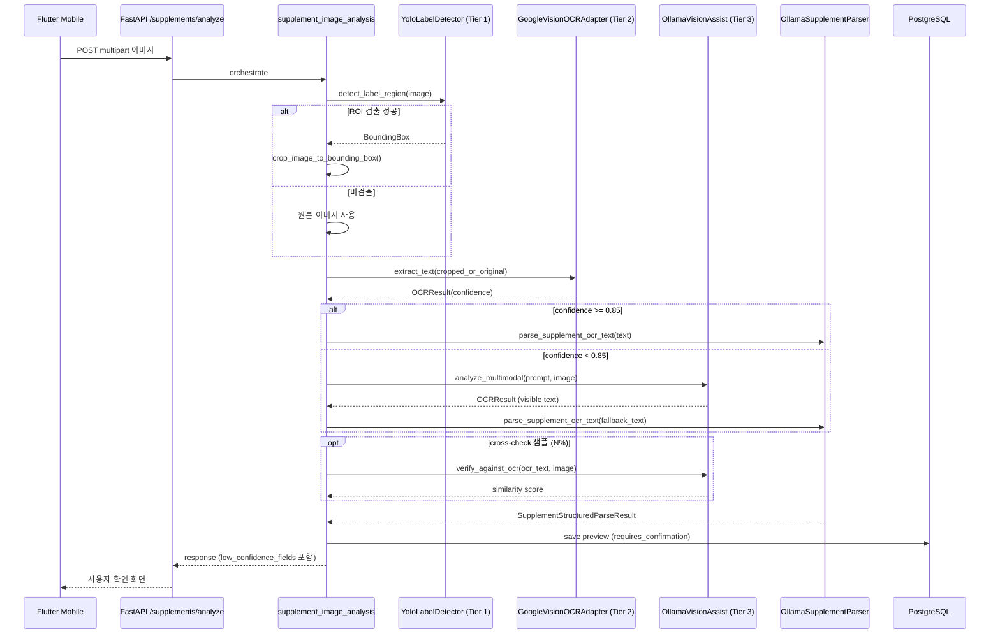

# 33. 3-Tier OCR 파이프라인 상세 구현 가이드

> **문서 정보**
> 버전: v1.2 | 작성일: 2026-05-14 | 상태: 개념 기준선 + docs/40 실행 플랜으로 분리 | 작성자: yeong-tech

---

## 0. 한 줄 요약

영양제 라벨 분석의 후속 목표 파이프라인은 ① **YOLO ROI 보조** ② **Google Cloud Vision Primary OCR(`DOCUMENT_TEXT_DETECTION`)** ③ **Ollama 멀티모달 Fallback + Cross-check 검수** 의 3-tier 구조다. 2026-05-16 현재 브랜치 기준으로 `GoogleVisionOCRAdapter`, OCR factory, optional `ClovaOCRAdapter` backup, 좌표 기반 `parse_label_layout()` 휴리스틱 parser가 구현되었다. CLOVA와 Google Vision은 layout-aware `OCRResult`로 정규화되고, Layout Parser는 이를 섹션별 행/열 cell 배열로 재구성한다. 남은 핵심 확장 범위는 실제 fixture 기반 우선순위 재검토, Layout Parser 결과의 LLM prompt 통합, fixture 평가 리포트, 발주처 review gate 산출물이다. 상세 실행 플랜은 [docs/40](./40-ocr-3-tier-expansion-design-plan.md)을 기준으로 한다.

> 주의: 이 문서는 3-tier 개념 기준선이다. 모델 tag, 비용, 정확도, latency 수치는 fixture 실행 결과가 아니면 완료 수치로 해석하지 않는다. 구현 순서와 현재 상태 판단은 [docs/40](./40-ocr-3-tier-expansion-design-plan.md)이 우선한다.

---

## 1. 구현 방향 + 사용자 의도

### 1.1 사용자 요구

- **Tier 1**: YOLO 로 라벨 영역만 검출(분류·의료 판단 X) → OCR 정확도 향상을 위한 입력 전처리
- **Tier 2**: Google Cloud Vision 으로 텍스트 추출 — 한국어 + 영양제 라벨 정확도 우선
- **Tier 3**: Ollama 멀티모달 LLM(Qwen 3.5 + Gemma 4 vision 보조)
  - *Fallback*: Google Vision 신뢰도가 낮을 때 라벨 이미지를 직접 멀티모달에 보내 텍스트 재추출
  - *Cross-check 검수*: Google Vision 출력이 시각 콘텐츠와 일치하는지 샘플링으로 교차 검증

### 1.2 선택 근거

- [docs/27](./27-ot-s2b-google-vision-ocr-review-plan.md) — Google Vision 의 한글 OCR 정확도가 시장에서 가장 안정적
- [docs/30 §1](./30-multimodal-yolo-experiment-plan.md) — `OCR-first + optional ROI + optional vision assist` 결론
- 공식 문서 확인(2026-05-15 상태 보정):
  - Ollama 모델 tag 가용성은 실제 배포 환경의 `ollama list`와 공식 model library 확인을 별도 sign-off로 남긴다. 이 문서는 특정 tag의 정확도나 설치 가능성을 완료 수치로 확정하지 않는다.
  - Ollama는 vision 입력의 `images` 배열과 structured output의 JSON schema `format`을 공식 지원한다 ([Ollama Vision](https://docs.ollama.com/capabilities/vision), [Ollama Structured Outputs](https://docs.ollama.com/capabilities/structured-outputs)).
  - Google Cloud Vision 의 **`DOCUMENT_TEXT_DETECTION`** 은 dense text image/document OCR에 맞는 feature이며, Cloud Vision 가격표에서 `Text Detection`과 동일한 단가 그룹으로 공시된다 ([Cloud Vision features](https://docs.cloud.google.com/vision/docs/features-list), [Cloud Vision pricing](https://cloud.google.com/vision/pricing)).

### 1.3 기존 문서와의 관계

| 문서 | 관계 |
| --- | --- |
| [docs/25](./25-ocr-text-supplement-analysis-plan.md) | OCR text → structured parse 흐름. 본 가이드는 그 흐름의 *입력* 을 책임진다. |
| [docs/26](./26-ot-s2-ocr-provider-adapter-implementation-plan.md) | `OCRAdapter` 인터페이스 표준. 본 가이드는 그 표준을 그대로 채택한다. |
| [docs/27](./27-ot-s2b-google-vision-ocr-review-plan.md) | Google Vision 리뷰. 본 가이드 §4 에서 `DOCUMENT_TEXT_DETECTION` 으로 결정을 갱신한다. |
| [docs/28](./28-ollama-local-llm-connection-implementation-plan.md) | Ollama 텍스트 파서 연결. 본 가이드 §5 의 Pydantic structured output 단계에서 재사용. |
| [docs/30](./30-multimodal-yolo-experiment-plan.md) | 실험 결론. 본 가이드는 그 결론을 후속 구현 명세로 구체화. |
| [docs/32](./32-paddleocr-local-fallback-plan.md) | PaddleOCR 비용 최적화 폴백. 본 가이드 §5.2 라우팅 트리에 후순위 폴백으로 포함. |
| [docs/31](./31-backend-feature-specifications.md) | 현행 기능 명세. 본 가이드 채택 후 §4 OCR·§5 LLM·§6 Vision 섹션 링크 갱신. |
| [docs/40](./40-ocr-3-tier-expansion-design-plan.md) | Google Vision MVP 이후 YOLO/Ollama/PaddleOCR/CLOVA/fixture report 확장 실행 플랜. |

---

## 2. End-to-End 파이프라인



응답 시간 목표: P95 < 6초 ([docs/06 §3.4](./06-tech-stack.md) 의 Redis 캐싱과 함께).

---

## 3. Tier 1 — YOLO ROI 보조 (Image Preprocessing)

### 3.1 책임
**영양제 라벨이 차지하는 픽셀 영역만** `BoundingBox` 로 반환. 분류·성분 추출·의료 판단 출력 절대 금지(CLAUDE.md Rule 1).

### 3.2 사용 모델

| 단계 | 모델 | 용도 | 품질 판단 |
| --- | --- | --- | --- |
| Phase 3 게이트 #2 통과 직후 | `vision_classifier_model` 설정값 | Ultralytics runner와 ROI contract smoke | supplement-label ROI 품질은 fixture report 전까지 확정하지 않는다. |
| Phase 4 fine-tuning 이후 | 자체 supplement-label ROI model | 실제 라벨 crop 품질 개선 후보 | mAP/IoU 목표는 학습 데이터와 fixture 평가 산출물에만 기록한다. |

Ultralytics predict mode는 결과 객체의 `boxes.xyxy`, `boxes.conf`, `boxes.cls`를 제공한다([Predict Mode](https://docs.ultralytics.com/modes/predict/)). 다만 pretrained detector가 영양제 라벨 전용 ROI를 보장한다고 보지 않는다.

### 3.3 검출 클래스 화이트리스트

`backend/src/vision/taxonomy.py` 의 `VisionLabel` enum 만 허용:
- `SUPPLEMENT_BOTTLE`
- `SUPPLEMENT_LABEL`
- `BLISTER_PACK`

모델 출력의 의료 클래스(예: `pill_label`, `prescription_label`)는 alias 매핑에서 제외. 별칭은 `VISION_LABEL_ALIASES` 만 사용.

### 3.4 출력

- `BoundingBox(x, y, width, height, confidence)`
- ROI 우선순위(`VISION_ROI_LABEL_PRIORITY`): `SUPPLEMENT_LABEL` > `SUPPLEMENT_BOTTLE` > `BLISTER_PACK`
- 미검출 시: `None` 반환 → Tier 2 가 원본 이미지를 입력으로 사용 (graceful "ROI 옵션 비활성" — fallback 패턴이 아니라 옵션 단계 스킵)

### 3.5 데이터셋 전략

- Phase 3 게이트 #2 통과 직후: pretrained 모델은 runner smoke와 failure-mode 확인에만 사용한다. supplement-label ROI 운영 품질은 fixture report 전까지 확정하지 않는다.
- 자체 데이터셋 수집 (Phase 3 후반):
  - 영양제 라벨 사진 100~200장 수동 라벨링 (CVAT / Roboflow)
  - AI Hub 음식 이미지 데이터셋 ([docs/09 §4.1](./09-data-catalog.md)) 보조 학습 (배경 다양성)
  - 학습 결과 `yolov8n-supplement.pt` 를 `backend/data/models/` 에 보관, `vision_classifier_model` 환경 변수로 교체

### 3.6 라이선스 — Ultralytics AGPL-3.0

Ultralytics 는 AGPL-3.0 또는 Enterprise 라이선스. 발주처 인수인계 시점 ([docs/Nutrition-docs/dev-guides/25](./dev-guides/25-handover-checklist.md)) 라이선스 영향 검토 필수. AGPL 의 *network use* 조항이 SaaS 운영에 미치는 영향을 docs/15 §3 의 게이트 #2 산출물에 포함.

### 3.7 활성화 조건

본 단계가 동작하려면 모두 동시 충족:
1. [docs/17 §8](./17-image-collection-consent-plan.md) 게이트 #2 통과
2. `Settings.enable_vision_classifier=True`
3. `pip install ".[vision]"` (docs/06 §2.3 vision extras 설치)

게이트 미통과 시 `vision/yolo.py` 가 `VisionError` 를 발생시키므로 호출처는 `try/except` 로 옵션 비활성 처리.

---

## 4. Tier 2 — Google Cloud Vision Primary OCR

### 4.1 책임
Tier 1 이 잘라낸 라벨 영역(또는 원본)에서 **텍스트와 신뢰도** 만 추출. 의미 추론·구조화는 다음 단계(`OllamaSupplementParser`)가 담당.

### 4.2 API 선택 — `DOCUMENT_TEXT_DETECTION`

docs/27 의 `TEXT_DETECTION`/`DOCUMENT_TEXT_DETECTION` 결정을 본 문서에서 갱신:

| 기능 | TEXT_DETECTION | DOCUMENT_TEXT_DETECTION ★ |
| --- | --- | --- |
| 적합 사례 | 일반 사진 안의 텍스트 | 밀집 텍스트(영양제 라벨·약 봉지·스캔 문서) |
| 언어 자동 감지 | 부분 집합 | 전체 지원 언어(한국어 포함) |
| 페이지·블록 단위 신뢰도 | 단어 단위만 | 페이지·블록·단어 모두 |
| 우선순위 | — | 두 옵션 동시 요청 시 자동 우선 |

근거: [Cloud Vision OCR docs](https://cloud.google.com/vision/docs/ocr), [Dense document text detection tutorial](https://cloud.google.com/vision/docs/fulltext-annotations).

### 4.3 입력 / 출력

- 입력: `OCRImageInput(image_bytes, mime_type, width, height, label_region: BoundingBox | None)` — `label_region` 이 있으면 Tier 1 에서 이미 크롭된 이미지
- 최대 크기: `Settings.supplement_image_max_bytes`(5MB), `supplement_image_max_pixels`(12M px)
- 출력: `OCRResult(text, provider="google_vision_document", confidence, pages)`
- 신뢰도 계산: `fullTextAnnotation.pages[].blocks[].paragraphs[].words[]`의 word confidence 평균을 우선 사용하고, 없으면 paragraph/block/page confidence 순서로 fallback한다. provider가 confidence를 반환하지 않으면 `None`으로 둔다.

### 4.4 인증 + 운영

- 로컬 개발 기본값은 `docs/35` 기준 `.env`의 `GOOGLE_CLOUD_API_KEY`만 사용한다.
- Service Account JSON 또는 credential 파일을 저장소에 두지 않는다.
- production 인증은 API key 제한 또는 attached service account 중 하나를 별도 보안 검토로 결정한다.
- 외부 OCR은 `ALLOW_EXTERNAL_OCR=false`, `OCR_PRIMARY_PROVIDER=none` 기본값에서 호출되지 않아야 한다.
- 비밀 관리: GitHub Secrets 또는 운영 secret manager에만 저장하고 문서, 로그, audit event에 key 값을 남기지 않는다.
- 비용: 실제 운영 단가는 Google Cloud Vision 공식 가격표 확인 뒤 산정한다. 본 문서는 임의 비용 수치를 확정값으로 사용하지 않는다.

### 4.5 한국어 처리

`DOCUMENT_TEXT_DETECTION` 의 언어 처리와 `language_hints` 사용 여부는 [Cloud Vision language support](https://docs.cloud.google.com/vision/docs/languages)와 fixture report 기준으로 판단한다. 현재 설정은 `google_vision_language_hints`를 빈 목록 기본값으로 두고, 필요한 경우에만 opt-in으로 전달한다.

### 4.6 활성화 조건

본 단계는 기본 운영이 아니라 명시 opt-in gate 뒤에서만 활성화한다.

1. `ALLOW_EXTERNAL_OCR=true`
2. `OCR_PRIMARY_PROVIDER=google_vision`
3. `EXTERNAL_OCR_PROCESSING` consent active
4. EXIF·GPS·파일명 식별 정보 제거 ([docs/17 §4.1](./17-image-collection-consent-plan.md))
5. 응답 후 원본 이미지 즉시 삭제 (`Settings.image_retention_days=0` 기본)
6. raw OCR text는 저장하지 않고 hash와 structured preview만 저장

---

## 5. Tier 3 — Ollama 멀티모달 Fallback + Cross-check 검수

### 5.1 책임
두 가지 모드로 동작:
- **Fallback 모드**: Tier 2 의 신뢰도가 임계값(0.85) 미만이면 라벨 이미지를 직접 멀티모달에 보내 *visible text* 만 재추출
- **Cross-check 검수 모드**: Tier 2 결과를 받아 동일 이미지의 시각 콘텐츠와 비교, 유사도 임계값(0.80) 미만이면 사용자 확인 화면으로 escalation

### 5.2 라우팅 트리(우선순위 통합)

[docs/32 §4.2](./32-paddleocr-local-fallback-plan.md) 의 폴백 체인과 통합:

```
Tier 1: YOLO ROI 검출
        ├─ 검출 성공  → 이미지 크롭
        └─ 미검출     → 원본 사용

Tier 2: Google Vision DOCUMENT_TEXT_DETECTION
        ├─ confidence >= 0.85 → 텍스트 채택
        │                       (옵션) cross-check 샘플링 → 불일치 시 escalation
        └─ confidence <  0.85 → Tier 3 Fallback 진입

Tier 3: Ollama 멀티모달 vision assist
        ├─ schema validation + visible text 후보 있음 → parser input 후보로 사용
        └─ 후보 없음 또는 검증 실패 → Tier 4 진입

Tier 4 (옵션): PaddleOCR (docs/32, 무료 quota 보호 또는 폐쇄망)
        └─ 미달 → Tier 5

Tier 5 (옵션): CLOVA OCR (기본 OFF, NCP CLOVA OCR Domain/API Gateway 필요)
        └─ 모두 실패 → 사용자 확인 화면 (수동 텍스트 입력)
```

### 5.3 모델 운영 원칙

Tier 3 는 후속 구현에서 두 책임을 분리한다.

| 역할 | 설정 | 검증 방식 |
| --- | --- | --- |
| 이미지 → visible text 후보 | `Settings.ollama_vision_model` | `ollama list`와 공식 model library로 tag 존재 여부를 확인하고, fixture report로 품질을 판단한다. |
| OCR text → 구조화 JSON | `Settings.ollama_model` | Pydantic schema validation과 parser regression test로 판단한다. |

모델 tag와 메모리 요구량은 배포 환경마다 달라질 수 있으므로 이 문서에서 완료 수치로 확정하지 않는다. 두 모델 모두 local Ollama에서 실행되어야 하며, 식별 가능 환자 정보가 외부 LLM으로 송출되지 않는다는 docs/12 원칙을 유지한다.

### 5.4 시스템 프롬프트 (재사용)

`backend/src/llm/ollama_vision.py` 의 `OLLAMA_VISION_ASSIST_SYSTEM_PROMPT` 를 그대로 재사용:

```
You are a local supplement label OCR fallback component.
Extract only text fragments that are visibly present in the image.
Do not infer ingredients, amounts, dosage, health effects, risks, or product facts
from outside knowledge. Do not provide medical or nutrition advice. If text is not
visible, return an empty list or null. Return only JSON matching the supplied schema.
```

본 프롬프트는 CLAUDE.md Rule 1(의료 판단 출력 금지) + docs/17 §7(의료기기법 회피) 의 핵심 안전장치.

### 5.5 두 모드의 상세

#### 5.5.1 Fallback 모드

- 트리거: `Settings.multimodal_ocr_assist_policy`가 `ocr_empty_only` 또는 `low_confidence`이고 primary OCR 결과가 해당 조건에 걸릴 때
- 입력: Tier 1 크롭된 이미지(또는 원본) + 시스템 프롬프트
- Ollama Chat API 의 `images` 배열에 base64 인코딩된 이미지 전달 ([Ollama Vision docs](https://docs.ollama.com/capabilities/vision))
- 출력: `OCRResult(text, provider="ollama_vision_assist", confidence=None)`. 이 경로의 채택 여부는 confidence가 아니라 schema validation, visible text 후보, downstream parser 결과로 판단한다.

#### 5.5.2 Cross-check 검수 모드

- 트리거: `enable_multimodal_verification=True` AND 확률 `multimodal_verification_sample_rate`(기본 5%) 추첨 통과
- 입력: 이미지 + Tier 2 의 텍스트
- 비교 방식: 멀티모달에 동일 이미지를 보내 텍스트를 추출하고 두 결과의 character-level Levenshtein 거리(또는 token recall)로 유사도 계산
- 임계값: `multimodal_verification_threshold`(기본 0.80) 미만 시 결과를 *requires_confirmation* 상태로 표시, 사용자에게 수동 검토 유도

### 5.6 활성화 조건

본 단계가 동작하려면:
1. [docs/17 §8](./17-image-collection-consent-plan.md) 게이트 #1 통과
2. `Settings.enable_multimodal_llm=True`
3. fallback 모드는 `multimodal_ocr_assist_policy`로 제어하고, verification 모드는 docs/40 기준 후속 설정을 추가한다.
4. Ollama 로컬 호스트(`127.0.0.1`/`localhost`/`::1`) 만 허용 (docs/12 §2 환자 정보 외부 송출 금지)

---

## 6. 코드 변경 범위(파일별)

본 가이드 채택 후 후속 PR 에서 다음 변경을 단계적으로 적용한다.

### 6.1 `backend/src/config.py`

2026-05-15 기준 현재 구현은 `multimodal_ocr_assist_policy`와 `google_vision_feature="document_text_detection"`를 이미 사용한다. Google Vision MVP 이후 추가할 설정은 [docs/40 §5](./40-ocr-3-tier-expansion-design-plan.md)를 기준으로 둔다.

```python
# Google Vision MVP 이후 확장 후보 (docs/40 §5)
ocr_roi_preprocessing_policy: Literal["disabled", "detect_only", "crop_before_primary"] = "disabled"
enable_multimodal_verification: bool = Field(
    default=False,
    description="Cross-check 샘플링 검수 활성화. docs/33 §5.5.2.",
)
multimodal_verification_sample_rate: float = Field(default=0.0, ge=0.0, le=1.0)
multimodal_verification_threshold: float = Field(default=0.80, ge=0.0, le=1.0)
```

`validate_production_security` 가드:
- `ocr_roi_preprocessing_policy != "disabled"` 이면 `enable_vision_classifier=True` 와 gate #2 sign-off 강제
- `enable_multimodal_verification=True` 면 동일하게 `enable_multimodal_llm=True` 강제 + sample_rate 가 `(0, 1]` 범위 검증

### 6.2 `backend/src/ocr/providers/google_vision.py`

`GoogleVisionOCRAdapter(OCRAdapter)`:
- `extract_text(image: OCRImageInput) -> OCRResult` 구현됨
- 현재 구현은 REST `images:annotate` 호출과 `x-goog-api-key` 또는 ADC bearer token header provider를 사용한다.
- 요청 feature 는 `Settings.google_vision_feature` 에서 가져온다.
- 응답의 `fullTextAnnotation.text` 또는 `textAnnotations[0].description`에서 OCR text를 추출한다.
- `fullTextAnnotation.pages[].blocks[].paragraphs[].words[]`는 `OCRResult.pages`의 layout hierarchy로 정규화한다.
- confidence 값은 word confidence 평균을 우선 사용하며, 값이 없으면 paragraph/block/page confidence로 fallback한다. 어떤 계층에도 값이 없으면 `None`이다.

### 6.3 `backend/src/services/supplement_image_analysis.py`

신규 헬퍼:

```python
async def _run_three_tier_ocr(
    settings: Settings,
    yolo: VisionAdapter | None,
    google_vision: OCRAdapter,
    ollama_vision: OCRAdapter | None,
    paddle: OCRAdapter | None,
    clova: OCRAdapter | None,
    image: OCRImageInput,
) -> OCRResult:
    """Run YOLO ROI → Google Vision → optional Ollama fallback chain.

    See docs/33 §5.2 routing tree.
    """
```

기존 `_run_ocr_chain` (docs/32 §5.5) 가 있다면 그것과 통합. 단일 진입점만 유지.

Cross-check 로직은 별도 헬퍼:

```python
async def _maybe_cross_check(
    settings: Settings,
    ollama_vision: OCRAdapter,
    image: OCRImageInput,
    primary_text: str,
) -> CrossCheckOutcome:
    """Optional verification when verification flag + sample-rate match."""
```

### 6.4 `backend/src/vision/yolo.py`

현재 fail-closed scaffold (`enable_vision_classifier=False` 면 즉시 `VisionError`). 활성화 후 동작:
- `detect_label_region()` 가 검출 실패 시 `VisionError` 대신 `None` 반환 옵션을 추가
- `UltralyticsYoloRunner` lazy-load (`import` 가 `try/except`)
- `detect_regions()` 결과 중 화이트리스트 클래스만 통과
- 최우선 ROI 한 개를 `BoundingBox` 로 반환

### 6.5 `backend/src/llm/ollama_vision.py`

기존 `OllamaVisionAssist` 에 추가:

```python
async def verify_against_ocr(
    self,
    ocr_text: str,
    image: OCRImageInput,
) -> VerificationOutcome:
    """Re-extract visible text and compare to OCR text by Levenshtein recall."""
```

### 6.6 `backend/.env.example`

3-Tier 운영 플래그 4종 + `GOOGLE_VISION_FEATURE` 라인 추가. production validator 경고를 한 줄 주석으로 안내.

### 6.7 `backend/pyproject.toml`

기존 `[project.optional-dependencies] vision` 그룹에 `google-cloud-vision>=3.7` 이 포함되어 있는지 확인. 미포함 시 base requirements 로 이동(기본 운영에 필요).

### 6.8 `docs/Nutrition-docs/31-backend-feature-specifications.md`

채택 후:
- §4.1 `OCR Adapter ABC` 항목 끝에 "운영 파이프라인은 [docs/33](./33-three-tier-ocr-pipeline-implementation-guide.md) 참조" 한 줄 추가
- §5.2 `Ollama Vision Assist` 항목에 fallback / cross-check 모드 구분 한 줄 추가
- §6.2 `YOLO 검출기` 항목에 ROI-only 운영 원칙과 docs/33 §3 링크 추가

---

## 7. 테스트 전략

### 7.1 단위 테스트

- `tests/unit/ocr/test_google_vision_provider.py`:
  - fake REST client 응답으로 `fullTextAnnotation`/`textAnnotations` 추출과 bounded confidence 평균 검증
  - 빈 응답·인증 실패 시 `OCRError`
  - `DOCUMENT_TEXT_DETECTION` 요청 feature 가 정확히 전달되는지 확인
- `tests/unit/vision/test_yolo.py`:
  - mock `YoloRegionRunner` → ROI 출력 → `BoundingBox` 변환 + 화이트리스트 필터 검증
  - 미검출 시 `None` 반환 (graceful 옵션 비활성)
- `tests/unit/llm/test_ollama_vision_verify.py`:
  - `verify_against_ocr` 의 Levenshtein recall 계산 정확도
  - 응답 JSON 검증 실패 시 재시도 1회

### 7.2 통합 테스트 — `tests/integration/test_three_tier_ocr_pipeline.py`

| 시나리오 | 입력 | 기대 결과 |
| --- | --- | --- |
| A | ROI 성공 + Google 신뢰도 0.92 | Google 결과 반환, Ollama 미호출 |
| B | ROI 실패 + Google 0.60 + Ollama 0.78 | Ollama fallback 결과 반환 |
| C | Google 0.95 + cross-check 통과(유사도 0.92) | Google 결과 반환, 추가 escalation 없음 |
| D | Google 0.95 + cross-check 실패(유사도 0.50) | `requires_confirmation` 플래그 부착, 사용자 확인 화면 |
| E | 모든 게이트 OFF | Google 단독 동작 (기존 동작 보장) |
| F | Google 0.5 + Ollama 0.5 + Paddle 0.6 + CLOVA OFF | Paddle 결과 반환 (docs/32 §4.2 와 통합) |
| G | 모든 폴백 실패 | 사용자 수동 텍스트 입력 화면 escalation |

### 7.3 라벨 100장 PoC

세 구성을 비교한 후 게이트 #1·#2 산출물에 첨부:

| 구성 | 측정 지표 | 비고 |
| --- | --- | --- |
| Google 단독 | 성분명 F1, 함량 F1, 단위 정규화율, P95 latency | baseline |
| Google + YOLO ROI | 동일 | ROI 가 정확도를 얼마나 끌어올리는지 |
| Google + YOLO + Ollama fallback | 동일 + Ollama 호출 비율 | 저신뢰 케이스 회복률 |

목표:
- 성분명 F1 ≥ 0.85
- 함량 F1 ≥ 0.80
- 단위 정규화 성공률 ≥ 0.90
- P95 OCR latency ≤ 6초

---

## 8. 컴플라이언스 평가

| 항목 | Tier 1 (YOLO) | Tier 2 (Google Vision) | Tier 3 (Ollama 멀티모달) |
| --- | --- | --- | --- |
| 환자 정보 외부 전송 | 없음(로컬) | **있음** | 없음(로컬, `127.0.0.1` 강제) |
| docs/17 §3 동의 카테고리 | 1번 분석용 임시 | 1번 분석용 임시 + 외부 송출 동의 | 1번 분석용 임시 |
| docs/17 §7 의료기기법 회피 | ROI metadata 만 출력 | 텍스트만 출력 | system prompt 로 의료 판단 금지 |
| docs/15 §3 규제 검토 | 라이선스(AGPL-3.0) 검토 | 외부 API 약관 | 로컬 처리로 면제 |
| EXIF / GPS 제거 (§4.1) | 적용 | 적용 | 적용 |
| `image_retention_days=0` 기본 | 적용 | 적용 | 적용 |

발주처 리뷰 게이트 매핑:
- 게이트 #1 — Tier 3 활성화 ([docs/17 §8](./17-image-collection-consent-plan.md))
- 게이트 #2 — Tier 1 활성화 + Ultralytics 라이선스 검토
- Tier 2 는 별도 게이트 없이 외부 송출 동의로 운영

---

## 9. 운영 모니터링

### 9.1 Golden Signals 확장

[dev-guides/26-operations-manual.md](./dev-guides/26-operations-manual.md) 에 추가:

| 지표 | 목표 | 임계 알람 |
| --- | --- | --- |
| OCR P95 latency | < 6초 | > 8초 |
| Google Vision 무료 quota 소진율 | < 80% / 월 | 80% 도달 시 알람 |
| YOLO ROI 검출 성공률 | > 90% | < 80% |
| Ollama fallback 진입률 | < 20% | > 30% (Google Vision 또는 YOLO 회귀 의심) |
| Cross-check 불일치율 | < 5% | > 10% |
| 사용자 수동 입력 escalation 비율 | < 5% | > 10% |

### 9.2 Datadog/Grafana 대시보드

`backend/src/services/supplement_image_analysis.py` 에 metric emit 추가:
- `ocr.tier.{1,2,3}.duration_ms`
- `ocr.tier.{1,2,3}.success_total`
- `ocr.tier.{1,2,3}.failure_total`
- `ocr.fallback.entered_total{from="tier2"}`
- `ocr.crosscheck.mismatch_total`

---

## 10. 도입 일정 (단일 개발자 기준)

| Day | 작업 | 산출물 |
| --- | --- | --- |
| 1 | `GoogleVisionOCRAdapter` 구현 + 단위 테스트 | google_vision.py + 5건 테스트 |
| 2 | Settings 4종 + `.env.example` + production validator | config.py 변경 |
| 3 | YOLO 실제 추론 연결(`UltralyticsYoloRunner` 활성) + ROI crop 통합 | yolo.py + ultralytics_runner.py |
| 4 | Ollama 멀티모달 fallback + verification 통합 + `_run_three_tier_ocr` | supplement_image_analysis.py + ollama_vision.py |
| 5 | 라벨 100장 PoC + 정확도 리포트 | docs/33 부록 또는 별도 PoC 노트 |
| 6 | 발주처 리뷰 게이트 #1·#2 산출물 제출 | 리포트 + 라이선스 검토 |
| 7 | docs/31·12·27 후속 갱신 + README 의 OCR 섹션 보강 | 문서 PR |

총 약 1주.

---

## 11. 발주처 게이트 매핑 요약

| 게이트 | 시점 | 대상 | 본 가이드 매핑 |
| --- | --- | --- | --- |
| 게이트 #1 | Phase 2 후반 | Ollama 멀티모달 활성 | Tier 3 fallback/verification |
| 게이트 #2 | Phase 3 초반 | YOLO 추론 활성 + AGPL 검토 | Tier 1 |
| 게이트 #3 | Phase 4 이후 | 학습 적재(pgvector) | 본 가이드 범위 외 ([docs/17 §8](./17-image-collection-consent-plan.md)) |

게이트 #1·#2 산출물에 §7.3 의 PoC 결과를 포함하여 발주처 컴플라이언스 담당 + PM 공동 리뷰.

---

## 12. 변경 이력

| 날짜 | 변경 내용 | 작성자 |
| --- | --- | --- |
| 2026-05-15 | Google Vision MVP 이후 실제 확장 실행 플랜을 `docs/40`으로 분리하고, 본 문서의 성능·모델·비용 수치가 fixture 결과로 오해되지 않도록 상태 주석을 추가. | yeong-tech |
| 2026-05-14 | 상태를 후속 구현 가이드로 낮추고, Ollama 공식 tag 기준으로 `gemma4:e4b` / `qwen3.5:9b` 조합을 정리. | yeong-tech |
| 2026-05-13 | 최초 작성. docs/30 실험 결론을 3-tier 후속 구현 명세로 정리. Tier 별 책임·라우팅 트리·코드 변경 범위·테스트 시나리오 7건·일정 1주 정의. | yeong-tech |

## 13. 관련 문서

- [docs/Nutrition-docs/06-tech-stack.md](./06-tech-stack.md) §2.3 — vision extras
- [docs/Nutrition-docs/09-data-catalog.md](./09-data-catalog.md) §4.1·§5.1 — AI Hub, Google Vision
- [docs/Nutrition-docs/11-detailed-feature-implementation-plan.md](./11-detailed-feature-implementation-plan.md) §745 — OCR 정확도 리스크
- [docs/Nutrition-docs/12-local-llm-ollama-migration.md](./12-local-llm-ollama-migration.md) §3 — Ollama 모델 운영안
- [docs/Nutrition-docs/15-regulated-feature-feasibility-and-compliance-plan.md](./15-regulated-feature-feasibility-and-compliance-plan.md) §3 — 라이선스·규제 검토
- [docs/Nutrition-docs/17-image-collection-consent-plan.md](./17-image-collection-consent-plan.md) §3·§7·§8·§9 — 동의 매트릭스·게이트
- [docs/Nutrition-docs/25-ocr-text-supplement-analysis-plan.md](./25-ocr-text-supplement-analysis-plan.md) — OCR text → structured parse
- [docs/Nutrition-docs/26-ot-s2-ocr-provider-adapter-implementation-plan.md](./26-ot-s2-ocr-provider-adapter-implementation-plan.md) — OCR adapter 인터페이스
- [docs/Nutrition-docs/27-ot-s2b-google-vision-ocr-review-plan.md](./27-ot-s2b-google-vision-ocr-review-plan.md) — Google Vision 리뷰
- [docs/Nutrition-docs/28-ollama-local-llm-connection-implementation-plan.md](./28-ollama-local-llm-connection-implementation-plan.md) — Ollama 텍스트 파서
- [docs/Nutrition-docs/30-multimodal-yolo-experiment-plan.md](./30-multimodal-yolo-experiment-plan.md) — 본 가이드의 사상적 기반
- [docs/Nutrition-docs/31-backend-feature-specifications.md](./31-backend-feature-specifications.md) §4·§5·§6 — 현행 기능 명세
- [docs/Nutrition-docs/32-paddleocr-local-fallback-plan.md](./32-paddleocr-local-fallback-plan.md) — Tier 4 PaddleOCR
- [docs/Nutrition-docs/40-ocr-3-tier-expansion-design-plan.md](./40-ocr-3-tier-expansion-design-plan.md) — Google Vision MVP 이후 3-tier 확장 실행 플랜
- [dev-guides/26-operations-manual.md](./dev-guides/26-operations-manual.md) — 모니터링 절차

외부 참조:
- [Ultralytics YOLOv8](https://docs.ultralytics.com/models/yolov8/)
- [Ultralytics Object Detection](https://docs.ultralytics.com/tasks/detect/)
- [Cloud Vision OCR](https://cloud.google.com/vision/docs/ocr)
- [Cloud Vision Dense Document Text Detection](https://cloud.google.com/vision/docs/fulltext-annotations)
- [Cloud Vision Language Support](https://docs.cloud.google.com/vision/docs/languages)
- [Ollama Vision](https://docs.ollama.com/capabilities/vision)
- [Ollama Structured Outputs](https://docs.ollama.com/capabilities/structured-outputs)
