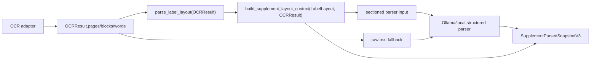

# 50. Phase 2 Layout Parser 실제 연결 상세 설계 및 구현 플랜

- 작성일: 2026-05-17
- 범위: OCR provider normalized layout -> deterministic layout parser -> sectioned parser input -> persisted evidence
- 상태: 상세 설계 및 구현 플랜
- 선행 기준: [47. P1-4 Layout Parser](./47-p1-4-layout-parser-design-plan.md), [49. Phase 1 Parser Schema Expansion](./49-phase1-parser-schema-expansion-design-plan.md)

## 1. 목표

Phase 2의 목표는 현재 독립 모듈에 가까운 `parse_label_layout()`을 OCR 분석 경로에 실제로 연결하는 것이다. 핵심 변경은 raw OCR blob 전체를 그대로 LLM parser에 전달하지 않고, 좌표 기반 layout parser가 만든 섹션별 text bundle을 우선 전달하는 것이다.

이 단계는 추천을 만들지 않는다. 추천 이전의 라벨 사실 구조화 품질을 높이기 위한 전처리/증거 보존 단계다.

## 2. 공식 기준과 확인한 전제

### 2.1 Google Vision

- Google Vision 문서 기준 dense document OCR은 `DOCUMENT_TEXT_DETECTION` 요청과 `fullTextAnnotation` 응답을 사용한다.
- `fullTextAnnotation`은 Pages -> Blocks -> Paragraphs -> Words -> Symbols 계층으로 구성된다.
- `DOCUMENT_TEXT_DETECTION`은 문서형 이미지에 적합한 dense text OCR feature이며, `TEXT_DETECTION`과 같이 요청될 때 우선 적용된다.

공식 문서:

- https://cloud.google.com/vision/docs/fulltext-annotations
- https://cloud.google.com/vision/docs/reference/rest/v1/Feature

### 2.2 NAVER Cloud CLOVA OCR

- CLOVA General OCR API 문서 기준 응답은 `fields`, `tables`, `cells`, `cellTextLines`, `cellWords` 같은 구조를 포함할 수 있다.
- layout 연결에 필요한 핵심 필드는 `inferText`, `inferConfidence`, `boundingPoly.vertices`다.
- `enableTableDetection`이 활성화된 응답에서는 table/cell 단위 구조를 normalized `OCRResult.pages/blocks/paragraphs/words`로 접어야 한다.

공식 문서:

- https://api.ncloud-docs.com/docs/en/ai-application-service-ocr-ocr

### 2.3 Pydantic schema

- Phase 2에서 추가되는 저장/전달 DTO는 Pydantic 모델로 정의하고, 계약 확인은 `model_json_schema()`로 수행한다.
- 공식 문서 기준 `BaseModel.model_json_schema()`는 model schema를 JSON-compatible dict로 생성한다.

공식 문서:

- https://docs.pydantic.dev/latest/concepts/json_schema/

### 2.4 명시적 한계

Google Vision, CLOVA, Pydantic 공식 문서에서 영양제 라벨 섹션 confidence에 대한 권장 threshold는 확인하지 못했다. 따라서 `section_low_confidence_threshold`는 공식 권장값이 아니라 프로젝트 fixture와 회귀 테스트로 보정하는 내부 운영값으로 둔다.

## 3. 현재 구현 진단

| 항목 | 현재 상태 | Phase 2 판단 |
| --- | --- | --- |
| `OCRResult.pages/blocks/paragraphs/words` | provider 공통 DTO가 존재한다. | 유지한다. Google Vision/CLOVA/local OCR 모두 이 DTO를 경유해야 한다. |
| `parse_label_layout()` | `src/parsing/layout_parser.py`에 구현되어 있고 `LabelLayout`을 반환한다. | OCR -> LLM parser 사이에 실제 연결한다. |
| `LabelLayout` | `provider`, `page_count`, `sections`, `warnings`를 가진다. | 그대로 source layout으로 사용하되, 저장용 context는 별도 bounded schema로 만든다. |
| `_parse_ocr_if_available()` | 현재 `ocr_result.text`를 `parse_supplement_analysis_ocr_text()`에 직접 전달한다. | 가장 중요한 연결 지점이다. layout 성공 시 sectioned parser input을 전달한다. |
| `parse_supplement_analysis_ocr_text()` | raw OCR text를 normalize/hash한 뒤 parser에 전달하고 V3 snapshot을 저장한다. | hash 기준은 원본 normalized OCR text로 유지하고, parser input은 layout bundle로 분리한다. |
| `SupplementParsedSnapshotV3` | `label_sections`, `evidence_spans`, `low_confidence_fields`, storage flags가 있다. | `layout_context` 또는 layout-derived summary를 optional로 추가해야 한다. |

비판적 판단: 현재 상태에서 `layout_available=bool(parse_result.label_sections)`로 판단하는 것은 엄밀하지 않다. LLM이 섹션을 추정해 반환해도 layout parser가 실제로 성공했는지와 구분되지 않는다. Phase 2에서는 `layout_context.layout_available`을 별도 source of truth로 둔다.

## 4. 목표 파이프라인



원칙:

1. OCR provider raw JSON은 저장하지 않는다.
2. raw image는 저장하지 않는다.
3. layout parser가 성공하면 LLM parser에는 섹션 marker와 row/cell evidence ref가 포함된 text bundle을 전달한다.
4. layout parser가 실패하거나 의미 있는 섹션을 만들지 못하면 기존 raw OCR text parser로 graceful fallback한다.
5. fallback이 발생해도 사용자 확인은 필수다.

## 5. 신규 계약: `SupplementLayoutContextV1`

### 5.1 위치

권장 파일:

- `backend/Nutrition-backend/src/models/schemas/supplement_layout_context.py`

이름을 `layout_context.py`로 두면 generic layout parser DTO와 혼동될 수 있다. 이 context는 보충제 라벨 분석용 parser input과 저장 summary를 겸하므로 `supplement_layout_context.py`가 더 명확하다.

### 5.2 모델 개요

```python
class SupplementLayoutContextV1(BaseModel):
    schema_version: Literal["supplement-layout-context-v1"]
    provider: str
    layout_available: bool
    parser_input_text: str | None
    sections: list[SupplementLayoutContextSectionV1]
    low_confidence_sections: list[str]
    warnings: list[str]
    fallback_reason: str | None
```

`parser_input_text`는 parser 호출을 위한 request-local 값이다. snapshot에 저장할 때는 `model_dump(exclude={"parser_input_text"})` 또는 별도 persisted DTO를 사용해 제외한다.

```python
class SupplementLayoutContextSectionV1(BaseModel):
    section_id: str
    section_type: SnapshotSectionType
    source_section_type: str
    heading_text: str | None
    text_bundle: str
    confidence: float | None
    requires_review: bool
    evidence_refs: list[str]
    row_count: int
    cell_count: int
```

```python
class SupplementLayoutCellEvidenceV1(BaseModel):
    span_id: str
    section_id: str
    section_type: SnapshotSectionType
    page_index: int | None
    row_index: int
    column_index: int
    cell_ref: str
    text_excerpt: str
    confidence: float | None
```

### 5.3 저장 제한

`layout_context`는 raw OCR text 전체 저장소가 되면 안 된다. 따라서 다음 제한을 둔다.

- `parser_input_text`: 저장하지 않거나, 저장하더라도 최대 길이를 엄격히 제한한다. 권장은 저장하지 않고 request-local parser input으로만 사용한다.
- `sections[].text_bundle`: 섹션별 bounded excerpt만 저장한다. section당 2,000자, 전체 8,000자 같은 내부 제한을 둔다.
- `evidence.text_excerpt`: 기존 `SupplementSnapshotEvidenceSpan.text_excerpt` 제한인 240자를 따른다.
- provider raw JSON, raw image bytes, raw full OCR text는 저장하지 않는다.

비판적 판단: 사용자가 "layout_context로 저장"을 요구했지만, 전체 section text bundle을 그대로 저장하면 raw OCR text 저장 금지 원칙과 충돌할 수 있다. 구현은 "bounded layout summary 저장 + full parser input은 request-local" 방식이 가장 안전하다.

## 6. 섹션 매핑 설계

`LabelLayout.SectionType`은 layout parser 중심 명칭이고, `SupplementParsedSnapshotV3.SnapshotSectionType`은 저장/추천 전단 계약 명칭이다. Phase 2에서 명시적 mapping 함수를 둔다.

| `LabelLayout.section_type` | `SnapshotSectionType` | 판단 |
| --- | --- | --- |
| `nutrition_function_info` | `nutrition_info` | 성분표/영양 기능 정보가 섞일 수 있어 우선 영양정보로 둔다. |
| `functionality` | `functional_info` | 기능성 claim 후보다. |
| `daily_intake` | `intake_method` | "1일 섭취량" anchor가 대부분 섭취 방법에 가깝다. |
| `intake_method` | `intake_method` | 그대로 사용한다. |
| `precautions` | `precautions` | 그대로 사용한다. |
| `ingredients` | `ingredients` | 원재료/성분명 section이다. |
| `unknown` | `unknown` | LLM 추정으로 재분류하지 않는다. |

추가 후보:

- `storage_method`: 현재 `SnapshotSectionType`에는 이미 존재하지만, `LabelLayout.SectionType`에는 아직 없다. Phase 2 구현에서는 layout parser section type과 keyword anchor를 `storage_method`까지 확장한 뒤 mapping한다.
- 보관 문구를 `precautions`로 임시 접으면 "주의사항"과 "보관방법"이 섞여 사용자 확인 UI가 흐려진다. 따라서 schema가 이미 받는 `storage_method`를 사용하는 쪽이 더 안전하다.

## 7. Sectioned Parser Input 형식

LLM parser에 전달할 입력은 사람이 읽는 raw paragraph가 아니라 deterministic bundle이다.

예시:

```text
[section:nutrition_info section_id=sec-000 confidence=0.91]
row=0 | col=0 cell=sec-000:r0:c0: 영양·기능정보
row=1 | col=0 cell=sec-000:r1:c0: 비타민 C | col=1 cell=sec-000:r1:c1: 500 mg

[section:intake_method section_id=sec-001 confidence=0.86]
row=0 | col=0 cell=sec-001:r0:c0: 1일 1회, 1회 1정 물과 함께 섭취하십시오.

[section:precautions section_id=sec-002 confidence=0.72 review=required]
row=0 | col=0 cell=sec-002:r0:c0: 임산부, 수유부는 섭취 전 전문가와 상담하십시오.
```

정렬 규칙:

- section 정렬: page index, section top, 원래 발견 순서
- row 정렬: `row_index`
- cell 정렬: `column_index`
- 같은 OCR 입력과 같은 parser option이면 byte-for-byte 동일한 `parser_input_text`가 나와야 한다.

LLM prompt 제약:

- section marker 밖의 값을 추정하지 않는다.
- `cell=` ref 또는 `section_id`를 evidence로 남긴다.
- `nutrient_code`는 LLM이 확정하지 않고 deterministic matcher 후보만 사용한다.
- section confidence가 낮거나 `review=required`이면 해당 필드를 `low_confidence_fields`에 포함한다.

## 8. Confidence 및 UI 확인 정책

### 8.1 section confidence 계산

권장 deterministic 계산:

1. section 내 cell confidence가 있는 값만 수집한다.
2. 값이 있으면 arithmetic mean을 사용한다.
3. 값이 없으면 `None`으로 둔다.
4. layout parser warning이 section에 직접 연결되면 confidence와 무관하게 `requires_review=True`로 둔다.

### 8.2 low confidence 판정

내부 운영 기준:

- `confidence is None`: 확인 필요
- `confidence < settings.supplement_ocr_confidence_threshold`: 확인 필요
- section row/cell이 0개: 확인 필요
- section type이 `unknown`: 확인 필요
- layout warning이 존재하는 section: 확인 필요

중요: threshold는 공식 권장값이 아니다. fixture 평가를 통해 보정해야 한다.

### 8.3 UI 연결 신호

저장 snapshot에는 다음 신호가 남아야 한다.

- `source.layout_available`
- `label_sections[].evidence_refs`
- `evidence_spans[].cell_ref`
- `low_confidence_fields`
- `warnings`

UI는 `low_confidence_fields` 또는 `requires_review`가 있는 section을 "확인 필요"로 표시한다. 이 문구는 parser confidence를 사용자에게 그대로 노출하는 대신 사용자가 실제 라벨과 비교하도록 유도하는 신호다.

## 9. Service 연결 설계

### 9.1 `_parse_ocr_if_available()` 변경

현재:

```python
parse_supplement_analysis_ocr_text(..., ocr_text=ocr_result.text)
```

목표:

```python
layout_context = build_supplement_layout_context(ocr_result, settings)
parsed = await parse_supplement_analysis_ocr_text(
    ...,
    ocr_text=ocr_result.text,
    parser_input_text=layout_context.parser_input_text,
    layout_context=layout_context,
)
```

주의:

- `ocr_text`는 hash/conflict detection 기준으로 유지한다.
- `parser_input_text`는 LLM에 전달할 sectioned input이다.
- layout unavailable이면 `parser_input_text=None`으로 두고 기존 raw text parser 경로를 사용한다.

### 9.2 `parse_supplement_analysis_ocr_text()` signature 확장

권장 변경:

```python
async def parse_supplement_analysis_ocr_text(
    ...,
    ocr_text: str,
    parser_input_text: str | None = None,
    layout_context: SupplementLayoutContextV1 | None = None,
) -> SupplementParserStoreResult:
```

동작:

1. `ocr_text`는 기존처럼 normalize/hash한다.
2. `parser_input_text`가 있으면 별도로 normalize한다.
3. parser 호출에는 `parser_input_text or normalized_text`를 전달한다.
4. `_build_parsed_snapshot()`에는 `layout_context`를 전달한다.

### 9.3 snapshot 저장

`SupplementParsedSnapshotV3`는 기존 데이터를 깨지 않도록 optional field를 추가한다.

```python
layout_context: SupplementLayoutContextV1 | None = None
```

대안은 별도 DB column이지만 Phase 2 범위에서는 migration 부담이 크다. 기존 `parsed_snapshot` JSON에 optional bounded context를 넣는 것이 낮은 위험이다.

저장 규칙:

- `source.layout_available = layout_context.layout_available`
- `label_sections`는 parser 결과와 layout context를 병합하되, LLM 추정 section보다 layout section evidence를 우선한다.
- `evidence_spans`는 layout cell evidence를 먼저 만들고, LLM parser가 반환한 evidence와 중복 제거한다.
- `warnings`에는 layout warning과 parser warning을 병합한다.
- `raw_ocr_text_stored=False`는 유지한다.

## 10. Graceful Fallback 조건

fallback은 실패를 숨기기 위한 것이 아니라 사용자 확인 화면을 유지하기 위한 경로다. 모든 fallback은 warning으로 남겨야 한다.

| 조건 | fallback reason | 동작 |
| --- | --- | --- |
| `ocr_result.pages` 비어 있음 | `layout_pages_unavailable` | 기존 raw OCR text parser 사용 |
| `parse_label_layout()` 예외 | `layout_parser_error` | 예외 내용을 노출하지 않고 safe warning만 저장 |
| `LabelLayout.sections` 비어 있음 | `layout_sections_empty` | 기존 raw OCR text parser 사용 |
| 모든 section이 `unknown` | `layout_sections_unknown_only` | 기존 raw OCR text parser 사용 |
| sectioned input이 너무 짧음 | `layout_parser_input_empty` | 기존 raw OCR text parser 사용 |
| sectioned input이 max chars 초과 | `layout_parser_input_too_long` | section bundle truncation 후 확인 필요, 그래도 초과하면 raw fallback |

fallback 성공 시에도 다음은 유지한다.

- raw image 미저장
- raw provider payload 미저장
- raw OCR text 미저장
- 사용자 확인 필수
- fallback warning 저장

## 11. Provider별 normalized layout 연결

### 11.1 Google Vision

연결 기준:

- `fullTextAnnotation.pages[]` -> `OCRPage`
- `blocks[]` -> `OCRBlock`
- `paragraphs[]` -> `OCRParagraph`
- `words[]` -> `OCRWord`
- `boundingBox.vertices` -> `OCRBoundingPoly`
- confidence가 제공되는 level은 가능한 범위에서 보존한다.

Phase 2에서는 provider raw response를 layout parser에 직접 넘기지 않는다. provider adapter에서 `OCRResult`로 변환한 뒤 `parse_label_layout()`만 호출한다.

### 11.2 CLOVA OCR

연결 기준:

- `fields[]` flat text는 `OCRWord` 또는 paragraph-like 단위로 접는다.
- `tables[].cells[].cellTextLines[].cellWords[]`가 있으면 word 단위로 우선 접는다.
- table cell row/column index는 현재 `OCRWord`에는 직접 보존 필드가 없으므로 Phase 2에서는 bounding box 기반 grouping을 계속 사용한다.

위험:

- CLOVA가 이미 table 구조를 제공하는데 이를 완전히 무시하면 table 병합 cell 정보를 잃을 수 있다.
- Phase 2 구현에서는 우선 normalized `OCRResult` 통일성을 유지하고, table-specific metadata는 Phase 2.1 별도 확장으로 둔다.

### 11.3 local OCR

local OCR provider는 layout hierarchy가 없을 수 있다. 이 경우:

- word bounding box가 있으면 `OCRResult.pages`를 구성해 layout parser를 태운다.
- bounding box가 없으면 graceful fallback한다.

## 12. 보안/개인정보/제품 리스크

| 리스크 | 문제 | 대응 |
| --- | --- | --- |
| layout_context가 raw OCR text 저장소가 됨 | raw text 미저장 원칙 위반 | section/excerpt 길이 제한, full parser input request-local 유지 |
| LLM이 section을 재분류/추정 | 라벨에 없는 값 생성 | prompt와 schema에서 evidence ref 필수, unknown은 unknown 유지 |
| confidence threshold를 공식값처럼 오해 | 잘못된 신뢰 표시 | 내부 운영값으로 명시, fixture 기반 조정 |
| `layout_available` 의미 혼선 | LLM section과 layout parser 성공이 섞임 | `layout_context.layout_available`을 source of truth로 사용 |
| provider별 좌표 scale 차이 | 행/열 grouping 오류 | parser warning 유지, 좌표 scale mismatch 테스트 추가 |
| fallback이 조용히 성공 처리됨 | 품질 저하 은폐 | fallback reason과 warning을 snapshot에 저장 |

## 13. 구현 페이즈

### P2-1. Schema 추가

파일:

- `src/models/schemas/supplement_layout_context.py`
- `src/models/schemas/supplement_snapshot.py`

작업:

- `SupplementLayoutContextV1`, `SupplementLayoutContextSectionV1`, `SupplementLayoutCellEvidenceV1` 추가
- `SupplementParsedSnapshotV3.layout_context` optional field 추가
- `model_json_schema()` smoke test 추가

검증:

- 기존 V3 snapshot fixture가 layout_context 없이 validation 통과
- layout_context 포함 fixture도 validation 통과

### P2-2. Context builder 추가

파일:

- `src/services/supplement_layout_context.py`

작업:

- `build_supplement_layout_context(ocr_result, settings) -> SupplementLayoutContextV1`
- 내부에서 `parse_label_layout(ocr_result)` 호출
- section mapping, confidence 계산, evidence span id 생성, sectioned input 생성
- fallback reason 결정

검증:

- 같은 `OCRResult` 입력에 같은 `parser_input_text`
- row/cell order deterministic
- low confidence section 산출

### P2-3. Parser service 연결

파일:

- `src/services/supplement_image_analysis.py`
- `src/services/supplement_parser.py`

작업:

- `_parse_ocr_if_available()`에서 layout_context 생성
- `parse_supplement_analysis_ocr_text()` signature 확장
- raw OCR text는 hash 전용 기준으로 유지
- parser에는 sectioned input 우선 전달
- snapshot build에 layout_context 전달

검증:

- layout available이면 mock parser가 section marker 포함 text를 받음
- layout unavailable이면 mock parser가 기존 normalized raw text를 받음

### P2-4. LLM prompt/evidence 연결

파일:

- `src/llm/ollama.py`
- `src/models/schemas/supplement_parser.py`

작업:

- structured parser prompt에 sectioned input format 설명 추가
- evidence refs는 `cell=` 또는 `section_id` 기반만 허용
- section marker 밖의 값 추정 금지 문구 추가
- parser schema의 evidence span validation은 기존 V3 계약과 호환 유지

검증:

- mock Ollama structured output이 evidence ref를 유지
- evidence ref 없는 핵심 필드는 low confidence 처리

### P2-5. 회귀 테스트

테스트 파일:

- `tests/unit/services/test_supplement_layout_context.py`
- `tests/unit/services/test_supplement_parser.py`
- `tests/unit/services/test_supplement_image_analysis.py`
- `tests/unit/ocr/test_google_vision_provider.py`
- `tests/unit/ocr/test_clova_provider.py`
- `tests/unit/parsing/test_layout_parser.py`

필수 테스트:

- Google Vision mock layout -> sectioned input -> parser 호출
- CLOVA mock layout -> sectioned input -> parser 호출
- local OCR mock with pages -> layout path
- manual OCR text -> raw fallback path
- layout parser failure -> raw fallback path
- low confidence section -> `low_confidence_fields`
- evidence span `cell_ref`가 snapshot에 남음
- raw image/text/provider payload 저장 flag가 모두 false

## 14. 성공 기준

Phase 2 완료 판정은 다음 조건으로 한다.

- 동일한 normalized `OCRResult`에서 section 분리와 parser input이 deterministic하다.
- LLM parser가 받는 입력은 raw OCR blob이 아니라 section marker가 있는 text bundle이다.
- parser 결과의 주요 필드에는 evidence section 또는 cell reference가 남는다.
- section confidence가 낮거나 layout fallback이 발생하면 UI 확인 신호가 남는다.
- Google Vision/CLOVA/local OCR 모두 provider raw response가 아니라 `OCRResult.pages/blocks/words`를 거친다.
- layout parser 실패 시 기존 raw OCR text parser로 graceful fallback한다.
- raw image, raw provider payload, raw full OCR text는 저장되지 않는다.
- 최종 status는 계속 `requires_confirmation`이며 사용자 확인 없이 추천/등록으로 넘어가지 않는다.

## 15. 구현 전 체크리스트

- [x] `SnapshotSectionType`에 `storage_method`가 있는지 확인한다.
- [ ] `LabelLayout.SectionType`과 layout parser keyword anchor에 `storage_method`를 추가한다.
- [ ] `SupplementParsedSnapshotV3` optional 확장이 기존 upcaster와 충돌하지 않는지 확인한다.
- [ ] `parse_supplement_analysis_ocr_text()` 호출부가 API preview/manual OCR 경로까지 포함해 모두 깨지지 않는지 확인한다.
- [ ] parser input max length와 stored context max length를 분리한다.
- [ ] fallback warning code가 사용자에게 노출 가능한 safe string인지 확인한다.
- [ ] Google Vision/CLOVA/local OCR fixture가 모두 `OCRResult.pages`를 포함하는지 확인한다.

## 16. 권장 구현 순서

1. `SupplementLayoutContextV1` schema와 JSON Schema smoke test를 먼저 추가한다.
2. `build_supplement_layout_context()`를 no-DB/no-LLM 순수 함수에 가깝게 구현한다.
3. builder unit test에서 deterministic ordering, confidence, fallback reason을 고정한다.
4. `parse_supplement_analysis_ocr_text()`에 `parser_input_text`와 `layout_context` optional 인자를 추가한다.
5. `_parse_ocr_if_available()`에서 layout path를 연결한다.
6. `_build_parsed_snapshot()`에서 layout-derived `label_sections`, `evidence_spans`, `warnings`, `source.layout_available`을 병합한다.
7. Ollama prompt를 sectioned input 중심으로 보정한다.
8. provider mock 회귀 테스트를 통과시킨 뒤 formatting/type/lint gate를 실행한다.

권장 검증 명령:

```bash
cd yeong-Lemon-Aid/backend/Nutrition-backend
ruff check src tests
black --check src tests
mypy src
pytest tests/unit/parsing tests/unit/ocr tests/unit/services/test_supplement_layout_context.py tests/unit/services/test_supplement_parser.py tests/unit/services/test_supplement_image_analysis.py -q --no-cov
```
