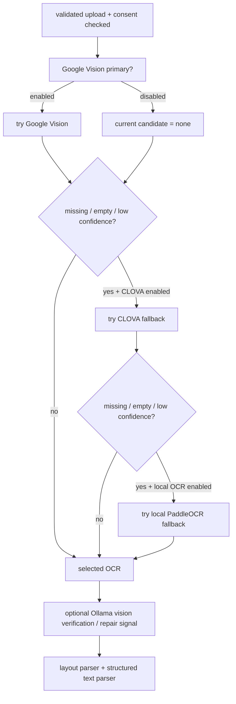

# 51. Phase 3 Fallback OCR 조건 수정 상세 설계 및 구현 플랜

- 작성일: 2026-05-17
- 범위: OCR provider 실행 조건, fallback 순서, external OCR consent, sanitized warning 누적
- 상태: 상세 설계 및 구현 플랜
- 선행 기준: [45. Google Vision Primary OCR](./45-p1-2-google-vision-primary-ocr-design-plan.md), [46. CLOVA OCR Backup](./46-p1-3-clova-ocr-backup-design-plan.md), [50. Phase 2 Layout Parser Integration](./50-phase2-layout-parser-integration-design-plan.md)

## 1. 목표

Phase 3의 목표는 primary OCR 존재 여부에 묶여 있는 fallback OCR 실행 조건을 분리하는 것이다. 현재 구조에서는 `OCR_PRIMARY_PROVIDER=none`이어도 CLOVA 또는 local PaddleOCR fallback을 켜고 싶을 수 있지만, service layer가 `primary_ocr_attempted`를 gate로 사용하면 fallback provider가 실행되지 않는다.

이 단계는 OCR provider chain의 실행 조건과 보안 gate를 바로잡는 작업이다. parser schema, 추천 로직, layout parser 자체는 변경하지 않는다.

## 2. 공식 기준과 확인한 전제

### 2.1 Google Vision

- Google Vision dense document OCR은 `DOCUMENT_TEXT_DETECTION`과 `fullTextAnnotation` 계층을 기준으로 한다.
- `fullTextAnnotation`은 Page, Block, Paragraph, Word, Symbol 계층으로 구성된다.

공식 문서:

- https://cloud.google.com/vision/docs/fulltext-annotations
- https://cloud.google.com/vision/docs/reference/rest/v1/Feature

### 2.2 NAVER Cloud CLOVA OCR

- CLOVA OCR은 API Gateway invoke URL과 `X-OCR-SECRET` header를 사용한다.
- General OCR 응답은 `fields`, `tables`, `cells`, `cellTextLines`, `cellWords`를 포함할 수 있다.
- OCR confidence와 layout에는 `inferConfidence`, `boundingPoly.vertices`를 사용한다.

공식 문서:

- https://api.ncloud-docs.com/docs/en/ai-application-service-ocr
- https://api.ncloud-docs.com/docs/en/ai-application-service-ocr-ocr

### 2.3 PaddleOCR

- PaddleOCR는 로컬 Python pipeline으로 사용할 수 있으며 `PaddleOCR().predict(...)` 경로를 제공한다.
- 공식 문서의 모델 표에는 Korean recognition 모델이 존재한다.
- PaddleOCR는 local provider로 취급한다. 외부 OCR consent는 필요하지 않지만 local model 설치, 캐시, dependency 검증은 필요하다.

공식 문서:

- https://www.paddleocr.ai/main/en/version3.x/pipeline_usage/OCR.html

### 2.4 한계

OCR confidence threshold는 provider 공식 문서가 영양제 라벨용 권장값을 제공하지 않는다. 따라서 `ocr_confidence_threshold`, `local_ocr_confidence_threshold`는 프로젝트 fixture 기반 내부 운영값으로 유지한다.

## 3. 현재 구현 진단

| 항목 | 현재 코드 상태 | 문제 |
| --- | --- | --- |
| primary OCR 실행 | `active_adapters.ocr is not None`이면 `_extract_ocr_if_configured()` 실행 | primary adapter와 전체 OCR pipeline 개념이 섞여 있다. |
| secondary fallback | `_extract_secondary_ocr_if_allowed(... primary_ocr_attempted=active_adapters.ocr is not None ...)` | primary adapter가 없으면 fallback adapter가 있어도 즉시 return한다. |
| multimodal fallback | `_extract_multimodal_ocr_if_allowed()`도 `primary_ocr_attempted`에 묶여 있고 secondary보다 먼저 실행된다. | Ollama vision assist가 OCR 대체 provider처럼 선택될 수 있다. |
| consent | `_required_supplement_analyze_consents()`가 `ocr_primary_provider == "google_vision"`일 때만 external consent를 요구한다. | `ENABLE_CLOVA_OCR=true`만 켠 경우 external OCR consent가 빠질 수 있다. |
| factory | `_build_fallback_ocr_adapters()`는 `enable_clova_ocr`이면 `ClovaOCRAdapter`를 만든다. | `ALLOW_EXTERNAL_OCR`, URL, secret 검증이 adapter runtime까지 늦춰진다. |
| warning | primary OCR 실패 warning은 하나만 반환하고 secondary provider 실패는 조용히 continue한다. | provider별 실패 추적과 UI 확인 신호가 부족하다. |

비판적 판단: 현재 `primary_ocr_attempted`는 "Google Vision 같은 primary provider가 구성되었는지"를 의미하지만, 실제로는 "OCR pipeline을 실행해도 되는지"처럼 사용되고 있다. 이 이름 때문에 `OCR_PRIMARY_PROVIDER=none` + `ENABLE_CLOVA_OCR=true` 또는 `ENABLE_LOCAL_OCR=true` 조합이 논리적으로 막힌다.

## 4. 목표 OCR Pipeline



실행 순서:

1. Google Vision primary, `OCR_PRIMARY_PROVIDER=google_vision`인 경우
2. 결과 없음, 빈 text, 저신뢰면 CLOVA fallback
3. 결과 없음, 빈 text, 저신뢰면 local PaddleOCR fallback
4. Ollama vision assist는 OCR provider 대체가 아니라 verification/repair signal로만 사용

## 5. 새 개념 분리

### 5.1 `ocr_pipeline_enabled`

의미: OCR provider chain 중 하나라도 실행 가능한지 나타내는 값.

계산 기준:

```python
ocr_pipeline_enabled = (
    active_adapters.ocr is not None
    or bool(active_adapters.fallback_ocr_adapters)
)
```

주의:

- Ollama vision assist는 `ocr_pipeline_enabled`에 포함하지 않는다.
- image bytes loading은 OCR provider chain 또는 multimodal verification이 실제로 필요할 때만 한다.

### 5.2 `providers_attempted`

의미: 이번 요청에서 어떤 OCR provider를 어떤 순서로 시도했는지 나타내는 request-local audit metadata.

권장 내부 DTO:

```python
ProviderAttemptStatus = Literal[
    "success",
    "empty_text",
    "low_confidence",
    "error",
    "skipped",
]

@dataclass(frozen=True)
class OCRProviderAttempt:
    provider: str
    role: Literal["primary", "fallback"]
    status: ProviderAttemptStatus
    confidence: float | None = None
    warning_code: str | None = None
    warning_message: str | None = None
```

이 값은 raw text, raw image, provider raw payload를 포함하면 안 된다.

### 5.3 `OCRPipelineResult`

권장 내부 DTO:

```python
@dataclass(frozen=True)
class OCRPipelineResult:
    selected_result: OCRResult | None
    providers_attempted: tuple[OCRProviderAttempt, ...]
    warnings: tuple[tuple[str, str], ...]
```

`SupplementImageAnalysisResult.ocr_attempted`는 더 이상 primary adapter 여부가 아니라 `bool(providers_attempted)` 또는 `ocr_pipeline_enabled` 기반으로 계산한다.

## 6. Provider 선택 정책

### 6.1 weak candidate 정의

OCR candidate는 다음 중 하나면 weak로 본다.

- result is `None`
- `result.text.strip()`이 비어 있음
- `result.confidence`가 있고 `settings.ocr_confidence_threshold`보다 낮음

현재 `_is_low_confidence()`는 `confidence is None`을 low로 보지 않는다. 이 정책은 유지한다. provider가 confidence를 제공하지 않는다고 무조건 fallback을 태우면 local OCR이나 일부 provider가 불필요하게 반복 호출될 수 있다. 단, empty text는 항상 fallback 조건이다.

### 6.2 provider chain 진행 규칙

- candidate가 없거나 empty면 다음 provider를 시도한다.
- candidate가 low confidence이면 다음 provider를 시도한다.
- candidate가 non-empty이고 low confidence가 아니면 chain을 멈춘다.
- 모든 provider가 weak면 가장 나은 non-empty candidate를 선택하되, warning과 low confidence field를 남긴다.

가장 나은 candidate 결정:

1. non-empty candidate가 empty candidate보다 우선
2. confidence가 있는 candidate끼리는 더 높은 confidence 우선
3. confidence가 없는 candidate와 low-confidence candidate는 provider order 우선
4. 동률이면 먼저 성공한 provider 우선

## 7. Ollama Vision Assist 역할 변경

현재 위험:

- `_extract_multimodal_ocr_if_allowed()`가 secondary OCR보다 먼저 실행된다.
- `ocr_result`를 `ollama_vision_assist` provider로 교체할 수 있다.
- 이 흐름은 generative vision model을 OCR provider 대체재로 취급하게 만든다.

Phase 3 목표:

- Ollama vision assist는 OCR chain 뒤에서만 실행한다.
- canonical `ocr_result`를 대체하지 않는다.
- 검증 mismatch 또는 repair suggestion warning만 생성한다.
- raw model output, raw image, raw OCR text는 저장하지 않는다.

권장 정리:

- `_extract_multimodal_ocr_if_allowed()`는 폐기하거나 private helper 이름을 `_inspect_ocr_with_multimodal_if_allowed()`로 변경한다.
- 기존 `_verify_ocr_with_multimodal_if_allowed()`는 유지하되 "selected OCR이 있을 때만 검증"으로 한정한다.
- `multimodal_ocr_assist_policy`가 `ocr_empty_only`인 경우도 OCR 대체로 쓰지 않는다. 빈 OCR 상태에서는 수동 입력 fallback을 유지한다.

호환성:

- `OCRSnapshotProvider`의 `ollama_vision_assist` literal은 legacy snapshot 읽기용으로 유지한다.
- 신규 normal path에서는 `ocr_provider=ollama_vision_assist`가 생성되지 않도록 한다.

## 8. External OCR Consent 설계

### 8.1 required consent 계산

현재:

```python
if settings.ocr_primary_provider == "google_vision":
    consents.append(ConsentType.EXTERNAL_OCR_PROCESSING)
```

목표:

```python
if is_external_ocr_pipeline_enabled(settings):
    consents.append(ConsentType.EXTERNAL_OCR_PROCESSING)
```

`is_external_ocr_pipeline_enabled(settings)`:

```python
return (
    settings.ocr_primary_provider == "google_vision"
    or settings.enable_clova_ocr
)
```

이 판단은 `ALLOW_EXTERNAL_OCR`와 별개다. `ALLOW_EXTERNAL_OCR=false`면 factory/config validation에서 막고, consent 계산은 "사용자가 외부 provider로 image가 나갈 가능성이 있는가"를 기준으로 한다.

### 8.2 factory fail-closed

`_build_fallback_ocr_adapters()`는 `enable_clova_ocr`일 때 다음을 즉시 검증해야 한다.

- `ALLOW_EXTERNAL_OCR=true`
- `CLOVA_OCR_API_URL` 존재
- `CLOVA_OCR_SECRET` 존재

현재 `ClovaOCRAdapter.extract_text()` 내부에서도 검증하지만, route dependency 생성 시점에서 실패하는 편이 더 안전하다. 사용자의 이미지 bytes를 읽기 전에 설정 오류가 드러나기 때문이다.

### 8.3 API key/secret

- Google API key, CLOVA secret은 서버 env only다.
- mobile app 또는 browser response에 노출하지 않는다.
- warning, audit metadata, exception detail에 secret value를 포함하지 않는다.

## 9. Warning 및 Audit 정책

provider별 실패는 전체 실패가 아니라 sanitized warning으로 누적한다.

권장 warning code:

| 상황 | code |
| --- | --- |
| provider exception | `ocr_provider_unavailable:{provider}` |
| empty text | `ocr_provider_empty:{provider}` |
| low confidence | `ocr_provider_low_confidence:{provider}` |
| fallback selected | `ocr_provider_selected:{provider}`는 user warning이 아니라 request-local audit만 권장 |
| all providers failed | `automatic_ocr_unavailable` |

사용자에게 보이는 warning message는 provider 세부 오류, URL, status body, secret, raw text를 포함하지 않는다.

예시:

- "Automatic text extraction from Google Vision was unavailable. A fallback OCR provider was tried."
- "Fallback OCR confidence was low. Review the extracted label details manually."

## 10. 코드 변경 설계

### 10.1 `supplement_image_analysis.py`

변경 방향:

- `primary_ocr_attempted` 인자 제거
- `_extract_ocr_if_configured()`와 `_extract_secondary_ocr_if_allowed()`를 `_run_ocr_provider_chain()` 중심으로 재구성
- `ocr_attempted`는 `bool(pipeline_result.providers_attempted)`로 계산
- `warning_pairs`에 provider chain warnings를 모두 포함
- multimodal assist는 OCR chain 이후 verification helper만 호출

권장 함수:

```python
async def _run_ocr_provider_chain(
    *,
    image_bytes: bytes | None,
    image_metadata: ValidatedSupplementImage,
    label_region: BoundingBox | None,
    primary_adapter: OCRAdapter | None,
    fallback_adapters: tuple[OCRAdapter, ...],
    settings: Settings,
) -> OCRPipelineResult:
    ...
```

provider order:

```python
providers = [
    ("google_vision_document", "primary", primary_adapter),
    *fallback_adapters_in_factory_order,
]
```

주의: provider name은 adapter에서 반환되는 `OCRResult.provider`를 우선 사용하되, exception 발생 시에는 factory role name을 사용한다.

### 10.2 `ocr/factory.py`

변경 방향:

- `is_external_ocr_pipeline_enabled(settings)` helper 추가 또는 settings helper 모듈로 분리
- `_build_fallback_ocr_adapters()`에서 CLOVA settings fail-closed
- fallback order는 CLOVA -> PaddleOCR 유지
- local PaddleOCR는 `ENABLE_LOCAL_OCR=true`일 때만 build

### 10.3 `api/v1/supplements.py`

변경 방향:

- `_required_supplement_analyze_consents()`에서 external OCR consent 조건을 Google primary뿐 아니라 CLOVA fallback까지 확장
- missing consent audit action은 지금처럼 external consent가 빠지면 `supplement_external_ocr_blocked`
- OpenAPI `x-conditional-consents=["external_ocr_processing"]`는 유지

### 10.4 tests

테스트가 먼저 실패하도록 추가한 뒤 구현한다.

필수 테스트:

- `OCR_PRIMARY_PROVIDER=none`, `ENABLE_CLOVA_OCR=true`, fallback adapter만 있음 -> CLOVA 호출
- `OCR_PRIMARY_PROVIDER=none`, `ENABLE_LOCAL_OCR=true`, local adapter만 있음 -> local 호출
- Google Vision primary empty -> CLOVA fallback 호출
- Google Vision primary low confidence -> CLOVA fallback 호출
- CLOVA low confidence -> local PaddleOCR fallback 호출
- CLOVA exception -> local PaddleOCR fallback 호출, sanitized warning 누적
- 모든 OCR provider 실패 -> intake preview 유지, parser 미호출, safe warning 저장
- `ENABLE_CLOVA_OCR=true`면 `EXTERNAL_OCR_PROCESSING` consent 요구
- external consent 누락 시 CLOVA adapter call count 0
- `ALLOW_EXTERNAL_OCR=false` + `ENABLE_CLOVA_OCR=true` factory error
- Ollama vision assist가 selected OCR provider를 대체하지 않음

## 11. 보안 조건

- 외부 OCR provider가 하나라도 실행 가능하면 `EXTERNAL_OCR_PROCESSING` consent가 필요하다.
- `OCR_IMAGE_PROCESSING` consent는 supplement label image analysis 기본 요구사항으로 유지한다.
- Google Vision API key와 CLOVA secret은 서버 env only다.
- raw image bytes는 provider request에만 사용하고 DB/log/audit에 저장하지 않는다.
- raw OCR text는 기존 hash 저장 원칙을 유지한다.
- provider raw payload는 저장하지 않는다.
- exception detail은 sanitized warning code/message로만 누적한다.

## 12. 구현 페이즈

### P3-1. Consent/helper 분리

파일:

- `src/ocr/factory.py`
- `src/api/v1/supplements.py`
- `tests/unit/ocr/test_ocr_factory.py`
- `tests/integration/api/test_supplement_intake_api.py`
- `tests/integration/api/test_supplement_analyze_google_vision.py`

작업:

- `is_external_ocr_pipeline_enabled(settings)` 추가
- `_required_supplement_analyze_consents()`에서 helper 사용
- CLOVA fallback enabled 시 external consent 요구 테스트 추가

### P3-2. Factory fail-closed

파일:

- `src/ocr/factory.py`
- `tests/unit/ocr/test_ocr_factory.py`

작업:

- `ENABLE_CLOVA_OCR=true` + `ALLOW_EXTERNAL_OCR=false` 즉시 `OCRConfigurationError`
- `CLOVA_OCR_API_URL`, `CLOVA_OCR_SECRET` 누락 시 즉시 error
- local OCR는 external gate 없이 build 가능

### P3-3. Provider chain service 구현

파일:

- `src/services/supplement_image_analysis.py`
- `tests/unit/services/test_supplement_image_analysis.py`

작업:

- `OCRProviderAttempt`, `OCRPipelineResult` 내부 DTO 추가
- `_run_ocr_provider_chain()` 구현
- `primary_ocr_attempted` 제거
- `providers_attempted` 기반 `ocr_attempted` 계산
- provider warning 누적

### P3-4. Ollama vision assist 역할 축소

파일:

- `src/services/supplement_image_analysis.py`
- `tests/unit/services/test_supplement_image_analysis.py`
- 필요 시 `src/models/schemas/supplement_snapshot.py`

작업:

- OCR chain 전에 vision assist를 호출하지 않도록 변경
- selected `OCRResult`를 `ollama_vision_assist`로 대체하지 않음
- verification mismatch warning만 유지

### P3-5. Regression gate

권장 검증 명령:

```bash
cd yeong-Lemon-Aid/backend
.venv/bin/ruff check Nutrition-backend/src Nutrition-backend/tests
.venv/bin/python -m black --check Nutrition-backend/src Nutrition-backend/tests
.venv/bin/python -m mypy Nutrition-backend/src
.venv/bin/python -m pytest Nutrition-backend/tests/unit/ocr Nutrition-backend/tests/unit/services/test_supplement_image_analysis.py Nutrition-backend/tests/integration/api/test_supplement_intake_api.py Nutrition-backend/tests/integration/api/test_supplement_analyze_google_vision.py -q --no-cov
```

현재 local venv의 일부 console script는 stale shebang일 수 있으므로, `black`/`mypy`는 `.venv/bin/python -m ...` 경로를 우선 사용한다.

## 13. 성공 기준

- `OCR_PRIMARY_PROVIDER=none`이어도 CLOVA/local fallback adapter가 설정되면 OCR pipeline이 실행된다.
- Google Vision primary가 실패/empty/low confidence이면 CLOVA fallback이 실행된다.
- CLOVA fallback도 실패/empty/low confidence이면 local PaddleOCR fallback이 실행된다.
- external OCR consent는 Google Vision뿐 아니라 CLOVA fallback에도 요구된다.
- provider별 실패는 전체 요청 실패가 아니라 sanitized warning으로 누적된다.
- 모든 OCR provider가 실패해도 intake preview는 생성되고 parser는 호출되지 않는다.
- Ollama vision assist는 canonical OCR result를 대체하지 않는다.
- raw image, raw OCR text, raw provider payload, API key/secret은 DB/log/audit/response에 저장되지 않는다.
