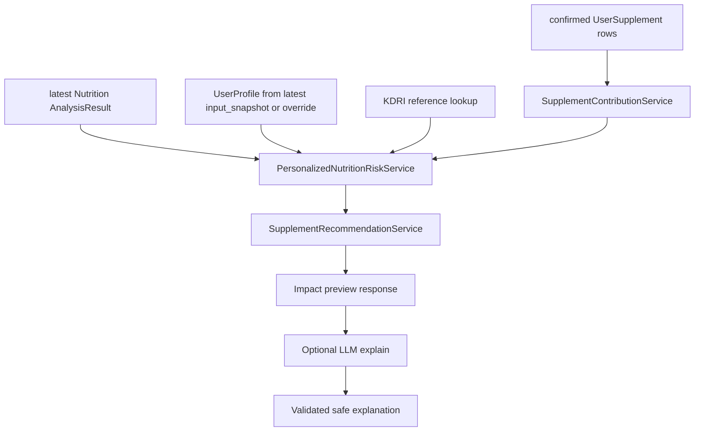

# 52. Phase 4 Recommendation Service 추가 상세 설계 및 구현 플랜

- 작성일: 2026-05-17
- 범위: 보충제 일일 기여량 계산, 사용자 영양 분석 반영, 안전한 insight 생성 API
- 상태: 상세 설계 및 구현 플랜
- 선행 기준: [49. Phase 1 Parser Schema Expansion](./49-phase1-parser-schema-expansion-design-plan.md), [50. Phase 2 Layout Parser Integration](./50-phase2-layout-parser-integration-design-plan.md), [51. Phase 3 Fallback OCR Routing](./51-phase3-fallback-ocr-routing-design-plan.md)

## 1. 목표

Phase 4의 목표는 사용자가 확인해 저장한 보충제 성분을 현재 영양 분석에 반영하는 것이다. 이 단계의 핵심은 "추천 문장 생성"이 아니라 먼저 결정론적 영양 계산을 만든 뒤, 그 결과를 안전한 insight로 표현하는 것이다.

따라서 LLM은 추천 판단자가 아니다. LLM은 이미 계산된 결과를 사용자에게 이해하기 쉬운 문장으로 다듬는 보조 역할만 맡는다. 부족, 적정, 과다, 중복 섭취 위험 분류는 모두 서버의 deterministic service가 수행해야 한다.

## 2. 공식 기준과 확인한 전제

### 2.1 KDRI 기준

- 2025 KDRI는 보건복지부 발간 자료로 한국영양학회 KDRIs 자료실에 공개되어 있다.
- KDRI는 나이, 성별, 생애주기, 임신/수유 여부 같은 조건별 기준값을 제공한다.
- 현재 코드에는 `kdris_2025.csv`, source manifest, `lookup_kdris_reference()`, `get_kdris_for_profile()` 기반 룩업 구조가 존재한다.

공식 문서:

- https://www.kns.or.kr/FileRoom/FileRoom.asp?BoardID=Kdr
- https://www.kns.or.kr/fileroom/FileRoom_view.asp?BoardID=Kdr&idx=167
- https://www.kns.or.kr/fileroom/fileroom_view.asp?BoardID=Kdr&idx=168

### 2.2 DRI/UL 안전 기준

- NIH ODS는 RDA, AI, EAR, UL 같은 DRI 기준 유형을 설명한다.
- UL은 일반적으로 adverse health effects 가능성이 낮은 최대 일일 섭취 수준으로 다룬다.
- 일부 영양소의 UL은 총섭취량이 아니라 보충제/강화식품/약물 등 supplemental intake에만 적용될 수 있다. 현재 코드의 `unit_converter.py`에도 magnesium supplemental TODO가 이미 남아 있으므로 Phase 4에서 이 차이를 무시하면 안 된다.

공식 문서:

- https://ods.od.nih.gov/factsheets/list-all/
- https://ods.od.nih.gov/factsheets/Pregnancy-HealthProfessional/

### 2.3 보충제 라벨과 질병 주장 제한

- FDA 문서 기준 dietary supplement label은 serving size, servings per container, dietary ingredients, amount per serving을 포함하는 Supplement Facts 정보를 요구한다.
- 질병을 treat, diagnose, cure, prevent 하려는 제품 의도는 dietary supplement가 아니라 drug 영역으로 다뤄진다.
- 구조/기능 claim은 disease claim이 아니어야 하며, 앱 문구도 질병 치료/예방 표현을 만들면 안 된다.

공식 문서:

- https://www.fda.gov/consumers/consumer-updates/fda-101-dietary-supplements
- https://www.fda.gov/regulatory-information/search-fda-guidance-documents/small-entity-compliance-guide-structurefunction-claims

### 2.4 API와 schema 기준

- FastAPI `response_model`은 OpenAPI 문서화, serialization, response filtering에 사용된다. Phase 4 API는 response schema를 명시해야 한다.
- Pydantic `BaseModel.model_json_schema()`는 JSON Schema 생성의 기준이다.
- Ollama structured output은 schema를 `format`에 전달하고 응답을 다시 Pydantic으로 검증하는 방식으로 제한해야 한다.

공식 문서:

- https://fastapi.tiangolo.com/reference/apirouter/
- https://docs.pydantic.dev/latest/concepts/json_schema/
- https://docs.ollama.com/capabilities/structured-outputs

### 2.5 명시적 한계

영양제 라벨과 사용자의 식이 기록만으로 질병 치료 효과, 약물 상호작용, 복용량 변경을 확정할 수 있는 공식 프로젝트 기준은 확인하지 못했다. Phase 4는 이러한 판단을 하지 않는다. 질환, 임신/수유, 약물, 알레르기 정보가 걸리는 경우는 `review_needed` 또는 `discuss_with_professional`로 제한한다.

## 3. 현재 구현 진단

| 항목 | 현재 코드 상태 | Phase 4 판단 |
| --- | --- | --- |
| 보충제 저장 | `UserSupplement`, `UserSupplementIngredient`가 사용자 확인 후 저장된다. | 추천 입력은 confirmed supplement만 사용한다. preview snapshot을 직접 추천에 쓰면 안 된다. |
| 성분 코드 | `UserSupplementCreate`에서 nutrient code allowlist를 검증한다. | LLM이 만든 코드가 아니라 deterministic matcher 또는 사용자 확인 코드만 계산에 포함한다. |
| 섭취 횟수 | `SupplementServing.daily_servings`가 사용자 확인 값으로 저장된다. | ingredient amount × daily_servings가 기본 계산식이다. |
| 성분량 | `UserSupplementIngredient.amount/unit`가 성분별로 저장된다. | amount 또는 unit이 없으면 추정하지 않고 missing field로 남긴다. |
| 영양 분석 | `analyze_nutrient_intakes()`가 KDRI reference와 intake를 비교한다. | 기존 식이 intake와 supplement contribution을 합산하는 새 layer가 필요하다. |
| 최신 영양 진단 | `get_latest_nutrition_diagnosis()`가 persisted `AnalysisResult`를 읽는다. | latest result를 food/diet baseline으로 읽고 supplement impact를 preview해야 한다. |
| 안전 문구 | `contains_forbidden_terms()`와 regulated OCR dose-change block이 있다. | recommendation 문구에도 동일하거나 더 강한 금지어 gate를 적용한다. |
| 동의/권한 | 영양 진단 read와 보충제 등록은 sensitive health consent를 요구한다. | supplement impact preview도 `sensitive_health_analysis` consent와 supplement read scope가 필요하다. |

비판적 판단: 현재 영양 분석은 `NutrientIntake` 입력값만 비교한다. 저장된 보충제 성분은 영양 분석 결과에 반영되지 않는다. 또한 `result_snapshot`에는 기존 분석 결과만 저장되고, "식이 섭취량"과 "보충제 기여량"을 분리해 합산한 흔적이 없다. Phase 4에서는 기존 결과를 덮어쓰기보다, 보충제 impact preview를 별도 response로 계산해야 회귀 위험이 낮다.

## 4. 설계 원칙

1. 라벨 OCR preview는 추천 입력으로 사용하지 않는다. 사용자가 확인해 `UserSupplement`로 저장된 값만 사용한다.
2. amount, unit, daily_servings, nutrient_code가 빠진 성분은 계산에서 제외하고 `warnings` 또는 `review_needed` insight에 남긴다. `missing_profile_fields`는 나이, 성별, 임신/수유 여부처럼 개인화 기준값 선택에 필요한 사용자 프로필 누락에만 사용한다.
3. nutrient_code는 deterministic matcher 후보 또는 사용자 확인값만 사용한다. LLM이 nutrient_code를 확정하지 않는다.
4. IU, RAE, supplemental-only UL처럼 영양소별 환산이 필요한 단위는 명시적 converter가 있는 경우에만 환산한다.
5. 식이 기록이 없거나 오래된 경우 "부족"을 확정하지 않고 `insufficient_data`로 표시한다.
6. 임신/수유, 질환, 약물, 알레르기 정보가 있거나 누락된 경우 복용 판단을 만들지 않고 review flag를 남긴다.
7. 직접 복용량 변경, 질병 치료/예방, 약물 상호작용 단정 표현은 금지한다.
8. LLM explain endpoint는 deterministic result를 재분류하거나 새 risk를 만들 수 없다.

## 5. 서비스 설계

### 5.1 `SupplementContributionService`

역할: 저장된 보충제 성분을 nutrient_code 기준 일일 기여량으로 합산한다.

권장 위치:

- `backend/Nutrition-backend/src/services/supplement_contribution.py`

입력:

- current user
- active `UserSupplement` rows
- child `UserSupplementIngredient` rows
- optional selected supplement ids for preview scope

계산식:

```text
ingredient_daily_amount = ingredient.amount * supplement.serving.daily_servings
aggregate_daily_amount[nutrient_code, unit] += ingredient_daily_amount
```

단위 환산:

1. 같은 nutrient_code와 같은 normalized unit은 단순 합산한다.
2. KDRI reference unit이 있으면 `convert_amount(amount, from_unit, to_unit, nutrient_code)`로 환산한다.
3. converter가 실패하면 해당 성분은 `unconverted_contributions`로 남기고 risk 계산에서 제외한다.
4. IU 환산은 현재처럼 vitamin D 등 명시 지원된 nutrient_code에만 허용한다.

권장 내부 DTO:

```python
class SupplementContributionItem(BaseModel):
    supplement_id: UUID
    supplement_name: str
    ingredient_id: UUID
    display_name: str
    nutrient_code: str
    amount_per_serving: float
    unit: str
    daily_servings: float
    daily_amount: float
    source: Literal["user_confirmed", "ocr_llm_preview"]
    confidence: float


class SupplementContributionAggregate(BaseModel):
    nutrient_code: str
    reference_unit: str | None
    total_daily_amount: float | None
    original_unit_totals: dict[str, float]
    contribution_count: int
    supplement_ids: list[UUID]
    warnings: list[str]
```

성공 조건:

- 같은 user의 active supplement만 읽는다.
- 삭제된 supplement는 제외한다.
- raw OCR text, raw image, raw LLM response는 참조하지 않는다.
- missing amount/unit/code는 추정하지 않는다.

### 5.2 `PersonalizedNutritionRiskService`

역할: 최신 영양 분석 결과, 사용자 프로필, KDRI reference, 보충제 기여량을 결합해 부족 지원 후보, 과다/중복 위험, 확인 필요 항목을 분류한다.

권장 위치:

- `backend/Nutrition-backend/src/services/personalized_nutrition_risk.py`

입력:

- `UserProfile` 또는 최신 `AnalysisResult.input_snapshot.profile`
- 최신 nutrition `AnalysisResult.result_snapshot.results`
- `SupplementContributionAggregate`
- KDRI reference lookup

기본 합산:

```text
food_or_recorded_intake = latest_analysis.actual_amount
supplement_intake = contribution.total_daily_amount converted to reference_unit
estimated_total_intake = food_or_recorded_intake + supplement_intake
```

분류 정책:

| 조건 | 결과 bucket | 사용자 의미 |
| --- | --- | --- |
| profile 없음 | `missing_profile_fields` | 개인화 판단 불가 |
| latest nutrition analysis 없음 | `review_needed` | 식이 기록 없이 보충제만 계산 |
| nutrient_code 없음 | `review_needed` | nutrient mapping 확인 필요 |
| unit 환산 불가 | `review_needed` | 단위 확인 필요 |
| 보충제 2개 이상이 같은 nutrient_code 제공 | `avoid_duplicate` | 중복 섭취 확인 |
| total > UL | `excess_or_duplicate_risks` | 상한 초과 가능성 |
| food intake가 low/deficient이고 supplement가 같은 nutrient를 제공 | `deficiency_support_candidates` | 부족 가능성 보완 후보 |
| disease/pregnancy/medication/allergy flag 존재 | `discuss_with_professional` | 전문가 상담 권고 |

UL 적용 주의:

- `reference.ul_amount`가 없으면 과다를 단정하지 않는다.
- supplemental-only UL 대상 영양소는 식이 intake와 보충제 intake를 섞어 계산하지 않는다. 현재 지원 불충분 항목은 `review_needed`로 둔다.
- `reference.reference_amount`가 없고 range 또는 policy limit만 있는 row는 Phase 4-1에서는 personalized ratio 계산에서 제외한다.

### 5.3 `SupplementRecommendationService`

역할: contribution과 risk classifier 결과를 API response로 조합한다. 이름은 recommendation이지만 실제 출력은 권장보다 insight 중심이어야 한다.

권장 위치:

- `backend/Nutrition-backend/src/services/supplement_recommendation.py`

허용 action label:

- `insight`
- `review_needed`
- `avoid_duplicate`
- `discuss_with_professional`

금지 action label:

- `increase_dose`
- `decrease_dose`
- `start_treatment`
- `stop_medication`
- `treat_disease`
- `prevent_disease`

출력 원칙:

- "복용하세요", "늘리세요", "줄이세요"가 아니라 "확인 대상", "중복 가능성", "상담 권장"으로 표현한다.
- 질환명과 영양소를 연결하더라도 치료 효과를 말하지 않는다.
- 약물 상호작용은 공식 interaction source가 없으면 단정하지 않는다.

## 6. API 설계

### 6.1 `POST /api/v1/nutrition/supplement-impact/preview`

목적: 현재 저장된 보충제가 최신 영양 분석 결과에 어떤 영향을 줄 수 있는지 즉시 계산한다.

권장 권한/동의:

- scope: `supplement:read`, `analysis:read`
- consent: `sensitive_health_analysis`

요청 후보:

```json
{
  "selected_supplement_ids": ["uuid"],
  "include_all_active_supplements": true,
  "profile_override": null
}
```

응답:

- `current_supplement_contributions`
- `deficiency_support_candidates`
- `excess_or_duplicate_risks`
- `missing_profile_fields`
- `safe_user_message`
- `clinical_disclaimer`

저장 정책:

- 기본은 non-persistent preview다.
- audit metadata에는 count, status, warning code만 남긴다.
- 성분 상세 payload는 response에만 반환하고 raw OCR/LLM 입력은 저장하지 않는다.

### 6.2 `GET /api/v1/supplements/recommendations/latest`

목적: 사용자에게 표시 가능한 최신 보충제 insight snapshot을 반환한다.

Phase 4-1 판단:

- 별도 persistence table 없이 `preview`와 동일 계산을 수행해 반환한다.
- 이후 성능 또는 히스토리 요구가 생기면 `AnalysisResult.analysis_type` 확장 또는 별도 `supplement_recommendation_snapshots` table을 추가한다.

주의:

- 현재 `analysis_results.analysis_type` check constraint는 `activity_score`, `weight_prediction`, `nutrition_analysis`만 허용한다. 새로운 analysis type을 저장하려면 DB migration이 필요하다.

### 6.3 `POST /api/v1/supplements/recommendations/explain`

목적: deterministic result를 안전한 설명 문장으로 다듬는다.

입력:

- `SupplementImpactPreviewResponse`
- locale
- tone preference

LLM guardrail:

- input은 deterministic response JSON만 허용한다.
- raw OCR text, raw image, raw label section bundle은 전달하지 않는다.
- output schema는 `safe_user_message`, `explanation_bullets`, `clinical_disclaimer`, `blocked_terms_detected` 정도로 제한한다.
- Pydantic schema를 Ollama `format`에 전달하고 응답을 다시 validate한다.
- LLM output이 action label, risk class, amount를 바꾸면 실패 처리한다.

## 7. 응답 schema 초안

```python
class SupplementImpactPreviewResponse(BaseModel):
    calculation_version: Literal["supplement-impact-v1.0.0"]
    reference_version: str
    source_manifest_version: str | None
    data_status: Literal["ready", "partial", "not_ready"]
    current_supplement_contributions: list[SupplementContributionAggregate]
    deficiency_support_candidates: list[SupplementNutritionInsight]
    excess_or_duplicate_risks: list[SupplementNutritionInsight]
    missing_profile_fields: list[str]
    safe_user_message: str
    clinical_disclaimer: str
    warnings: list[str]
    requires_user_confirmation: bool
```

```python
class SupplementNutritionInsight(BaseModel):
    nutrient_code: str
    nutrient_name: str | None
    action_label: Literal[
        "insight",
        "review_needed",
        "avoid_duplicate",
        "discuss_with_professional",
    ]
    reason_code: str
    current_food_or_recorded_amount: float | None
    supplement_daily_amount: float | None
    estimated_total_amount: float | None
    reference_amount: float | None
    reference_unit: str | None
    ul_amount: float | None
    contributing_supplements: list[UUID]
    evidence: list[SupplementInsightEvidence]
    user_message: str
```

```python
class SupplementInsightEvidence(BaseModel):
    source_type: Literal["user_supplement", "nutrition_analysis", "kdri_reference"]
    source_id: str
    field: str
    value_summary: str
```

## 8. 데이터 흐름



중요한 경계:

- OCR/label parser는 `UserSupplement` 저장 전까지만 관여한다.
- Phase 4 계산은 `UserSupplement`와 `AnalysisResult`만 읽는다.
- LLM은 `H` 이후에만 붙는다.

## 9. 보안 및 개인정보 설계

1. API는 authenticated owner subject 기준으로만 데이터를 읽는다.
2. `supplement-impact/preview`는 `sensitive_health_analysis` consent가 없으면 403을 반환한다.
3. audit metadata에는 supplement count, nutrient count, warning code만 남긴다.
4. raw image, raw OCR text, raw LLM response는 사용하지 않고 저장하지 않는다.
5. Explain endpoint는 local Ollama 기본값을 따른다. 외부 LLM 사용은 기본 차단한다.
6. `safe_user_message`와 LLM explanation은 forbidden term scan을 통과해야 한다.
7. 임신/수유, 질환, 약물, 알레르기 관련 내용은 diagnosis나 치료가 아니라 확인/상담 권고로만 표현한다.

## 10. 실패/부분 성공 정책

| 상황 | HTTP/API 처리 | response 처리 |
| --- | --- | --- |
| 저장된 보충제 없음 | 200 | `data_status=not_ready`, 빈 contribution |
| 최신 영양 분석 없음 | 200 | `data_status=partial`, supplement-only contribution과 warning |
| profile 누락 | 200 또는 422 | persisted latest가 없으면 missing field, 명시 override가 invalid면 422 |
| 단위 환산 실패 | 200 | 해당 nutrient insight는 `review_needed` |
| KDRI reference 없음 | 200 | 해당 nutrient insight는 `review_needed` |
| LLM explain 실패 | 502 | deterministic preview는 실패시키지 않고 explain endpoint만 실패 |
| forbidden wording 감지 | 502 또는 safe fallback | safe fallback message 반환 가능 |

## 11. 비판적 위험 목록

1. OCR preview를 바로 추천에 연결하면 라벨 hallucination이 건강 조언으로 승격된다. 반드시 `UserSupplement.user_confirmed_at` 이후 값만 사용한다.
2. `daily_servings=0` 또는 누락값을 잘못 해석하면 기여량이 0으로 보일 수 있다. 누락은 0이 아니라 review_needed다.
3. IU 환산은 영양소마다 다르다. generic IU -> mg/ug 변환은 금지한다.
4. magnesium, folate, niacin, vitamin E처럼 supplemental-only UL이 있는 항목은 총섭취량 계산과 별도 취급이 필요하다.
5. KDRI row의 `reference_amount`가 없고 range/policy limit만 있는 경우 ratio 계산을 만들면 숫자 신뢰성이 깨진다.
6. 식이 기록이 오래되었거나 일부 식사만 입력된 상태에서 deficiency를 확정하면 과잉 추천으로 이어질 수 있다.
7. 만성질환 priority table은 부족 항목 sorting 보조이지 보충제 복용 판단 근거가 아니다.
8. LLM이 "추천", "복용", "치료" 문구를 만들 수 있으므로 output validator와 forbidden term scanner가 필요하다.
9. `latest` API를 persistence 없이 매번 계산하면 모바일 화면에서 결과 시각이 흔들릴 수 있다. Phase 4-1은 deterministic recompute로 시작하고, Phase 4-2에서 snapshot persistence를 검토한다.
10. 보충제 성분량은 라벨값과 실제 제품 함량이 다를 수 있다. response에는 "라벨 및 사용자 확인 기준"임을 명시한다.

## 12. 구현 플랜

### Phase 4-1. Schema 추가

대상:

- `src/models/schemas/supplement_recommendation.py`

작업:

- contribution item/aggregate schema 추가
- risk insight schema 추가
- preview/explain request/response schema 추가
- forbidden action label을 enum에 넣지 않는다.
- `model_json_schema()` smoke test 추가

검증:

- Pydantic schema validation
- OpenAPI example forbidden term test 확장

### Phase 4-2. Contribution service

대상:

- `src/services/supplement_contribution.py`

작업:

- active `UserSupplement` + ingredients load
- daily contribution 계산
- nutrient_code/unit별 합산
- KDRI reference unit 환산 시도
- missing amount/unit/code warning 생성

테스트:

- amount × daily_servings 계산
- 동일 nutrient 중복 합산
- 삭제된 supplement 제외
- unknown unit은 review_needed로 남김
- raw OCR/LLM field 미사용

### Phase 4-3. Risk service

대상:

- `src/services/personalized_nutrition_risk.py`

작업:

- 최신 nutrition analysis result 읽기
- profile 추출 또는 override 처리
- supplement contribution과 actual intake 합산
- 부족 지원 후보, UL 초과, 중복 보충제, missing data 분류
- pregnancy/chronic disease gate 적용

테스트:

- deficiency + supplement contribution -> `deficiency_support_candidates`
- total > UL -> `excess_or_duplicate_risks`
- same nutrient multiple supplements -> `avoid_duplicate`
- no nutrition analysis -> partial response
- pregnancy/chronic disease -> `discuss_with_professional`
- forbidden wording 없음

### Phase 4-4. Recommendation orchestration

대상:

- `src/services/supplement_recommendation.py`

작업:

- contribution service와 risk service 조합
- response summary 생성
- clinical disclaimer 고정 문구 적용
- audit metadata용 summary helper 제공

테스트:

- empty supplement state
- partial data state
- ready state
- deterministic sorting

### Phase 4-5. API 연결

대상:

- `src/api/v1/nutrition.py`
- `src/api/v1/supplements.py`
- `src/api/v1/examples.py`
- `src/api/v1/contract.py`

작업:

- `POST /api/v1/nutrition/supplement-impact/preview`
- `GET /api/v1/supplements/recommendations/latest`
- `POST /api/v1/supplements/recommendations/explain`
- scope/consent gate 추가
- sanitized audit event 추가

테스트:

- 401/403/422 contract
- consent missing
- owner isolation
- OpenAPI response_model 노출

### Phase 4-6. LLM explain guardrail

대상:

- `src/llm/ollama.py` 또는 별도 `src/services/supplement_explanation.py`

작업:

- deterministic preview JSON만 LLM 입력
- schema-constrained output
- output 재검증
- forbidden term/action mutation 감지
- LLM unavailable 시 deterministic `safe_user_message` fallback 유지

테스트:

- LLM이 amount/action_label 변경 시 reject
- 금지어 포함 시 reject
- raw OCR text가 prompt에 포함되지 않음

## 13. 성공 기준

- 보충제 성분은 `nutrient_code` 기준으로 일일 기여량이 계산된다.
- 최신 영양 분석 결과에 보충제 기여량을 더해 부족 지원 후보와 과다/중복 위험을 분리한다.
- 계산 불가능한 항목은 추정하지 않고 missing/review-needed로 남긴다.
- 직접 복용량 변경, 질병 치료, 약물 상호작용 단정 문구가 response와 OpenAPI example에 없다.
- 임신/수유, 질환, 약물, 알레르기 문맥은 `discuss_with_professional`로 제한된다.
- LLM explain은 deterministic result를 설명만 하고 판단을 바꾸지 못한다.
- raw image, raw OCR text, raw LLM response는 Phase 4 경로에서 읽거나 저장하지 않는다.

## 14. 구현 순서 권장

1. `supplement_recommendation.py` schema부터 추가한다.
2. `SupplementContributionService`를 DB read + pure calculation으로 분리해 단위 테스트를 먼저 만든다.
3. `PersonalizedNutritionRiskService`는 기존 `NutritionAnalysisResult` snapshot을 소비하도록 만든다.
4. preview API를 먼저 붙이고 persistence 없는 계산으로 검증한다.
5. latest API는 preview와 같은 service를 재사용한다.
6. explain API는 마지막에 붙인다. LLM이 없어도 Phase 4의 핵심 기능은 동작해야 한다.

## 15. 구현 완료 전 차단 조건

- `analysis_results.analysis_type`에 새 값을 저장하려면 migration 설계가 먼저 필요하다.
- `medications`와 `allergies` schema가 현재 `UserProfile`에 없으므로 약물/알레르기 상호작용은 Phase 4에서 단정하지 않는다.
- 식이 기록 freshness 기준이 없으면 `latest nutrition analysis`의 stale 여부를 판단할 수 없다. Phase 4-1에서는 created_at을 response evidence에 노출하고, freshness policy는 별도 결정한다.
- KDRI 2025 source manifest의 review status가 production-approved가 아니면 response에 dataset warning을 남긴다.
