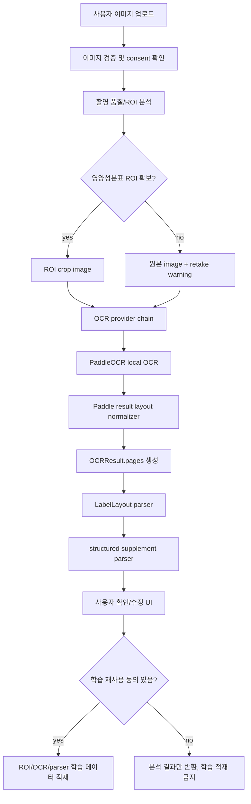

# PaddleOCR 기반 OCR 정확도 향상 상세 설계 및 구현 플랜

- 작성일: 2026-05-17
- 작성 위치: `yeong-Lemon-Aid/Brand-New-update`
- 대상 경로: `yeong-Lemon-Aid/backend/Nutrition-backend`
- 문서 목적: PaddleOCR 활용 방안을 권장안으로 보완하고, 학습으로 정확도를 높이는 3가지 방법을 실제 구현 가능한 단계로 설계한다.
- 상태: 브레인스토밍 기반 상세 설계 및 구현 플랜

## 1. 결론

권장 해결방안은 PaddleOCR을 "로컬 OCR 실행 축"으로 확정하고, Google Vision을 사용할 수 없는 상황에서도 `OCR_PRIMARY_PROVIDER=none` + `ENABLE_LOCAL_OCR=true` 조합으로 OCR provider chain이 동작하도록 유지하는 것이다. 다만 PaddleOCR이 Google Vision보다 영양제 라벨에서 더 정확하다는 결론은 아직 내릴 수 없다. 공식 문서에는 영양제 및 보충제 라벨 전용 성능값이나 confidence threshold 권장값이 없으므로, 내부 fixture benchmark를 먼저 만들고 그 결과로 fallback 순서와 threshold를 조정해야 한다.

학습으로 정확도를 높이는 방법은 다음 3개 트랙으로 병렬 설계하되, 구현 순서는 위험도가 낮은 것부터 진행한다.

1. ROI/촬영 품질 학습: 여러 제품, 흐림, 빛반사, 표지 라벨만 있는 사진을 먼저 분류하고 영양성분표 영역을 잘라 OCR 입력 품질을 높인다.
2. PaddleOCR detection/recognition fine-tuning: 영양제 라벨 도메인의 글자, 단위, 숫자, 한영 혼합 문구를 학습해 OCR 자체를 개선한다.
3. 사용자 확인 기반 parser/domain correction: 사용자가 수정 및 확인한 결과를 사전, 단위 정규화, 성분명 alias, OCR 혼동 보정 규칙으로 축적해 구조화 정확도를 높인다.

실제 제품 적용 우선순위는 `PaddleOCR layout normalization -> fixture 평가 -> ROI/품질 학습 -> parser/domain correction -> PaddleOCR fine-tuning` 순서를 권장한다. OCR 모델 fine-tuning은 효과가 클 수 있지만 데이터 라벨링, 학습 인프라, 개인정보 동의, 회귀 평가 비용이 크므로 바로 1순위로 두지 않는다.

## 2. 공식 문서 기준과 한계

확인한 공식 문서:

- PaddleOCR General OCR Pipeline: https://www.paddleocr.ai/main/en/version3.x/pipeline_usage/OCR.html
- PaddleOCR Text Detection Module: https://www.paddleocr.ai/main/en/version3.x/module_usage/text_detection.html
- PaddleOCR Text Recognition Module: https://www.paddleocr.ai/main/en/version3.x/module_usage/text_recognition.html
- PaddleOCR fine-tuning reference, version 2.10.0: https://www.paddleocr.ai/v2.10.0/en/ppocr/model_train/finetune.html
- Ultralytics YOLO Train mode: https://docs.ultralytics.com/modes/train/
- Ultralytics object detection dataset docs: https://docs.ultralytics.com/datasets/detect/
- OpenCV thresholding: https://docs.opencv.org/4.x/d7/d4d/tutorial_py_thresholding.html
- OpenCV geometric transformations: https://docs.opencv.org/4.x/da/d6e/tutorial_py_geometric_transformations.html

공식 문서에서 확인한 기준:

- PaddleOCR 3.x General OCR Pipeline은 문서 방향 분류, text image unwarping, textline orientation, text detection, text recognition 모듈로 구성된다.
- PaddleOCR 3.x Python 통합은 `PaddleOCR(...).predict(...)` 형태를 제공하고, `device`, `text_detection_model_dir`, `text_recognition_model_dir` 같은 로컬 inference 설정을 지원한다.
- PaddleOCR 3.x 모델 표에는 `korean_PP-OCRv5_mobile_rec`가 존재하며, 한국어, 영어, 숫자 인식을 지원한다고 명시되어 있다.
- PaddleOCR 3.x는 detection miss, recognition error 같은 문제 원인별로 모듈 fine-tuning 경로를 나눈다.
- PaddleOCR detection/recognition 모듈 문서는 dataset 준비, pretrained model 다운로드, train, eval, export 흐름을 제공한다.
- Ultralytics YOLO는 custom object detection 모델 학습에 사용할 수 있고, dataset 설정 문서를 제공한다.
- OpenCV는 adaptive thresholding, Otsu thresholding, affine/perspective transformation 같은 전처리 기본 연산을 공식 문서로 제공한다.

한계:

- I cannot find the official documentation for this specific query: supplement-label-specific PaddleOCR confidence threshold.
- I cannot find the official documentation for this specific query: PaddleOCR expected accuracy on Korean and English supplement facts labels photographed by smartphones.
- 따라서 `LOCAL_OCR_CONFIDENCE_THRESHOLD=0.75` 같은 값은 공식 권장값이 아니라 현재 프로젝트 내부 운영 초기값으로 취급해야 한다.
- PaddleOCR 공식 모델 표의 성능값은 PaddleOCR 측 benchmark 환경 기준이다. 우리 제품의 영양제 라벨, 스마트폰 촬영, 빛반사, 다제품 이미지 성능으로 일반화하면 안 된다.

## 3. 현재 구현 상태 요약

현재 코드 기준으로 이미 구현된 부분:

- `src/ocr/providers/paddle.py`에 `PaddleOCRAdapter`가 존재한다.
- `PaddleOCRAdapter`는 `ENABLE_LOCAL_OCR=true`일 때만 동작하고, `paddleocr` 패키지를 lazy import한다.
- 현재 adapter는 요청 이미지를 임시 파일로 저장한 뒤 `predict(image_path)`를 호출한다.
- PaddleOCR 결과에서 `rec_texts`, `texts`, `rec_scores`, `scores`, legacy `(text, score)` 형태를 재귀적으로 수집해 `OCRResult(text=..., provider="paddleocr_local", confidence=...)`로 반환한다.
- `src/ocr/factory.py`는 `ENABLE_LOCAL_OCR=true`이면 fallback OCR adapter 목록에 `PaddleOCRAdapter`를 추가한다.
- `src/services/supplement_image_analysis.py`에는 primary OCR과 fallback OCR을 순차 실행하는 `_run_ocr_provider_chain()`이 존재한다.
- `OCR_PRIMARY_PROVIDER=none`이어도 fallback adapter가 있으면 OCR chain이 실행될 수 있는 구조가 반영되어 있다.
- `src/parsing/layout_parser.py`는 `OCRResult.pages`의 word coordinate를 받아 y-band row grouping, x-gap cell splitting, keyword anchor 기반 `LabelLayout`을 생성한다.
- `src/models/schemas/label_layout.py`에는 `LabelLayout`, `LabelSection`, `LabelCell`, `LabelBox`, `LayoutParserOptions`가 존재한다.
- `src/learning/consent_gate.py`는 `OCR_IMAGE_PROCESSING`, `DATA_RETENTION`, `IMAGE_LEARNING_DATASET` 동의와 feature flag를 확인해 학습 데이터 적재를 막는 gate를 제공한다.

현재 구현의 핵심 공백:

- PaddleOCR adapter는 text와 평균 confidence 중심으로 결과를 반환한다.
- layout parser는 `OCRResult.pages` 안의 word coordinate가 있어야 강하게 동작한다.
- 따라서 PaddleOCR 결과의 `rec_polys`, `dt_polys`, `rec_texts`, `rec_scores` 또는 Result JSON을 `OCRPage/OCRBlock/OCRParagraph/OCRWord`로 변환하는 layout normalization 계층이 필요하다.
- ROI/품질 학습, PaddleOCR fine-tuning, domain correction은 아직 구현 설계와 데이터 파이프라인이 분리되어 있지 않다.

## 4. 목표 아키텍처



설계 원칙:

- PaddleOCR은 로컬 OCR provider로 취급한다. 외부 OCR consent는 요구하지 않지만, 로컬 모델 설치, 캐시, 버전, readiness 검증은 필요하다.
- Ollama vision assist는 OCR provider 대체가 아니라 검증/보정 신호로만 사용한다.
- ROI detector는 OCR 모델이 아니다. ROI detector는 "어디를 OCR할지"를 개선하는 전처리 단계다.
- 학습 데이터는 사용자 명시 동의 없이는 저장하거나 재사용하지 않는다.
- raw image, raw OCR text, provider raw payload는 운영 audit metadata에 포함하지 않는다.
- 모델 성능 수치는 fixture benchmark 전까지 문서나 UI에 노출하지 않는다.

## 5. PaddleOCR 실행 설계

### 5.1 운영 모드

| 모드 | 설정 예시 | 목적 |
| --- | --- | --- |
| local-only mode | `OCR_PRIMARY_PROVIDER=none`, `ALLOW_EXTERNAL_OCR=false`, `ENABLE_LOCAL_OCR=true` | Google Vision 없이 PaddleOCR만으로 OCR 수행 |
| external-primary + local-fallback | `OCR_PRIMARY_PROVIDER=google_vision`, `ALLOW_EXTERNAL_OCR=true`, `ENABLE_LOCAL_OCR=true` | Google 결과가 없거나 낮은 품질일 때 PaddleOCR fallback |
| benchmark mode | provider별 결과를 별도 report로 저장 | provider 우열 판단, threshold calibration, 회귀 테스트 |

권장 초기 운영값:

```dotenv
OCR_PRIMARY_PROVIDER=none
ALLOW_EXTERNAL_OCR=false
ENABLE_LOCAL_OCR=true
LOCAL_OCR_PROVIDER=paddleocr
LOCAL_OCR_LANGUAGE=korean
LOCAL_OCR_DEVICE=cpu
LOCAL_OCR_CONFIDENCE_THRESHOLD=0.75
```

주의: `LOCAL_OCR_CONFIDENCE_THRESHOLD=0.75`는 공식 권장값이 아니다. 초기 내부 기준이며 fixture benchmark로 재조정해야 한다.

### 5.2 PaddleOCR adapter 보완 설계

현재 adapter 보완 목표:

- `text`와 `confidence`만 반환하지 않고 가능한 경우 `OCRResult.pages`를 채운다.
- PaddleOCR 3.x Result object의 `json` 또는 `save_to_json()` 형태를 안전하게 파싱한다.
- 다음 key를 우선 탐색한다: `rec_texts`, `rec_scores`, `rec_polys`, `dt_polys`, `dt_scores`, `text_det_params`, `page_index`.
- `rec_polys`가 있으면 recognition text line별 polygon으로 사용한다.
- `rec_polys`가 없고 `dt_polys`만 있으면 detection line box와 recognition text를 index 기준으로 매칭하되, 길이가 맞지 않으면 layout warning을 남기고 flat text fallback으로 전환한다.
- box가 line 단위만 존재하면 line 전체를 하나의 `OCRWord`처럼 보관한다. 이후 parser가 x-gap split을 하기 어렵다는 warning을 유지한다.
- word 단위 분리가 가능해지면 `OCRParagraph.words`로 세분화한다. 단, 임의 문자 폭 분할은 성분표 numeric field를 망가뜨릴 수 있으므로 기본값으로 사용하지 않는다.

권장 새 내부 함수:

```python
def _build_ocr_pages_from_paddle_prediction(
    prediction: object,
    *,
    image_width: int,
    image_height: int,
) -> tuple[list[OCRPage], list[str]]:
    """Normalize PaddleOCR result objects into provider-neutral OCR pages."""
```

권장 warning code:

- `paddle_layout_unavailable`: PaddleOCR 결과에서 polygon을 찾지 못함
- `paddle_layout_text_box_count_mismatch`: text와 polygon 개수가 맞지 않음
- `paddle_layout_line_level_only`: word-level이 아니라 line-level 좌표만 있음
- `paddle_score_unavailable`: confidence score를 찾지 못함

### 5.3 readiness check

로컬 OCR은 설치 및 모델 다운로드 이슈가 빈번하므로 API 서버 시작과 실제 요청 사이에 readiness check가 필요하다.

권장 구현:

- `PaddleOCRAdapter.healthcheck()` 또는 service-level `check_local_ocr_readiness(settings)` 추가
- 확인 항목:
  - `paddleocr` import 가능 여부
  - `PaddleOCR(lang=settings.local_ocr_language, device=settings.local_ocr_device)` 초기화 가능 여부
  - tiny synthetic image 또는 fixture sample에 대한 `predict()` 성공 여부
  - model cache 경로 쓰기 권한
- production에서는 `ENABLE_LOCAL_OCR=true`만으로 통과시키지 않고, 사전 sign-off flag 또는 model path 고정이 필요하다.

## 6. 학습 방법 1: ROI/촬영 품질 학습

### 6.1 문제 정의

사용자 이미지는 다음 문제를 자주 만든다.

- 한 이미지에 여러 영양제/보충제가 함께 존재한다.
- 표지 라벨만 있고 영양성분표가 없다.
- 성분표가 작거나 흐리거나 빛반사로 가려진다.
- 제품이 기울어져 있고 텍스트가 원근 왜곡되어 있다.
- 성분표와 마케팅 문구가 섞여 OCR text 순서가 깨진다.

이 문제는 OCR 모델 fine-tuning 이전에 ROI/품질 단계에서 먼저 줄이는 것이 더 안전하다. 성분표가 아닌 영역을 OCR하면 아무리 좋은 OCR 모델도 구조화 parser에 잘못된 후보를 넘기게 된다.

### 6.2 데이터 라벨 설계

이미지 단위 label:

- `single_product`
- `multi_product`
- `facts_table_visible`
- `cover_only`
- `partial_label`
- `blurred_text`
- `glare_or_shadow`
- `low_light`
- `rotated_or_perspective`
- `too_small_text`

bounding box label:

- `supplement_product`
- `nutrition_facts_table`
- `supplement_facts_table`
- `ingredients_section`
- `daily_intake_section`
- `precautions_section`
- `barcode_region`
- `brand_front_label`

권장 manifest:

```json
{
  "image_id": "sha256:...",
  "source": "user_confirmed",
  "consent_scope": ["ocr_image_processing", "data_retention", "image_learning_dataset"],
  "labels": ["multi_product", "facts_table_visible"],
  "boxes": [
    {
      "class_name": "supplement_facts_table",
      "x_center": 0.52,
      "y_center": 0.48,
      "width": 0.38,
      "height": 0.42
    }
  ],
  "split_group": "product_or_barcode_group_id",
  "created_at": "2026-05-17"
}
```

### 6.3 구현 플랜

1. `ImageQualityReport` schema 추가
   - image-level 문제를 구조화한다.
   - UI가 "성분표를 더 가까이 촬영해주세요" 같은 retake action을 낼 수 있게 한다.
2. deterministic quality analyzer 추가
   - OpenCV thresholding, blur score, brightness, contrast, edge density, text region ratio를 계산한다.
   - 공식 권장 임계값이 아닌 내부 fixture calibration 값으로 둔다.
3. ROI dataset manifest exporter 추가
   - 사용자 동의 gate를 통과한 이미지만 manifest에 적재한다.
   - EXIF/GPS 제거, 파일명 pseudonymization, user id 분리를 필수화한다.
4. YOLO ROI detector 학습
   - Ultralytics custom detection dataset 형식으로 변환한다.
   - product-disjoint split을 적용한다. 같은 제품이나 같은 이미지 hash가 train/validation/test에 동시에 들어가면 data leakage다.
5. OCR 전처리 연결
   - ROI detector가 `supplement_facts_table`을 찾으면 그 crop을 PaddleOCR 입력으로 사용한다.
   - ROI confidence가 낮거나 다제품 상황이면 원본 OCR과 ROI OCR을 둘 다 평가하되, parser에는 후보 provenance를 남긴다.

### 6.4 평가 지표

- ROI detection: labeled fixture 기준 IoU, precision/recall, mAP
- downstream OCR: field exact match, numeric exact match, unit exact match
- parser: `LabelLayout.sections` 생성률, section anchor match, row/column mismatch rate
- UX: retake warning 이후 성공률

수치 목표는 초기 baseline report 이후 설정한다. 현재 단계에서 목표값을 임의로 지정하지 않는다.

## 7. 학습 방법 2: PaddleOCR detection/recognition fine-tuning

### 7.1 문제 정의

PaddleOCR 기본 모델이 다음 항목에서 반복적으로 실패할 때 fine-tuning을 검토한다.

- `mg`, `mcg`, `µg`, `IU`, `%DV` 같은 단위 혼동
- `0/O`, `1/l/I`, `5/S`, `8/B` 같은 문자 혼동
- 한글 성분명과 영어 성분명이 같은 줄에 있는 경우
- 작은 표 글자, 회전, 라벨 곡률, 반사광
- row 단위 인식은 되었지만 숫자와 단위가 떨어져 구조화가 실패하는 경우

### 7.2 데이터셋 설계

Text detection 학습 데이터:

- 입력: 성분표 ROI 이미지 또는 전체 라벨 이미지
- label: text line 또는 text box polygon
- 목적: 텍스트 영역 miss 감소, 표 내부 작은 글자 detection 개선

Text recognition 학습 데이터:

- 입력: line crop 또는 word crop
- label: 사람이 확인한 정확한 transcript
- 목적: 한영 혼합 성분명, 단위, 숫자 recognition 개선

필수 metadata:

- `image_id`
- `crop_id`
- `product_group_id`
- `label_type`: `detection` 또는 `recognition`
- `language_mix`: `ko`, `en`, `ko_en`, `numeric_unit`
- `source_provider`: bootstrap OCR provider
- `human_verified`: true/false
- `consent_scope`
- `split`: train/val/test

### 7.3 학습 절차

1. badcase 수집
   - PaddleOCR 결과와 사용자 수정 결과가 다른 사례를 수집한다.
   - raw image 저장은 별도 동의가 있을 때만 한다.
2. bootstrap labeling
   - 기존 PaddleOCR/Google Vision/CLOVA 결과를 초안 label로 사용한다.
   - 사람이 correction UI에서 text box와 transcript를 확정한다.
3. split 고정
   - 같은 제품군, 같은 barcode, 같은 이미지 hash는 train/validation/test를 넘나들 수 없다.
4. recognition first
   - detection box가 어느 정도 안정적이면 recognition fine-tuning부터 시작한다.
   - 영양제 라벨은 text detection보다 numeric/unit recognition 오류가 구조화 실패로 이어지는 경우가 많기 때문이다.
5. detection second
   - 표 내부 글자 누락, 작은 글자 miss가 반복되면 detection fine-tuning을 진행한다.
6. export and deploy
   - PaddleOCR 공식 문서의 export 흐름으로 inference model directory를 생성한다.
   - API 설정에서 `text_detection_model_dir`, `text_recognition_model_dir`에 해당하는 값을 주입할 수 있게 한다.
7. shadow evaluation
   - fine-tuned model을 운영 선택 결과로 바로 쓰지 않고, 먼저 shadow mode에서 baseline과 비교한다.

### 7.4 설정 보완안

현재 설정은 `LOCAL_OCR_LANGUAGE`, `LOCAL_OCR_DEVICE`, `LOCAL_OCR_CONFIDENCE_THRESHOLD` 중심이다. fine-tuned model을 쓰려면 다음 설정을 추가하는 편이 안전하다.

```dotenv
LOCAL_OCR_TEXT_DETECTION_MODEL_DIR=
LOCAL_OCR_TEXT_RECOGNITION_MODEL_DIR=
LOCAL_OCR_TEXT_DETECTION_MODEL_NAME=
LOCAL_OCR_TEXT_RECOGNITION_MODEL_NAME=
LOCAL_OCR_USE_DOC_ORIENTATION_CLASSIFY=false
LOCAL_OCR_USE_DOC_UNWARPING=false
LOCAL_OCR_USE_TEXTLINE_ORIENTATION=false
LOCAL_OCR_ENGINE=
```

주의:

- PaddleOCR 3.x에서는 기존 `det_model_dir`, `rec_model_dir`가 deprecated로 안내되어 있으므로 새 parameter 이름인 `text_detection_model_dir`, `text_recognition_model_dir` 기준으로 맞춘다.
- 문서와 설치된 PaddleOCR package version이 다르면 parameter 이름이 달라질 수 있으므로, 구현 시 `paddleocr.__version__`와 공식 문서를 다시 확인한다.

### 7.5 평가 지표

- OCR level:
  - CER
  - WER
  - line exact match
  - numeric exact match
  - unit exact match
- 구조화 level:
  - 성분명 match
  - 함유량 match
  - 단위 match
  - row association match
  - section classification match
- 안전성:
  - false correction rate
  - hallucinated field count
  - missing amount not fabricated count

성능표에는 반드시 baseline PaddleOCR, fine-tuned PaddleOCR, optional Google Vision/CLOVA 결과를 같은 fixture split에서 비교한다. 서로 다른 데이터셋 결과를 나란히 놓고 우열을 주장하면 안 된다.

## 8. 학습 방법 3: parser/domain correction 학습

### 8.1 문제 정의

OCR 자체가 완벽하지 않아도 사용자 확인 결과를 잘 축적하면 구조화 품질을 빠르게 올릴 수 있다. 특히 영양제 라벨은 성분명, 단위, 1일 섭취량, 함량 표기 방식이 반복되므로 parser/domain correction이 비용 대비 효과가 크다.

### 8.2 데이터 설계

사용자 확인 snapshot:

```json
{
  "analysis_id": "uuid",
  "provider": "paddleocr_local",
  "ocr_text_hash": "sha256:...",
  "layout_version": "label-layout-v1",
  "original_field": {
    "name": "Vitarnin D",
    "amount": "1O",
    "unit": "ug"
  },
  "confirmed_field": {
    "name": "Vitamin D",
    "amount": "10",
    "unit": "µg"
  },
  "correction_type": ["ocr_confusion", "unit_normalization"],
  "human_verified": true,
  "created_at": "2026-05-17"
}
```

domain dictionary:

- `canonical_name`
- `language`
- `aliases`
- `nutrient_code`
- `allowed_units`
- `common_ocr_confusions`
- `evidence_count`
- `last_human_reviewed_at`
- `source`: `user_confirmed`, `official_dataset`, `team_reviewed`

### 8.3 구현 플랜

1. correction capture
   - 사용자가 분석 결과를 수정 및 확인할 때 original/confirmed pair를 저장한다.
   - raw OCR text 전체가 아니라 field-level hash와 필요한 최소 diff만 저장한다.
2. safe normalization layer
   - parser 전 단계에서는 Unicode normalization, 공백, 안전한 단위 표기만 보정한다.
   - parser 후 단계에서는 성분명 alias, 단위 후보, 숫자 후보를 confidence와 함께 제시한다.
3. nutrient/domain dictionary
   - 팀 검수된 alias만 자동 correction에 사용한다.
   - 검수 전 alias는 UI suggestion이나 low-confidence candidate로만 사용한다.
4. OCR confusion map
   - `O -> 0`, `l -> 1`, `µg <-> ug`, `rn -> m` 같은 혼동은 field type이 numeric/unit일 때만 적용한다.
   - 성분명 field에 숫자 보정을 적용하거나 numeric field에 성분명 보정을 적용하지 않는다.
5. no fabrication rule
   - 원본 OCR 또는 사용자 확인에 없는 함량 값을 생성하지 않는다.
   - 성분명만 있고 함량이 없으면 `amount_missing`으로 표시하고 사용자 확인을 요구한다.

### 8.4 평가 지표

- parser exact match before/after correction
- human review acceptance rate
- correction rollback rate
- false positive correction rate
- unknown ingredient review queue size

## 9. 개인정보 및 학습 동의 설계

학습 재사용은 다음 조건이 모두 true일 때만 허용한다.

- `enable_image_learning_pipeline=true`
- `image_learning_retention_days > 0`
- 사용자 동의: `OCR_IMAGE_PROCESSING`
- 사용자 동의: `DATA_RETENTION`
- 사용자 동의: `IMAGE_LEARNING_DATASET`

저장 전 처리:

- EXIF/GPS 제거
- 원본 파일명 제거
- user id와 image id 분리
- 얼굴, 주소, 전화번호, 처방 정보 등 비관련 개인정보 탐지 시 학습 적재 차단
- raw image가 필요 없는 parser correction은 field-level diff만 저장

분할 원칙:

- 같은 제품, 같은 barcode, 같은 image hash, 같은 촬영 session은 train/validation/test를 넘나들 수 없다.
- 사용자 단위 split만으로는 제품 중복 leakage를 막지 못할 수 있으므로 product group split을 우선한다.

## 10. 상세 구현 로드맵

### Phase 0. 문서 확정

- 이 문서를 팀 설계 기준으로 둔다.
- 기존 `docs/Nutrition-docs/40`, `51`, `17`과 충돌하는 표현이 있으면 runtime code 기준으로 정리한다.

완료 조건:

- 권장안이 PaddleOCR 중심으로 정리됨
- 3가지 학습 방법의 목적, 데이터, 구현, 평가가 분리됨
- 공식 문서 링크와 한계가 명시됨

### Phase 1. PaddleOCR local-only smoke test

변경 후보:

- `src/ocr/providers/paddle.py`
- `src/ocr/factory.py`
- `tests/unit/ocr/test_paddle_provider.py`
- `tests/integration/test_supplement_image_paddle_local.py`

작업:

- `OCR_PRIMARY_PROVIDER=none`, `ENABLE_LOCAL_OCR=true` 조합 테스트 추가
- PaddleOCR 미설치 시 sanitized error 검증
- fake predictor 기반 success, empty text, low confidence 테스트 추가
- readiness check 설계 및 smoke fixture 추가

완료 조건:

- Google Vision 없이 PaddleOCR fallback chain이 실행됨
- 미설치 환경에서도 서버가 깨지지 않고 명확한 warning을 반환함

### Phase 2. PaddleOCR layout normalization

변경 후보:

- `src/ocr/providers/paddle.py`
- `src/ocr/base.py`
- `tests/unit/ocr/test_paddle_provider.py`
- `tests/unit/parsing/test_layout_parser.py`

작업:

- PaddleOCR Result object, dict, JSON 형태 fixture 작성
- `rec_texts + rec_scores + rec_polys`를 `OCRResult.pages`로 변환
- `dt_polys`만 있는 경우 degraded layout warning 처리
- line-level box를 `OCRWord`로 보관하는 최소 경로 구현
- layout parser가 PaddleOCR provider에서도 warning과 section을 안정적으로 생성하는지 테스트

완료 조건:

- PaddleOCR 결과가 `LabelLayout`까지 전달됨
- box가 없는 경우에도 flat text fallback과 warning이 명확함

### Phase 3. fixture benchmark

변경 후보:

- `scripts/evaluate_ocr_providers.py`
- `scripts/evaluate_label_layout.py`
- `tests/fixtures/ocr/`
- `outputs/ocr-benchmark/`

작업:

- fixture manifest 작성
- provider별 OCR 결과를 동일 fixture에서 비교
- raw image와 raw OCR text가 아닌 redacted metrics 중심 report 생성
- confidence threshold 후보를 fixture 결과로 calibration

완료 조건:

- PaddleOCR 기본 모델의 실제 baseline 확보
- Google Vision/CLOVA와의 우열을 데이터로만 판단
- threshold 변경 PR에 근거 report 첨부 가능

### Phase 4. ROI/품질 학습 파이프라인

변경 후보:

- `src/models/schemas/image_quality.py`
- `src/services/supplement_image_quality.py`
- `src/vision/preprocessing.py`
- `src/vision/yolo.py`
- `scripts/export_roi_training_manifest.py`
- `scripts/evaluate_roi_detector.py`

작업:

- deterministic image quality analyzer 구현
- ROI/품질 label manifest schema 작성
- consent gate 통과 데이터만 export
- Ultralytics dataset 변환기 작성
- ROI crop 전후 OCR benchmark 비교

완료 조건:

- 품질 문제에 대한 retake warning 가능
- ROI crop이 OCR/parser 성공률에 미치는 영향을 측정 가능
- YOLO 학습은 manifest와 split 검증이 끝난 뒤 진행

### Phase 5. PaddleOCR fine-tuning offline pipeline

변경 후보:

- `scripts/export_paddleocr_det_dataset.py`
- `scripts/export_paddleocr_rec_dataset.py`
- `scripts/validate_paddleocr_dataset_split.py`
- `docs/Nutrition-docs/paddleocr-finetuning-runbook.md`
- `src/config.py`
- `src/ocr/providers/paddle.py`

작업:

- detection/recognition dataset export
- product-disjoint split validator
- PaddleOCR official train/eval/export command runbook 작성
- fine-tuned model directory 설정 추가
- shadow evaluation mode 추가

완료 조건:

- 학습 데이터 누수 검사가 자동화됨
- fine-tuned model이 local model dir로 주입 가능
- baseline 대비 개선/악화 report 없이 production 선택 불가

### Phase 6. parser/domain correction loop

변경 후보:

- `src/models/schemas/ocr_correction.py`
- `src/services/ocr_correction_capture.py`
- `src/parsing/domain_correction.py`
- `src/parsing/supplement_parser.py`
- `tests/unit/parsing/test_domain_correction.py`

작업:

- 사용자 confirmed field diff 저장
- 성분명 alias dictionary와 unit normalization table 추가
- field type별 OCR confusion map 적용
- correction suggestion과 automatic correction을 분리
- 팀 검수 전 correction은 자동 적용하지 않음

완료 조건:

- 사용자 수정이 다음 분석 품질 개선에 사용될 수 있음
- amount/unit hallucination 방지 규칙이 테스트됨

### Phase 7. production sign-off

작업:

- 개인정보 동의 UI 문구와 backend consent gate 일치 확인
- fixture benchmark report 승인
- model artifact checksum과 version 기록
- rollback plan 작성
- production setting validator 통과

완료 조건:

- PaddleOCR local OCR, ROI, fine-tuned model, correction dictionary 중 어떤 조합을 켜도 audit trail이 남음
- 성능 수치, threshold, fallback 순서가 report 기반으로 설명 가능함

## 11. 플랜별 세부 Phase 분해

이 절은 전체 Phase 0-7을 실제 구현 티켓으로 쪼개기 위한 세부 분해다. 각 플랜은 독립적으로 진행할 수 있지만, production 적용 순서는 `Plan A -> OCR benchmark gate -> Plan B/Plan D -> Plan C -> Plan E`를 권장한다. 구현 티켓에서는 `PADDLE-LOCAL`, `OCR-BENCH`, `ROI-TRAIN`, `PADDLE-FINETUNE`, `DOMAIN-CORRECTION`처럼 prefix를 분리해 추적한다.

### Plan A. PaddleOCR local OCR 및 layout normalization

목표: Google Vision 없이도 PaddleOCR이 OCR provider chain에서 안정적으로 실행되고, 가능한 경우 `OCRResult.pages`를 채워 기존 `LabelLayout` parser가 사용할 수 있게 한다.

상세 설계 문서: [`2026-05-17-plan-a-paddleocr-local-layout-normalization-detail-plan.md`](./2026-05-17-plan-a-paddleocr-local-layout-normalization-detail-plan.md)

#### A0. 버전 및 실행 조건 고정

작업:

- 설치 대상 PaddleOCR major/minor version 확인
- 현재 공식 문서 parameter와 설치 버전의 `PaddleOCR` initializer parameter 비교
- `OCR_PRIMARY_PROVIDER=none`, `ENABLE_LOCAL_OCR=true`, `ALLOW_EXTERNAL_OCR=false` 조합을 표준 local-only mode로 문서화
- local OCR dependency가 optional extra인지 확인

변경 후보:

- `pyproject.toml`
- `src/config.py`
- `.env.example`
- `docs/Nutrition-docs/`

완료 조건:

- PaddleOCR 설정 이름이 공식 문서와 충돌하지 않음
- 설치되지 않은 환경에서도 import-time failure가 발생하지 않음

#### A1. local-only provider chain smoke test

작업:

- `build_supplement_image_analysis_adapters()`가 primary 없이 fallback PaddleOCR adapter를 구성하는지 테스트
- fake predictor로 success, empty text, low confidence, exception case를 검증
- provider attempt metadata에 raw OCR text가 들어가지 않는지 확인

변경 후보:

- `tests/unit/ocr/test_paddle_provider.py`
- `tests/unit/ocr/test_factory.py`
- `tests/unit/services/test_supplement_image_analysis.py`

완료 조건:

- `OCR_PRIMARY_PROVIDER=none`이어도 PaddleOCR fallback이 실행 가능함
- 실패 시 sanitized warning만 반환됨

#### A2. PaddleOCR result shape fixture 구축

작업:

- PaddleOCR 3.x Result object의 `json` 형태 fixture 작성
- `rec_texts + rec_scores + rec_polys` fixture 작성
- `dt_polys + dt_scores`만 있는 degraded fixture 작성
- legacy tuple/list fixture 작성
- box/text 개수 mismatch fixture 작성

변경 후보:

- `tests/fixtures/ocr/paddle/`
- `tests/unit/ocr/test_paddle_provider.py`

완료 조건:

- provider raw payload를 직접 runtime parser에 흘리지 않고 normalized fixture로 테스트 가능
- PaddleOCR 결과 shape가 바뀌었을 때 깨지는 지점이 명확함

#### A3. PaddleOCR layout normalizer 구현

작업:

- `_build_ocr_pages_from_paddle_prediction()` 추가
- polygon 좌표를 `OCRBoundingPoly`로 변환
- line-level text를 최소 단위 `OCRWord`로 보관
- score를 line confidence로 전달
- image width/height와 좌표 scale mismatch warning 처리

변경 후보:

- `src/ocr/providers/paddle.py`
- `src/ocr/base.py`

완료 조건:

- PaddleOCR 결과에 polygon이 있으면 `OCRResult.pages`가 비어 있지 않음
- polygon이 없으면 `paddle_layout_unavailable` warning으로 degrade됨

#### A4. `LabelLayout` parser 연결 검증

작업:

- PaddleOCR normalized result를 `parse_label_layout()`에 입력하는 test 추가
- section anchor가 있는 fixture와 없는 fixture를 분리
- line-level box만 있을 때 row grouping이 가능한지 확인
- warning이 UI-safe string인지 확인

변경 후보:

- `tests/unit/parsing/test_layout_parser.py`
- `tests/integration/test_supplement_image_paddle_local.py`

완료 조건:

- PaddleOCR provider에서도 `LabelLayout(provider="paddleocr_local", ...)` 생성 가능
- layout 부족 상황이 crash가 아니라 warning으로 끝남

#### A5. readiness check 및 운영 진단

작업:

- PaddleOCR import, initializer, tiny prediction smoke를 묶은 readiness 함수 추가
- model cache path와 device 설정을 response에 raw path 없이 요약
- production validator에서 local OCR sign-off 조건 명확화

변경 후보:

- `src/services/health.py`
- `src/ocr/providers/paddle.py`
- `src/config.py`
- `tests/unit/test_health.py`

완료 조건:

- 로컬 OCR 미설치, 모델 다운로드 실패, device mismatch를 운영자가 구분 가능
- production enablement가 문서와 설정에서 동시에 통제됨

#### A6. PaddleOCR baseline report

작업:

- fixture benchmark script가 PaddleOCR 기본 모델 결과를 측정
- text metric과 parser metric을 분리
- threshold 후보를 report에만 기록하고 코드 기본값은 별도 PR에서 변경

변경 후보:

- `scripts/evaluate_ocr_providers.py`
- `outputs/ocr-benchmark/`

완료 조건:

- PaddleOCR 기본 모델 baseline이 확보됨
- Google Vision, CLOVA와의 우열 판단은 동일 fixture 결과에만 의존함

### Plan B. ROI 및 촬영 품질 학습

목표: OCR 전에 이미지가 분석 가능한지 판단하고, 성분표 ROI를 잘라 PaddleOCR 입력 품질을 높인다.

#### B0. 품질/ROI taxonomy 확정

작업:

- image-level label과 bbox label 목록 확정
- `cover_only`, `multi_product`, `facts_table_visible`, `glare_or_shadow`, `blurred_text` 같은 상태 label 정의
- `supplement_facts_table`, `ingredients_section`, `precautions_section` bbox class 정의
- label guideline 초안 작성

변경 후보:

- `docs/Nutrition-docs/`
- `tests/fixtures/vision/`

완료 조건:

- annotator가 같은 이미지를 보고 같은 label을 선택할 수 있음
- ROI class가 OCR/parser 목적과 직접 연결됨

#### B1. deterministic image quality analyzer

작업:

- blur, brightness, contrast, edge density, text-region density 계산
- OpenCV thresholding과 geometric transform 후보를 실험용으로 분리
- 임계값은 fixture calibration 전까지 warning-only로 둠

변경 후보:

- `src/services/supplement_image_quality.py`
- `src/models/schemas/image_quality.py`
- `tests/unit/services/test_supplement_image_quality.py`

완료 조건:

- retake warning 후보를 structured output으로 반환
- 임계값이 공식 권장값인 것처럼 표현되지 않음

#### B2. consent-gated ROI dataset export

작업:

- `consent_gate.py`를 dataset export 앞단에 연결
- EXIF/GPS 제거 후 pseudonymized image id 생성
- raw image 저장이 허용되지 않으면 field-level metadata만 저장
- manifest schema validation 추가

변경 후보:

- `scripts/export_roi_training_manifest.py`
- `src/learning/consent_gate.py`
- `tests/unit/learning/test_consent_gate.py`

완료 조건:

- 동의 없는 이미지는 export 대상에서 제외됨
- manifest에는 user-identifying data가 없음

#### B3. annotation workflow

작업:

- annotation tool에서 사용할 class map 작성
- 다제품 이미지의 product-level box와 facts-table box 관계 정의
- label review status 추가: `draft`, `reviewed`, `rejected`
- reviewer 간 disagreement 기록 방식 정의

변경 후보:

- `docs/Nutrition-docs/roi-annotation-guideline.md`
- `scripts/validate_roi_annotations.py`

완료 조건:

- 학습 전 label 품질을 검수할 수 있음
- rejected label이 train set에 들어가지 않음

#### B4. YOLO dataset 변환 및 leakage validator

작업:

- manifest를 Ultralytics detection dataset 구조로 변환
- `product_group_id`, `barcode`, `image_hash` 기준 split 검증
- train/validation/test 중복 검출 시 build fail 처리

변경 후보:

- `scripts/export_yolo_roi_dataset.py`
- `scripts/validate_dataset_split.py`
- `tests/unit/scripts/test_validate_dataset_split.py`

완료 조건:

- product-disjoint split이 보장됨
- 같은 제품 사진이 train과 test에 동시에 들어가지 않음

#### B5. ROI detector training

작업:

- Ultralytics train command를 runbook으로 고정
- seed, model name, dataset checksum, class map checksum 기록
- mAP/precision/recall과 downstream OCR metric을 함께 기록

변경 후보:

- `docs/Nutrition-docs/roi-training-runbook.md`
- `outputs/roi-training/`

완료 조건:

- 학습 artifact가 재현 가능함
- ROI 모델 단독 성능과 OCR downstream 성능을 분리해 볼 수 있음

#### B6. runtime ROI selection

작업:

- `supplement_facts_table` ROI가 있으면 PaddleOCR crop input 생성
- 다제품 상황이면 자동 선택하지 않고 product selection warning 반환
- ROI crop과 원본 OCR 후보의 provenance를 유지

변경 후보:

- `src/vision/preprocessing.py`
- `src/vision/yolo.py`
- `src/services/supplement_image_analysis.py`

완료 조건:

- wrong-product ROI가 자동으로 추천 입력이 되는 위험을 낮춤
- ROI crop 전후 결과 비교가 가능함

#### B7. ROI 효과 평가

작업:

- 원본 OCR vs ROI crop OCR 비교
- parser success, numeric exact match, unit exact match 비교
- retake warning 이후 재촬영 성공률 추적

변경 후보:

- `scripts/evaluate_roi_ocr_impact.py`
- `outputs/ocr-benchmark/`

완료 조건:

- ROI detector를 켜는 것이 실제로 이득인지 report로 판단 가능

### Plan C. PaddleOCR fine-tuning

목표: 영양제 라벨 도메인의 한영 혼합 텍스트, 숫자, 단위, 작은 표 글자에 맞춰 PaddleOCR detection/recognition 모델을 개선한다.

#### C0. badcase taxonomy 구축

작업:

- OCR failure를 detection miss, recognition error, layout association error, parser error로 분류
- `mg/mcg/µg/IU/%DV`, `0/O`, `1/l/I` 같은 confusion category 정의
- fine-tuning으로 해결할 문제와 parser correction으로 해결할 문제 분리

변경 후보:

- `docs/Nutrition-docs/paddleocr-badcase-taxonomy.md`
- `outputs/ocr-badcases/`

완료 조건:

- 모델 학습 대상 문제가 명확함
- parser correction으로 충분한 문제를 OCR fine-tuning으로 과하게 넘기지 않음

#### C1. recognition dataset export

작업:

- line crop 또는 word crop과 transcript를 export
- 사람이 확인한 transcript만 train label로 사용
- language mix와 field type metadata 추가

변경 후보:

- `scripts/export_paddleocr_rec_dataset.py`
- `scripts/validate_paddleocr_rec_dataset.py`

완료 조건:

- recognition 학습 데이터가 PaddleOCR 공식 학습 흐름에 맞게 준비됨
- transcript가 OCR bootstrap 결과만으로 확정되지 않음

#### C2. detection dataset export

작업:

- text line polygon 또는 bbox annotation export
- 성분표 ROI 전체 이미지와 line box를 함께 보관
- detection dataset과 recognition dataset의 source link 유지

변경 후보:

- `scripts/export_paddleocr_det_dataset.py`
- `scripts/validate_paddleocr_det_dataset.py`

완료 조건:

- text detection miss를 학습할 수 있는 box 데이터가 준비됨
- recognition crop과 detection source를 추적 가능

#### C3. split 및 leakage 검증

작업:

- product/barcode/image hash/session 기준 split 고정
- train/validation/test label distribution report 생성
- 같은 crop의 augmented variant가 split을 넘지 않도록 차단

변경 후보:

- `scripts/validate_paddleocr_dataset_split.py`
- `tests/unit/scripts/test_paddleocr_split_validator.py`

완료 조건:

- 성능 평가가 데이터 누수로 과대평가되지 않음

#### C4. recognition fine-tuning 1차

작업:

- PaddleOCR 공식 text recognition train/eval/export 흐름으로 runbook 작성
- baseline model과 fine-tuned model을 같은 test split에서 비교
- numeric/unit metric을 별도 산출

변경 후보:

- `docs/Nutrition-docs/paddleocr-rec-finetuning-runbook.md`
- `outputs/paddleocr-finetuning/`

완료 조건:

- recognition fine-tuning 효과가 report로 검증됨
- 악화 field type이 있으면 production 후보에서 제외됨

#### C5. detection fine-tuning 1차

작업:

- text detection miss가 baseline report에서 확인된 경우에만 진행
- PaddleOCR 공식 text detection train/eval/export 흐름으로 runbook 작성
- detection Hmean뿐 아니라 downstream parser metric도 측정

변경 후보:

- `docs/Nutrition-docs/paddleocr-det-finetuning-runbook.md`
- `outputs/paddleocr-finetuning/`

완료 조건:

- detection fine-tuning이 필요한지 데이터로 설명 가능
- 작은 표 글자 누락 개선 여부가 확인됨

#### C6. fine-tuned model deployment setting

작업:

- `LOCAL_OCR_TEXT_DETECTION_MODEL_DIR`
- `LOCAL_OCR_TEXT_RECOGNITION_MODEL_DIR`
- `LOCAL_OCR_TEXT_DETECTION_MODEL_NAME`
- `LOCAL_OCR_TEXT_RECOGNITION_MODEL_NAME`
- `LOCAL_OCR_ENGINE`
- 위 설정을 `PaddleOCR(...)` initializer에 안전하게 연결

변경 후보:

- `src/config.py`
- `src/ocr/providers/paddle.py`
- `.env.example`
- `tests/unit/test_config.py`

완료 조건:

- fine-tuned model directory를 코드 수정 없이 설정으로 주입 가능
- deprecated parameter를 사용하지 않음

#### C7. shadow evaluation 및 promotion gate

작업:

- 운영 요청에서 기본 모델과 fine-tuned 모델을 동시에 실행하지 않고, benchmark job에서 shadow 비교
- artifact checksum, config snapshot, dataset checksum 기록
- promotion 기준은 fixture report 승인 후 설정

변경 후보:

- `scripts/evaluate_paddleocr_shadow_model.py`
- `outputs/ocr-benchmark/`

완료 조건:

- baseline보다 악화된 모델이 production으로 올라가지 않음
- 어떤 데이터와 설정으로 학습했는지 추적 가능

### Plan D. Parser/domain correction 학습

목표: 사용자 확인 결과를 성분명 alias, 단위 정규화, OCR confusion map으로 축적해 구조화 정확도를 높인다. 이 플랜은 모델 학습보다 빠르게 적용할 수 있지만, 없는 값을 만들어내면 안 된다.

#### D0. correction event schema

작업:

- original field와 confirmed field diff schema 정의
- raw OCR text 전체 저장 대신 field-level hash와 최소 diff 저장
- correction type enum 정의: `ingredient_alias`, `unit_normalization`, `ocr_confusion`, `row_association`, `section_anchor`

변경 후보:

- `src/models/schemas/ocr_correction.py`
- `tests/unit/models/test_ocr_correction.py`

완료 조건:

- 사용자 수정 데이터가 구조화되어 저장 가능
- 개인정보와 raw text 저장 범위가 최소화됨

#### D1. user confirmation capture

작업:

- 분석 결과 확인 UI 또는 API에서 user-confirmed result를 저장
- 자동 OCR 결과와 사용자 확정 결과를 비교
- 사용자가 단순 조회만 한 경우 학습 데이터로 취급하지 않음

변경 후보:

- `src/services/ocr_correction_capture.py`
- `src/api/`
- `tests/integration/test_ocr_correction_capture.py`

완료 조건:

- 명시적으로 확인된 수정만 correction source가 됨

#### D2. dictionary 및 confusion map

작업:

- 성분명 canonical dictionary 설계
- alias, allowed unit, language, source, evidence count 관리
- field type별 confusion rule 적용 범위 제한

변경 후보:

- `src/parsing/domain_dictionary.py`
- `src/parsing/domain_correction.py`
- `tests/unit/parsing/test_domain_dictionary.py`

완료 조건:

- `Vitamin D`, `비타민D`, `Vitarnin D` 같은 후보를 검수 가능한 형태로 연결
- numeric field가 아닌 곳에 숫자 보정이 적용되지 않음

#### D3. suggestion engine

작업:

- low-confidence correction candidate를 생성
- 자동 적용하지 않고 review-required 상태로 반환
- candidate마다 evidence와 source를 남김

변경 후보:

- `src/parsing/domain_correction.py`
- `tests/unit/parsing/test_domain_correction.py`

완료 조건:

- 사용자나 팀 리뷰어가 correction 근거를 확인 가능
- correction suggestion이 structured parser output과 분리됨

#### D4. reviewed rule automatic apply

작업:

- 팀 검수된 alias/unit/confusion rule만 자동 적용
- 자동 적용 전후 값을 audit metadata로 남김
- amount missing 상황에서는 값을 생성하지 않고 `amount_missing` 유지

변경 후보:

- `src/parsing/supplement_parser.py`
- `src/parsing/domain_correction.py`

완료 조건:

- no-fabrication rule이 unit test로 보장됨
- 검수 전 correction이 production에서 자동 적용되지 않음

#### D5. review queue 및 rollback

작업:

- correction candidate review status 관리
- 잘못된 correction rule 비활성화
- 특정 rule 적용 결과를 재평가하는 script 작성

변경 후보:

- `scripts/evaluate_domain_correction_rules.py`
- `outputs/domain-correction/`

완료 조건:

- 잘못된 domain rule을 되돌릴 수 있음
- rule 변경이 parser metric에 미치는 영향이 측정됨

#### D6. parser/domain correction 평가

작업:

- correction 적용 전후 parser exact match 비교
- false positive correction rate 계산
- unknown ingredient review queue size 추적

변경 후보:

- `scripts/evaluate_domain_correction.py`
- `outputs/ocr-benchmark/`

완료 조건:

- correction dictionary가 실제 구조화 정확도를 올리는지 검증 가능

### Plan E. Cross-cutting 평가, 개인정보, 배포 거버넌스

목표: PaddleOCR, ROI 학습, fine-tuning, domain correction이 각각 따로 구현되더라도 같은 안전 기준과 평가 기준을 공유하게 한다.

#### E0. consent 및 retention gate

작업:

- 모든 dataset export script 앞에 `evaluate_image_learning_gate()` 호출
- retention days, consent scope, feature flag를 동일하게 검증
- 동의 철회 시 dataset 재생성 또는 제외 목록 반영 절차 정의

완료 조건:

- 어떤 학습 파이프라인도 동의 gate를 우회하지 않음

#### E1. redacted evaluation report

작업:

- raw image, raw OCR text 없이 metric 중심 report 생성
- provider별 result id와 fixture id는 hash로 표시
- 성능 수치에는 dataset version과 split version을 함께 기록

완료 조건:

- 팀 공유 보고서에 개인정보 없이 성능 근거를 넣을 수 있음

#### E2. artifact versioning

작업:

- model checksum
- dataset checksum
- config snapshot
- code commit hash
- official doc version/date
- 위 정보를 model card 또는 release note에 기록

완료 조건:

- 학습 결과를 재현하거나 rollback할 수 있음

#### E3. production promotion checklist

작업:

- local OCR enablement checklist
- ROI model enablement checklist
- fine-tuned PaddleOCR enablement checklist
- domain correction auto-apply checklist
- rollback path 문서화

완료 조건:

- 개별 플랜이 따로 완료되어도 production 적용 기준이 일관됨

## 12. 테스트 전략

Unit test:

- PaddleOCR Result object shape별 parser
- no layout, mismatched layout, line-level layout warning
- confidence threshold 처리
- `OCR_PRIMARY_PROVIDER=none` + fallback adapter 구성
- consent gate fail reasons
- domain correction no-fabrication rule

Integration test:

- local-only PaddleOCR mode
- ROI crop 후 PaddleOCR 입력
- PaddleOCR `OCRResult.pages` -> `LabelLayout` -> structured parser
- user correction capture -> domain dictionary candidate

Evaluation test:

- fixture image set 고정
- provider별 OCR metric
- ROI crop 전후 metric
- parser/domain correction 전후 metric
- train/validation/test leakage validator

CI에서 항상 돌릴 항목:

- fake PaddleOCR predictor unit test
- layout parser deterministic tests
- consent gate tests
- dataset split validator sample tests

로컬 또는 scheduled job로 돌릴 항목:

- 실제 PaddleOCR dependency smoke test
- OCR provider benchmark
- YOLO/PaddleOCR training job

## 13. 주요 리스크와 대응

| 리스크 | 영향 | 대응 |
| --- | --- | --- |
| PaddleOCR package version과 문서 parameter 불일치 | runtime error | 구현 시 설치 버전과 공식 문서 재검증, adapter에 version-specific test 추가 |
| 영양제 라벨 confidence threshold 부재 | 잘못된 자동 선택 | fixture benchmark 기반 threshold calibration |
| 다제품 이미지에서 wrong ROI 선택 | 다른 제품 성분을 추천에 사용 | multi-product warning, 사용자 제품 선택 UI, ROI provenance 기록 |
| OCR fine-tuning data leakage | 성능 과대평가 | product/barcode/hash disjoint split validator |
| 사용자 동의 없는 학습 적재 | 개인정보/신뢰 리스크 | `consent_gate.py`를 모든 export 경로 앞에 둠 |
| parser correction hallucination | 없는 성분/함량 생성 | no-fabrication rule, low-confidence review queue |
| 모델 artifact 관리 부재 | 재현 불가 | model checksum, config snapshot, benchmark report 저장 |

## 14. 권장 다음 작업

가장 먼저 구현할 작업은 PaddleOCR layout normalization이다. 이미 PaddleOCR adapter와 OCR provider chain은 존재하므로, PaddleOCR 결과를 `OCRResult.pages`로 변환해 기존 `LabelLayout` parser가 사용할 수 있게 만드는 작업이 가장 직접적인 정확도 개선 지점이다.

그 다음에는 fixture benchmark를 만들고, ROI/품질 학습과 parser/domain correction을 병렬로 진행한다. PaddleOCR fine-tuning은 dataset export, split validation, benchmark harness가 준비된 뒤 시작해야 한다.

1차 구현 PR 범위:

1. `PaddleOCRAdapter`에 layout-aware normalization 추가
2. fake PaddleOCR result fixture test 추가
3. local-only mode integration test 추가
4. `LabelLayout` warning이 PaddleOCR 경로에서 안전하게 노출되는지 확인

2차 구현 PR 범위:

1. fixture benchmark script
2. image quality report schema
3. ROI manifest exporter
4. consent gate 연결 검증

3차 구현 PR 범위:

1. parser/domain correction capture
2. alias/unit/confusion dictionary
3. no-fabrication tests

4차 구현 PR 범위:

1. PaddleOCR detection/recognition dataset exporter
2. fine-tuning runbook
3. local model directory settings
4. shadow evaluation mode
