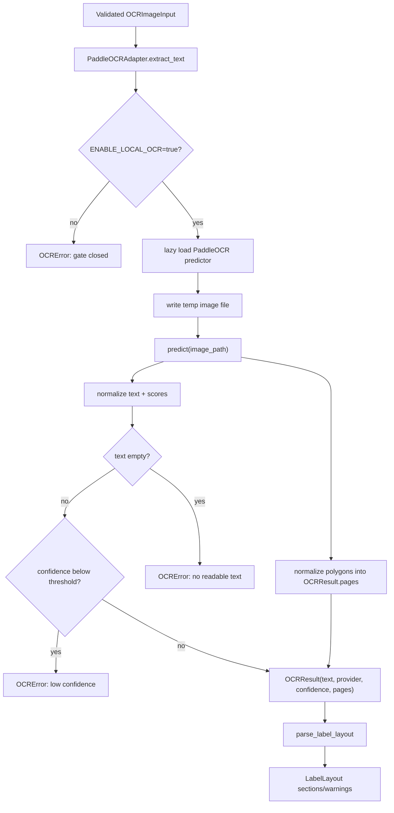

# Plan A. PaddleOCR Local OCR 및 Layout Normalization 상세 설계/구현 플랜

- 작성일: 2026-05-17
- 작성 위치: `yeong-Lemon-Aid/Brand-New-update`
- 대상 코드: `yeong-Lemon-Aid/backend/Nutrition-backend`
- 상위 문서: `2026-05-17-paddleocr-learning-accuracy-design-plan.md`
- 범위: PaddleOCR local-only OCR 실행, PaddleOCR 결과 layout 정규화, `OCRResult.pages` 생성, `LabelLayout` parser 연결, readiness 및 baseline 평가
- 비범위: ROI 모델 학습, PaddleOCR fine-tuning, parser/domain correction 자동 적용

## 1. 결론

Plan A의 핵심 구현 목표는 PaddleOCR을 단순 flat-text fallback이 아니라 기존 `OCRResult.pages -> LabelLayout` 경로에 연결되는 provider로 올리는 것이다. 현재 코드에는 `PaddleOCRAdapter`가 이미 존재하고 `ENABLE_LOCAL_OCR=true`일 때 fallback OCR adapter로 build된다. 그러나 현재 adapter는 `rec_texts`, `rec_scores` 등을 모아 `OCRResult(text=..., provider="paddleocr_local", confidence=...)`만 반환하므로 layout parser가 사용할 word coordinate가 없다.

권장 해결방안:

1. PaddleOCR local-only mode를 명시적으로 검증한다.
2. PaddleOCR 3.x result의 `json`/dict shape에서 `rec_texts`, `rec_scores`, `rec_polys`, `dt_polys`를 우선 수집한다.
3. polygon이 있으면 line-level `OCRWord`를 만들어 `OCRResult.pages`를 채운다.
4. line-level box만 있을 때는 "정교한 column split은 제한됨"을 전제로 `LabelLayout` 연결을 먼저 완료한다.
5. word-level 분할은 Plan A 후속 개선으로 둔다. 임의 문자 폭 기반 분할은 숫자/단위 association을 망가뜨릴 수 있으므로 기본 구현에 넣지 않는다.
6. readiness는 "설정됨"과 "실제 PaddleOCR runtime 가능"을 분리한다.
7. 모든 판단은 fixture benchmark 전에는 정확도 우열이 아니라 동작 가능성과 구조 보존 여부로 제한한다.

## 1.1 2026-05-17 구현 반영 기준

이번 구현에서는 다음 범위를 코드와 테스트에 반영한다.

- `PaddleOCRAdapter`가 PaddleOCR 3.x `rec_texts`, `rec_scores`, `rec_polys`, `dt_polys`를 provider 내부 `_PaddleLine`으로 정규화한다.
- `rec_polys`를 우선 사용하고 없을 때만 `dt_polys`로 degrade한다.
- polygon이 하나 이상 유효하면 one page, one `TEXT` block, one paragraph, line-level `OCRWord` 구조로 `OCRResult.pages`를 만든다.
- polygon이 없거나 무효여도 text/confidence가 유효하면 OCR 성공으로 반환하고 `pages=()`로 degrade한다.
- 같은 text가 반복되어도 line-level layout path에서는 dedupe하지 않는다.
- `/ready`는 계속 configuration-only로 유지하고, 실제 PaddleOCR import/init/predict는 `backend/scripts/probe_paddleocr_runtime.py`에서만 명시 실행한다.
- runtime dependency 문제는 구현 코드에서 임의 dependency를 추가하지 않고 probe JSON으로 드러낸다.

## 2. 공식 문서 기준

확인한 공식 문서:

- PaddleOCR Quick Start: https://www.paddleocr.ai/latest/en/quick_start.html
- PaddleOCR General OCR Pipeline: https://www.paddleocr.ai/latest/en/version3.x/pipeline_usage/OCR.html
- PaddleOCR Text Detection Module: https://www.paddleocr.ai/latest/en/version3.x/module_usage/text_detection.html
- PaddleOCR Text Recognition Module: https://www.paddleocr.ai/latest/en/version3.x/module_usage/text_recognition.html

공식 문서 기준으로 설계에 반영할 점:

- General OCR Pipeline은 document orientation classification, document unwarping, textline orientation classification, text detection, text recognition 모듈로 구성된다.
- Python API는 `PaddleOCR(...)` 객체 생성 후 `predict("./image.png")` 호출을 제공한다.
- result object는 `print()`, `save_to_img(...)`, `save_to_json(...)`을 제공하고, `json` attribute로 prediction 결과 dict를 얻을 수 있다.
- Plan A v1 런타임 설정은 `device`, `engine`, `use_doc_orientation_classify`, `use_doc_unwarping`, `use_textline_orientation`, `paddlex_config`만 프로젝트 설정으로 노출한다.
- `text_detection_model_name`, `text_detection_model_dir`, `text_recognition_model_name`, `text_recognition_model_dir`는 공식 문서에 존재하지만 Plan A v1 범위에서는 추가하지 않는다. 모델 pinning/fine-tuning 단계에서 별도 설계한다.
- 공식 문서의 multilingual recognition model 표에는 `korean_PP-OCRv5_mobile_rec`가 있고, Korean, English, numeric text recognition을 지원한다고 설명되어 있다.
- 공식 모델의 성능 수치는 PaddleOCR 측 test dataset 기준이다. 스마트폰으로 촬영된 한국어/영어 혼합 영양제 라벨 성능으로 일반화하면 안 된다.

명시적 한계:

- I cannot find the official documentation for this specific query: supplement-label-specific PaddleOCR confidence threshold.
- I cannot find the official documentation for this specific query: official PaddleOCR recommendation for line-level vs word-level layout conversion into a custom DTO like this project`s `OCRResult`.
- 따라서 threshold, fallback order, layout degradation policy는 내부 fixture benchmark로 결정해야 한다.

## 3. 현재 구현 상태 진단

### 3.1 이미 구현된 부분

현재 코드 기준:

- `src/ocr/base.py`에 provider-neutral OCR DTO가 존재한다.
  - `OCRResult`
  - `OCRPage`
  - `OCRBlock`
  - `OCRParagraph`
  - `OCRWord`
  - `OCRBoundingPoly`
- `src/ocr/providers/paddle.py`에 `PaddleOCRAdapter`가 존재한다.
- `PaddleOCRAdapter`는 `ENABLE_LOCAL_OCR=true`가 아니면 fail-closed로 `OCRError`를 발생시킨다.
- `PaddleOCRAdapter`는 `paddleocr`를 lazy import한다.
- adapter는 요청 이미지 bytes를 임시 파일로 저장하고 `predict(image_path)`를 호출한다.
- 현재 `_collect_text_and_scores()`는 dict/list/object를 재귀적으로 돌면서 `rec_texts`, `texts`, `rec_scores`, `scores`, legacy `(text, score)`를 수집한다.
- `src/ocr/factory.py`는 `ENABLE_LOCAL_OCR=true`이면 fallback adapter 목록에 `PaddleOCRAdapter`를 추가한다.
- `src/services/supplement_image_analysis.py`에는 primary OCR과 fallback OCR을 순차 실행하는 `_run_ocr_provider_chain()`이 있다.
- `src/parsing/layout_parser.py`는 `OCRResult.pages`가 있으면 좌표 기반으로 `LabelLayout`을 만든다.
- `tests/unit/ocr/test_paddle_provider.py`에는 flat text, gate, low-confidence 테스트가 있다.
- `tests/unit/ocr/test_ocr_factory.py`에는 optional fallback adapter build 테스트가 있다.
- `src/services/readiness.py`에는 `local_ocr` readiness component가 있지만, 현재는 `ENABLE_LOCAL_OCR` flag 기준이다.

### 3.2 현재 공백

구현 공백:

- PaddleOCR adapter가 `OCRResult.pages`를 채우지 않는다.
- PaddleOCR polygon result를 `OCRBoundingPoly`로 변환하는 함수가 없다.
- `rec_texts`, `rec_scores`, `rec_polys`, `dt_polys`의 index alignment 정책이 없다.
- PaddleOCR result shape별 fixture가 부족하다.
- local OCR readiness가 실제 import, model initialization, prediction 가능 여부를 검증하지 않는다.
- PaddleOCR local-only mode의 end-to-end integration test가 부족하다.
- PaddleOCR result가 layout parser로 들어가는 테스트가 없다.

설계상 주의할 점:

- `OCRResult` DTO를 성급히 확장하지 않는다. 현재 Google Vision/CLOVA/layout parser가 이미 이 계약을 사용하고 있으므로 Plan A의 1차 목표는 기존 DTO 안에서 해결하는 것이다.
- provider raw JSON을 service나 parser로 흘리지 않는다. provider adapter 내부에서 정규화한다.
- PaddleOCR line-level polygon을 억지로 word-level로 쪼개지 않는다.
- confidence가 `None`인 provider 결과를 무조건 low-confidence로 처리하지 않는다. 현재 pipeline 정책과 충돌할 수 있다.

## 4. 목표 런타임 흐름



핵심 판단:

- OCR extraction 성공 여부는 text 존재와 confidence threshold로 판단한다.
- layout normalization 실패는 OCR extraction 실패로 처리하지 않는다. text가 있고 confidence가 통과했다면 `pages=()` 또는 degraded layout으로 반환할 수 있다.
- layout parser는 `pages=()`일 때 이미 `layout_unavailable` warning을 낼 수 있다.
- polygon이 있는 경우에는 `pages`를 채워 layout parser가 row/section을 복원할 기회를 준다.

## 5. 세부 설계

### 5.1 Settings 설계

Plan A 1차 구현에서 유지할 설정:

```dotenv
OCR_PRIMARY_PROVIDER=none
ALLOW_EXTERNAL_OCR=false
ENABLE_LOCAL_OCR=true
LOCAL_OCR_PROVIDER=paddleocr
LOCAL_OCR_LANGUAGE=korean
LOCAL_OCR_DEVICE=cpu
LOCAL_OCR_ENGINE=paddle
LOCAL_OCR_USE_DOC_ORIENTATION_CLASSIFY=false
LOCAL_OCR_USE_DOC_UNWARPING=false
LOCAL_OCR_USE_TEXTLINE_ORIENTATION=false
LOCAL_OCR_PADDLEX_CONFIG=
LOCAL_OCR_CONFIDENCE_THRESHOLD=0.75
```

권장 적용 순서:

1. Plan A 1차에서는 `LOCAL_OCR_ENGINE`, orientation/unwarping/textline flags, `LOCAL_OCR_PADDLEX_CONFIG`만 추가한다.
2. model name/dir 설정은 fine-tuning 또는 model pinning이 필요해지는 시점에 별도 설계로 추가한다.
3. 설정이 추가될 때는 `src/config.py`, `.env.example`, 관련 테스트, 문서가 함께 변경되어야 한다.

설정 설계 원칙:

- PaddleOCR 공식 parameter 이름과 맞춘다.
- deprecated parameter 이름을 새로 도입하지 않는다.
- production 기본값은 여전히 local OCR off를 유지한다.
- `LOCAL_OCR_CONFIDENCE_THRESHOLD`는 공식 권장값이 아니라 내부 calibration 값임을 문서에 남긴다.

### 5.2 Predictor 초기화 설계

현재 `_get_paddle_predictor(language, device)`는 다음 kwargs만 넘긴다.

```python
kwargs: dict[str, object] = {"lang": language}
if device:
    kwargs["device"] = device
```

Plan A 보완안:

```python
def _get_paddle_predictor(
    *,
    language: str,
    device: str | None,
    engine: str | None,
    use_doc_orientation_classify: bool,
    use_doc_unwarping: bool,
    use_textline_orientation: bool,
    paddlex_config: str | None,
) -> PaddlePredictor:
    ...
```

주의:

- `lang`은 현재 코드와 PaddleOCR 사용 예시에서 널리 쓰이지만, 한국어 PP-OCRv5 recognition model name을 직접 지정하는 방식과는 다를 수 있다. runtime probe에서 설치된 PaddleOCR version과 initializer 동작을 확인한다.
- 공식 문서에는 `device="gpu"` 예시가 있으나, 로컬 개발/CI 기본값은 CPU로 둔다.
- model download가 runtime request 중 발생하면 latency와 실패율이 커진다. production에서는 model cache를 build 단계에서 준비하거나 PaddleX config 기반 모델 경로 pinning을 별도 검토한다.

### 5.3 Result snapshot 추출 설계

PaddleOCR result는 object, dict, list가 섞여 들어올 수 있다. 현재 코드는 재귀 walk로 text/score만 수집한다. layout normalization에는 "한 줄의 text, score, polygon을 같은 index로 묶은 record"가 필요하다.

권장 내부 DTO:

```python
@dataclass(frozen=True)
class _PaddleLine:
    text: str
    confidence: float | None
    polygon: OCRBoundingPoly | None
    source: Literal["rec_polys", "dt_polys", "legacy", "none"]
```

권장 추출 함수:

```python
def _extract_paddle_lines(
    value: object,
) -> tuple[list[_PaddleLine], list[str]]:
    """Extract aligned text, score, and polygon lines from PaddleOCR output."""
```

추출 우선순위:

1. `rec_texts` + `rec_scores` + `rec_polys`
2. `rec_texts` + `rec_scores` + `dt_polys`
3. `texts` + `scores` + `rec_polys`
4. legacy nested tuples
5. text-only fallback

정렬 및 중복 정책:

- `rec_texts`의 순서를 provider order로 유지한다.
- 같은 text가 반복되어도 서로 다른 polygon이면 중복 제거하지 않는다. 성분표에서는 같은 성분명이나 같은 단위가 여러 줄에 반복될 수 있다.
- flat text fallback에서만 기존 `_dedupe_preserve_order()`를 유지할 수 있다.
- layout path에서는 중복 제거보다 위치 보존이 중요하다.

### 5.4 Polygon parsing 설계

PaddleOCR JSON에서 polygon은 numpy array가 list로 변환된 shape일 수 있다. 최소 지원 shape:

```json
[[10, 20], [120, 20], [120, 42], [10, 42]]
```

확장 지원 shape:

```json
[{"x": 10, "y": 20}, {"x": 120, "y": 20}, {"x": 120, "y": 42}, {"x": 10, "y": 42}]
```

권장 함수:

```python
def _parse_paddle_polygon(value: object) -> OCRBoundingPoly | None:
    """Parse a PaddleOCR polygon into OCRBoundingPoly when the shape is valid."""
```

검증 규칙:

- vertex는 최소 2개 이상이어야 한다. 기존 layout parser가 bounding box min/max를 만들 수 있기 때문이다.
- x/y가 int 또는 float가 아니면 해당 polygon은 무효 처리한다.
- 음수 좌표는 provider error 또는 crop 좌표 오차일 수 있으므로 Plan A에서는 polygon 무효 처리한다.
- image width/height를 초과하는 좌표는 즉시 실패시키지 않고 parser의 coordinate scale warning 경로를 활용한다.
- normalized coordinate인지 pixel coordinate인지 provider가 명확히 주지 않으면 임의 scaling하지 않는다.

### 5.5 OCR hierarchy mapping 설계

Plan A의 최소 mapping:

```text
OCRResult
  OCRPage(width=image.width, height=image.height)
    OCRBlock(block_type="TEXT")
      OCRParagraph(text=joined line text)
        OCRWord(text=line_text, bounding_box=line_polygon)
```

이 mapping의 장점:

- 기존 `OCRResult.pages` 계약을 바꾸지 않는다.
- `parse_label_layout()`가 이미 `OCRWord`를 flatten하므로 연결 비용이 낮다.
- line-level coordinate만으로도 y-band row grouping이 가능하다.
- PaddleOCR result가 word-level을 제공하지 않아도 layout parser에 최소 정보를 제공한다.

이 mapping의 한계:

- line text 내부의 성분명/함량/단위 column split은 정교하지 않을 수 있다.
- x-gap cell splitting은 line 전체 box를 하나의 word로 보기 때문에 table cell 복원력이 낮다.
- 성분표에서 한 줄에 `비타민D 10 µg 100%`가 들어오면 `LabelCell` 하나로 묶일 수 있다.

후속 개선:

- PaddleOCR가 word-level boxes를 제공하는 shape가 확인되면 word-level mapping을 추가한다.
- line text를 whitespace token으로 나누고 bounding box를 비례 분할하는 방식은 기본 구현에서 제외한다. 숫자/단위 위치를 왜곡할 수 있기 때문이다.

### 5.6 Text와 layout 경로 분리

현재 `_collect_text_and_scores()`는 전체 prediction tree를 재귀적으로 walk한다. layout normalization에서도 동일한 tree를 별도로 walk하면 중복, 순서 변경, score mismatch가 발생할 수 있다.

권장 구조:

```python
lines, layout_warnings = _extract_paddle_lines(
    prediction,
    image_width=image.width,
    image_height=image.height,
)
fragments = [line.text for line in lines]
scores = [line.confidence for line in lines if line.confidence is not None]
pages = _build_pages_from_paddle_lines(lines, image=image)
```

fallback:

- `_extract_paddle_lines()`가 아무 line도 못 만들면 기존 `_collect_text_and_scores()`를 사용한다.
- text-only fallback에서는 `pages=()`로 반환한다.

중요:

- text extraction 실패와 layout extraction 실패를 분리한다.
- layout 실패 때문에 OCR fallback chain이 다음 provider로 넘어가면 안 된다. text가 정상이라면 현재 provider 결과를 유지한다.

### 5.7 Confidence 정책

현재 정책:

- score list가 있으면 평균을 `OCRResult.confidence`로 사용한다.
- confidence가 threshold 미만이면 `OCRError`.
- confidence가 `None`이면 threshold 비교를 하지 않는다.

Plan A 유지 정책:

- provider가 confidence를 제공하지 않는다고 무조건 실패시키지 않는다.
- line-level score 평균을 global confidence로 유지한다.
- score가 일부 line에만 있으면 score가 있는 line만 평균한다.
- score 값이 0.0-1.0 범위를 벗어나면 버린다.

명시적 한계:

- `LOCAL_OCR_CONFIDENCE_THRESHOLD=0.75`는 공식 영양제 라벨 threshold가 아니다.
- threshold 변경은 Plan A6 benchmark 이후 별도 PR에서 수행한다.

### 5.8 Readiness 설계

현재 readiness는 `ENABLE_LOCAL_OCR`만 보고 `ready`를 반환한다. 실제로는 다음 상태를 구분해야 한다.

| 상태 | 의미 |
| --- | --- |
| `not_configured` | `ENABLE_LOCAL_OCR=false` |
| `configured` | 설정은 켜졌지만 heavy runtime check는 실행하지 않음 |
| `ready` | import, initialize, optional predict smoke 성공 |
| `not_ready` | import/init/predict 실패 |

권장 구현:

```python
def check_local_ocr_runtime(
    settings: Settings,
    *,
    run_prediction: bool = False,
) -> ReadinessComponent:
    """Check whether configured local OCR runtime is actually usable."""
```

운영 정책:

- 기본 `/readiness`는 빠르게 응답해야 하므로 heavy prediction을 매번 실행하지 않는다.
- 별도 deep readiness 또는 startup smoke에서 `run_prediction=True`를 사용한다.
- production에서는 model cache 준비 여부를 배포 전 smoke test로 확인한다.

readiness details에 넣을 수 있는 값:

- `provider`
- `language`
- `device`
- `engine`
- `runtime_checked`
- `prediction_smoke_checked`

readiness details에 넣지 말아야 할 값:

- raw image path
- raw OCR text
- full model cache absolute path
- provider raw exception stack trace

## 6. Phase별 구현 플랜

### A0. 현재 전제 고정 및 문서 정합성 확인

목표: 구현 전에 PaddleOCR 공식 parameter, 현재 코드 설정, 기존 docs 표현을 정리한다.

작업:

- PaddleOCR 공식 문서의 `PaddleOCR(...)` parameter와 현재 `_get_paddle_predictor()` kwargs 비교
- `LOCAL_OCR_LANGUAGE=korean`이 현재 코드에서 쓰이는 방식 확인
- `pyproject.toml`의 optional dependency `ocr-local = ["paddleocr>=3.0"]` 유지 여부 확인
- stale docs에서 "PaddleOCR 기본 ON", "정확도 85-90%" 같은 검증되지 않은 표현이 남아 있는지 점검

변경 후보:

- `yeong-Lemon-Aid/backend/pyproject.toml`
- `yeong-Lemon-Aid/backend/Nutrition-backend/src/config.py`
- `yeong-Lemon-Aid/backend/Nutrition-backend/.env.example` 또는 실제 `.env.example` 위치
- `yeong-Lemon-Aid/docs/Nutrition-docs/32-paddleocr-local-fallback-plan.md`
- `yeong-Lemon-Aid/docs/Nutrition-docs/40-ocr-3-tier-expansion-design-plan.md`
- `yeong-Lemon-Aid/docs/Nutrition-docs/51-phase3-fallback-ocr-routing-design-plan.md`

완료 조건:

- 구현 PR에서 사용할 PaddleOCR parameter 이름이 확정됨
- 공식 문서로 확인하지 못한 성능/threshold 표현은 제거되거나 "가정"으로 표시됨
- Plan A 구현 범위가 ROI/fine-tuning/domain correction과 섞이지 않음

검증:

```bash
rg -n "PaddleOCR|LOCAL_OCR|ENABLE_LOCAL_OCR|85|90|threshold" yeong-Lemon-Aid/docs/Nutrition-docs yeong-Lemon-Aid/backend
```

### A1. Local-only provider chain 테스트

목표: Google Vision 없이 PaddleOCR adapter만으로 OCR provider chain이 실행될 수 있음을 테스트로 고정한다.

작업:

- `OCR_PRIMARY_PROVIDER=none`, `ENABLE_LOCAL_OCR=true`, `ALLOW_EXTERNAL_OCR=false` settings fixture 추가
- factory가 `primary_adapter=None`, `fallback_ocr_adapters=(PaddleOCRAdapter,)`를 반환하는지 테스트
- `_run_ocr_provider_chain()`이 primary 없이 fallback adapter를 실행하는지 fake adapter로 검증
- 실패 시 provider attempt status가 sanitized warning으로 남는지 확인

변경 후보:

- `tests/unit/ocr/test_ocr_factory.py`
- `tests/unit/services/test_supplement_image_analysis.py`

완료 조건:

- local-only mode가 regression test로 고정됨
- external OCR consent 없이 local PaddleOCR adapter build가 가능함
- PaddleOCR 실패가 raw exception을 API response로 노출하지 않음

권장 테스트 이름:

```python
def test_factory_builds_local_ocr_fallback_without_primary_provider() -> None:
    ...

async def test_ocr_provider_chain_runs_local_fallback_without_primary() -> None:
    ...
```

### A2. PaddleOCR result fixture 구축

목표: PaddleOCR result shape가 바뀌어도 adapter normalizer가 어떤 shape를 지원하는지 테스트로 명확히 한다.

작업:

- fake predictor가 object with `.json` attribute를 반환하는 케이스 추가
- fake predictor가 callable `.json()` method를 반환하는 케이스 추가
- `rec_texts + rec_scores + rec_polys` dict fixture 추가
- `rec_texts + rec_scores + dt_polys` dict fixture 추가
- `rec_texts`와 polygon count mismatch fixture 추가
- text-only fixture 추가
- invalid polygon fixture 추가

변경 후보:

- `tests/unit/ocr/test_paddle_provider.py`
- 필요 시 `tests/fixtures/ocr/paddle/`

완료 조건:

- PaddleOCR 3.x JSON-style result가 unit test로 표현됨
- layout 가능/불가능 케이스가 분리됨
- result shape가 알 수 없을 때도 text-only fallback이 유지됨

권장 fixture 예시:

```python
{
    "rec_texts": ["영양 기능정보", "비타민 D 10 ug"],
    "rec_scores": [0.93, 0.91],
    "rec_polys": [
        [[10, 20], [150, 20], [150, 42], [10, 42]],
        [[10, 50], [220, 50], [220, 72], [10, 72]],
    ],
}
```

### A3. PaddleOCR line extraction 구현

목표: PaddleOCR prediction에서 text, confidence, polygon을 index-aligned line record로 만든다.

작업:

- `_PaddleLine` dataclass 추가
- `_prediction_to_mappings()` 또는 `_iter_prediction_mappings()` 추가
- `_extract_paddle_lines()` 추가
- `_parse_paddle_polygon()` 추가
- `_score_value()` 재사용 또는 단일 값 helper 추가
- line extraction 경로에서는 중복 제거를 하지 않도록 기존 `_dedupe_preserve_order()`와 분리

변경 후보:

- `src/ocr/providers/paddle.py`

완료 조건:

- `rec_texts`, `rec_scores`, `rec_polys`가 있으면 line count가 text count와 일치함
- polygon이 없는 line도 text-only line으로 유지 가능
- invalid polygon은 해당 line polygon만 `None` 처리하고 text extraction은 유지함

권장 함수 분리:

```python
def _extract_paddle_lines(value: object) -> list[_PaddleLine]:
    ...

def _collect_lines_from_mapping(value: dict[object, object]) -> list[_PaddleLine]:
    ...

def _parse_polygon_sequence(value: object) -> list[OCRBoundingPoly | None]:
    ...
```

주의:

- 모든 nested dict에서 line을 수집할 때 같은 line이 중복 수집될 수 있다. root result shape를 우선 처리하고, 실패할 때만 recursive fallback을 사용한다.
- `rec_texts`와 `rec_polys`의 길이가 다르면 index matching을 무리하게 하지 않는다.

### A4. `OCRResult.pages` 생성

목표: PaddleOCR line record를 provider-neutral layout hierarchy로 변환한다.

작업:

- `_build_ocr_pages_from_paddle_lines(lines, image)` 추가
- image width/height를 `OCRPage(width=..., height=...)`에 반영
- line polygon을 `OCRWord.bounding_box`에 반영
- `OCRBlock.block_type="TEXT"` 사용
- paragraph와 block confidence는 score 평균으로 계산
- polygon이 하나도 없으면 `pages=()`

변경 후보:

- `src/ocr/providers/paddle.py`

완료 조건:

- polygon이 있는 PaddleOCR fixture에서 `result.pages`가 비어 있지 않음
- `result.pages[0].blocks[0].paragraphs[0].words`에 line-level words가 들어감
- `result.text` 순서와 `OCRWord.text` 순서가 일치함

권장 mapping:

```python
page = OCRPage(
    width=image.width,
    height=image.height,
    confidence=confidence,
    blocks=(
        OCRBlock(
            text=text,
            confidence=confidence,
            bounding_box=_union_polygons(lines),
            block_type="TEXT",
            paragraphs=(
                OCRParagraph(
                    text=text,
                    confidence=confidence,
                    bounding_box=_union_polygons(lines),
                    words=tuple(words),
                ),
            ),
        ),
    ),
)
```

주의:

- `_union_polygons()`는 axis-aligned bounding polygon을 만드는 helper로 충분하다.
- 회전된 polygon을 보존해야 하는 원본 line에는 `OCRWord.bounding_box`의 원 polygon을 넣고, block/paragraph union만 axis-aligned로 만든다.

### A5. Adapter 반환 정책 정리

목표: text/confidence/layout 결과를 일관된 정책으로 `OCRResult`에 담는다.

작업:

- `extract_text()` 내부 흐름을 `prediction -> lines -> text/scores/pages` 순서로 정리
- line extraction 실패 시 기존 `_collect_text_and_scores()` fallback 사용
- confidence threshold는 현 정책 유지
- text empty는 `OCRError`
- layout empty는 `OCRError`가 아니라 `pages=()` 반환

변경 후보:

- `src/ocr/providers/paddle.py`
- `tests/unit/ocr/test_paddle_provider.py`

완료 조건:

- OCR text가 있으면 layout 실패만으로 provider chain이 다음 OCR로 넘어가지 않음
- low-confidence text는 기존처럼 provider 실패로 처리됨
- text-only result도 기존 behavior와 호환됨

회귀 테스트:

- 기존 `test_paddle_adapter_flattens_prediction_text_and_scores`
- 기존 `test_paddle_adapter_requires_local_ocr_gate`
- 기존 `test_paddle_adapter_rejects_low_confidence_prediction`
- 신규 `test_paddle_adapter_populates_pages_from_rec_polys`
- 신규 `test_paddle_adapter_keeps_text_when_layout_is_unavailable`

### A6. `LabelLayout` parser 연결 테스트

목표: PaddleOCR provider 결과가 기존 deterministic layout parser와 실제로 연결되는지 검증한다.

작업:

- PaddleOCR fixture result를 `parse_label_layout()`에 입력
- `영양 기능정보`, `섭취방법`, `원재료명` 같은 anchor를 가진 line-level fixture 작성
- `layout.provider == "paddleocr_local"` 확인
- section 생성과 warnings를 확인
- no pages case는 기존 `layout_unavailable` warning 확인

변경 후보:

- `tests/unit/parsing/test_layout_parser.py`
- `tests/unit/services/test_supplement_layout_context.py`
- `tests/unit/services/test_supplement_image_analysis.py`

완료 조건:

- PaddleOCR polygon result가 `LabelLayout`으로 이어짐
- line-level limitation이 crash가 아니라 parser output/warning으로 표현됨
- Google/CLOVA layout parser tests가 깨지지 않음

### A7. Readiness deep check 구현

목표: local OCR이 "설정상 enabled"인지와 "실제로 실행 가능한지"를 구분한다.

작업:

- `check_local_ocr_runtime(settings, run_prediction=False)` helper 추가
- import 실패, initializer 실패, prediction 실패를 각각 sanitized message code로 반환
- 기본 readiness에서는 heavy prediction을 수행하지 않음
- deep smoke test script 또는 명시 endpoint에서만 tiny prediction 수행

변경 후보:

- `src/services/readiness.py`
- `src/ocr/providers/paddle.py`
- `tests/unit/services/test_readiness.py`

완료 조건:

- `ENABLE_LOCAL_OCR=true`인데 PaddleOCR 미설치인 상태를 `ready`로 오판하지 않음
- health response에 raw exception stack이 노출되지 않음
- local OCR이 disabled이면 기존처럼 `not_configured`

권장 message code:

- `local_ocr_disabled`
- `local_ocr_configured`
- `local_ocr_runtime_ready`
- `local_ocr_import_failed`
- `local_ocr_initialization_failed`
- `local_ocr_prediction_smoke_failed`

### A8. Baseline benchmark skeleton

목표: 정확도 주장을 하기 전에 PaddleOCR 기본 모델의 fixture baseline을 산출할 준비를 한다.

작업:

- PaddleOCR provider collector를 benchmark script에 연결
- dependency/model cache가 없으면 skip 처리
- raw image/raw OCR text를 report에 넣지 않고 metric과 warning만 기록
- 동일 fixture에서 Google Vision/CLOVA/manual과 비교할 수 있게 provider label 통일

변경 후보:

- `scripts/evaluate_ocr_providers.py`
- `scripts/evaluate_label_layout.py`
- `outputs/ocr-benchmark/`
- `tests/fixtures/supplement_labels/manifest.json`

완료 조건:

- PaddleOCR basic model baseline을 report로 산출할 수 있음
- benchmark 전에는 threshold와 provider order를 바꾸지 않음
- report는 개인정보와 raw OCR text를 포함하지 않음

## 7. 구현 순서 제안

1차 PR: local-only 경로와 Paddle result fixture

- A1, A2 중심
- 목적: 현재 provider chain이 local-only를 지원한다는 사실을 테스트로 고정
- 코드 영향: 낮음

2차 PR: PaddleOCR layout normalizer

- A3, A4, A5 중심
- 목적: PaddleOCR result를 `OCRResult.pages`로 변환
- 코드 영향: `src/ocr/providers/paddle.py` 중심

3차 PR: layout parser 연결

- A6 중심
- 목적: PaddleOCR provider output이 `LabelLayout`과 서비스 layout context에 연결되는지 검증
- 코드 영향: 테스트 중심, 필요 시 service warning 보완

4차 PR: readiness deep check

- A7 중심
- 목적: local OCR runtime 상태를 운영자가 오판하지 않게 함
- 코드 영향: readiness service와 tests

5차 PR: benchmark skeleton

- A8 중심
- 목적: 정확도/threshold/provider order 판단을 위한 측정 기반 확보
- 코드 영향: scripts와 outputs template 중심

## 8. 테스트 매트릭스

| 테스트 | 목적 | 필수 여부 |
| --- | --- | --- |
| adapter disabled gate | local OCR fail-closed 유지 | 필수 |
| adapter missing dependency | lazy import failure가 sanitized OCRError로 처리됨 | 필수 |
| flat text result | 기존 behavior 유지 | 필수 |
| low confidence result | threshold 정책 유지 | 필수 |
| `rec_polys` result | `OCRResult.pages` 생성 | 필수 |
| `dt_polys` fallback | detection polygon으로 degraded layout 생성 | 필수 |
| mismatched count | text는 유지하고 layout은 degrade | 필수 |
| invalid polygon | 해당 polygon만 무효 처리 | 필수 |
| `parse_label_layout()` with Paddle pages | `LabelLayout` 연결 검증 | 필수 |
| no pages layout parser | `layout_unavailable` 유지 | 필수 |
| readiness disabled/configured | 기본 `/ready`의 configuration-only 상태 구분 | 필수 |
| runtime probe import/predict JSON | optional dependency 실제 동작 확인 | 로컬/명시 실행 |

권장 실행:

```bash
cd yeong-Lemon-Aid/backend
python -m pytest -o addopts='' \
  Nutrition-backend/tests/unit/ocr/test_paddle_provider.py \
  Nutrition-backend/tests/unit/ocr/test_ocr_factory.py \
  Nutrition-backend/tests/unit/parsing/test_layout_parser.py \
  Nutrition-backend/tests/unit/services/test_supplement_layout_context.py \
  Nutrition-backend/tests/unit/services/test_supplement_image_analysis.py \
  Nutrition-backend/tests/unit/scripts/test_probe_paddleocr_runtime.py \
  Nutrition-backend/tests/unit/test_config.py \
  -q
```

품질 확인:

```bash
python -m ruff check Nutrition-backend/src/ocr/providers/paddle.py scripts/probe_paddleocr_runtime.py
python -m black --check Nutrition-backend/src/ocr/providers/paddle.py scripts/probe_paddleocr_runtime.py
python -m mypy Nutrition-backend/src/ocr/providers/paddle.py scripts/probe_paddleocr_runtime.py
```

## 9. 리스크와 대응

| 리스크 | 설명 | 대응 |
| --- | --- | --- |
| PaddleOCR result shape drift | PaddleOCR version에 따라 JSON key가 달라질 수 있음 | result fixture를 여러 shape로 두고 unknown shape는 text-only fallback |
| line-level layout 한계 | PaddleOCR가 word-level box를 주지 않으면 table cell 복원이 약함 | Plan A는 line-level pages 연결까지, word split은 benchmark 이후 별도 설계 |
| confidence threshold 오해 | 0.75가 공식 기준처럼 오해될 수 있음 | 내부 초기값으로 문서화하고 benchmark 전 변경 금지 |
| runtime model download | 첫 요청에서 모델 다운로드가 발생해 실패/지연 가능 | readiness smoke, model cache SOP, production build step 검토 |
| heavy readiness | health endpoint가 느려질 수 있음 | 기본 readiness는 configuration-only로 유지하고 runtime probe를 별도 CLI로 분리 |
| DTO 확장 과잉 | `OCRResult` 변경이 Google/CLOVA/parser 회귀를 만들 수 있음 | Plan A 1차는 기존 DTO 유지 |
| raw payload 노출 | provider raw JSON이 response/log에 남을 수 있음 | adapter 내부 정규화 후 sanitized metadata만 유지 |

## 10. Definition of Done

Plan A 완료 조건:

- `OCR_PRIMARY_PROVIDER=none` + `ENABLE_LOCAL_OCR=true` 조합이 테스트로 보장된다.
- PaddleOCR adapter가 polygon result를 받으면 `OCRResult.pages`를 채운다.
- PaddleOCR adapter가 polygon 없는 result를 받아도 기존 flat text behavior를 유지한다.
- PaddleOCR result가 `parse_label_layout()`에 연결된다.
- line-level layout 한계가 문서와 테스트명에서 명확히 드러난다.
- local OCR readiness는 configuration-only로 유지되고, runtime-checked 상태는 별도 probe JSON으로 확인된다.
- PaddleOCR 기본 모델의 정확도나 threshold에 대한 임의 주장이 없다.
- fixture benchmark 전에는 provider order와 threshold를 변경하지 않는다.

## 11. 구현 전 최종 체크리스트

- [ ] PaddleOCR 공식 문서의 parameter 이름 재확인
- [ ] 설치된 `paddleocr` version 확인
- [ ] `OCRResult` DTO 변경 없이 구현 가능한지 재검토
- [ ] PaddleOCR result fixture 최소 5종 준비
- [ ] local-only provider chain test 작성
- [ ] `LabelLayout` parser 연결 test 작성
- [ ] PaddleOCR runtime probe가 기본 `/ready`를 느리게 만들지 않도록 분리
- [ ] raw image/raw OCR text 저장 금지 확인
- [ ] benchmark 전 성능 수치 주장 금지

## 12. 바로 구현할 때의 추천 파일 단위

1. `src/ocr/providers/paddle.py`
   - `_PaddleLine`
   - `_extract_paddle_lines()`
   - `_parse_paddle_polygon()`
   - `_build_paddle_pages()`
2. `tests/unit/ocr/test_paddle_provider.py`
   - result shape fixture tests
   - pages 생성 tests
   - text-only fallback tests
3. `tests/unit/ocr/test_ocr_factory.py`
   - local-only fallback adapter tests
4. `tests/unit/services/test_supplement_image_analysis.py`
   - primary 없이 fallback chain 실행 tests
5. `tests/unit/parsing/test_layout_parser.py`
   - PaddleOCR line-level layout fixture tests
6. `src/services/readiness.py`
   - configuration-only local OCR details
7. `backend/scripts/probe_paddleocr_runtime.py`
   - explicit import/init/predict smoke JSON
