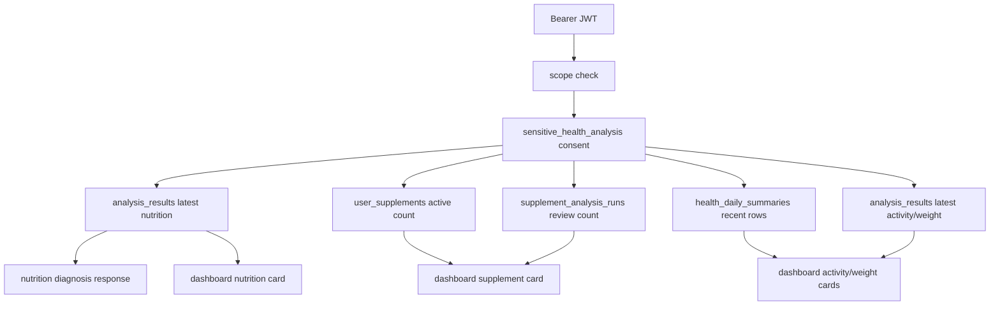

# 23. P1-5 Deficiency and Dashboard API

> 상태: 구현 완료 | 기준일: 2026-05-12 | 범위: 최신 부족 영양소 조회, 대시보드 summary 구현

## 1. 목적

P1-5는 새 OCR/LLM 계산을 추가하는 단계가 아니라, 이미 저장된 owner-scoped 분석 결과와 P1-4 영양제 등록 데이터를 모바일 화면에서 바로 읽을 수 있는 read API로 연결하는 단계다.

## 2. 구현 범위

| API | 상태 | 역할 |
|---|---|---|
| `GET /api/v1/nutrition/diagnosis/latest` | `p1_5_deficiency_dashboard_ready` | 최신 저장 영양 분석 결과를 부족/과다 영양소 화면용 응답으로 변환 |
| `GET /api/v1/dashboard/summary` | `p1_5_deficiency_dashboard_ready` | 영양, 활동, 체중, 영양제 등록 상태를 대시보드 summary로 합성 |

## 3. 데이터 흐름



## 4. 보안 기준

- 모든 P1-5 read API는 `Depends(require_current_user)`를 거치는 scope dependency를 사용한다.
- owner key는 클라이언트 입력이 아니라 검증된 `iss`와 `sub`로 만든 `owner_subject`만 사용한다.
- 응답에는 `owner_subject`, `input_snapshot`, OCR 원문, prompt, raw LLM response를 노출하지 않는다.
- `sensitive_health_analysis` 활성 동의 없이는 403으로 차단하고 audit event를 남긴다.
- audit metadata에는 count, 상태, 조회 범위만 저장하고 snapshot payload는 저장하지 않는다.
- 저장된 nutrition result의 사용자 문구에 금지 표현이 있으면 응답 전에 차단한다.

## 5. 데이터 한계

현재 런타임 KDRIs는 `2020-sample` fixture이고, 2025 KDRIs는 `digitization_pending` 후보 데이터로 관리된다. 따라서 API는 `dataset_status`, `dataset_version`, `source_manifest_version`을 응답에 포함해 모바일과 QA가 샘플 데이터 상태를 명확히 알 수 있게 한다.

식품 추천은 검수된 식품 데이터 연결 전까지 임의 생성하지 않는다. `recommended_foods`는 빈 map으로 반환한다.

## 6. 구현 파일

| 파일 | 변경 |
|---|---|
| `backend/src/models/schemas/nutrition.py` | `NutritionDiagnosisLatestResponse`, `NutritionDiagnosisSummary` 추가 |
| `backend/src/models/schemas/dashboard.py` | dashboard card별 `data_status`, nutrition source metadata, activity health metric fields 추가 |
| `backend/src/services/nutrition_diagnosis.py` | 최신 영양 분석 결과 조회 및 부족/과다 count 변환 |
| `backend/src/services/dashboard.py` | dashboard read-model 합성, health summary 기반 활동·체중 metric 반영 |
| `backend/src/api/v1/nutrition.py` | `GET /nutrition/diagnosis/latest` 구현 |
| `backend/src/api/v1/dashboard.py` | `GET /dashboard/summary` 스텁 제거 및 구현 |
| `backend/tests/integration/api/test_dashboard_nutrition_api.py` | P1-5 route 보안/응답 테스트 |
| `backend/tests/unit/services/test_nutrition_diagnosis.py` | 부족 영양소 변환 테스트 |
| `backend/tests/unit/services/test_dashboard.py` | dashboard helper 테스트 |

## 7. 검증

권장 검증 명령:

```bash
cd yeong-Lemon-Aid/backend
./.venv/bin/python -m pytest -o addopts='' tests/integration/api/test_dashboard_nutrition_api.py tests/integration/api/test_p1_api_contract.py tests/unit/services/test_nutrition_diagnosis.py tests/unit/services/test_dashboard.py
./.venv/bin/python -m pytest
./.venv/bin/python -m ruff check src tests
./.venv/bin/python -m mypy src
```

검증 결과: P1-5 이후 P1-6 health sync 보강까지 포함한 dashboard targeted 테스트가 통과했다. 전체 백엔드 테스트, Ruff, mypy 최종 결과는 `docs/Nutrition-docs/previous-version/24-p1-6-healthkit-health-connect-sync.md`의 P1-6 검증 결과를 기준으로 한다.

## 8. 참고 공식 문서

- FastAPI Dependencies: https://fastapi.tiangolo.com/tutorial/dependencies/
- FastAPI OAuth2 scopes: https://fastapi.tiangolo.com/advanced/security/oauth2-scopes/
- SQLAlchemy asyncio: https://docs.sqlalchemy.org/en/20/orm/extensions/asyncio.html
- Pydantic models: https://docs.pydantic.dev/latest/concepts/models/
- OWASP API Security Top 10 2023: https://owasp.org/API-Security/editions/2023/en/0x11-t10/
- 보건복지부 2025 한국인 영양소 섭취기준 보도자료: https://m.korea.kr/briefing/pressReleaseView.do?newsId=156737581
