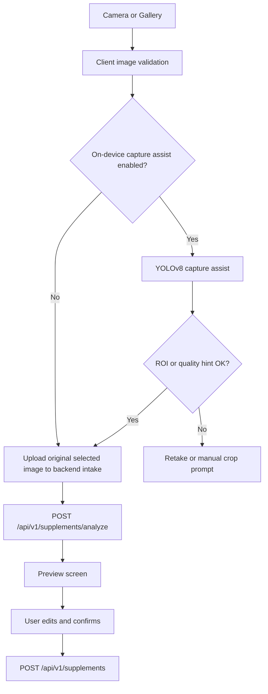

# 25. P1-7 Mobile MVP, Native iOS/iPadOS, and Capture Vision Strategy

> 상태: 상세 설계 및 구현 플랜 | 기준일: 2026-05-12 | 범위: Flutter 모바일 MVP, Xcode 네이티브 iOS/iPadOS 트랙, 촬영/업로드, 기존 P1 API 연결, Google Vision + YOLOv8 촬영 보조 전략

## 1. 목적

P1-7은 백엔드 P1-0~P1-6에서 구현한 API 계약을 실제 사용자 앱 MVP로 연결하는 단계다. 기존 계획은 `mobile/` Flutter 앱을 기본 전제로 두었지만, 이번 수정에서는 **Flutter 크로스플랫폼 트랙**과 **Xcode 네이티브 iOS/iPadOS 트랙**을 함께 설계한다.

두 트랙은 UI 구현 방식만 다르다. 인증, 동의, API payload, 오류 처리, 개인정보 보호, 건강/영양 산출식은 모두 백엔드를 단일 진실로 유지한다. 앱은 촬영, 동의, 인증 토큰 전달, 업로드, 사용자 확인, 대시보드 표시를 담당하고, 산출식과 저장 판단은 서버 API가 담당한다.

P1-7은 OCR/LLM/Google Vision/YOLOv8의 최종 인식 정확도를 확정하는 단계가 아니다. 모바일은 분석 결과가 비어도 수동 입력으로 저장 가능한 경로를 제공해야 한다. YOLOv8은 OCR 대체가 아니라 촬영 보조, ROI guide, 품질 안내 후보로만 둔다.

## 2. 현재 백엔드 연결점

| 기능 | 백엔드 상태 | 모바일 연결 방식 |
|---|---|---|
| 영양제 이미지 intake | `POST /api/v1/supplements/analyze` 구현 | `multipart/form-data` 업로드, `client_request_id` 포함 |
| 영양제 최종 등록 | `POST /api/v1/supplements` 구현 | preview 또는 수동 입력을 사용자가 확인한 뒤 저장 |
| 영양제 목록/상세/삭제 | `GET/DELETE /api/v1/supplements` 구현 | 등록 목록, 상세, 삭제 화면 연결 |
| 대시보드 | `GET /api/v1/dashboard/summary` 구현 | 홈 summary 표시 |
| 부족 영양소 | `GET /api/v1/nutrition/diagnosis/latest` 구현 | 부족/과다 영양소 summary 표시 |
| 헬스 데이터 sync | `POST /api/v1/health/sync` 구현 | HealthKit/Health Connect foreground sync |
| 개인정보/동의 | P0/P1 privacy API 구현 | 최초 동의, 철회, 차단 상태 안내 |

주의: `/api/v1/supplements/analyze`는 현재 P1-2 intake 구현 상태이며, OCR/LLM 후보가 비어 있을 수 있다. 따라서 P1-7 모바일은 "분석 결과가 비어 있으면 수동 입력으로 확인 저장"하는 경로를 반드시 포함한다.

## 3. 공식 문서 기반 전제

1. **Flutter `image_picker`는 갤러리 선택과 새 사진 촬영을 지원한다.**
   iOS는 `NSPhotoLibraryUsageDescription`, `NSCameraUsageDescription` 등 Info.plist 설명이 필요하고, Android에서는 low memory 상황에서 Activity가 종료될 수 있어 `retrieveLostData()` 처리가 권장된다.
   출처: https://pub.dev/packages/image_picker

2. **Flutter `camera`는 preview, capture, image stream을 지원한다.**
   image stream을 사용할 수 있으므로 YOLOv8 촬영 보조를 붙일 때 `image_picker`보다 적합하다. iOS는 카메라/마이크 사용 설명이 필요하고, Android 기본 구현은 CameraX 기반 endorsed implementation을 사용한다.
   출처: https://pub.dev/packages/camera

3. **Xcode는 Apple 플랫폼 앱의 생성, 빌드, 테스트, 제출까지 담당하는 IDE다.**
   네이티브 iOS/iPadOS 트랙은 Xcode project 또는 workspace를 기준으로 관리한다.
   출처: https://developer.apple.com/documentation/xcode/

4. **SwiftUI는 Apple 플랫폼 UI와 app structure를 선언형으로 작성하는 프레임워크다.**
   iPhone/iPad 공통 화면, adaptive layout, 상태 기반 화면 전환의 기본 UI 레이어로 사용한다. UIKit은 SwiftUI에서 부족한 platform-specific 기능이 필요할 때 보조적으로 사용한다.
   출처: https://developer.apple.com/documentation/swiftui
   보조 출처: https://developer.apple.com/documentation/uikit/about_app_development_with_uikit

5. **AVFoundation capture subsystem은 iOS/iPadOS 카메라 세션, 입력, 출력, preview를 구성한다.**
   Xcode 네이티브 트랙에서 실시간 카메라 preview와 frame 기반 YOLO/Core ML 촬영 보조를 붙일 때 사용한다.
   출처: https://developer.apple.com/documentation/AVFoundation/capture-setup

6. **PhotosUI는 사용자가 선택한 사진만 앱에 제공하는 시스템 picker를 제공한다.**
   네이티브 iOS/iPadOS 트랙의 갤러리 선택은 `PhotosPicker` 또는 PHPicker 기반으로 시작한다.
   출처: https://developer.apple.com/documentation/photosui

7. **URLSession은 Apple 플랫폼의 기본 HTTP networking API다.**
   네이티브 iOS/iPadOS API client는 `URLSession` 기반으로 구현하고, bearer token redaction과 공통 error mapping을 별도 계층으로 둔다.
   출처: https://developer.apple.com/documentation/foundation/urlsession

8. **Keychain Services는 작은 민감 값을 안전하게 저장하는 Apple 보안 API다.**
   OAuth/OIDC access token, refresh token, development bearer token은 UserDefaults에 저장하지 않고 Keychain wrapper 뒤에 둔다.
   출처: https://developer.apple.com/documentation/security/keychain-services

9. **HealthKit은 Xcode capability, availability 확인, 사용자 권한 요청이 필요하다.**
   HealthKit은 기기와 OS 버전에 따라 사용할 수 없을 수 있으므로 `HKHealthStore.isHealthDataAvailable()` 확인을 전제로 한다. iPadOS 지원은 HealthKit availability에 따라 화면을 degrade한다.
   출처: https://developer.apple.com/documentation/healthkit/setting_up_healthkit
   보조 출처: https://developer.apple.com/documentation/Xcode/configuring-healthkit-access

10. **Vision과 Core ML은 Apple 온디바이스 이미지 분석 및 모델 추론 경로다.**
    Xcode 네이티브 트랙에서 YOLO 계열 모델을 Apple 기기에 넣는다면 Core ML export 모델과 Vision/Core ML pipeline을 후보로 둔다.
    출처: https://developer.apple.com/documentation/vision/
    출처: https://developer.apple.com/documentation/coreml

11. **Google Cloud Vision OCR은 `TEXT_DETECTION`과 `DOCUMENT_TEXT_DETECTION`을 제공한다.**
    영양제 라벨처럼 텍스트 추출이 핵심인 입력은 object detection이 아니라 OCR feature가 중심이다. Google Vision OCR은 cloud 전송이 필요하므로 privacy 설계에서 별도 동의, 감사, 보관 정책을 요구한다.
    출처: https://docs.cloud.google.com/vision/docs/ocr

12. **Ultralytics YOLOv8은 detection/segmentation/classification 등 여러 task와 inference/validation/training/export를 지원한다.**
    Ultralytics 문서는 YOLOv8 formal research paper가 없다고 명시하므로 P1-7에서는 논문 근거가 아니라 공식 소프트웨어/모델 문서 기반 후보로 취급한다.
    출처: https://docs.ultralytics.com/models/yolov8/

13. **Ultralytics export mode는 CoreML, TFLite 등 모바일 배포 포맷을 지원한다.**
    Android/Flutter는 TFLite 후보, iOS/iPadOS 네이티브는 CoreML 후보를 우선 검토한다.
    출처: https://docs.ultralytics.com/modes/export/

14. **Apple Human Interface Guidelines는 플랫폼 관습과 adaptive 경험을 강조한다.**
    Xcode 네이티브 iPadOS 트랙은 단순 확대 iPhone UI가 아니라 Split View, 큰 화면 정보 밀도, pointer/keyboard affordance를 고려한다.
    출처: https://developer.apple.com/design/human-interface-guidelines

15. **FastAPI는 같은 form field로 여러 파일을 받는 `list[UploadFile]` 패턴을 지원한다.**
    다중 이미지 업로드 API를 만들 때 `multipart/form-data`의 `files` field를 반복 전송하고, 서버는 파일별 검증 결과를 item 단위로 반환할 수 있다.
    출처: https://fastapi.tiangolo.com/tutorial/request-files/

16. **PhotosUI `PhotosPicker`는 여러 `PhotosPickerItem` 선택과 `maxSelectionCount` 설정을 지원한다.**
    Xcode 네이티브 트랙에서 다중 이미지 선택을 구현할 때 시스템 picker의 다중 선택 기능을 사용한다.
    출처: https://developer.apple.com/documentation/photosui/photospicker/photospicker%28ispresented%3Aselection%3Amaxselectioncount%3Aselectionbehavior%3Amatching%3Apreferreditemencoding%3A%29

17. **AVFoundation은 capture device frame duration을 통해 frame rate를 제한할 수 있다.**
    `activeVideoMinFrameDuration`은 최대 frame rate 제한과 연결되며, 설정 전 `lockForConfiguration()`이 필요하다. `AVCaptureVideoDataOutput`은 처리용 video frame 접근과 late frame discard 설정을 제공한다.
    출처: https://developer.apple.com/documentation/avfoundation/avcapturedevice/activevideominframeduration
    출처: https://developer.apple.com/documentation/avfoundation/avcapturevideodataoutput

18. **Google Cloud Vision은 batch image annotation을 제공한다.**
    `images:annotate`는 batch image annotation request를 받고, 비동기 batch는 Cloud Storage 기반 대량 처리에 적합하다. 단, 모바일 앱이 직접 Vision을 호출하지 않고 서버 adapter 뒤에서 동의·감사·보관 정책을 처리해야 한다.
    출처: https://cloud.google.com/vision/docs/reference/rest/v1/images/annotate
    출처: https://cloud.google.com/vision/docs/batch

## 4. Flutter와 Xcode 트랙 브레인스토밍

### 4.1 결론

권장 전략은 **Flutter 우선 MVP + Xcode 네이티브 iOS/iPadOS 선택 트랙**이다.

- 빠른 iOS/Android 동시 MVP와 발표용 flow 검증은 Flutter가 유리하다.
- Apple 생태계 중심 데모, iPadOS 큰 화면 UX, HealthKit, AVFoundation live camera, Core ML/Vision 온디바이스 추론을 깊게 다룰 때는 Xcode 네이티브 트랙이 유리하다.
- 두 앱을 동시에 production 수준으로 유지하면 비용이 커진다. 따라서 P1-7에서는 하나를 주 구현 트랙으로 선택하고, 다른 트랙은 동일 API 계약을 따르는 skeleton 또는 spike로 제한한다.

### 4.2 트랙 비교

| 항목 | Flutter 트랙 | Xcode 네이티브 iOS/iPadOS 트랙 |
|---|---|---|
| 경로 | `mobile/` | `ios-native/` |
| 대상 | iOS + Android 공통 MVP | iOS + iPadOS first-class 앱 |
| UI | Material 3, Riverpod, go_router | SwiftUI, adaptive iPhone/iPad layout |
| Networking | Dio | URLSession |
| 토큰 저장 | flutter_secure_storage | Keychain Services |
| 사진 선택 | image_picker | PhotosUI |
| live camera | camera plugin | AVFoundation |
| Health | Flutter health adapter + HealthKit/Health Connect | HealthKit 직접 연동 |
| YOLO 후보 | TFLite 또는 platform channel | Core ML + Vision 우선 |
| 장점 | 구현 속도, Android 포함, 단일 codebase | Apple 권한/카메라/HealthKit/iPad UX 제어력 |
| 위험 | 네이티브 권한 edge case는 plugin 의존 | Android 별도 구현 필요, 팀 Swift/Xcode 숙련도 필요 |
| P1-7 권장 | 기본 구현 트랙 | Apple-first demo가 필요하면 병행 skeleton |

### 4.3 트랙 선택 원칙

1. **MVP 일정 우선이면 Flutter를 주 트랙으로 둔다.**
   - 기존 가이드의 모바일 스택과 가장 잘 맞는다.
   - Android Health Connect까지 같은 앱에서 다룰 수 있다.

2. **iOS/iPadOS 품질이 핵심이면 Xcode 트랙을 주 트랙으로 둔다.**
   - HealthKit, AVFoundation, PhotosUI, Keychain, Core ML/Vision을 직접 제어한다.
   - iPadOS 화면을 단순 mobile scale-up이 아니라 adaptive dashboard로 설계할 수 있다.

3. **두 트랙은 business logic을 복제하지 않는다.**
   - API DTO, error code, consent gate, privacy copy, algorithm version 표시는 공통 문서와 OpenAPI에서 생성 또는 수동 동기화한다.
   - Flutter와 Swift 모델명이 달라도 서버 field 이름과 상태 전이는 동일해야 한다.

## 5. Google Vision과 YOLOv8 브레인스토밍

### 5.1 결론

P1-7의 권장 방향은 **Google Vision은 서버 OCR 후보**, **YOLOv8은 모바일 촬영 보조/ROI 후보**로 분리하는 것이다. YOLOv8은 글자를 읽는 OCR이 아니므로 영양제 라벨 텍스트 추출을 대체하지 않는다. 대신 촬영 화면에서 "라벨/영양성분표가 화면에 들어왔는지", "음식 접시/포장 객체가 보이는지", "너무 멀거나 잘렸는지"를 감지하는 보조 기능에 적합하다.

### 5.2 비교

| 항목 | Google Vision OCR/Object Localization | YOLOv8 on-device |
|---|---|---|
| 주요 역할 | OCR, 서버 이미지 인식, object localization | 실시간 객체 탐지, ROI/촬영 품질 보조 |
| 영양제 라벨 텍스트 | 적합. `TEXT_DETECTION`/`DOCUMENT_TEXT_DETECTION` 사용 | 부적합. 별도 OCR 모델이 아님 |
| 음식 사진 후보 | object localization 가능하나 범용 label 한계 | 맞춤 학습 시 food/supplement class 후보 가능 |
| 네트워크 | 필요 | 불필요 |
| 개인정보 | 이미지가 클라우드로 전송됨 | 이미지가 기기 내에서 처리됨 |
| 정확도 통제 | Google 모델에 의존 | 프로젝트 데이터셋/학습 품질에 의존 |
| 비용 | 호출 비용/쿼터 관리 필요 | 앱 크기/배터리/성능 관리 필요 |
| MVP 난이도 | 백엔드 OCR adapter 연결 필요 | 모델 학습/변환/기기별 최적화 필요 |
| P1-7 권장 범위 | 직접 구현하지 않고 backend future adapter 계약만 고려 | interface + feature flag + mock/noop부터 설계 |

### 5.3 하이브리드 촬영 전략



P1-7은 API 계약을 바꾸지 않는다. YOLOv8 결과는 모바일에서 촬영 안내에만 사용하고, 백엔드로 별도 hint를 보내지 않는다. 백엔드가 향후 `capture_hints`를 받을 필요가 생기면 P1-8 이후 OpenAPI 계약 변경으로 분리한다.

### 5.4 YOLOv8 class 후보

P1-7에서는 실제 학습 데이터가 없으므로 아래 class는 설계 후보로만 둔다. 임의 성능 수치는 만들지 않는다.

| 후보 class | 용도 | P1-7 처리 |
|---|---|---|
| `supplement_bottle` | 영양제 병/포장 감지 | 촬영 안내 |
| `supplement_label` | 라벨 영역 감지 | crop guide |
| `nutrition_facts_panel` | 영양성분표 영역 감지 | crop guide |
| `meal_plate` | 식단 사진 여부 감지 | P2 식단 입력 준비 |
| `food_item` | 음식 항목 후보 | P2+ 데이터셋 확보 후 |
| `barcode` | 제품 식별 보조 | P2+ barcode scanner 검토 |

### 5.5 YOLOv8 사용 조건

- P1-7 기본값은 `ENABLE_ON_DEVICE_YOLO=false`.
- YOLOv8 모델 asset이 없으면 앱은 noop capture assist로 동작한다.
- Flutter 트랙은 TFLite 후보를 우선 검토하고, iOS 최적화가 필요하면 platform channel 또는 CoreML delegate 후보를 검토한다.
- Xcode 네이티브 트랙은 Core ML export 모델과 Vision/Core ML pipeline을 우선 검토한다.
- Ultralytics AGPL-3.0/Enterprise licensing을 확인하기 전에는 상용 배포용 binary에 YOLO 모델과 코드를 묶지 않는다.
- 성능 목표는 구현 후 실제 기기에서 측정한다. P1-7 계획 문서에는 fake FPS, fake accuracy를 쓰지 않는다.

### 5.6 카메라 비전 FPS/정확도 사전 설정 브레인스토밍

아래 수치는 모델 성능 claim이 아니라 **초기 engineering gate**다. 공식 문서에서 이 앱에 대한 권장 FPS/정확도 값을 찾을 수는 없으므로, 실제 target device, 실제 라벨 데이터셋, 실제 모델 asset으로 측정한 뒤 조정한다.

#### 5.6.1 FPS 원칙

영양제 라벨 촬영 보조는 게임이나 AR처럼 30 FPS 추론이 필요하지 않다. preview는 부드러워야 하지만, YOLO/Core ML/TFLite 추론은 사용자가 라벨 위치를 맞추는 데 충분한 주기로만 돌리면 된다. 따라서 preview FPS와 inference FPS를 분리한다.

| 항목 | 초기값 | 근거/운영 방식 |
|---|---:|---|
| Camera preview target | 30 FPS | 사용자 조준 경험용. 기기/플러그인 기본값이 다르면 시스템 default를 우선한다 |
| Capture assist default inference | 5 FPS | 라벨/영양성분표 guide에는 충분한 반응성. 1 frame당 200 ms budget |
| Low power inference | 2 FPS | 배터리/발열/저사양 기기 fallback |
| High responsiveness experiment | 10 FPS | 실제 기기에서 p95 latency와 발열이 통과할 때만 feature flag로 실험 |
| Still image batch inference | 실시간 FPS 대상 아님 | 업로드 전 thumbnail/metadata 검증만 하고, 분석은 서버 batch/queue 기준 |
| Dynamic downshift | 5 -> 2 -> off | p95 inference latency가 150 ms를 넘거나 dropped-frame warning이 지속되면 자동 하향 |

Xcode 트랙은 AVFoundation에서 지원하는 frame duration 범위 안에서만 FPS를 제한한다. Flutter 트랙은 plugin이 제공하는 image stream 위에서 inference 호출을 throttle한다. 두 트랙 모두 late frame을 쌓지 않고 최신 frame만 처리하는 정책을 둔다.

#### 5.6.2 정확도/품질 gate

Object detection에서는 일반적인 "accuracy"보다 mAP, precision, recall, IoU 기준을 사용한다. 다만 P1-7의 YOLO는 최종 진단이나 영양 분석을 결정하지 않고 촬영 안내만 하므로 **recall 우선**으로 잡는다. 라벨이 있는데 guide를 못 띄우는 false negative가 사용자 경험에 더 치명적이고, false positive는 "수동 입력/그대로 업로드" fallback으로 완화 가능하기 때문이다.

| 단계 | 사용 조건 | 초기 gate |
|---|---|---|
| Dev smoke | mock/noop이 아닌 실제 모델을 앱에 연결해도 되는 최소 조건 | target device에서 5 FPS throttle 시 p95 inference latency <= 150 ms, 앱 preview jank 없음 |
| Dataset gate | 프로젝트 test set으로 측정 | `mAP@50 >= 0.70`, `recall@IoU0.5 >= 0.80`, `precision@IoU0.5 >= 0.60` |
| Default-on 후보 | 일반 사용자에게 feature flag를 켤 수 있는 후보 | `mAP@50 >= 0.85`, `mAP@50:95 >= 0.55`, `recall@IoU0.5 >= 0.90`, `precision@IoU0.5 >= 0.80` |
| UX gate | 촬영 guide 품질 | 라벨이 잘린 사진, 흔들린 사진, 너무 먼 사진에서 retake/crop warning이 수동 검수 기준으로 유효 |
| Safety gate | 의료/개인정보 안전 | YOLO 결과만으로 복용량, 질환, 영양소 부족 판단을 하지 않음 |

초기 confidence threshold는 `0.45`, NMS IoU threshold는 `0.50`을 후보로 둔다. 이 값은 모델 default가 아니라 **프로젝트 후보 설정**이며, validation set에서 precision/recall tradeoff를 보고 조정한다. 실제 데이터가 쌓이기 전까지 앱 화면에는 "정확도" 수치를 노출하지 않는다.

#### 5.6.3 사전 설정값

| 설정 | 기본값 | 설명 |
|---|---:|---|
| `CAPTURE_ASSIST_ENABLED` | `false` | 모델 asset이 준비되기 전 기본 off |
| `CAPTURE_ASSIST_TARGET_FPS` | `5` | balanced inference throttle |
| `CAPTURE_ASSIST_LOW_POWER_FPS` | `2` | 저전력/발열 fallback |
| `CAPTURE_ASSIST_EXPERIMENTAL_MAX_FPS` | `10` | 실험용 상한 |
| `CAPTURE_ASSIST_MODEL_INPUT_SIZE` | `640` | YOLO 계열 후보 입력 크기 |
| `CAPTURE_ASSIST_CONF_THRESHOLD` | `0.45` | UI guide 후보 threshold |
| `CAPTURE_ASSIST_NMS_IOU_THRESHOLD` | `0.50` | 중복 box 제거 후보 threshold |
| `CAPTURE_ASSIST_P95_LATENCY_MS` | `150` | default-on 후보 성능 gate |

### 5.7 다중 이미지 업로드/분석 브레인스토밍

단일 사진만 받으면 영양제 병 앞면, 성분표, 섭취 방법, 주의 문구, 바코드가 서로 다른 면에 있는 제품을 처리하기 어렵다. 따라서 사용자 경험은 다중 이미지 선택/촬영을 허용하되, 서버 저장은 원본 이미지 보관 없이 hash와 metadata 중심으로 유지한다.

#### 5.7.1 권장 방향

1. **P1-7 client MVP**
   - Flutter: `image_picker.pickMultiImage()`로 여러 이미지를 선택한다.
   - Xcode: `PhotosPicker`의 다중 selection을 사용한다.
   - 카메라 촬영은 "추가 촬영" 버튼으로 여러 장을 queue에 넣는다.
   - 서버 batch endpoint가 없으면 current single endpoint에 순차 업로드하고 UI에서 하나의 작업으로 묶는다.

2. **P1-7b/P1-8 backend batch**
   - 새 endpoint 후보: `POST /api/v1/supplements/analyze-batch`.
   - multipart field: `files: list[UploadFile]`.
   - form field: `client_batch_id`, `metadata_json`.
   - response는 batch 단위 summary와 image item별 validation/preview 상태를 반환한다.

3. **서버 분석 원칙**
   - 파일별 MIME/magic bytes/size/pixel 검증을 독립 수행한다.
   - 원본 이미지 bytes, 원본 파일명, EXIF는 저장하지 않는다.
   - item별 `image_sha256`, role, size, dimensions, validation status만 snapshot에 남긴다.
   - OCR/LLM/Google Vision은 서버 adapter 뒤에서만 수행한다.

#### 5.7.2 이미지 역할 후보

| `image_role` | 예시 | 처리 방향 |
|---|---|---|
| `front_label` | 제품명/브랜드 앞면 | 제품명 후보 추출 우선 |
| `supplement_facts` | 영양성분표 | 성분명/함량/단위 추출 우선 |
| `ingredients` | 원재료/기능성 원료 | 성분 후보 보강 |
| `directions` | 섭취 방법 | 사용자가 확인할 복용 빈도 후보 |
| `warning` | 주의사항 | 안전 문구 후보. 직접 복용량 변경 안내 금지 |
| `barcode` | 바코드/QR | P2+ 제품 식별 후보 |
| `other` | 사용자가 역할 미지정 | 낮은 우선순위 OCR 후보 |

#### 5.7.3 제한값 후보

| 설정 | 초기값 | 설명 |
|---|---:|---|
| `SUPPLEMENT_IMAGE_BATCH_MAX_FILES` | `6` | 앞면, 성분표, 원재료, 섭취 방법, 주의사항, 바코드까지 커버 |
| `SUPPLEMENT_IMAGE_BATCH_MAX_BYTES` | `20 MiB` | 모바일 네트워크와 서버 메모리 보호용 batch 총량 |
| `SUPPLEMENT_IMAGE_MAX_BYTES` | `5 MiB` | 기존 단일 파일 제한 유지 |
| `SUPPLEMENT_IMAGE_MAX_PIXELS` | `12,000,000` | 기존 decoded pixel 제한 유지 |
| `SUPPLEMENT_IMAGE_BATCH_PARTIAL_SUCCESS` | `true` | 유효한 이미지는 preview에 포함하고, 실패 item은 item error로 표시 |
| `SUPPLEMENT_IMAGE_BATCH_TTL_MINUTES` | `30` | 사용자 확인 전 preview TTL |

#### 5.7.4 batch 응답 후보

```json
{
  "analysis_batch_id": "uuid",
  "client_batch_id": "mobile-generated-id",
  "status": "requires_confirmation",
  "items": [
    {
      "client_image_id": "front-1",
      "image_role": "front_label",
      "status": "accepted",
      "warnings": []
    },
    {
      "client_image_id": "facts-1",
      "image_role": "supplement_facts",
      "status": "invalid_image",
      "warnings": ["unsupported_media_type"]
    }
  ],
  "preview": {
    "product_name_candidates": [],
    "ingredient_candidates": [],
    "requires_user_confirmation": true
  }
}
```

HTTP status는 전체 요청이 인증/동의/크기 제한에서 막히면 4xx를 반환한다. 일부 파일만 실패하면 200과 item별 status를 반환하는 방식을 우선 후보로 둔다. 이렇게 해야 사용자가 유효한 사진을 다시 올리지 않고 실패한 사진만 교체할 수 있다.

## 6. P1-7 모바일 MVP 범위

### 6.1 포함

1. Flutter 앱 골격
   - `mobile/pubspec.yaml`, `analysis_options.yaml`, `.env.example`, `README.md`.
   - Material 3 theme, go_router, Riverpod, Dio, secure storage.

2. Xcode 네이티브 iOS/iPadOS 골격
   - `ios-native/` Xcode project 또는 workspace.
   - SwiftUI app entry, iPhone/iPad adaptive root navigation.
   - URLSession API client, Keychain token store, shared DTO mapping.
   - PhotosUI gallery picker와 AVFoundation camera service 추상화.

3. API 클라이언트
   - Bearer token interceptor 또는 request decorator.
   - 공통 error mapping: 401, 403 consent required, 409 conflict, 422 validation.
   - development mode token provider와 production external IdP adapter interface 분리.

4. 동의/권한 화면
   - `ocr_image_processing`.
   - `sensitive_health_analysis`.
   - `health_device_data`.
   - 카메라/사진 권한.
   - HealthKit/Health Connect 권한.

5. 영양제 MVP
   - 카메라/갤러리 선택.
   - 여러 이미지 선택/추가 촬영 queue.
   - 이미지별 role 지정: 앞면, 성분표, 원재료, 섭취 방법, 주의사항, 바코드, 기타.
   - `client_request_id` 생성.
   - 단일 이미지: `/api/v1/supplements/analyze` 업로드.
   - 다중 이미지: P1-7에서는 순차 업로드 fallback, P1-7b/P1-8에서는 `/api/v1/supplements/analyze-batch` 후보.
   - preview가 비어 있으면 수동 입력 화면으로 degrade.
   - 사용자 확인 후 `/api/v1/supplements` 등록.
   - 목록/상세/삭제.

6. 대시보드 MVP
   - `/api/v1/dashboard/summary`.
   - `/api/v1/nutrition/diagnosis/latest`.
   - not_ready/ready 상태별 UI.
   - 안전 문구와 면책 고지.

7. 헬스 sync MVP
   - Flutter: HealthKit/Health Connect foreground sync adapter.
   - Xcode: HealthKit read-only foreground sync adapter.
   - 최근 30일 기본 sync.
   - 권한 거부 시 수동 입력 fallback.
   - iPadOS에서 HealthKit unavailable이면 sync 화면을 "지원되지 않음" 상태로 degrade.

8. 촬영 보조 추상화
   - Flutter: `CaptureAssistService`.
   - Xcode: `CaptureAssisting` protocol.
   - 기본 구현은 noop 또는 mock result.
   - default FPS preset: preview 30 FPS, inference 5 FPS throttle.
   - low power preset: inference 2 FPS.
   - 실제 모델 accuracy는 mAP/precision/recall gate로 측정.
   - YOLO/Core ML/TFLite 실제 inference는 P1-7b 또는 P2로 분리.

### 6.2 제외

- Google Vision OCR adapter 직접 구현.
- YOLOv8 모델 학습, 데이터 라벨링, 성능 claim.
- YOLOv8 accuracy/FPS를 실제 측정 없이 화면에 노출.
- 의료 문서 OCR intake.
- 처방전/검사표 기반 복용량 변경 안내.
- background HealthKit/Health Connect sync.
- 앱스토어/플레이스토어 배포.
- 외부 IdP SDK 최종 선택과 social login 운영화.
- Flutter와 Xcode 앱을 서로 다른 business rule로 분기하는 구조.

## 7. 모바일 구조

### 7.1 Flutter 트랙

```text
mobile/
├── pubspec.yaml
├── analysis_options.yaml
├── .env.example
├── README.md
├── assets/
│   └── models/                    # optional, P1-7 기본 비움
├── lib/
│   ├── main.dart
│   ├── app.dart
│   ├── core/
│   │   ├── config/
│   │   ├── network/
│   │   ├── auth/
│   │   ├── storage/
│   │   ├── routing/
│   │   └── theme/
│   ├── features/
│   │   ├── onboarding/
│   │   ├── consent/
│   │   ├── capture/
│   │   ├── supplement/
│   │   ├── dashboard/
│   │   ├── nutrition/
│   │   ├── health/
│   │   └── settings/
│   └── shared/
│       ├── models/
│       ├── widgets/
│       └── utils/
└── test/
    ├── unit/
    ├── widget/
    └── integration_test/
```

### 7.2 Xcode 네이티브 iOS/iPadOS 트랙

```text
ios-native/
├── LemonHealth.xcodeproj
├── LemonHealth/
│   ├── App/
│   │   ├── LemonHealthApp.swift
│   │   ├── AppEnvironment.swift
│   │   └── RootNavigationView.swift
│   ├── Core/
│   │   ├── Config/
│   │   ├── Networking/
│   │   ├── Auth/
│   │   ├── Keychain/
│   │   ├── Routing/
│   │   └── Privacy/
│   ├── Features/
│   │   ├── Onboarding/
│   │   ├── Consent/
│   │   ├── Capture/
│   │   ├── Supplement/
│   │   ├── Dashboard/
│   │   ├── Nutrition/
│   │   ├── Health/
│   │   └── Settings/
│   ├── Shared/
│   │   ├── Models/
│   │   ├── Components/
│   │   └── Utilities/
│   └── Resources/
│       └── Models/                # optional Core ML model slot, P1-7 기본 비움
├── LemonHealthTests/
└── LemonHealthUITests/
```

`mobile/ios/`는 Flutter가 생성하는 iOS runner 영역이므로, 순수 Xcode 앱은 `ios-native/`에 분리한다. 이렇게 해야 Flutter generated files와 네이티브 앱 source ownership이 섞이지 않는다.

## 8. 핵심 모듈 설계

### 8.1 Flutter capture assist

```dart
abstract interface class CaptureAssistService {
  Future<CaptureAssistResult> analyze({
    required XFile image,
    required CaptureUseCase useCase,
  });
}

enum CaptureUseCase {
  supplementLabel,
  mealPhoto,
}

class CaptureAssistResult {
  final bool available;
  final List<CaptureBox> boxes;
  final List<String> warnings;
  final String provider;
}

class CaptureImageDraft {
  final String clientImageId;
  final XFile image;
  final String imageRole;
  final int sortOrder;
}
```

| 구현체 | 역할 |
|---|---|
| `NoopCaptureAssistService` | 기본값. 모델 없이 항상 사용 가능 |
| `MockCaptureAssistService` | widget/integration test용 deterministic 결과 |
| `YoloCaptureAssistService` | P1-7b 이후 TFLite/CoreML 모델 asset이 있을 때 활성화 |

### 8.2 Swift capture assist

```swift
protocol CaptureAssisting {
    func analyze(
        imageData: Data,
        useCase: CaptureUseCase
    ) async throws -> CaptureAssistResult
}

enum CaptureUseCase: String, Codable {
    case supplementLabel
    case mealPhoto
}

struct CaptureAssistResult: Codable, Equatable {
    let available: Bool
    let boxes: [CaptureBox]
    let warnings: [String]
    let provider: String
}

struct CaptureImageDraft: Identifiable, Equatable {
    let id: String
    let imageData: Data
    let imageRole: String
    let sortOrder: Int
}
```

| 구현체 | 역할 |
|---|---|
| `NoopCaptureAssistService` | 기본값. 모델 없이 항상 사용 가능 |
| `MockCaptureAssistService` | XCTest/UI test용 deterministic 결과 |
| `CoreMLYoloCaptureAssistService` | P1-7b 이후 Core ML model asset이 있을 때 활성화 |

### 8.3 API client 공통 계약

| 책임 | Flutter | Xcode iOS/iPadOS |
|---|---|---|
| HTTP client | Dio | URLSession |
| token injection | interceptor | request decorator |
| token storage | flutter_secure_storage | Keychain wrapper |
| DTO | Dart model | Swift Codable model |
| error mapping | `ApiError` | `APIError` |
| 403 consent | consent route | consent sheet/screen |
| 409 conflict | retry/new request id 안내 | retry/new request id 안내 |
| 422 validation | field error UI | field error UI |
| 다중 이미지 | `files[]` 또는 순차 upload queue | `PhotosPickerItem[]` 또는 AVFoundation capture queue |

## 9. 화면 설계

| 화면 | 목적 | Flutter | Xcode iOS/iPadOS |
|---|---|---|---|
| Splash | env/auth/consent preload | `SplashScreen` | `SplashView` |
| 개발 인증 | 개발용 bearer token 입력/저장 | `DevAuthScreen` | `DevAuthView` |
| 동의 | 필수/선택 동의 | `ConsentScreen` | `ConsentView` |
| 홈 대시보드 | dashboard summary | `HomeDashboardScreen` | `DashboardView` |
| 영양제 촬영 | 카메라/갤러리, capture assist slot | `SupplementCaptureScreen` | `SupplementCaptureView` |
| preview | 분석 후보 확인, 수동 입력 | `SupplementPreviewScreen` | `SupplementPreviewView` |
| 영양제 편집 | 사용자 확인 payload 작성 | `SupplementEditScreen` | `SupplementEditView` |
| 목록 | 등록 목록 | `SupplementListScreen` | `SupplementListView` |
| 상세 | 상세/삭제 | `SupplementDetailScreen` | `SupplementDetailView` |
| 헬스 sync | HealthKit/Health Connect sync | `HealthSyncScreen` | `HealthSyncView` |
| 부족 영양소 | nutrition latest | `NutritionLatestScreen` | `NutritionLatestView` |
| 설정/개인정보 | 동의 철회, 데이터 삭제 진입 | `SettingsPrivacyScreen` | `SettingsPrivacyView` |

iPadOS에서는 `DashboardView`, `SupplementListView`, `SupplementDetailView`를 한 화면에서 나눠 볼 수 있는 adaptive navigation을 후속 구현 대상으로 둔다. 단, P1-7 skeleton 단계에서는 iPhone layout이 iPad에서도 깨지지 않는 수준을 최소 완료 기준으로 한다.

## 10. 보안/개인정보 설계

| 위험 | 대응 |
|---|---|
| 카메라 이미지에 위치/EXIF 포함 | 업로드 전 메타데이터 제거 또는 재인코딩 검토. P1-7에서는 원본 파일명을 서버에 보내지 않음 |
| 이미지 로컬 잔존 | 성공 업로드 후 cache 파일 삭제. 실패 시 pending upload TTL 적용 |
| OAuth token 노출 | Flutter는 secure storage, Xcode는 Keychain 사용. log/interceptor에서 Authorization header redaction |
| UserDefaults 오용 | Xcode 트랙에서 token, refresh token, health payload snapshot을 UserDefaults에 저장하지 않음 |
| Google Vision cloud 전송 | P1-7 모바일은 직접 Google Vision 호출 금지. 서버 adapter에서 동의/감사/보관정책 처리 |
| YOLOv8 모델 license | AGPL/Enterprise 확인 전 상용 binary 포함 금지 |
| 허위 정확도 claim | 실제 테스트셋 평가 전 accuracy/FPS 수치 미기재 |
| 의료적 오해 | 모든 화면에 "건강관리 참고 정보" 면책 고지. 복용량 변경 직접 안내 금지 |
| HealthKit/Health Connect 민감성 | foreground sync, 일별 aggregate만 전송, 권한 거부와 데이터 없음 구분 |
| iPadOS HealthKit availability | HealthKit 미지원 또는 제한 상태를 오류가 아니라 unsupported state로 표시 |
| 두 앱 간 정책 drift | API DTO, consent purpose, disclaimer copy를 문서/OpenAPI 기준으로 동기화 |

## 11. 구현 플랜

### Phase 0. 트랙 결정과 공통 계약 고정

1. 이번 스프린트의 주 구현 트랙을 선택한다.
   - 권장 기본값: Flutter 주 구현.
   - Apple-first 데모가 필요하면 Xcode skeleton을 병행한다.
2. OpenAPI에서 P1-7에 필요한 DTO와 error code를 목록화한다.
3. Flutter Dart model과 Swift Codable model의 field 이름을 같은 서버 계약에 맞춘다.
4. consent purpose, disclaimer copy, token storage policy를 공통 문서로 고정한다.

완료 기준:

- `mobile/`과 `ios-native/`의 책임 경계가 정리된다.
- 두 트랙이 같은 endpoint, field, error code를 사용한다.
- 구현 전에 중복 business rule을 만들지 않는다는 원칙이 문서화된다.

### Phase 1A. Flutter project skeleton

1. `mobile/pubspec.yaml` 작성.
2. `mobile/analysis_options.yaml` 작성.
3. `mobile/.env.example` 작성.
4. `lib/main.dart`, `lib/app.dart`, theme, router skeleton 작성.
5. `README.md`에 실행 명령과 env 설명 추가.

완료 기준:

- `flutter pub get` 성공.
- `flutter analyze` 성공.
- 기본 앱이 iOS/Android simulator에서 열린다.

### Phase 1B. Xcode iOS/iPadOS project skeleton

1. `ios-native/` Xcode project 생성.
2. SwiftUI app entry와 root navigation 작성.
3. iPhone/iPad simulator target을 확인한다.
4. `.xcconfig` 또는 local config placeholder로 API base URL을 분리한다.
5. `README.md`에 Xcode build/test 명령과 required capability를 정리한다.

완료 기준:

- Xcode에서 iPhone simulator build 성공.
- Xcode에서 iPad simulator build 성공.
- 앱 시작 시 빈 dashboard 또는 auth gate가 표시된다.

### Phase 2. Core network/auth foundation

1. Flutter Dio client와 auth interceptor 구현.
2. Swift URLSession API client와 request decorator 구현.
3. Flutter secure storage token store 구현.
4. Swift Keychain token store 구현.
5. 개발용 token entry screen/view 구현.
6. API error model 구현.
7. 공통 loading/error/disclaimer component 구현.

완료 기준:

- `/health` 호출 가능.
- bearer token이 보호 API에 주입된다.
- 401/403/409/422 테스트 fixture가 UI state로 변환된다.
- Authorization header가 로그에 남지 않는다.

### Phase 3. Consent foundation

1. consent list/grant/revoke API client.
2. Flutter `ConsentScreen` 구현.
3. SwiftUI `ConsentView` 구현.
4. `ocr_image_processing`, `sensitive_health_analysis`, `health_device_data` 설명 분리.
5. 권한 차단 시 consent prompt로 이동.

완료 기준:

- 동의 없을 때 API 403을 일반 오류가 아니라 동의 화면으로 연결한다.
- 철회 후 관련 화면이 저장/조회 시도를 막는다.
- Flutter와 Swift copy가 같은 의미를 유지한다.

### Phase 4. Supplement capture and registration

1. Flutter `image_picker` 기반 gallery/camera 선택.
2. Flutter 다중 이미지 선택 queue와 이미지 role picker 구현.
3. SwiftUI PhotosUI 기반 gallery 선택.
4. SwiftUI 다중 `PhotosPickerItem` queue와 이미지 role picker 구현.
5. Swift AVFoundation camera service skeleton 작성.
6. `client_request_id`, `client_batch_id`, `client_image_id` 생성과 재시도 정책 구현.
7. `/supplements/analyze` 단일 multipart upload.
8. batch endpoint가 없을 때 단일 endpoint 순차 업로드 fallback.
9. P1-7b/P1-8 후보로 `/supplements/analyze-batch` 계약을 OpenAPI에 추가.
10. preview가 비어도 manual edit 가능.
11. `/supplements` 저장.
12. list/detail/delete 구현.

완료 기준:

- 단일 이미지 선택 -> analyze -> 수동 확인 -> 등록 -> 목록 반영.
- 다중 이미지 선택 -> queue -> 순차 analyze fallback 또는 batch contract mock -> 수동 확인.
- 409 idempotency conflict UI 처리.
- 서버가 반환한 `analysis_id`가 있으면 등록 payload에 포함.
- batch 결과가 있으면 `analysis_batch_id`와 item별 status를 표시.
- iOS/iPadOS에서 사진 권한 거부와 사용자가 취소한 상태를 구분한다.

### Phase 5. Capture assist abstraction and YOLOv8 slot

1. Flutter `CaptureAssistService` interface 작성.
2. Swift `CaptureAssisting` protocol 작성.
3. Noop 구현체 작성.
4. Mock 구현체 작성.
5. FPS preset config 추가: 5 FPS default, 2 FPS low power, 10 FPS experiment.
6. confidence/NMS 후보 config 추가.
7. latency/dropped-frame telemetry event를 민감 데이터 없이 기록.
8. feature flag와 model asset path config 추가.
9. Flutter `YoloCaptureAssistService`는 class skeleton만 둔다.
10. Swift `CoreMLYoloCaptureAssistService`는 class skeleton만 둔다.
11. 실제 inference는 모델 asset 확보 후 구현한다.

완료 기준:

- YOLO disabled 상태에서도 촬영/업로드 flow가 완전 동작한다.
- YOLO enabled이지만 asset이 없으면 안전하게 noop fallback한다.
- 테스트에서 mock box/warning으로 UI 안내를 검증한다.
- mock inference가 5 FPS throttle 정책을 넘지 않는다.
- 실제 모델을 연결할 때까지 accuracy/FPS 수치를 사용자에게 노출하지 않는다.

### Phase 6. Dashboard and nutrition summary

1. dashboard summary API client.
2. Flutter `HomeDashboardScreen` 구현.
3. SwiftUI `DashboardView` 구현.
4. nutrition latest API client.
5. not_ready 상태 UI.
6. iPadOS에서는 목록/상세를 나눠 볼 수 있는 layout 후보를 skeleton으로 둔다.

완료 기준:

- dashboard `ready/not_ready` 상태가 깨지지 않는다.
- owner/snapshot 같은 민감 내부 필드는 UI에 표시하지 않는다.
- iPad 화면에서 주요 텍스트와 버튼이 겹치지 않는다.

### Phase 7. Health sync MVP

1. Flutter health adapter 작성.
2. Swift HealthKit service 작성.
3. iOS HealthKit permission text 작성.
4. Android Health Connect permission manifest 준비.
5. 최근 30일 aggregate sync.
6. 수동 입력 fallback.
7. HealthKit unavailable state를 별도 UI로 표시한다.

완료 기준:

- 권한 허용 시 `/health/sync` 호출.
- 권한 거부/데이터 없음/Health Connect 미설치/HealthKit 미지원 상태가 구분 표시된다.
- 같은 `client_batch_id` retry 정책을 준수한다.

### Phase 8. Tests and QA

1. Flutter unit tests
   - API error mapping.
   - token storage wrapper.
   - supplement payload builder.
   - capture assist fallback.

2. Flutter widget/integration tests
   - consent screen.
   - supplement preview manual edit.
   - dashboard ready/not_ready.
   - health sync states.
   - mocked backend flow: capture -> analyze -> confirm -> list.
   - multi-image queue: add/remove/reorder/role selection.
   - batch partial success item rendering.

3. Swift XCTest
   - URLSession request builder.
   - Keychain token store wrapper with test double.
   - Codable DTO decode.
   - API error mapping.
   - capture assist noop/mock.
   - multi-image DTO and role validation.

4. SwiftUI UI smoke
   - auth gate.
   - consent flow.
   - supplement manual input.
   - dashboard not_ready.

5. real device smoke
   - iOS camera/gallery.
   - iOS multiple photo selection.
   - iPadOS layout.
   - iOS HealthKit permission if available.
   - Android camera/gallery.
   - Android multiple image selection.
   - Android Health Connect availability.

검증 명령 예시:

```bash
flutter analyze
flutter test
xcodebuild test -scheme LemonHealth -destination 'platform=iOS Simulator,name=<iPhone Simulator>'
xcodebuild test -scheme LemonHealth -destination 'platform=iOS Simulator,name=<iPad Simulator>'
```

## 12. YOLOv8 후속 구현 조건

YOLOv8은 아래 조건이 충족된 뒤 P1-7b 또는 P2로 구현한다.

1. 최소 데이터셋
   - supplement label/food photo 후보 이미지.
   - class별 annotation.
   - train/val/test split.
   - 사용자 개인 이미지가 포함되면 동의와 삭제 정책 필요.

2. 모델 변환
   - Flutter/Android: `yolov8n` 계열 custom model -> TFLite INT8/FP16 후보.
   - Xcode iOS/iPadOS: CoreML model package 후보.
   - export 후 sanity check.

3. 기기 성능 검증
   - 앱 시작 시간.
   - inference latency.
   - memory peak.
   - 배터리 영향.
   - UI jank 여부.

4. 품질 검증
   - mAP/precision/recall/F1은 실제 test set에서 산출.
   - 라벨 crop guide가 upload 성공률을 개선하는지 A/B 비교.
   - 성능 미달 시 YOLO feature flag 기본 off 유지.
   - FPS, latency, 발열, 배터리 영향은 target device별로 별도 기록.

## 13. 완료 기준

- 주 구현 트랙이 명시되어 있다.
- Flutter를 선택하면 `mobile/`에 실제 Flutter 앱 skeleton이 존재한다.
- Xcode 트랙을 선택하면 `ios-native/`에 iOS/iPadOS SwiftUI 앱 skeleton이 존재한다.
- 개발용 bearer token으로 기존 P1 API를 호출할 수 있다.
- 영양제 단일 이미지 선택/업로드/수동 확인/저장/list/detail/delete 흐름이 동작한다.
- 다중 이미지 선택 queue, role 지정, 순차 업로드 fallback 또는 batch mock 흐름이 동작한다.
- dashboard와 nutrition latest가 ready/not_ready 상태를 표시한다.
- HealthKit/Health Connect sync 화면과 수동 fallback이 준비된다.
- YOLOv8은 feature flag와 interface/protocol이 준비되어 있고, 모델 미존재 시 앱 기능을 막지 않는다.
- capture assist FPS/accuracy gate가 문서화되어 있고 실제 측정 전 사용자-facing claim을 하지 않는다.
- 민감 이미지, token, health data가 로그에 노출되지 않는다.
- Flutter는 `flutter analyze`, unit/widget tests, 최소 1개 mocked integration test가 통과한다.
- Xcode 트랙을 구현한 경우 iPhone/iPad simulator build 또는 test가 통과한다.

## 14. 다음 구현 권장 순서

1. P1-7 주 구현 트랙을 선택한다.
   - Android까지 같은 스프린트에 포함하려면 Flutter 주 구현.
   - Apple-first iOS/iPadOS 데모가 목표면 Xcode 주 구현.

2. 선택한 트랙의 skeleton을 먼저 만든다.
   - Flutter: `mobile/` 생성, router/theme/network/auth.
   - Xcode: `ios-native/` 생성, SwiftUI root, URLSession/Keychain.

3. 동의 화면과 403 consent redirect를 붙인다.

4. 영양제 capture/upload/manual confirm flow를 완성한다.

5. dashboard/read API를 붙여 사용자가 저장 결과를 확인하게 한다.

6. Health sync를 foreground 버튼으로 붙인다.

7. 마지막으로 YOLOv8 capture assist interface와 mock UI를 연결한다.

8. 실제 YOLOv8 inference는 데이터셋과 모델 asset이 준비된 뒤 별도 단계에서 진행한다.
