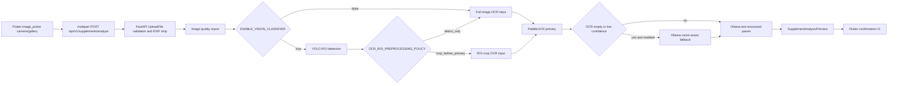

# OCR + YOLO + Ollama + Flutter 시뮬레이션 구현 플랜 - 2026-05-22

## 목표

현재 `Lemon-Aid` 워크트리의 OCR, YOLO ROI, Ollama, Flutter 흐름을 이용해
영양제 성분표 이미지에서 텍스트와 성분 후보를 추출할 수 있는지 확인하고,
Flutter 시뮬레이터에서 이미지 선택부터 backend 분석 결과 표시까지 검증한다.

이 플랜의 핵심 원칙은 다음과 같다.

1. OCR 원문과 원본 이미지 바이트는 product API 응답, Git 산출물, 로그에 저장하지 않는다.
2. Flutter 앱에는 raw OCR text 대신 `parsed_product`, `ingredient_candidates`,
   `provider_observations`, `image_quality_report`, warnings만 표시한다.
3. raw OCR text 확인은 operator-only local harness 또는 redacted collector의
   임시 실행 결과로만 한다.
4. YOLO는 OCR engine이 아니라 ROI detector다. 성분표 인식 품질 판단은 OCR/파서
   결과 기준으로 한다.
5. Ollama는 외장 모델 경로를 사용하되 `ALLOW_EXTERNAL_LLM=false`와 loopback endpoint를
   유지한다.

## 공식 문서 확인 근거

- FastAPI `UploadFile`/`File` multipart 처리: https://fastapi.tiangolo.com/tutorial/request-files/
- PaddleOCR 3.x OCR pipeline: https://www.paddleocr.ai/main/en/version3.x/pipeline_usage/OCR.html
- Ultralytics YOLO predict mode: https://docs.ultralytics.com/modes/predict
- Ollama structured outputs: https://docs.ollama.com/capabilities/structured-outputs
- Ollama vision capability: https://docs.ollama.com/capabilities/vision
- Flutter `image_picker`: https://pub.dev/packages/image_picker
- Flutter camera plugin recipe: https://docs.flutter.dev/cookbook/plugins/picture-using-camera

확인한 공식 문서 기준:

- FastAPI는 파일이 포함된 요청을 `multipart/form-data`로 처리하고 `UploadFile.read()`/`seek()`는
  async 메서드다.
- PaddleOCR general OCR pipeline은 detection/recognition과 optional orientation modules로
  구성된다.
- Ultralytics YOLO predict 결과는 `Results` 객체와 `boxes`를 통해 bounding box를 제공한다.
- Ollama structured output은 `format`에 JSON Schema를 전달하고, vision 모델도 image input과
  structured output을 함께 사용할 수 있다.
- `image_picker`는 `pickImage(source: ImageSource.camera|gallery)`와 Android lost-data 복구
  흐름을 제공한다.
- 실시간 카메라 preview까지 필요하면 Flutter 공식 `camera` plugin의 `CameraController`/
  `CameraPreview` 흐름을 별도 도입해야 한다.

## 현재 코드 기준 상태

### Backend

현재 경로:

```text
backend/Nutrition-backend
```

핵심 파일:

| 영역 | 파일 | 현재 역할 |
| --- | --- | --- |
| API | `src/api/v1/supplements.py` | `POST /api/v1/supplements/analyze` multipart image upload, `ocr_provider` selector, consent gate |
| Orchestration | `src/services/supplement_image_analysis.py` | 이미지 검증, image quality, YOLO ROI, OCR, Ollama fallback/verification, parser 연결 |
| Intake | `src/services/supplement_intake.py` | JPEG/PNG/WebP MIME 검증, size/pixel limit, EXIF 제거, preview 저장 |
| OCR contract | `src/ocr/base.py` | `OCRImageInput`, `OCRResult`, optional `label_region`, OCR layout pages |
| OCR factory | `src/ocr/factory.py` | `configured`, `paddleocr`, `clova`, `google_vision` selector와 adapter bundle 생성 |
| Local OCR | `src/ocr/providers/paddle.py` | PaddleOCR local adapter, `ENABLE_LOCAL_OCR=true` 필요 |
| YOLO ROI | `src/vision/yolo.py`, `src/vision/ultralytics_runner.py` | `ENABLE_VISION_CLASSIFIER=true`일 때 detector 실행 |
| ROI crop | `src/vision/preprocessing.py` | detected bounding box crop, label priority |
| Ollama parser | `src/llm/ollama.py` | OCR text to structured supplement schema |
| Ollama vision | `src/llm/ollama_vision.py` | OCR fallback/verification용 local vision model |

현재 설정 구조:

| 설정 | 기본값/상태 | 의미 |
| --- | --- | --- |
| `OCR_PRIMARY_PROVIDER` | `paddleocr` | 기본 OCR provider |
| `ENABLE_LOCAL_OCR` | `true` | PaddleOCR primary/fallback 허용 |
| `ENABLE_VISION_CLASSIFIER` | `false` | YOLO ROI 비활성 기본값 |
| `OCR_ROI_PREPROCESSING_POLICY` | `disabled` | ROI crop 비활성 기본값 |
| `ENABLE_MULTIMODAL_LLM` | `false` | Ollama vision assist 비활성 기본값 |
| `MULTIMODAL_OCR_ASSIST_POLICY` | `disabled` | OCR fallback 비활성 기본값 |
| `ENABLE_MULTIMODAL_VERIFICATION` | `false` | OCR 결과 vision 검증 비활성 기본값 |
| `OLLAMA_MODEL` | `qwen3.5:9b` | text structured parser 기본 모델 |
| `OLLAMA_VISION_MODEL` | `gemma4:e4b` | vision assist 기본 모델 |

현재 코드로 가능한 것:

- 이미지 업로드 후 PaddleOCR local로 텍스트 추출 시도
- OCR text를 request memory 안에서 Ollama structured parser로 전달
- 분석 preview에 성분 후보와 provider observation 저장
- YOLO ROI detection을 feature flag로 켜서 OCR input에 label/bottle ROI를 전달
- OCR 실패/저신뢰도일 때 Ollama vision assist를 fallback으로 호출
- accepted OCR 결과와 Ollama vision candidate 간 similarity 검증
- raw OCR text 저장 없이 text non-empty, latency, parser success 같은 bounded metadata만 저장

현재 한계:

- YOLO 기본 모델 `yolov8n.pt`는 영양제 성분표 전용 detector가 아니다. COCO `bottle`은 잡을 수
  있어도 `supplement_label` 또는 nutrition facts table을 안정적으로 crop한다고 보면 안 된다.
- `OllamaVisionAssistAdapter`는 primary OCR이 아니라 fallback/verification 용도다.
- public mobile API는 raw OCR text를 반환하지 않는다. Flutter 화면에서 원문 OCR text 자동 표시를
  하려면 privacy boundary 재검토가 필요하다.
- Flutter repository는 현재 multipart field `ocr_provider=paddleocr`로 고정되어 있다.
- Flutter 시뮬레이터는 실제 카메라 사용이 제한적이므로 gallery fixture를 우선 사용해야 한다.

### Flutter

핵심 파일:

| 영역 | 파일 | 현재 역할 |
| --- | --- | --- |
| 앱 entry | `mobile/lib/main.dart` | `AppConfig`로 API base URL 주입 |
| 설정 | `mobile/lib/core/config/app_config.dart` | `LEMON_API_BASE_URL`, token, cert pin 검증 |
| API client | `mobile/lib/core/api/api_client.dart` | JSON/multipart 요청 |
| Repository | `mobile/lib/features/supplements/supplement_repository.dart` | `/supplements/analyze` upload, `ocr_provider=paddleocr` |
| Flow UI | `mobile/lib/features/supplements/supplement_flow_screen.dart` | camera/gallery 선택, 품질 경고, 분석/확인/등록 UI |
| Models | `mobile/lib/features/supplements/supplement_models.dart` | backend preview schema parsing |
| Tests | `mobile/test/supplement_flow_image_picker_test.dart` | image_picker, 품질 경고, camera permission |
| Integration | `mobile/integration_test/supplement_ios_camera_permission_test.dart` | iOS permission channel smoke |

현재 Flutter 흐름:

```text
Consents tab에서 최소 동의
  -> Supplement tab
  -> ImagePicker camera/gallery
  -> local capture quality panel
  -> 분석하기
  -> BackendLemonAidRepository.analyzeSupplementImage()
  -> POST /api/v1/supplements/analyze
  -> SupplementAnalysisPreview 표시
  -> 성분 후보 확인/수정
  -> register
```

## 목표 아키텍처



## 구현/검증 Phase

### Phase 0 - 기준선 고정

목표: 현재 backend/mobile 계약이 깨지지 않는지 먼저 고정한다.

작업:

1. 현재 브랜치의 기존 dirty 변경분을 건드리지 않고 별도 문서/검증 중심으로 진행한다.
2. `docs/team-collaboration` 10개 md의 브랜치/커밋/PR 규칙을 유지한다.
3. OCR 원문 저장 금지 invariant를 검증 항목에 포함한다.
4. Flutter는 `ocr_provider=paddleocr` 고정 상태로 baseline을 잡는다.

산출물:

```text
outputs/todo-list/2026-05-22/2026-05-22-ocr-yolo-ollama-flutter-simulation-plan.md
```

검증:

```bash
git diff --check
```

### Phase 1 - Backend local OCR 가능성 확인

목표: 영양제 성분표 이미지 1장과 30장 smoke에서 PaddleOCR text extraction과
Ollama structured parsing이 동작하는지 확인한다.

환경:

```bash
cd "$LEMON_AID_ROOT"

OLLAMA_MODELS="$OLLAMA_MODELS_DIR" \
OLLAMA_HOST=127.0.0.1:11435 \
ollama serve
```

Ollama 모델 확인:

```bash
find "$OLLAMA_MODELS_DIR/manifests/registry.ollama.ai/library" \
  -maxdepth 2 -type f -print
```

현재 확인된 local manifest 후보:

```text
gemma4/e4b
gemma4/26b
gemma4/latest
gemma-4-26B-A4B-it-GGUF/UD-Q3_K_M
gemma-4-26B-A4B-it-GGUF/UD-Q4_K_M
qwen3.5/9b
qwen3.6/latest
```

권장 smoke:

```bash
OLLAMA_BASE_URL=http://127.0.0.1:11435 \
OLLAMA_MODEL=gemma4:e4b \
LLM_PROVIDER=ollama \
ALLOW_EXTERNAL_LLM=false \
RUN_PADDLEOCR_PROBE=1 \
ENABLE_LOCAL_OCR=true \
PYTHONPATH=backend/Nutrition-backend \
/private/tmp/lemon-p1-quality-venv/bin/python backend/scripts/run_naver_tampermonkey_ocr_eval.py \
  --manifest outputs/generated/ocr-eval/2026-05-22-naver-tampermonkey/manifest-detail-smoke-30.jsonl \
  --output-root outputs/generated/ocr-eval/2026-05-22-naver-tampermonkey/runner-paddle-detail-smoke-30-gemma4 \
  --providers paddleocr \
  --llm-parse \
  --resume \
  --python-executable /private/tmp/lemon-p1-quality-venv/bin/python \
  --env-file "$LEMON_AID_ENV_FILE"
```

Acceptance criteria:

- observation row 수 = manifest row 수
- `text_non_empty_rate >= 0.80`
- OCR 성공 row의 `llm_parse_status=completed` 비율 확인
- `raw_artifacts_stored=false`
- `raw_ocr_text_stored=false`
- forbidden raw key scan 통과

현재 참고 baseline:

| Provider | Calls | Completed | Text non-empty | LLM success | Error |
| --- | ---: | ---: | ---: | ---: | --- |
| `paddleocr_local` detail 30 | 30 | 0.8667 | 0.8667 | 1.0 | `{"ocrerror": 4}` |
| `clova_ocr` detail 30 | 30 | 1.0 | 1.0 | 1.0 | `{}` |
| `google_vision_document` detail 30 | 30 | 0.0 | 0.0 | null | `{"ocr_http_status_401": 30}` |

### Phase 2 - YOLO ROI를 켠 backend smoke

목표: YOLO ROI가 성분표 OCR 품질을 실제로 개선하는지, 또는 full image OCR보다
나빠지는지 분리해서 확인한다.

중요한 판단:

- `yolov8n.pt`는 generic object detector다.
- 현재 taxonomy는 `bottle`, `label`, `blister`를 supplement ROI taxonomy로 normalize한다.
- 영양제 성분표 table 전용 detector가 아니므로 `crop_before_primary`를 바로 기본값으로 올리면
  성분표를 잘라낼 위험이 있다.

실행 순서:

1. `detect_only`로 먼저 ROI metadata만 확인한다.
2. provider observation과 parser success가 baseline보다 나빠지지 않는지 본다.
3. 이후 제한된 fixture에서만 `crop_before_primary`를 비교한다.

권장 env:

```bash
ENABLE_VISION_CLASSIFIER=true
VISION_CLASSIFIER_MODEL=yolov8n.pt
VISION_ROI_MIN_CONFIDENCE=0.50
OCR_ROI_PREPROCESSING_POLICY=detect_only
OCR_PRIMARY_PROVIDER=paddleocr
ENABLE_LOCAL_OCR=true
```

두 번째 비교 env:

```bash
OCR_ROI_PREPROCESSING_POLICY=crop_before_primary
```

Acceptance criteria:

- YOLO 실패 시에도 API는 500이 아니라 full image OCR 또는 safe warning으로 degrade한다.
- `vision_roi_used` audit metadata가 true/false로 남는다.
- `ocr_roi_crop_unavailable` warning이 생겨도 raw image/ocr text는 저장하지 않는다.
- crop mode에서 `text_non_empty_rate`, `llm_parse_success_rate`, ingredient candidate count가
  full-image baseline보다 개선되거나 최소 동일해야 한다.

중단 기준:

- crop 후 성분 후보가 줄거나 text non-empty가 떨어지면 `detect_only` 유지.
- custom supplement-label detector 없이 `crop_before_primary`를 기본값으로 올리지 않는다.

### Phase 3 - Ollama vision assist 검증

목표: OCR이 비었거나 낮은 confidence일 때 local Gemma4 vision model이 보조 text candidate를
만들 수 있는지 확인한다.

권장 env:

```bash
ENABLE_MULTIMODAL_LLM=true
OLLAMA_BASE_URL=http://127.0.0.1:11435
OLLAMA_VISION_MODEL=gemma4:e4b
ALLOW_EXTERNAL_LLM=false
MULTIMODAL_OCR_ASSIST_POLICY=ocr_empty_only
ENABLE_MULTIMODAL_VERIFICATION=false
```

저신뢰도까지 확장할 때:

```bash
MULTIMODAL_OCR_ASSIST_POLICY=low_confidence
```

검증 포인트:

- `ollama_vision_assist` provider observation이 `stage=multimodal_fallback`으로만 남는지 확인
- vision assist 결과가 primary OCR을 덮어쓸 때 성분 후보가 실제로 증가하는지 확인
- `confidence=None`인 Ollama vision output을 high-confidence OCR처럼 표시하지 않는다
- prompt injection 방어: 모델은 visible text fragment만 반환하고 의학 조언/복용량 변경은 하지 않는다

Acceptance criteria:

- OCR empty row 중 최소 1건에서 `ollama_vision_assist`가 non-empty candidate를 만든다.
- structured parser schema validation이 통과한다.
- raw model response 저장 없음.
- Flutter UI에는 `확인 필요` 또는 low confidence state로 표시한다.

### Phase 4 - FastAPI product API smoke

목표: 실제 `/api/v1/supplements/analyze`가 Flutter multipart와 같은 방식으로 동작하는지 확인한다.

Backend 실행 예시:

```bash
cd "$LEMON_AID_ROOT"

DATABASE_URL="$LEMON_AID_DATABASE_URL" \
AUTH_MODE=disabled \
OCR_PRIMARY_PROVIDER=paddleocr \
ENABLE_LOCAL_OCR=true \
ALLOW_EXTERNAL_OCR=false \
LLM_PROVIDER=ollama \
OLLAMA_BASE_URL=http://127.0.0.1:11435 \
OLLAMA_MODEL=gemma4:e4b \
ALLOW_EXTERNAL_LLM=false \
ALLOWED_HOSTS='["localhost","127.0.0.1","10.0.2.2","testserver"]' \
ALLOWED_ORIGINS='["http://localhost:3001","http://127.0.0.1:3001"]' \
.venv/bin/python -m uvicorn src.main:app \
  --app-dir backend/Nutrition-backend \
  --host 127.0.0.1 \
  --port 8000
```

Readiness:

```bash
curl -sS http://127.0.0.1:8000/ready
```

API smoke:

```bash
curl -sS -X POST http://127.0.0.1:8000/api/v1/supplements/analyze \
  -F "image=@/absolute/path/to/supplement-label.jpg;type=image/jpeg" \
  -F "ocr_provider=paddleocr" \
  -F "client_request_id=local-smoke-$(date +%s)"
```

주의:

- 실제 runtime에서 consent gate가 살아 있으면 먼저 `ocr_image_processing` consent를 grant해야 한다.
- `AUTH_MODE=disabled`라도 consent model이 필요하면 Flutter의 Consents tab에서 최소 동의를 먼저 활성화한다.
- API 응답에 raw OCR text가 없다는 것이 정상이다.

Acceptance criteria:

- HTTP 202
- `status=requires_confirmation`
- `ingredient_candidates` 또는 safe warning 존재
- `provider_observations[*].provider`에 `paddleocr_local` 또는 fallback provider 표시
- `provider_observations[*].raw_ocr_text_stored=false`

### Phase 5 - Flutter 시뮬레이터 연결

목표: 사용자가 시뮬레이터에서 이미지를 선택하고 backend 분석 preview를 확인한다.

권장 순서:

1. Backend와 Ollama를 먼저 띄운다.
2. Flutter unit test로 repository multipart 계약을 확인한다.
3. iOS simulator는 gallery fixture로 먼저 검증한다.
4. Android emulator는 `10.0.2.2` base URL로 검증한다.
5. 실제 기기 카메라는 별도 수동 smoke로 분리한다.

Flutter test:

```bash
cd "$LEMON_AID_ROOT/mobile"
flutter test test/unit/supplement_repository_test.dart
flutter test test/supplement_flow_image_picker_test.dart
flutter test integration_test/supplement_ios_camera_permission_test.dart
```

iOS simulator:

```bash
cd "$LEMON_AID_ROOT/mobile"
flutter run -d ios \
  --dart-define=LEMON_API_BASE_URL=http://127.0.0.1:8000/api/v1
```

Android emulator:

```bash
flutter run -d android \
  --dart-define=LEMON_API_BASE_URL=http://10.0.2.2:8000/api/v1
```

시뮬레이터 수동 시나리오:

1. `Consents` tab에서 최소 동의 활성화.
2. `Supplement` tab 이동.
3. 카메라가 안 되면 gallery 선택.
4. 영양제 성분표 fixture image 선택.
5. 품질 경고가 나오면 이미지가 실제로 낮은 품질인지 확인하고, 필요 시 `그래도 분석`.
6. `OCR 분석 중이에요` 상태 확인.
7. preview 화면에서 성분 후보, provider observations, warnings 확인.
8. low confidence 후보는 직접 라벨과 대조 후 저장 또는 수동 수정.

Acceptance criteria:

- Flutter 화면에서 네트워크/API 에러 없이 `Supplement preview is ready for review` notice가 뜬다.
- `ingredient_candidates`가 1개 이상 표시되거나, OCR 실패/품질 경고가 안전하게 표시된다.
- raw OCR text가 앱 화면에 자동 노출되지 않는다.
- Gallery fallback 문구가 simulator에서 자연스럽게 표시된다.

### Phase 6 - 실제 카메라 UX 확장 여부 결정

현재 `image_picker`는 single-shot camera/gallery 선택에 적합하다. 실시간 카메라 preview와
capture guide overlay를 더 정교하게 만들려면 Flutter 공식 `camera` plugin으로 별도 PR을
분리한다.

분기:

| 조건 | 결정 |
| --- | --- |
| 시뮬레이터/gallery smoke만 필요 | 현재 `image_picker` 유지 |
| 실제 기기에서 guide overlay, autofocus, exposure, multi-shot 필요 | `camera` plugin 도입 |
| OCR 품질 문제가 대부분 촬영 품질 때문 | camera plugin + 품질 분석 panel 강화 |

camera plugin 도입 시 새 PR 범위:

- `mobile/pubspec.yaml`: `camera`, `path_provider`, `path`
- `SupplementFlowScreen`에서 camera preview screen 분리
- iOS `NSCameraUsageDescription` 유지
- Android camera permission 유지
- 기존 `image_picker` gallery fallback은 유지

## PR 분할 전략

현재 변경분이 이미 크므로 추가 구현은 작게 나눈다.

| PR | 브랜치 | 범위 | 예상 검증 |
| --- | --- | --- | --- |
| PR 1 | `docs/ocr-flutter-simulation-plan` | 이 계획 문서만 | `git diff --check` |
| PR 2 | `test/ocr-api-smoke-harness` | FastAPI analyze smoke script, raw scan | backend unit + script smoke |
| PR 3 | `feat/ocr-yolo-roi-eval` | YOLO `detect_only`/crop 비교 runner | provider eval + raw scan |
| PR 4 | `feat/ocr-ollama-vision-fallback` | Gemma4 vision fallback fixture eval | parser + vision assist tests |
| PR 5 | `feat/mobile-ocr-simulation-flow` | Flutter operator/debug provider display, simulator docs | flutter test/analyze |
| PR 6 | `feat/mobile-camera-preview` | 필요 시 `camera` plugin 전환 | integration test + manual device smoke |

커밋 예시:

```text
docs(ocr): Flutter OCR 시뮬레이션 계획 작성
test(ocr): analyze API smoke 검증 스크립트 추가
feat(ocr): YOLO ROI 비교 평가 runner 추가
feat(mobile): OCR preview provider 상태 표시
```

팀 규칙:

- feature -> develop은 Squash.
- `develop -> main`은 merge commit.
- `--no-verify`, lease 없는 `--force`, `.env`/비밀키 커밋 금지.
- PR은 가능하면 500줄 이하로 유지.

## 검증 매트릭스

| 계층 | 명령/증거 | 통과 기준 |
| --- | --- | --- |
| Backend unit | `pytest backend/Nutrition-backend/tests/unit/services/test_supplement_image_analysis.py -q --no-cov` | OCR/YOLO/Ollama fallback 계약 유지 |
| OCR factory | `pytest backend/Nutrition-backend/tests/unit/ocr/test_ocr_factory.py -q --no-cov` | adapter gate 정상 |
| Config | `pytest backend/Nutrition-backend/tests/unit/test_config.py -q --no-cov` | production validation 유지 |
| Provider eval | `run_naver_tampermonkey_ocr_eval.py --resume` | 중복 외부 호출 없음 |
| Raw scan | JSON/JSONL forbidden key scan | raw text/image/provider payload 없음 |
| Flutter repository | `flutter test test/unit/supplement_repository_test.dart` | `ocr_provider=paddleocr`, multipart image field |
| Flutter capture UI | `flutter test test/supplement_flow_image_picker_test.dart` | gallery/camera permission/quality warning |
| Flutter integration | `flutter test integration_test/supplement_ios_camera_permission_test.dart` | iOS permission channel |
| Manual simulator | iOS/Android run | preview 표시, safe warning 표시 |

## 성공 판정

이 작업을 완료로 판단하려면 다음이 모두 증명되어야 한다.

1. Backend local smoke에서 실제 영양제 성분표 이미지 OCR이 non-empty text를 만든다.
2. Ollama structured parser가 최소 1개 이상의 성분 후보를 schema-valid하게 반환한다.
3. YOLO ROI를 켠 경우와 끈 경우의 OCR 결과를 같은 fixture로 비교했다.
4. Flutter simulator에서 gallery fixture를 선택해 `/supplements/analyze` preview를 받는다.
5. 앱 화면에 성분 후보 또는 안전한 실패/품질 경고가 표시된다.
6. raw OCR text, raw provider payload, image bytes, secret 값이 산출물/로그/Git에 남지 않는다.
7. 관련 backend unit, Flutter unit/integration, `git diff --check`가 통과한다.

## 권장 우선순위

1. PaddleOCR + Ollama text parser end-to-end를 local smoke로 먼저 고정한다.
2. Flutter simulator는 gallery fixture로 backend preview까지 먼저 연결한다.
3. YOLO는 `detect_only`로 안전하게 관찰한 뒤, crop이 실제 OCR 성능을 올릴 때만 사용한다.
4. Ollama vision assist는 OCR empty/low confidence fallback으로만 검증한다.
5. 실제 camera preview 개선은 성분표 인식이 gallery fixture에서 먼저 증명된 뒤 진행한다.
