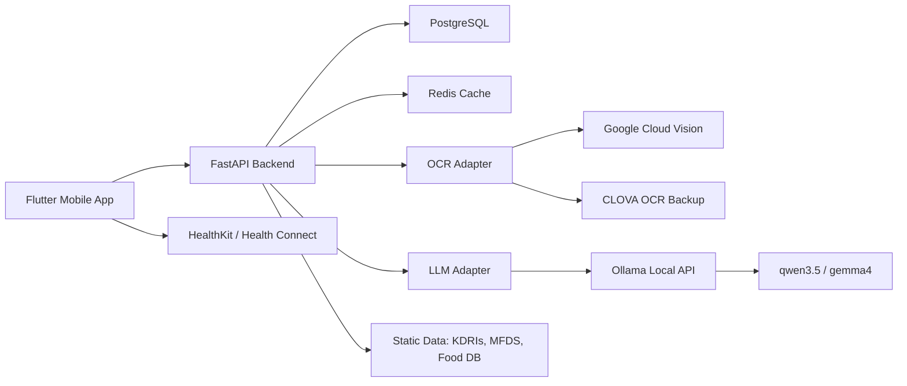

# 11. 상세 기능 구현 계획

> 작성일: 2026-05-11
> 대상 경로: `/Users/yeong/99_me/00_github/03_lemon_healthcare/yeong-Vision-Nutrition`
> 확인 범위: `docs/*.md` 10개, `docs/dev-guides/*.md` 30개, 루트/백엔드/모바일/데이터 `CLAUDE.md`

## 1. 현재 상태 요약

현재 저장소는 기획·설계 문서와 개발 가이드가 매우 상세하게 준비된 상태이지만, 실제 구현 파일은 아직 생성되지 않았다.

- `backend/`: `CLAUDE.md`만 존재한다.
- `mobile/`: `CLAUDE.md`만 존재한다.
- `data/`: `CLAUDE.md`만 존재한다.
- `docs/`: 구현 방향, 알고리즘, 데이터, 컴플라이언스, 모바일 화면, 운영·인수인계 문서가 준비되어 있다.

따라서 앞으로의 작업은 "문서 기반 신규 구현"으로 진행해야 한다. 기존 코드와 충돌할 위험은 낮지만, 처음부터 폴더 구조·테스트·품질 기준을 강하게 잡아야 한다.

## 2. 문서 확인 결과

### 2.1 루트 기획 문서 10개

| 문서 | 확인한 핵심 내용 | 구현 반영 |
|---|---|---|
| `01-project-overview.md` | 5종 출력, 프로젝트 범위, 성공 기준 | 기능 백로그와 마일스톤의 기준 문서 |
| `02-background-problem.md` | 사업 배경, 핵심 문제, 검증 질문 | MVP가 답해야 할 질문 정의 |
| `03-project-intent.md` | 만성질환자 중심 차별화, 페르소나 A/B | 기본 시나리오는 페르소나 B 우선 |
| `04-market-research.md` | 경쟁사 기능 비교, 포지셔닝 | 기능 우선순위에서 OCR, 식단, 건강 데이터 통합 강조 |
| `05-github-guidelines.md` | GitHub 협업, 브랜치, 커밋, CI | Conventional Commits, PR, CI 분리 적용 |
| `06-tech-stack.md` | Flutter, FastAPI, PostgreSQL, Redis, OCR, LLM | 실제 기술 스택 확정 기준 |
| `07-core-algorithm.md` | BMI, v1~v4, BMR/TDEE, 체중 예측, OCR/LLM, 식단, 목적별 분석 | 백엔드 순수 함수와 서비스 설계의 핵심 |
| `08-implementation-plan.md` | Phase 0~4 로드맵, 역할, WBS | 이번 계획의 상위 일정 기준 |
| `09-data-catalog.md` | KDRIs, 식약처 API, 건강기능식품 원료 DB, HealthKit/Health Connect | 데이터 수급·스키마·출처 표기 기준 |
| `10-compliance-checklist.md` | 의료법, 약사법, 건기식법, 개인정보, 앱스토어, 표현 가이드 | 모든 UI·API·LLM 응답의 안전장치 기준 |

### 2.2 개발 가이드 30개

| 범위 | 문서 | 구현 묶음 |
|---|---|---|
| 환경 | `00-setup-environment.md` | 백엔드 골격, 설정, 테스트, 품질 도구 |
| 핵심 알고리즘 | `01`~`06` | BMI, 활동점수, BMR/TDEE, 체중 예측, KDRIs, 부족 영양소 분석 |
| OCR/LLM/API | `07`~`09` | OCR Adapter, LLM Adapter, 영양제 등록 API |
| 모바일 기반 | `10`~`13` | Flutter 골격, 카메라, 헬스 데이터, 대시보드 |
| 고도화 | `14`~`17` | Hall 모델, 목적별 분석, 식단 인식, 피드백/푸시 |
| 모바일 화면 | `18`~`21` | 부족 영양소 화면, 목적별 화면, 식단 입력, 피드백 UI |
| 발표·운영 | `22`~`29` | 시연, 발표, 리허설, 인수인계, 운영, 장애 대응, 최종 산출물 |

## 3. 구현 원칙

### 3.1 범위 원칙

MVP는 "건강 정보 제공 PoC"로 제한한다. 질병의 진단, 치료, 처방처럼 해석될 수 있는 기능은 구현하지 않는다.

- 제공: 영양소 섭취 상태 안내, 권장 섭취량 정보, 체중 변화 예측, 활동 권고, 식품·성분 중심 안내
- 제외: 특정 질병 판정, 치료 효과 보장, 특정 약·제품 구매 유도, LDB 실연동, DTx/SaMD 범위 기능

### 3.2 기술 원칙

- 백엔드는 Python 3.13+, FastAPI, Pydantic v2, SQLAlchemy 2.x, Alembic 기준으로 시작한다.
- 모바일은 Flutter, Riverpod, go_router, Dio, Freezed 기준으로 시작한다.
- OCR/LLM은 Adapter 인터페이스를 반드시 거친다. LLM 기본 Provider는 환자 개인정보 보호를 위해 Ollama 로컬 LLM으로 둔다.
- 모든 public 함수와 클래스는 Google-style docstring 또는 Dart doc comment를 작성한다.
- 새 기능은 테스트를 동반한다.

### 3.3 검증 원칙

- 알고리즘은 문서의 계산 예시를 테스트 케이스로 고정한다.
- OCR은 실제 API 테스트와 mock 테스트를 분리하고, LLM은 mock 테스트와 로컬 Ollama 통합 테스트를 분리한다.
- 민감정보, 금지 표현, 면책 고지 누락은 기능 결함으로 본다.
- API 키, 사용자 데이터, 원본 이미지 데이터는 Git에 넣지 않는다.

## 4. 전체 아키텍처 계획

## 5. 백엔드 구현 계획

### 5.1 Phase 1: 백엔드 골격

목표: 이후 알고리즘과 API를 붙일 수 있는 최소 서버를 만든다.

구현 파일:

- `backend/pyproject.toml`
- `backend/requirements.txt`
- `backend/requirements-dev.txt`
- `backend/.env.example`
- `backend/src/main.py`
- `backend/src/config.py`
- `backend/src/utils/logger.py`
- `backend/tests/conftest.py`

주요 작업:

1. FastAPI 앱 팩토리 생성
2. `/health` 엔드포인트 구현
3. Pydantic Settings 기반 환경변수 로딩
4. pytest, ruff, black, mypy 설정
5. GitHub Actions 백엔드 CI 추가

완료 기준:

- `GET /health`가 `{"status": "ok"}` 형태로 응답
- `pytest`, `ruff`, `black --check`, `mypy --strict` 통과
- `.env.example`만 커밋되고 실제 `.env`는 제외

### 5.2 Phase 1: 핵심 산출식 알고리즘

목표: 회사 가이드에 정의된 산출식을 백엔드 순수 함수로 구현한다.

구현 파일:

- `backend/src/models/schemas/user.py`
- `backend/src/models/schemas/algorithm.py`
- `backend/src/algorithms/bmi.py`
- `backend/src/algorithms/activity.py`
- `backend/src/algorithms/metabolism.py`
- `backend/src/prediction/weight.py`

기능:

- 한국·아시아 BMI 분류
- v1 권장 걸음수와 기본 활동점수
- v2 심박수 가중
- v3 백분위 보너스
- v4 만성질환 가중
- BMR, TDEE
- 1주/1개월/3개월 체중 변화 예측

테스트:

- 50대 여성 비만1단계 활동점수 예시
- v2 심박수 누락 시 폴백
- v3 표본 부족 시 보너스 0 처리
- v4 미정의 질환 코드 무시
- BMR/TDEE 경계값
- 7-step 체중 예측 계산 예시

### 5.3 Phase 1~2: 데이터 룩업과 부족 영양소 분석

목표: KDRIs 기준값과 사용자 섭취량을 비교해 부족, 적정, 과다 상태를 계산한다.

구현 파일:

- `data/kdris/kdris_2020.csv`
- `data/kdris/kdris_metadata.json`
- `data/reference/nutrient_codes.json`
- `data/mfds/unit_conversions.json`
- `backend/src/models/schemas/nutrition.py`
- `backend/src/nutrition/kdris.py`
- `backend/src/nutrition/unit_converter.py`
- `backend/src/nutrition/deficiency_analysis.py`

주의:

- 코드명에는 `diagnosis` 대신 `analysis`, `evaluation`, `status`를 사용한다.
- 사용자 노출 문구는 "부족 가능성", "섭취를 늘리면 도움이 될 수 있음"처럼 표현한다.
- KDRIs 원본 디지털화는 출처, 버전, 라이선스, 다운로드 일자를 메타데이터에 남긴다.

완료 기준:

- 30종 주요 영양소 CSV 로딩
- 성별, 나이, 임신·수유 조건 룩업
- mg, ug, IU 단위 환산
- UL 초과 위험 표시
- 금지 표현 자동 검사 통과

### 5.4 Phase 2: OCR Adapter

목표: 영양제 라벨 이미지를 텍스트로 변환하는 외부 API 추상화 계층을 만든다.

구현 파일:

- `backend/src/ocr/base.py`
- `backend/src/ocr/exceptions.py`
- `backend/src/ocr/preprocessor.py`
- `backend/src/ocr/google_vision.py`
- `backend/src/ocr/clova.py`
- `backend/src/cache/ocr_cache.py`
- `backend/src/ocr/pipeline.py`

처리 흐름:

1. 이미지 MIME, 크기, 해상도 검증
2. 이미지 전처리
3. OCR 캐시 확인
4. Google Vision 우선 호출
5. 실패 시 CLOVA OCR 폴백
6. 원문 텍스트, confidence, bounding box 저장

완료 기준:

- Adapter mock 테스트
- 이미지 형식·용량 오류 처리
- OCR 캐시 키 중복 방지
- 테스트셋 기준 정확도 측정 리포트 생성

### 5.5 Phase 2: LLM 파싱 Adapter

목표: OCR 원문을 영양제 성분 JSON으로 구조화한다.

구현 파일:

- `backend/src/llm/base.py`
- `backend/src/llm/exceptions.py`
- `backend/src/llm/schemas.py`
- `backend/src/llm/prompts.py`
- `backend/src/llm/ollama.py`
- `backend/src/llm/external.py` 선택 사항, 비식별 테스트 또는 승인 환경 전용
- `backend/src/nutrition/mfds_matcher.py`

처리 흐름:

1. OCR 텍스트 정규화
2. Ollama Structured Outputs 또는 JSON Schema로 성분 구조화
3. JSON Schema 검증
4. 식약처 건강기능식품 원료 DB 매칭
5. 단위 환산
6. 금지 표현 검사
7. 낮은 confidence 항목은 사용자 확인 대상으로 표시

완료 기준:

- LLM mock 테스트
- 로컬 Ollama 통합 테스트
- malformed JSON, 누락 필드, 단위 오류 처리
- 특정 제품 추천 문구 0건

### 5.6 Phase 2: 영양제 등록 API

목표: 모바일에서 이미지 하나를 업로드하면 OCR, LLM, 식약처 매칭, 부족 영양소 분석을 한 번에 수행한다.

엔드포인트:

| Method | Path | 용도 |
|---|---|---|
| `POST` | `/api/v1/supplements/register` | 영양제 이미지 업로드 및 분석 |
| `GET` | `/api/v1/supplements` | 사용자 등록 영양제 목록 |
| `GET` | `/api/v1/supplements/{id}` | 등록 결과 상세 |
| `DELETE` | `/api/v1/supplements/{id}` | 등록 항목 삭제 |

DB 모델:

- `users`
- `supplements`
- `supplement_ingredients`
- `nutrition_analysis_results`
- `ocr_jobs`
- `llm_parse_jobs`

완료 기준:

- multipart 업로드 정상 처리
- 응답 시간 목표: 일반 케이스 6초 이내
- 실패 원인을 사용자 친화 메시지로 변환
- Swagger UI에서 API 확인 가능

### 5.7 Phase 3: 식단 인식 API

목표: 텍스트 또는 이미지 식단 입력을 음식·영양소 목록으로 변환한다.

엔드포인트:

| Method | Path | 용도 |
|---|---|---|
| `POST` | `/api/v1/meals/recognize/text` | 텍스트 식단 인식 |
| `POST` | `/api/v1/meals/recognize/image` | 이미지 식단 인식 |
| `POST` | `/api/v1/meals` | 사용자가 검토한 식단 저장 |
| `GET` | `/api/v1/meals` | 식단 기록 목록 |
| `GET` | `/api/v1/meals/{id}` | 식단 상세 |

구현 파일:

- `backend/src/meal/base.py`
- `backend/src/meal/text_parser.py`
- `backend/src/meal/ollama_vision.py`
- `backend/src/nutrition/food_matcher.py`
- `backend/src/api/v1/meals.py`

완료 기준:

- 텍스트 MVP 먼저 구현
- 이미지 인식은 Feature Flag로 분리
- 사용자가 인식 결과를 수정한 뒤 저장
- 식품영양성분 API 매칭 실패 시 수동 입력 허용

### 5.8 Phase 3: 목적별 분석

목표: 눈 건강, 간 기능, 피로 회복 등 사용자가 선택한 목적에 맞춰 관련 성분·식품 정보를 보여준다.

엔드포인트:

| Method | Path | 용도 |
|---|---|---|
| `GET` | `/api/v1/goals` | 지원 목적 목록 |
| `POST` | `/api/v1/goals/{goal_code}/analyze` | 목적별 영양 상태 분석 |

구현 파일:

- `data/reference/health_goals.json`
- `backend/src/nutrition/goal_definitions.py`
- `backend/src/nutrition/goal_analysis.py`
- `backend/src/api/v1/goals.py`

주의:

- 식약처 인정 기능성 표현만 사용한다.
- "효과 보장" 표현을 사용하지 않는다.
- 의료자문 또는 법무 검토 전에는 고위험 문구를 막는다.

### 5.9 Phase 2~3: 규제 입력 OCR intake

목표: 처방전과 검사표를 의료 판단 대상이 아니라 사용자가 보유한 건강 문서를 구조화하는 입력 기능으로 구현한다. 복용량 변경, 약 중단, 질환 진단, 치료 추천은 직접 제공하지 않는다.

엔드포인트:

| Method | Path | 용도 |
|---|---|---|
| `POST` | `/api/v1/regulated-inputs/prescriptions/ocr` | 처방전 OCR 추출 및 사용자 확인 대상 생성 |
| `POST` | `/api/v1/regulated-inputs/lab-results/ocr` | 검사표 OCR 추출 및 사용자 확인 대상 생성 |
| `POST` | `/api/v1/regulated-inputs/{document_id}/confirm` | OCR 결과 사용자 수정·확인 |
| `POST` | `/api/v1/medication-safety/check` | 약·영양제 조합의 주의 가능성 알림 |
| `POST` | `/api/v1/professional-review/requests` | 전문가 상담 또는 검토 요청 생성 |

구현 파일:

- `backend/src/regulated/base.py`
- `backend/src/regulated/prescription_ocr.py`
- `backend/src/regulated/lab_result_ocr.py`
- `backend/src/regulated/dose_change_blocker.py`
- `backend/src/regulated/safety_alerts.py`
- `backend/src/api/v1/regulated_inputs.py`
- `backend/src/api/v1/medication_safety.py`
- `backend/src/models/db/regulated_document.py`
- `backend/src/models/db/prescription_item.py`
- `backend/src/models/db/lab_result_item.py`
- `backend/src/models/db/professional_review_request.py`

정책:

- 처방전과 검사표 원본 이미지는 기본 저장하지 않고 OCR 추출 후 삭제한다.
- OCR 결과는 사용자 수정·확인 전에는 건강 분석에 사용하지 않는다.
- 처방전은 약품명, 용법, 용량, 기간, 처방일자 구조화까지만 허용한다.
- 검사표는 검사명, 수치, 단위, 참고범위, 검사일자, 추세 표시까지만 허용한다.
- 복용량 변경 질문은 직접 안내하지 않고 의료인 또는 약사 상담 CTA로 전환한다.

완료 기준:

- 별도 민감정보 동의 없이는 endpoint가 403을 반환
- 원본 민감 문서 이미지 저장 비활성화 테스트 통과
- dose change 요청 차단 테스트 통과
- 금지 표현 검사 통과
- audit log에 OCR 시작, 사용자 확인, 안전 알림 이벤트 기록

### 5.10 Phase 3: Hall 단순화 모델

목표: 3개월 예측의 현실성을 높이기 위해 단순화된 동적 체중 모델을 추가한다.

구현 파일:

- `backend/src/prediction/body_composition.py`
- `backend/src/prediction/hall.py`
- `backend/src/prediction/selector.py`

정책:

- 7-step 모델은 기본 모델로 유지한다.
- Hall 모델은 기능 플래그 기본 `false` 뒤에 두고, 고도화 화면 또는 별도 contract 승인 이후에만 선택 적용한다.
- 결과는 "예측 참고값"으로 표현한다.

### 5.11 Phase 3: 피드백과 푸시 알림

목표: 사용자가 분석 결과에 피드백을 남기고, 필요한 경우 푸시 알림을 받을 수 있게 한다.

엔드포인트:

| Method | Path | 용도 |
|---|---|---|
| `POST` | `/api/v1/feedback` | 사용자 피드백 저장 |
| `POST` | `/api/v1/devices` | 푸시 토큰 등록 |
| `DELETE` | `/api/v1/devices/{token}` | 푸시 토큰 삭제 |

구현 파일:

- `backend/src/models/db/feedback.py`
- `backend/src/models/db/device_token.py`
- `backend/src/feedback/service.py`
- `backend/src/notifications/base.py`
- `backend/src/notifications/fcm.py`
- `backend/src/notifications/apns.py`
- `backend/src/notifications/dispatcher.py`
- `backend/src/api/v1/feedback.py`
- `backend/src/api/v1/devices.py`

완료 기준:

- 피드백 저장
- 토큰 중복 방지
- 알림 빈도 제한
- 토큰 만료 자동 정리

## 6. 모바일 구현 계획

### 6.1 Phase 2: Flutter 골격

구현 파일:

- `mobile/pubspec.yaml`
- `mobile/analysis_options.yaml`
- `mobile/lib/main.dart`
- `mobile/lib/app.dart`
- `mobile/lib/core/config/env.dart`
- `mobile/lib/core/routing/app_router.dart`
- `mobile/lib/core/network/dio_provider.dart`
- `mobile/lib/core/storage/secure_storage.dart`
- `mobile/lib/shared/widgets/disclaimer.dart`
- `mobile/lib/shared/widgets/app_loading.dart`
- `mobile/lib/shared/widgets/app_error.dart`

완료 기준:

- `flutter analyze` 통과
- `flutter test` 통과
- API base URL을 `--dart-define`으로 주입
- 모든 건강 관련 화면에 공통 면책 고지 위젯 배치 가능

### 6.2 영양제 촬영·업로드 화면

구현 파일:

- `mobile/lib/features/supplement/domain/supplement_models.dart`
- `mobile/lib/features/supplement/data/supplement_repository.dart`
- `mobile/lib/features/supplement/presentation/providers/supplement_provider.dart`
- `mobile/lib/features/supplement/presentation/screens/supplement_capture_screen.dart`
- `mobile/lib/features/supplement/presentation/screens/supplement_result_screen.dart`
- `mobile/lib/features/supplement/presentation/widgets/source_selector.dart`
- `mobile/lib/features/supplement/presentation/widgets/upload_progress.dart`

화면 흐름:

1. 카메라 또는 갤러리 선택
2. 권한 요청
3. 이미지 선택·크롭
4. 업로드 진행률 표시
5. 분석 결과 표시
6. 사용자가 낮은 confidence 항목 확인

### 6.3 HealthKit / Health Connect 연동

구현 파일:

- `mobile/lib/features/health/domain/health_data.dart`
- `mobile/lib/features/health/data/health_repository.dart`
- `mobile/lib/features/health/presentation/providers/health_consent_provider.dart`
- `mobile/lib/features/health/presentation/screens/health_consent_screen.dart`
- `mobile/lib/features/health/presentation/widgets/manual_input_dialog.dart`

수집 데이터:

- 걸음수
- 심박수 요약
- 체중 기록

주의:

- iOS HealthKit과 Android Health Connect 모두 별도 권한이 필요하다.
- Health Connect의 누적 데이터는 중복 방지를 위해 집계 API 우선 사용을 검토한다.
- 사용자가 권한을 거부하면 수동 입력으로 폴백한다.

### 6.4 대시보드와 5종 출력

구현 화면:

- `DashboardHomeScreen`
- `NutritionDashboardScreen`
- `WeightPredictionScreen`
- `ActivityRecommendationScreen`
- `DeficientNutrientsScreen`
- `GoalSelectionScreen`
- `GoalAnalysisScreen`

5종 출력 매핑:

| 출력 | 백엔드 | 모바일 |
|---|---|---|
| 부족 영양소 | `/api/v1/nutrition/latest` 또는 보충제 등록 응답 | `DeficientNutrientsScreen` |
| 권장 섭취량 | KDRIs 룩업 API | `NutritionDashboardScreen` |
| 체중 변화 예측 | `/api/v1/predictions/weight` | `WeightPredictionScreen` |
| 활동 권고 | `/api/v1/activity/score` | `ActivityRecommendationScreen` |
| 목적별 분석 | `/api/v1/goals/{goal_code}/analyze` | `GoalAnalysisScreen` |

### 6.5 식단 입력 화면

구현 파일:

- `mobile/lib/features/meal/domain/meal_models.dart`
- `mobile/lib/features/meal/data/meal_repository.dart`
- `mobile/lib/features/meal/presentation/providers/meal_provider.dart`
- `mobile/lib/features/meal/presentation/screens/meal_input_screen.dart`
- `mobile/lib/features/meal/presentation/screens/meal_review_screen.dart`
- `mobile/lib/features/meal/presentation/widgets/input_method_selector.dart`
- `mobile/lib/features/meal/presentation/widgets/meal_text_input.dart`
- `mobile/lib/features/meal/presentation/widgets/meal_image_picker.dart`
- `mobile/lib/features/meal/presentation/widgets/meal_item_editable.dart`

완료 기준:

- 텍스트와 이미지 입력 토글
- 인식 결과 미리보기
- 음식명, 섭취량, g 단위 수정
- 저장 후 대시보드 갱신

### 6.6 피드백 UI와 푸시 토큰

구현 파일:

- `mobile/lib/features/feedback/domain/feedback_models.dart`
- `mobile/lib/features/feedback/data/feedback_repository.dart`
- `mobile/lib/features/feedback/presentation/widgets/star_rating.dart`
- `mobile/lib/features/feedback/presentation/widgets/feedback_dialog.dart`
- `mobile/lib/features/feedback/presentation/widgets/inline_feedback_button.dart`
- `mobile/lib/features/notifications/push_token_service.dart`
- `mobile/lib/features/notifications/push_token_provider.dart`

완료 기준:

- 주요 분석 결과 화면에서 피드백 제출 가능
- 앱 시작 시 푸시 토큰 등록
- 알림 권한 거부 상태 처리
- Pull-to-refresh 제공

## 7. 데이터베이스 스키마 초안

### 7.1 핵심 테이블

| 테이블 | 목적 |
|---|---|
| `users` | 사용자 프로필, 성별, 생년월일, 키, 기본 체중 |
| `consent_records` | 건강 데이터, 식단·영양제 이미지, 선택적 의료 데이터 동의 이벤트 |
| `health_sync_batches` | 모바일 헬스 데이터 sync 요청 단위의 수락/거절 결과 |
| `health_daily_summaries` | 걸음수, 심박수, 체중, 활동에너지 일별 요약 |
| `supplement_products` | 식약처/운영 source 기반 영양제 reference 마스터 |
| `supplement_product_ingredients` | 영양제 reference 성분·함량·단위 |
| `supplement_analysis_runs` | 영양제 OCR/LLM preview snapshot |
| `user_supplements` | 사용자 확인 영양제 복용 데이터 |
| `user_supplement_ingredients` | 사용자 확인 영양제 성분 데이터 |
| `meal_records` | 식단 기록 |
| `meal_items` | 식단별 음식 항목 |
| `nutrition_analysis_results` | 영양 분석 결과 스냅샷 |
| `activity_scores` | v1~v4 활동점수 결과 |
| `weight_predictions` | 1주/1개월/3개월 예측 결과 |
| `goal_analysis_results` | 목적별 분석 결과 |
| `feedback` | 사용자 피드백 |
| `device_tokens` | FCM/APNs 토큰 |
| `external_api_jobs` | OCR 호출 상태, 비용, 오류 |
| `llm_parse_jobs` | 로컬 Ollama 모델명, 처리 시간, 스키마 검증 결과, 오류 |

### 7.2 설계 기준

- `id`는 UUID 사용
- `created_at`, `updated_at` 기본 포함
- 민감정보 또는 이미지 원문은 DB에 직접 저장하지 않고 Object Storage 참조 사용
- LLM/OCR 원문은 필요한 범위만 저장하고 보관 기간을 제한한다. LLM 운영 로그에는 프롬프트 전문을 저장하지 않는다.
- JSONB 컬럼은 GIN 인덱스 적용 후보로 분리 검토

## 8. API 목록 초안

| 영역 | Method | Path | 우선순위 | Scope |
|---|---|---|---|---|
| 상태 | `GET` | `/health` | P0 | - |
| 활동 | `POST` | `/api/v1/activity/score` | P1 | - |
| 체중 | `POST` | `/api/v1/predictions/weight` | P1 | - |
| 영양 기준 | `GET` | `/api/v1/nutrition/kdris` | P1 | - |
| 영양 분석 | `POST` | `/api/v1/nutrition/analyze` | P1 | - |
| 분석 결과 | `POST` | `/api/v1/analysis-results/*` | P0 | `analysis:write` |
| 분석 결과 | `GET` | `/api/v1/analysis-results` | P0 | `analysis:read` |
| 영양제 | `POST` | `/api/v1/supplements/analyze` | P1-2 이미지 intake 구현 | `supplement:write` |
| 영양제 | `POST` | `/api/v1/supplements` | P1-0 계약 / P1-4 구현 | `supplement:write` |
| 영양제 | `GET` | `/api/v1/supplements` | P1-0 계약 / P1-4 구현 | `supplement:read` |
| 영양제 | `GET` | `/api/v1/supplements/{supplement_id}` | P1-0 계약 / P1-4 구현 | `supplement:read` |
| 영양제 | `DELETE` | `/api/v1/supplements/{supplement_id}` | P1-0 계약 / P1-4 구현 | `supplement:delete` |
| 헬스 데이터 | `POST` | `/api/v1/health/sync` | P1-0 계약 / P1-6 구현 | `health:write` |
| 대시보드 | `GET` | `/api/v1/dashboard/summary` | P1-0 계약 / P1-5 구현 | `dashboard:read` |
| 식단 | `POST` | `/api/v1/meals/recognize/text` | P2 | TBD |
| 식단 | `POST` | `/api/v1/meals/recognize/image` | P3 | TBD |
| 식단 | `POST` | `/api/v1/meals` | P2 | TBD |
| 목적 | `GET` | `/api/v1/goals` | P2 | TBD |
| 목적 | `POST` | `/api/v1/goals/{goal_code}/analyze` | P2 | TBD |
| 피드백 | `POST` | `/api/v1/feedback` | P3 | TBD |
| 기기 | `POST` | `/api/v1/devices` | P3 | TBD |

P1-0에서 영양제·헬스 데이터·대시보드 endpoint는 OpenAPI 계약과 보안 스코프를 먼저 동결한다. 실제 OCR, LLM, DB 저장 구현 전까지는 `501 p1_contract_stub`을 반환한다.

P1-1에서 영양제·헬스 데이터 저장 기반을 먼저 구현한다. Alembic head는 `0004_create_p1_supplement_health`이며, 사용자 소유 데이터는 `owner_subject` 기준으로 격리한다. 삭제 요청 경로는 `analysis_results`, `consent_records`, `supplement_analysis_runs`, `user_supplements`, `user_supplement_ingredients`, `health_sync_batches`, `health_daily_summaries`를 함께 처리한다.

P1-2에서 `/api/v1/supplements/analyze`는 P1-0 stub이 아니라 이미지 intake 구현 상태다. JPEG/PNG/WebP만 허용하고, 원본 이미지·파일명·EXIF·OCR 원문은 저장하지 않으며, `supplement_analysis_runs`에 `image_sha256`, MIME, byte size, intake metadata, preview TTL을 저장한다. 실제 OCR/LLM 후보 추출은 P1-3 이후 단계에서 붙인다.

## 9. 마일스톤 계획

### M0: 준비와 검증

기간: 2~3일

- 팀 브랜치 전략 확정
- API 키 신청 및 Ollama 모델 준비
- KDRIs 원본 수급
- 식약처 API 응답 확인
- 금지 표현 목록 확정
- Flutter/FastAPI 로컬 실행 환경 확인

### M1: 백엔드 기본 산출식 PoC

기간: 1.5~2주

- 백엔드 골격
- BMI, v1~v4
- BMR, TDEE
- 체중 예측
- KDRIs 샘플 룩업
- 기본 API 3개

게이트:

- 모든 계산 예시 테스트 통과
- Swagger에서 산출식 API 확인

### M2: 영양제 OCR MVP

기간: 2~3주

- OCR Adapter
- LLM Adapter
- 식약처 원료 매칭
- 영양제 등록 API
- 모바일 촬영·업로드 화면
- 부족 영양소 화면 1차

게이트:

- 샘플 라벨 30장 이상 E2E 테스트
- 실패 시 사용자 수정 가능
- 특정 제품 추천 문구 없음

### M3: 건강 데이터와 대시보드

기간: 1.5~2주

- HealthKit/Health Connect 연동
- 활동점수 화면
- 체중 예측 화면
- 영양 대시보드
- 공통 면책 고지 UI

게이트:

- 권한 거부, 권한 허용, 수동 입력 케이스 모두 테스트
- Android/iOS 설정 파일 검토

### M4: 식단·목적별 분석·피드백

기간: 2주

- 텍스트 식단 인식
- 이미지 식단 인식 PoC
- 목적별 분석
- 피드백 저장
- 푸시 토큰 등록
- 5종 출력 통합

게이트:

- 페르소나 B 시나리오 전체 시연 가능
- 금지 표현 자동 검사 통과
- 주요 화면 위젯 테스트 통과

### M5: 발표·인수·운영 준비

기간: 1주

- 시연 데이터 시드
- 발표 자료
- 리허설
- 운영 매뉴얼
- 장애 런북
- 인수인계 체크리스트

게이트:

- 신규 팀원이 README만 보고 실행 가능
- 백업·복원 절차 리허설
- API 키와 시크릿 인계 절차 분리

## 10. 우선순위 백로그

### P0: 반드시 먼저

- 백엔드 골격
- 품질 도구
- `/health`
- KDRIs 샘플 데이터
- BMI/v1~v4/BMR/TDEE/체중 예측
- 금지 표현 검사 유틸
- 공통 면책 고지 문구

### P1: MVP 핵심

- 영양제 OCR/LLM
- 영양제 등록 API
- 모바일 촬영·업로드
- HealthKit/Health Connect 동의·수집
- 부족 영양소 분석
- 체중·활동·영양 대시보드

### P2: 차별화

- 식단 텍스트 인식
- 목적별 분석
- 식품·성분 기반 권장 식품 안내
- 사용자 수정 기반 데이터 품질 개선

### P3: 운영·고도화

- Hall 모델
- 식단 이미지 인식
- 피드백/푸시
- 운영 모니터링
- 인수인계 자동 점검

## 11. 리스크와 대응

| 리스크 | 영향 | 대응 |
|---|---:|---|
| OCR 정확도 부족 | 높음 | Google Vision 우선, CLOVA 폴백, 사용자 수정 화면 제공 |
| LLM 구조화 실패 | 높음 | Ollama JSON Schema 검증, 재시도, 낮은 confidence 표시, 사용자 수정 화면 |
| API 키·Ollama 모델 준비 지연 | 높음 | Phase 0 첫날 신청·설치, mock Adapter로 병렬 개발 |
| KDRIs 디지털화 지연 | 중간 | 샘플 CSV 먼저, 실제 CSV는 메타데이터 포함 후 교체 |
| 법적 표현 리스크 | 높음 | 금지 표현 검사, 면책 고지, 법무·의료자문 게이트 |
| HealthKit/Health Connect 권한 거부 | 중간 | 수동 입력 폴백 |
| 모바일-백엔드 응답 스키마 불일치 | 중간 | OpenAPI 스키마와 mock JSON 고정 |
| 일정 초과 | 높음 | P0/P1만 MVP, P2/P3는 데모 옵션으로 분리 |

## 12. 테스트 전략

### 12.1 백엔드

- 단위 테스트: 순수 함수, 단위 환산, KDRIs 룩업, 금지 표현 검사
- 통합 테스트: API 라우터, DB 세션, Adapter mock
- E2E 테스트: 영양제 이미지 → OCR → LLM → 영양 분석
- 성능 테스트: 30종 영양소 분석 100ms 내 목표, 영양제 등록 6초 내 목표

### 12.2 모바일

- 위젯 테스트: 입력 화면, 결과 화면, 면책 고지
- Provider 테스트: API 성공/실패/로딩 상태
- E2E 테스트: 카메라 업로드, 헬스 동의, 식단 입력
- 권한 테스트: 카메라, HealthKit, Health Connect, 알림

### 12.3 컴플라이언스 테스트

- 사용자 노출 문자열 금지 표현 검사
- LLM 프롬프트 금지 표현 검사
- 면책 고지 누락 검사
- 데이터 출처 페이지 존재 여부 검사
- 동의 화면 체크박스 분리 검사

## 13. 팀 작업 순서 제안

1. BE: `00`~`04` 구현으로 계산 API 선완성
2. DD: KDRIs, 식약처, 원료 DB 메타데이터 확보
3. AI: OCR/LLM Adapter mock 먼저 작성 후 OCR API와 Ollama 로컬 LLM 연결
4. ME: Flutter 골격, 공통 위젯, 촬영 화면 병렬 구현
5. PM/QA: 금지 표현 검사, 시연 시나리오, 테스트 케이스 관리

병렬화 기준:

- 알고리즘과 모바일 골격은 병렬 가능
- OCR 실제 API가 늦어도 mock Adapter로 API/모바일 개발 가능
- KDRIs 실제 CSV가 늦어도 샘플 CSV로 백엔드 테스트 가능
- 식단 이미지 인식은 텍스트 인식 MVP가 안정화된 뒤 진행

## 14. 공식 문서 근거

아래 문서는 기술 전제 검증용으로 확인했다.

- FastAPI `UploadFile`: https://fastapi.tiangolo.com/reference/uploadfile/
- FastAPI `TestClient`: https://fastapi.tiangolo.com/tutorial/testing/
- SQLAlchemy Declarative Mapping: https://docs.sqlalchemy.org/en/20/orm/declarative_mapping.html
- Alembic Autogenerate: https://alembic.sqlalchemy.org/en/latest/autogenerate.html
- PostgreSQL 16 `CREATE TABLE`: https://www.postgresql.org/docs/16/sql-createtable.html
- PostgreSQL 16 JSON/JSONB: https://www.postgresql.org/docs/16/datatype-json.html
- Google Cloud Vision OCR: https://cloud.google.com/vision/docs/ocr
- Ollama API Introduction: https://docs.ollama.com/api/introduction
- Ollama Chat API: https://docs.ollama.com/api/chat
- Ollama Structured Outputs: https://docs.ollama.com/capabilities/structured-outputs
- Ollama Python Library: https://github.com/ollama/ollama-python
- Apple HealthKit authorization: https://developer.apple.com/documentation/healthkit/authorizing-access-to-health-data
- Android Health Connect aggregated reads: https://developer.android.com/health-and-fitness/health-connect/aggregate-data
- Firebase Cloud Messaging for Flutter: https://firebase.google.com/docs/cloud-messaging/flutter/receive-messages
- go_router package: https://pub.dev/packages/go_router
- Dio package: https://pub.dev/packages/dio
- Freezed package: https://pub.dev/packages/freezed
