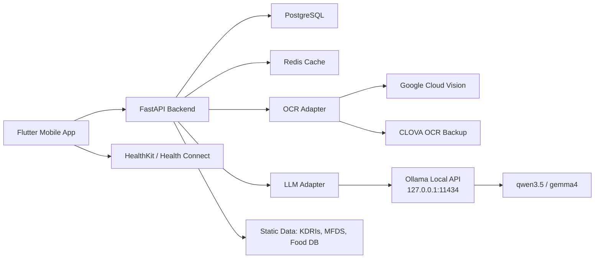

# 12. 로컬 LLM 전환 계획 (Ollama)

> **문서 정보**
> 버전: v1.0 | 작성일: 2026-05-11 | 상태: 설계 반영 | 작성자: yeong-tech

---

## 한 줄 요약

환자 개인정보와 민감 건강정보를 다루는 프로젝트 특성상 LLM 기본 경로를 외부 Claude/OpenAI API가 아니라 **MacBook Pro M4 Pro 24GB에서 실행되는 Ollama 로컬 LLM**으로 전환한다. 외부·클라우드 LLM은 비식별 테스트 또는 법무·보안 검토 후 별도 승인된 경우에만 사용한다.

---

## 1. 변경 결정

| 항목 | 기존 방향 | 변경 방향 |
|------|-----------|-----------|
| 기본 LLM | Claude API, OpenAI 백업 | Ollama 로컬 LLM |
| 실행 위치 | 외부 API 서버 | 개발자 MacBook Pro M4 Pro 24GB |
| 네트워크 전송 | OCR 텍스트가 외부 LLM으로 전송될 수 있음 | LLM 파싱은 `localhost` 내부 호출 |
| 기본 모델 | `claude-*`, `gpt-*` | `qwen3.5:*` 또는 `gemma4:*` |
| 장기 확장 | 고성능 외부 API 폴백 | 더 큰 로컬 장비, 사내 GPU 서버, 비식별 클라우드 LLM |

Ollama 공식 문서 기준으로 설치 후 기본 API 주소는 `http://localhost:11434/api`이며, Chat API는 `POST /api/chat`을 사용한다. 구조화 출력은 `format`에 `json` 또는 JSON Schema를 넣는 방식으로 지원된다.

---

## 2. 개인정보 처리 원칙

1. **환자 식별 가능 정보는 외부 LLM으로 보내지 않는다.**
2. OCR 원문, 식단 텍스트, 복약·질환 관련 문장은 기본적으로 로컬 Ollama로만 처리한다.
3. 외부 OCR은 현재 계획상 유지하되, 원본 이미지와 OCR 결과 보관 기간을 제한하고, 장기적으로 로컬 OCR 후보도 검토한다.
4. 로그에는 프롬프트 전문을 저장하지 않고 `model`, `duration_ms`, `schema_valid`, `error_code` 같은 운영 메타데이터만 저장한다.
5. DeepSeek V4 Pro처럼 현재 Ollama에서 `:cloud`로 제공되는 모델은 식별 가능 환자 데이터 처리에 사용하지 않는다. 사용하려면 비식별 처리, 보안 검토, 법무·의료자문 승인이 먼저 필요하다.

---

## 3. 권장 모델 운영안

현재 장비는 MacBook Pro M4 Pro 24GB이므로 모델 파일 크기와 OS/브라우저/IDE 메모리 사용량을 함께 고려해야 한다.

| 단계 | 모델 후보 | 공식 Ollama 표기 | 용도 | 판단 |
|------|-----------|------------------|------|------|
| 1차 기본 | Qwen 3.5 | `qwen3.5:9b` 또는 `qwen3.5:latest` | 영양제 라벨 텍스트 파싱, 식단 텍스트 파싱 | 우선 적용 |
| 1차 대안 | Gemma 4 | `gemma4:e4b` 또는 `gemma4:latest` | 구조화 출력, **Phase 2 멀티모달 보조 채널 정식 채택** (이미지 입력 검증) | 우선 적용, [docs/17 §9](./17-image-collection-consent-plan.md) 게이트 #1 통과 후 활성화 |
| 성능 비교 | Qwen 3.5 27B | `qwen3.5:27b` | 더 복잡한 한국어 라벨 | 속도·메모리 테스트 후 제한 적용 |
| 성능 비교 | Gemma 4 26B | `gemma4:26b` | 멀티모달/장문 파싱 후보 | 속도·메모리 테스트 후 제한 적용 |
| 향후 고사양 | Qwen 3.6 | `qwen3.6:27b`, `qwen3.6:35b` | 더 큰 스펙 장비 또는 사내 서버 | 현 24GB 장비에서는 보수적으로 접근 |
| 향후 보류 | DeepSeek V4 Pro | `deepseek-v4-pro:cloud` | 고성능 추론 | 클라우드 모델이므로 PHI 처리 금지 |

주의: Ollama 모델 페이지의 크기는 모델 파일 크기 기준이며, 실제 실행 시에는 컨텍스트 길이, 동시 요청 수, OS 메모리 사용량에 따라 추가 메모리가 필요하다. 24GB 장비에서는 24GB로 표시되는 모델을 기본값으로 두지 않는다.

### 3.1 멀티모달 호출 시그니처

**도입 시점**: Phase 2 후반에 별도 PR 로 도입. 본 시점(Phase 1)에는 영양제 OCR 파싱이 `src/llm/ollama.py` 의 `OllamaSupplementParser` 가 단독 운영하며, `src/services/supplement_parser.py:131` 가 그 파서를 직접 호출한다. 아래 `LLMAdapter` 인터페이스는 향후 `OllamaSupplementParser` 가 내부적으로 위임할 어댑터 계층을 정의한다.

`src/llm/base.py`의 `LLMAdapter`에 다음 추상 메서드를 추가한다. 텍스트 전용 어댑터는 `NotImplementedError`를 발생시키고, Gemma 4 등 멀티모달 가능 모델만 구현체를 제공한다.

```python
from typing import Protocol

class LLMAdapter(Protocol):
    async def analyze_text(self, prompt: str) -> LLMResult: ...

    async def analyze_multimodal(
        self,
        prompt: str,
        image_bytes: bytes,
    ) -> LLMResult:
        """이미지와 텍스트 프롬프트를 함께 받아 영양제 라벨 정보를 구조화한다.

        Args:
            prompt: 영양제 라벨 파싱 지시 프롬프트(JSON 스키마 포함).
            image_bytes: JPEG/PNG 이미지(최대 10MB, 2048px).

        Returns:
            검증된 LLMResult. JSON 스키마 위반 시 1회 재시도.

        Raises:
            NotImplementedError: 텍스트 전용 어댑터에서 호출된 경우.
        """
```

운영 진입 조건:

- `enable_multimodal_llm=true` (환경 변수 또는 `backend/src/config.py` 의 `Settings.enable_multimodal_llm`)
- [docs/17 §8](./17-image-collection-consent-plan.md) 게이트 #1 통과
- OCR 결과의 보조 검증으로만 사용. 단독으로 영양제 정보를 결정짓지 않는다.

---

## 4. 변경 아키텍처



---

## 5. 환경 변수 기준

`.env.example`에는 실제 키가 아니라 빈 값과 로컬 기본값만 둔다.

```env
LLM_PROVIDER=ollama
OLLAMA_BASE_URL=http://127.0.0.1:11434
OLLAMA_MODEL=qwen3.5:9b
OLLAMA_TIMEOUT_SEC=60
OLLAMA_TEMPERATURE=0

# 외부 LLM은 기본 비활성화. 비식별 테스트 또는 승인된 환경에서만 사용한다.
ALLOW_EXTERNAL_LLM=false
```

---

## 6. 구현 변경 사항

| 영역 | 변경 내용 |
|------|-----------|
| `src/llm/base.py` | 기존 Adapter 인터페이스 유지 |
| `src/llm/ollama.py` | 신규 `OllamaAdapter` 구현 |
| `src/llm/external.py` | 기본 비활성화, 비식별 테스트 또는 승인 환경 전용 가드 |
| `src/llm/schemas.py` | Pydantic 모델의 `model_json_schema()`를 Ollama `format`에 전달 |
| `src/llm/prompts.py` | 의료법·약사법 금지 표현과 JSON 전용 응답 규칙 유지 |
| 테스트 | mock 테스트 + 로컬 Ollama 통합 테스트 분리 |

Ollama 구조화 출력은 Pydantic JSON Schema를 `format`에 넣고, 응답을 다시 Pydantic으로 검증하는 방식으로 구현한다. 검증 실패 시 재시도는 최대 1회로 제한하고, 실패 결과는 사용자 수정 화면으로 넘긴다.

---

## 7. 로컬 실행 명령

```bash
# Ollama 앱 또는 서버 실행 후 모델 설치
ollama pull qwen3.5:9b
ollama pull gemma4:e4b

# 동작 확인
curl http://127.0.0.1:11434/api/chat \
  -H "Content-Type: application/json" \
  -d '{
    "model": "qwen3.5:9b",
    "stream": false,
    "messages": [
      {"role": "user", "content": "비타민 C 1000mg을 JSON으로 정리해줘."}
    ],
    "format": "json",
    "options": {"temperature": 0}
  }'
```

---

## 8. 검증 기준

- [ ] `ollama list`에서 기본 모델 확인
- [ ] `POST /api/chat` 로컬 호출 성공
- [ ] `ParsedSupplement.model_json_schema()` 기반 구조화 출력 검증 통과
- [ ] 인터넷 차단 상태에서도 LLM 파싱 단위 테스트 통과
- [ ] 환자 식별 가능 데이터가 외부 LLM 로그나 API 요청에 남지 않음
- [ ] `DeepSeek V4 Pro :cloud` 등 클라우드 모델은 민감정보 테스트에서 차단
- [ ] 100개 샘플 기준 파싱 성공률, 평균 응답 시간, 메모리 사용량 기록

---

## 9. 공식 참고 문서

- Ollama API Introduction: https://docs.ollama.com/api/introduction
- Ollama Chat API: https://docs.ollama.com/api/chat
- Ollama Structured Outputs: https://docs.ollama.com/capabilities/structured-outputs
- Ollama Python Library: https://github.com/ollama/ollama-python
- Ollama macOS requirements: https://docs.ollama.com/macos
- Ollama Apple GPU Metal support: https://docs.ollama.com/gpu
- Qwen 3.5 model library: https://ollama.com/library/qwen3.5
- Gemma 4 model library: https://ollama.com/library/gemma4
- Qwen 3.6 model library: https://ollama.com/library/qwen3.6
- DeepSeek V4 Pro model library: https://ollama.com/library/deepseek-v4-pro
