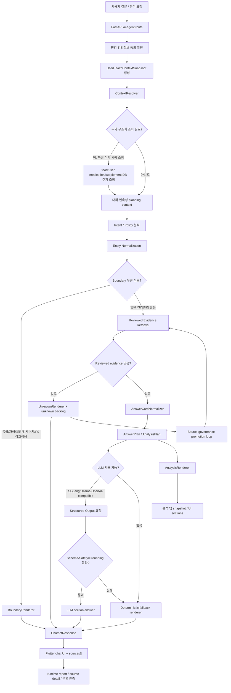

# 23. 에이전트/LLM 파이프라인 흐름 정리

> Status: pipeline summary draft
> 작성일: 2026-06-01
> 기준 worktree: `feat/ai-agent-backend-integration`
> 목적: 에이전트와 LLM 전체 흐름을 파이프라인 이미지로 만들기 위한 상세 구조 정리

## 1. 한 줄 방향

Lemon Aid의 AI는 "FAQ 몇 개에 답하는 챗봇"이 아니라, 앱의 식사, 영양제, 복약, 분석 상태를
매번 읽고, 검수된 근거만 내부 답변 프레임인 `AnswerCard`로 정규화한 뒤,
`AnswerPlan` / `AnalysisPlan`을 만들어 챗봇 탭과 분석 탭에 다르게 보여주는
개인화 건강 에이전트로 만든다.

핵심 메시지는 다음이다.

```text
LLM이 지식을 만드는 구조가 아니다.
앱 컨텍스트 + 검수 근거 + 안전 경계가 먼저 plan을 만들고,
LLM은 그 plan을 사용자에게 읽기 좋은 문장이나 section JSON으로 표현하는 역할만 한다.
```

## 2. 전체 파이프라인 요약

```text
사용자 질문 / 분석 요청
→ FastAPI route
→ 민감 건강정보 동의 확인
→ UserHealthContextSnapshot 생성
→ ContextResolver가 추가 DB 조회 필요 여부 판단
→ 대화 연속성 planning context 구성
→ intent / policy / entity normalization
→ urgent / medical boundary 선판정
→ reviewed evidence retrieval
→ AnswerCardNormalizer
→ AnswerPlan / AnalysisPlan 생성
→ LLM structured output 또는 deterministic renderer
→ SafetyGuard / grounding 검증
→ ChatRenderer / AnalysisRenderer / BoundaryRenderer / UnknownRenderer
→ API answerability + sources[] 응답
→ Flutter chat / analysis UI
→ unknown backlog / runtime report / source governance 운영 루프
```

## 3. 이미지용 최상위 레이어

파이프라인 이미지는 아래 5개 레이어로 나누면 가장 이해하기 쉽다.

```text
[User/App Input]
질문, 식사 기록, 영양제 확인, 복약 정보, 분석 결과

[Context & Planning]
동의 확인, UserHealthContextSnapshot, ContextResolver, 대화 연속성, intent/entity normalization

[Knowledge & Safety]
Boundary 선판정, reviewed evidence retrieval, AnswerCardNormalizer, unknown backlog

[LLM/Renderer]
AnswerPlan, AnalysisPlan, SGLang/Ollama structured output, deterministic fallback,
SafetyGuard, Chat/Analysis/Boundary/Unknown renderer

[Output & Operations]
Flutter chat, 분석 탭, answerability, sources[], source detail,
runtime report, source governance promotion loop
```

## 4. Mermaid 초안

아래 Mermaid는 이미지 제작 전 구조 확인용 초안이다. 실제 디자인에서는 각 노드를 카드형 블록으로
다시 배치하면 된다.



## 5. 입력 계층

입력은 단순 채팅 메시지만이 아니다. Lemon Aid agent는 앱 전체 상태를 읽는 쪽으로 설계한다.

주요 입력:

- 사용자 질문
- 오늘 식사 기록
- 최근 식사 기록
- 등록된 영양제
- 오늘 체크된 영양제
- 사용자 확인이 끝난 영양제 라벨
- 복약 정보
- 사용자 프로필의 건강축, 위험 플래그, 목표
- 오늘의 분석 snapshot
- 건강 분석 snapshot
- 사용자가 방금 본 분석 결과
- 최근 채팅에서 사용자가 직접 확인한 건강 신호

원칙:

- raw prompt를 장기 저장하지 않는다.
- raw OCR text를 챗봇 근거로 쓰지 않는다.
- raw image, EXIF, 원본 파일명은 agent 답변 경로에 넣지 않는다.
- raw LLM output이나 provider payload를 API 응답, backlog, runtime report에 복사하지 않는다.
- 사용자 확인 전 OCR preview는 근거가 아니라 후보 정보로만 본다.

## 6. API 진입 계층

중심 route는 `POST /api/v1/ai-agent/chat`이다.

route의 1차 책임:

- 민감 건강정보 동의 확인
- production-like source governance gate 확인
- 사용자 앱 컨텍스트 snapshot 생성
- DB-backed reviewed evidence retriever 연결
- ChatbotAgent 실행
- answerability와 source metadata를 mobile에 전달
- unknown이면 raw-free backlog event 기록
- agent run audit 기록

API 응답의 핵심 필드:

```text
request_id
message
provider
used_tools
safety_warnings
source_families
answerability
sources[]
requires_user_approval
```

`sources[]`에는 최소한 아래 metadata를 담는다.

```text
source_id
source_family
review_status
version_label
reviewed_at
expires_at
source_url
boundary_code optional
```

## 7. UserHealthContextSnapshot

챗봇은 매 답변 전에 `UserHealthContextSnapshot`을 읽는다. 이 snapshot은 앱 데이터 전체 dump가
아니라 raw-free 요약 계약이다.

snapshot 섹션:

```text
user_profile_summary
today_analysis_snapshot
health_analysis_snapshot
active_supplement_snapshot
recent_food_and_checklist_snapshot
chat_derived_health_signals
visible_analysis_context
```

각 섹션의 의미:

| 섹션 | 의미 | 이미지 노드 설명 |
| --- | --- | --- |
| `user_profile_summary` | 목표, 건강축, risk flag, 복약 요약 | 사용자 기본 건강 맥락 |
| `today_analysis_snapshot` | 오늘 현재 분석 결과 | 오늘 기록 기반 생활관리 상태 |
| `health_analysis_snapshot` | 누적 건강 분석 결과와 readiness | 장기/누적 분석 상태 |
| `active_supplement_snapshot` | 등록/체크된 영양제와 confirmed 성분 | 영양제 맥락 |
| `recent_food_and_checklist_snapshot` | 최근 식사, rough nutrient axes, 체크리스트 | 식사/행동 맥락 |
| `chat_derived_health_signals` | 채팅에서 사용자가 직접 확인한 신호 | 대화 기반 건강 신호 |
| `visible_analysis_context` | 사용자가 본 분석 결과 | 이 결과로 질문하기 연결 |

`visible_analysis_context`는 stale 판정을 가진다. 사용자가 분석 결과를 본 뒤 새 음식, 새 영양제
체크, 체크리스트 변경이 생기면 stale로 표시하고 최신 DB 상태를 다시 확인한다.

## 8. ContextResolver

`ContextResolver`는 현재 snapshot으로 충분한지, 특정 DB 조회가 필요한지 결정한다.

예시:

| 사용자 질문 | 처리 |
| --- | --- |
| "오늘 점심, 저녁 식단을 짜줘" | 식단 계획 요청이므로 snapshot 기반 guidance |
| "어제 점심에 내가 뭐 먹었지?" | 특정 음식 기록 조회이므로 `needs_structured_lookup` |
| "이 결과로 다시 설명해줘" | visible analysis context를 사용하되 stale 여부 확인 |
| "내가 먹는 약이랑 이 영양제 괜찮아?" | 복약 context와 entity normalization 필요 |

중요한 구분:

- 특정 기록 조회와 식단 추천은 다르다.
- "오늘", "점심", "저녁"이라는 단어가 있어도 "식단 짜줘", "추천", "어떻게 먹으면 좋아"는 계획 요청이다.
- DB에 필요한 기록이 없으면 `needs_more_info` 또는 `unknown_no_reviewed_source`로 닫는다.

## 9. 대화 연속성

짧은 후속 질문은 planning 단계에서 이전 사용자 발화 맥락을 잃지 않게 처리한다.

예시:

```text
사용자: 고혈압인데 라면 먹었어.
사용자: 그럼 저녁은?
```

두 번째 질문만 보면 일반 저녁 질문이지만, 실제로는 고혈압, 라면, 나트륨 맥락이 이어진다.
따라서 planning question에는 최근 user turn만 transient하게 붙인다.

원칙:

- assistant 답변은 factual grounding으로 쓰지 않는다.
- 최근 user turn만 사용한다.
- full conversation을 DB, snapshot, unknown backlog에 저장하지 않는다.
- deterministic fallback에서도 같은 맥락을 유지한다.

## 10. Intent / Policy 분석

질문은 answerability 중심으로 분류한다.

주요 answerability:

```text
answerable
answerable_with_caution
needs_more_info
unknown_no_reviewed_source
medical_decision_boundary
urgent_escalation
```

대표 분류:

| 질문 유형 | answerability | LLM 호출 |
| --- | --- | --- |
| 일반 식사/운동/수면 | `answerable` | 가능 |
| 만성질환 생활관리 | `answerable` 또는 `answerable_with_caution` | 가능 |
| 일반 약/영양제 주의 | `answerable_with_caution` | 가능 |
| 처방 변경, 복용량 변경 | `medical_decision_boundary` | 금지 |
| 검사수치 치료 판단 | `medical_decision_boundary` | 금지 |
| P0 병용 조합 | `medical_decision_boundary` | 금지 |
| 가슴통증, 숨참, 마비, 실신, 자해 | `urgent_escalation` | 금지 |
| reviewed source 없음 | `unknown_no_reviewed_source` | 금지 또는 unknown renderer |

## 11. Entity Normalization

약물, 영양제, 성분, 음식 표현을 canonical entity로 정규화한다. 이 단계는 안전 품질의 핵심이다.

예시:

```text
리튬 / lithium / 탄산리튬 → lithium
와파린 / warfarin → warfarin
자몽 / grapefruit → grapefruit
비타민 K / vitamin k → vitamin_k
마그네슘 / magnesium → magnesium
혈압약 / 당뇨약 / 이뇨제 → ambiguous medication class
```

넓은 약 표현 처리:

- "혈압약 + 칼륨"처럼 약 이름이 넓으면 병용 가능/불가를 단정하지 않는다.
- `needs_more_info` 또는 boundary로 닫는다.
- 정확한 약 이름, 성분명, 제품 라벨, 신장/간 기능, 최근 이상 증상을 확인하도록 안내한다.

P0 boundary 후보:

```text
p0_warfarin_vitamin_k
p0_levothyroxine_calcium_iron
p0_st_johns_wort_antidepressant
p0_grapefruit_statin
p0_potassium_salt_substitute
p0_nitrate_pde5_inhibitor
p0_lithium_selenium
```

## 12. Boundary 선판정

안전 경계는 retrieval과 LLM보다 먼저 적용한다.

Boundary 유형:

| Boundary | 예시 | 처리 |
| --- | --- | --- |
| `urgent_escalation` | 가슴 통증, 숨참, 마비, 실신 | LLM 없이 즉시 행동 안내 |
| `mental_health_risk` | 자해, 자살 생각, 극단적 굶기 | LLM 없이 안전 자원 안내 |
| `medical_decision_boundary` | 처방 변경, 검사수치 치료 판단 | 제품이 결정하지 않는다고 안내 |
| `drug_or_interaction` | P0 약물/영양제 조합 | 병용 가능/불가 단정 금지 |
| `out_of_scope` | 개인 진단/치료 결정 | 확인할 정보와 전문가 확인 지점 안내 |

Boundary 응답의 특징:

- LLM을 호출하지 않는다.
- 짧고 직접적이다.
- 개인 의료 판단을 대신하지 않는다.
- source metadata와 `boundary_code`를 남길 수 있다.
- raw prompt나 provider payload를 남기지 않는다.

## 13. Reviewed Evidence Retrieval

일반 건강 답변은 reviewed evidence를 검색한다. 현재 v1은 DB evidence row와 registry fallback
중심이다.

검색 허용 조건:

```text
review_status = reviewed
source version reviewed
expires_at >= today
user_facing_allowed = true
```

검색 제외 조건:

```text
draft
paper_candidate
deprecated
stale source
raw web search
raw OCR
raw prompt
raw LLM output
```

검색 실패 처리:

- LLM 일반 지식으로 보완하지 않는다.
- `unknown_no_reviewed_source`로 닫는다.
- 필요한 검수 지식과 확인할 정보를 안내한다.
- raw-free unknown backlog metadata를 남긴다.

## 14. AnswerCard

`AnswerCard`는 수동 FAQ 카드가 아니다. 검색된 검수 근거를 답변 직전에 정리한 내부 답변
프레임이다.

핵심 필드:

```text
card_id
answerability
topic
intent
condition
allowed_guidance
specific_examples
checklist
caution_conditions
must_not_say
source_id
source_url
source_family
source_version_id
version_label
review_status
reviewed_at
expires_at
grounding_snippet_ids
```

`AnswerCardNormalizer`는 아래 조건을 만족하지 못하는 후보를 버린다.

- source metadata 없음
- reviewed status 아님
- stale source
- allowed guidance 없음
- specific examples 없음
- checklist 없음
- must_not_say 없음
- topic 관련도 낮음
- 금지 표현이 allowed guidance에 섞임

## 15. AnswerPlan / AnalysisPlan

`AnswerCard` 위에는 공통 planning layer를 둔다. 이 layer가 챗봇과 분석 탭을 연결한다.

`AnswerPlan`은 챗봇 답변용 계획이다.

```text
intent
answer_depth
context_used
personalization_level
readiness_level
problem_axes
nutrient_priorities
food_first_actions
supplement_considerations
behavior_actions
safety_boundaries
source_basis
ctas
must_not_say
```

`AnalysisPlan`은 분석 탭용 계획이다.

```text
score_status
score
readiness_level
strengths
priority_adjustments
nutrient_priorities
recommended_foods
checklist_actions
missing_records
safety_boundaries
ctas
```

같은 근거라도 질문 흐름과 사용자 기록에 따라 다른 우선순위가 나온다. 예를 들어 같은 나트륨
근거라도 라면을 먹은 사용자에게는 국물, 소스, 장류, 가공육을 먼저 보게 하고, 단백질 부족 기록이
있을 때만 두부, 달걀, 생선구이 같은 후보를 강하게 제안한다.

## 16. LLM 계층

LLM은 판단자가 아니라 표현자다.

현재 지원 흐름:

- Ollama
- SGLang
- OpenAI-compatible chat completions endpoint

SGLang 경로:

```text
SGLANG_BASE_URL=http://127.0.0.1:30000/v1
endpoint=/chat/completions
response_format=json_schema
```

LLM prompt에 들어가는 것:

- `AnswerCard` summary
- `AnswerPlan` prompt summary
- 허용 source family
- 금지 규칙
- section JSON schema

LLM prompt에 들어가면 안 되는 것:

- raw prompt
- raw OCR
- raw LLM output
- internal trace
- source registry 전체 dump
- draft source
- paper candidate
- "모델이 아는 일반 지식으로 보완하라"는 규칙

LLM 출력 처리:

```text
JSON schema 성공
→ section answer로 렌더링
→ SafetyGuard / grounding check
→ 통과 시 사용자 응답

JSON schema 실패 또는 forbidden wording
→ raw payload 비노출
→ deterministic fallback
```

## 17. Renderer 계층

Renderer는 역할별로 분리한다.

```text
ChatRenderer
AnalysisRenderer
BoundaryRenderer
UnknownRenderer
CardAnswerRenderer
```

역할:

| Renderer | 역할 |
| --- | --- |
| `ChatRenderer` | `AnswerPlan`을 짧은 전문가 코칭형 챗봇 답변으로 변환 |
| `AnalysisRenderer` | `AnalysisPlan`을 분석 탭 점수, 섹션, 체크리스트, CTA로 변환 |
| `BoundaryRenderer` | 응급/복약/검사수치 boundary를 LLM 없이 생성 |
| `UnknownRenderer` | reviewed source가 없을 때 fail-closed 응답 생성 |
| `CardAnswerRenderer` | `AnswerCard` 기반 deterministic answer/fallback 생성 |

챗봇 기본 답변의 6요소:

```text
현재 기록/상황 요약
핵심 건강축 또는 영양축
오늘 먹을 수 있는 음식 후보
줄일 음식/습관
오늘 할 행동
위험/복약/검사수치 boundary
```

## 18. Safety / Grounding

SafetyGuard는 LLM이 만든 문장을 최종 검증한다.

차단 대상:

- 진단 단정
- 치료 결정
- 처방 변경
- 복용량 변경
- 병용 가능/불가 단정
- reviewed card에 없는 새 수치 claim
- `must_not_say` 유사 표현
- draft/paper/internal source 노출
- raw prompt, raw OCR, raw LLM response 노출

fallback 조건:

```text
required section 없음
card specificity 부족
unsupported fact 생성
unsupported numeric claim 생성
forbidden phrase 포함
source grounding 실패
structured JSON parse 실패
```

## 19. Unknown Backlog 운영 루프

모르는 질문은 그냥 사라지지 않는다. 다만 raw question을 저장하지 않고 구조화 metadata만 남긴다.

운영 루프:

```text
unknown_no_reviewed_source
→ topic/category/intent/retrieval_status 저장
→ source owner가 공식 source 후보 확인
→ medical_sources / source_versions 추가
→ evidence item 또는 policy boundary 작성
→ allowed/blocked wording 검수
→ golden test 추가
→ smoke에서 sources[] 확인
→ 다음부터 answerable 또는 boundary로 승격
```

unknown backlog status:

```text
open
reviewing
promoted
dismissed
deprecated
```

중요한 점:

- unknown backlog는 학습 데이터 dump가 아니다.
- raw prompt, raw chat transcript, raw OCR은 저장하지 않는다.
- 운영자가 다음 reviewed evidence PR을 만들기 위한 queue다.

## 20. DB / Source Governance

사용자 기록 DB와 의료 source governance DB는 책임이 다르다.

사용자 DB:

```text
food_records
user_medications
confirmed supplement records
agent memory
analysis snapshots
```

의료 source governance DB:

```text
medical_sources
medical_source_versions
medical_evidence_items
medical_policy_boundaries
medical_rag_chunks
chatbot_unknown_knowledge_events
```

분리 원칙:

- 사용자 삭제/동의/프라이버시는 사용자 DB 책임이다.
- source review/expiry/audit는 medical source governance 책임이다.
- 사용자 DB record는 medical source row를 삭제하지 않는다.
- medical source row는 사용자별 민감 정보를 담지 않는다.

## 21. RAG 예정 흐름

현재는 RAG/vector search를 먼저 붙이지 않았다. source governance와 `AnswerCard` gate를 먼저 만든
상태다.

예정 흐름:

```text
medical_evidence_items / medical_policy_boundaries
→ reviewed, not expired filter
→ medical_rag_chunks 생성
→ tsvector GIN index
→ pgvector embedding + HNSW index
→ keyword top-N + vector top-N
→ RRF 결합
→ low confidence evaluator
→ AnswerCardNormalizer
→ renderer
```

RAG 원칙:

- raw web scrape/OCR chunk는 금지한다.
- reviewed chunk만 index에 들어간다.
- retrieval 전에 review status와 expiry filter를 적용한다.
- vector 결과도 prompt에 바로 넣지 않는다.
- 반드시 `AnswerCardNormalizer`를 통과한다.
- confidence가 낮으면 unknown 또는 needs_more_info로 닫는다.

## 22. Flutter UI

Flutter는 backend chat response에서 `answerability`와 `sources[]`를 파싱한다.

UI에서 보여줄 수 있는 것:

- 답변 본문
- answerability label
- provider
- source chip 또는 source basis panel
- source_id
- source_family
- review_status
- version_label
- reviewed_at
- expires_at
- boundary_code

UI에서 판단하면 안 되는 것:

- 병용 가능/불가
- 치료 필요성
- 검사수치 해석
- source metadata만 보고 medical decision 생성

## 23. 현재 구현 완료 상태

현재 worktree 기준 1차 구현된 축:

```text
Answerability / AnswerCard / AnswerCardNormalizer
DB-backed evidence retriever
unknown_no_reviewed_source fail-closed
unknown backlog DB / report
P0 boundary code
entity normalization
AnswerPlan / AnalysisPlan
ChatRenderer / AnalysisRenderer 분리
SGLang structured output + fallback
FastAPI chat response sources[]
Flutter source parsing / source UI 일부
food record v1
user medication context
confirmed supplement snapshot
today analysis / health analysis snapshot
runtime raw-free observability
```

남은 핵심:

- reviewed evidence coverage 확장
- unknown backlog topic을 공식 source, reviewed evidence, boundary, golden test, smoke 세트로 승격
- `medical_rag_chunks` 기반 hybrid retrieval 설계와 eval
- source promotion/deprecation/expiry/audit 운영 절차 강화
- provider별 structured output capability matrix
- Flutter source detail UX 고도화
- 분석 점수가 건강 위험 점수처럼 보이지 않게 UI 문구와 golden test 유지

## 24. 이미지 제작용 노드 목록

이미지 제작 시 아래 노드를 그대로 박스로 사용할 수 있다.

### Input

- User Question
- Chat Conversation
- Food Records
- Confirmed Supplement Snapshot
- User Medication Context
- Today Analysis Snapshot
- Health Analysis Snapshot
- Visible Analysis Context

### Context

- Consent Gate
- UserHealthContextSnapshot
- ContextResolver
- Structured DB Lookup
- Conversation Continuity

### Planning

- Policy Classifier
- Intent Analysis
- Entity Normalization
- Answerability Decision
- AnswerPlan
- AnalysisPlan

### Knowledge

- Source Governance DB
- Reviewed Evidence Retriever
- AnswerCardNormalizer
- AnswerCard
- Medical Policy Boundary
- Unknown Backlog

### LLM / Renderer

- SGLang / Ollama / OpenAI-compatible Client
- JSON Schema Response Format
- SafetyGuard
- Deterministic Fallback
- ChatRenderer
- AnalysisRenderer
- BoundaryRenderer
- UnknownRenderer

### Output

- ChatbotResponse
- `answerability`
- `sources[]`
- Flutter Chat UI
- Analysis Tab UI
- Source Detail UI
- Runtime Report

### Operations

- Unknown Topic Report
- Source Promotion
- Evidence Review
- Boundary Seed
- Golden Test
- Smoke Test
- Expiry / Deprecation Audit

## 25. 이미지에서 강조할 문장

이미지 중앙 또는 하단 설명 문구로는 아래 문장이 적합하다.

```text
Lemon Aid Agent는 LLM-first chatbot이 아니라
context-first, reviewed-evidence-first, safety-boundary-first health agent다.
LLM은 최종 표현을 돕고, 건강 사실과 의료 판단은 검수 근거와 deterministic policy가 제한한다.
```

한국어 버전:

```text
Lemon Aid Agent는 LLM이 건강 지식을 만들어내는 챗봇이 아니다.
앱 컨텍스트와 검수 근거, 안전 경계를 먼저 통과한 뒤
LLM은 안전하게 표현하는 역할만 맡는다.
```
