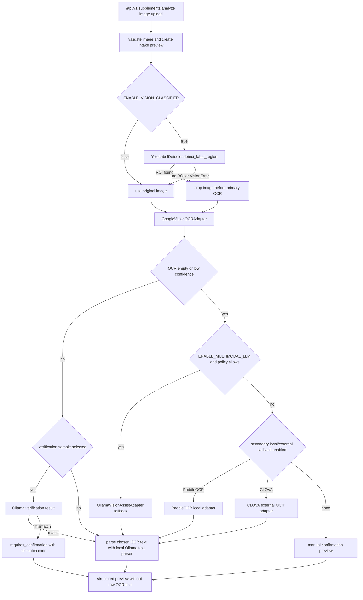

# 40. OCR 3-Tier 확장 상세 설계 및 구현 플랜

> **문서 정보**
> 버전: v1.1 | 작성일: 2026-05-18 | 상태: PaddleOCR primary 전환 반영 (docs/33 v1.3 align) | 작성자: yeong-tech

---

## 0. 결론

PaddleOCR primary 전환(docs/33 v1.3) 이후 다음 단계는 새로운 OCR 체인을 한 번에 켜는 작업이 아니라, 이미 존재하는 orchestration 지점에 **YOLO ROI**, **PaddleOCR primary OCR**, **Ollama local vision assist**, **Google Vision/CLOVA optional external fallback**, **fixture evaluation report**를 단계적으로 연결하는 작업이다.

이번 문서의 운영 원칙은 다음과 같다.

- PaddleOCR(`paddleocr_local`)이 default primary OCR이며 `OCR_PRIMARY_PROVIDER=paddleocr` + `ENABLE_LOCAL_OCR=true`가 운영 기본값이다.
- Google Vision은 `ALLOW_EXTERNAL_OCR=true` + `EXTERNAL_OCR_PROCESSING` 동의가 켜진 환경에서만 활성화되는 외부 비교/스모크 옵션이다.
- YOLO는 OCR 전처리용 ROI detector이며, OCR 또는 성분 추론 엔진으로 취급하지 않는다.
- Ollama vision은 local-only fallback/verification 보조 채널이며, `OCRResult.confidence`를 만들어낸다고 가정하지 않는다.
- PaddleOCR과 CLOVA의 우선순위는 정확도 수치를 임의로 확정하지 않고 fixture benchmark 결과로 재검토한다.
- raw image와 raw OCR text는 저장하지 않고, preview와 hash/metrics만 남긴다.
- fixture report가 나오기 전까지 정확도·latency는 **목표 또는 측정 항목**일 뿐, 달성 수치로 기록하지 않는다.

### 0.1 2026-05-15 구현 반영 상태

이 문서 기준으로 1차 구현을 반영했다.

| Phase | 반영 상태 | 구현 요약 |
| --- | --- | --- |
| O3T-1 adapter composition | 완료 | `build_supplement_image_analysis_adapters()`가 primary OCR, YOLO ROI, Ollama vision assist, optional fallback OCR adapters를 설정 기반으로 조립한다. |
| O3T-2 YOLO ROI crop | 완료 | `OCR_ROI_PREPROCESSING_POLICY=crop_before_primary`일 때 primary OCR 입력을 crop PNG로 바꾼다. crop 실패 시 원본 이미지 OCR로 graceful fallback한다. |
| O3T-3 Ollama fallback/verification | 1차 완료 | 기존 fallback 정책을 route factory에 연결했고, `ENABLE_MULTIMODAL_VERIFICATION` sample 검증 경로와 mismatch warning code를 추가했다. |
| O3T-4 PaddleOCR fallback | 1차 완료 | `PaddleOCRAdapter`를 optional dependency 기반 lazy-load adapter로 추가했다. 기본값은 off다. |
| O3T-5 CLOVA fallback | 1차 완료 | `ClovaOCRAdapter`를 external OCR gate 뒤 optional fallback으로 추가했다. 기본값은 off다. |
| O3T-6 fixture report | 완료 | `backend/scripts/evaluate_ocr_three_tier.py`, manifest example, redacted report template을 추가했다. P1 fixture 평가 리포트 gate는 `docs/Nutrition-docs/43-ocr-3-tier-fixture-evaluation-report-plan.md`에서 상세화한다. |
| O3T-7 발주처 review gate | 부분 완료 | OCR evaluation report template은 추가했다. provider sign-off 문서와 checklist 연결은 별도 문서 보강 단계로 남긴다. |

검증 결과:

```bash
cd 03_lemon_healthcare/yeong-Lemon-Aid/backend
.venv/bin/python -m ruff check Nutrition-backend/src Nutrition-backend/tests scripts
.venv/bin/python -m mypy Nutrition-backend/src/ocr Nutrition-backend/src/vision Nutrition-backend/src/llm Nutrition-backend/src/services/supplement_image_analysis.py Nutrition-backend/src/api/v1/supplements.py Nutrition-backend/src/config.py scripts/evaluate_ocr_three_tier.py
.venv/bin/python -m pytest -q --no-cov
.venv/bin/python scripts/evaluate_ocr_three_tier.py --manifest ../data/supplement_images/manifests/fixtures/supplement_labels/manifest.example.jsonl --output-dir /private/tmp/lemon-ocr-eval-smoke
```

최신 실행 결과: `357 passed, 2 skipped`; ruff와 mypy 통과. 실제 Google/CLOVA smoke는 opt-in gate 뒤에 남겨두었다.

---

## 1. 현재 구현 상태 확인

| 영역 | 현재 코드 기준 상태 | 남은 갭 |
| --- | --- | --- |
| Primary OCR | `backend/Nutrition-backend/src/ocr/factory.py`에서 `OCR_PRIMARY_PROVIDER=google_vision`일 때 `GoogleVisionOCRAdapter`를 생성한다. | route-level adapter factory가 아직 primary OCR만 주입한다. vision/multimodal/local fallback adapter까지 한 번에 조립하는 factory가 필요하다. |
| Analyze endpoint | `backend/Nutrition-backend/src/api/v1/supplements.py`의 `get_supplement_image_analysis_adapters()`는 `SupplementImageAnalysisAdapters(ocr=...)`만 반환한다. | `vision=YoloLabelDetector(...)`, `multimodal_ocr=OllamaVisionAssistAdapter(...)`, optional fallback provider 주입이 필요하다. |
| YOLO ROI | `backend/Nutrition-backend/src/vision/yolo.py`와 `backend/Nutrition-backend/src/vision/ultralytics_runner.py`에 gated detector와 Ultralytics runner가 있다. | 실제 analyze path에서 adapter가 주입되지 않는다. 또한 primary OCR(PaddleOCR) 입력을 ROI crop으로 바꾸는 전처리 경로가 필요하다. |
| ROI crop helper | `backend/Nutrition-backend/src/vision/preprocessing.py`에 `crop_image_to_bounding_box()`가 있다. | Ollama vision assist는 자체 crop을 하지만, Google Vision adapter는 현재 `label_region` metadata를 직접 crop하지 않는다. |
| Ollama vision assist | `backend/Nutrition-backend/src/llm/ollama_vision.py`에 local-only OCR-like fallback adapter가 있다. 결과 confidence는 `None`이다. | route factory 주입, fallback 실패 처리, cross-check verification 모델이 필요하다. |
| Fallback policy | `Settings.multimodal_ocr_assist_policy`는 `disabled`, `ocr_empty_only`, `low_confidence`를 지원한다. | PaddleOCR/CLOVA 후순위 fallback selector와 verification sample policy가 없다. |
| Fixture report | 현재 fixture 기준 정확도/latency report runner가 없다. | 공개/동의된 라벨 fixture manifest, benchmark script, redacted report template이 필요하다. |

---

## 2. 공식 문서 기준

이 설계는 2026-05-15 기준 아래 공식 문서를 확인한 뒤 작성했다. 여기에서 확인하지 못한 기능이나 성능 수치는 구현 확정값으로 쓰지 않는다.

| 기술 | 공식 문서에서 확인한 사실 | 우리 프로젝트 설계 반영 |
| --- | --- | --- |
| Google Cloud Vision OCR | Cloud Vision OCR은 `TEXT_DETECTION`과 `DOCUMENT_TEXT_DETECTION`을 제공하며, `DOCUMENT_TEXT_DETECTION`은 dense text/document OCR 응답에 page/block/paragraph/word 정보를 포함한다. URL: <https://cloud.google.com/vision/docs/ocr> | 영양제 라벨처럼 밀집 텍스트가 많은 입력은 MVP와 동일하게 `document_text_detection`을 기본 feature로 둔다. |
| Ultralytics YOLO predict | Ultralytics predict 결과는 `Results`/`boxes`를 통해 `xyxy`, `conf`, `cls`를 제공한다. URL: <https://docs.ultralytics.com/modes/predict/> | 현재 `UltralyticsYoloRunner`의 `boxes.xyxy/conf/cls` 정규화 방향은 공식 API 형태와 맞다. 단, pretrained 모델이 supplement-label ROI 품질을 보장한다고 보지 않는다. |
| Ollama vision | Ollama vision 모델은 메시지의 `images` 배열로 이미지 입력을 받을 수 있다. URL: <https://docs.ollama.com/capabilities/vision> | `OllamaVisionAssistAdapter`는 image bytes를 base64로 전달하는 현재 구조를 유지한다. |
| Ollama structured output | Ollama는 `format`에 JSON 또는 JSON Schema를 넣는 structured output 패턴을 제공한다. URL: <https://docs.ollama.com/capabilities/structured-outputs> | visible text 후보와 verification 결과는 Pydantic schema로 검증한다. |
| PaddleOCR | PaddleOCR 3.x 문서는 `PaddleOCR()` 파이프라인, `predict()` 사용, detection/recognition model dir와 device 설정을 제공한다. URL: <https://www.paddleocr.ai/main/en/version3.x/pipeline_usage/OCR.html> | PaddleOCR fallback은 optional dependency와 local model cache가 준비된 환경에서만 enable한다. |
| NAVER Cloud CLOVA OCR | CLOVA OCR은 API Gateway invoke URL과 `X-OCR-SECRET`을 사용하며, image `data` 또는 `url`, `requestId`, `timestamp`, `images` 등을 요청 구조로 사용한다. URL: <https://guide.ncloud-docs.com/docs/en/clovaocr-example01>, <https://api-fin.ncloud-docs.com/docs/clova-ocr-template-api> | CLOVA는 external OCR consent, secret handling, vendor review가 끝난 뒤 optional fallback으로만 둔다. |
| NAVER Cloud CLOVA 운영 제한 | CLOVA OCR prerequisite 문서는 계정별 권장 호출 성능, 회전 문서 주의, 전송 이미지/결과 저장 정책 관련 안내를 제공한다. URL: <https://guide.ncloud-docs.com/docs/en/clovaocr-spec> | CLOVA를 기본 fallback으로 켜지 않고, review gate에서 throughput·보관정책·동의 문구를 검토한다. |

---

## 3. 브레인스토밍 정리

### 3.1 YOLO ROI 실제 추론 연결

선택지는 세 가지다.

| 선택지 | 장점 | 리스크 | 결정 |
| --- | --- | --- | --- |
| A. 현재 YOLO runner를 route factory에 바로 주입 | 구현량이 작고 현재 코드 구조와 맞다. | `yolov8n.pt` 기본 모델은 supplement label 전용 class를 보장하지 않는다. | 채택하되 기본 off. smoke는 runner 동작만 확인한다. |
| B. Google Vision adapter 내부에서 `label_region` crop | adapter 단위로 독립적이다. | provider마다 crop 중복 구현이 생긴다. | 보류. |
| C. service에서 primary OCR 입력을 crop image로 변환 | Google/Paddle/CLOVA가 같은 전처리 입력을 받는다. | metadata width/height를 crop 기준으로 재계산해야 한다. | 채택. `OCRImageInput`을 만들기 전에 crop 적용. |

결정: YOLO 연결은 `ENABLE_VISION_CLASSIFIER=true`와 explicit sign-off 뒤에서만 route factory에 주입한다. 실제 OCR 품질 개선은 "YOLO box를 찾았다"가 아니라 "crop된 이미지로 primary OCR이 개선됐다"를 fixture report로 확인해야 한다.

### 3.2 Ollama multimodal fallback/verification 연결

Ollama vision assist는 두 모드로 분리한다.

| 모드 | 트리거 | 출력 | 저장 정책 |
| --- | --- | --- | --- |
| Fallback | primary OCR이 비어 있거나 confidence가 낮을 때 | visible text 후보를 newline text로 변환해 parser에 전달 | raw 후보 text 저장 금지. downstream parser가 hash와 structured preview만 저장. |
| Verification | primary OCR이 통과했더라도 sample rate 또는 high-risk rule에 걸릴 때 | `match`, `mismatch_reasons`, `requires_confirmation` 같은 검증 결과 | raw OCR text와 raw image 저장 금지. mismatch code와 aggregate metric만 저장. |

주의: 현재 `OllamaVisionAssistAdapter`는 `confidence=None`을 반환한다. 따라서 fallback 채택 여부는 "Ollama confidence"가 아니라 다음 기준으로 판단해야 한다.

- schema validation 성공 여부
- visible text fragment 수
- 금지 표현 또는 추론성 문구 포함 여부
- primary OCR과의 normalized token overlap 또는 `difflib.SequenceMatcher` 기반 similarity
- 사용자가 확인해야 할 low-confidence field 존재 여부

### 3.3 PaddleOCR local fallback vs CLOVA fallback 우선순위

정확도 우선순위는 fixture benchmark 전에는 확정하지 않는다. 다만 운영 기본값은 다음처럼 둔다.

1. PaddleOCR primary OCR (`paddleocr_local`)
2. Ollama local vision fallback 또는 verification
3. Google Vision external OCR (`ALLOW_EXTERNAL_OCR=true` + `EXTERNAL_OCR_PROCESSING` 동의 시에만)
4. CLOVA OCR external fallback (기본 OFF + vendor review 필요)
5. manual confirmation

이 순서의 이유는 정확도 확정이 아니라, 환자 정보의 외부 전송과 비용/secret/vendor 검토면에서 local primary를 먼저 활용하고 외부 provider는 명시 동의 게이트를 거친 뒤에만 활성화하는 것이 프로젝트 기본 안전 원칙과 맞기 때문이다. Google Vision과 CLOVA는 한국어 OCR 정확도 상한 측정 후보로 유지하되, external OCR consent와 발주처 vendor review가 끝나기 전에는 기본 off로 둔다.

### 3.4 Fixture report

보고서는 성능 숫자를 문서에 임의로 적는 방식이 아니라, 같은 fixture를 같은 script로 반복 실행해서 생성해야 한다.

필수 측정 항목:

- OCR text non-empty rate
- structured parser success rate
- ingredient name normalized F1
- amount/unit normalized exact match
- user confirmation escalation rate
- provider fallback rate
- provider error rate
- p50/p95/p99 latency
- ROI detection success rate
- ROI crop 사용 여부별 OCR 결과 차이
- raw image/raw OCR text가 artifact에 남지 않았는지 확인

fixture 구성 원칙:

- 사용자 실제 처방전·검사표·민감 이미지 사용 금지
- 공개 이미지, 직접 촬영 샘플, 또는 명시 동의된 테스트 라벨만 사용
- repository에는 raw image를 넣지 않고 manifest schema와 synthetic/example fixture만 둔다
- report에는 raw OCR text 대신 normalized field-level diff와 hash만 남긴다

### 3.5 발주처 리뷰 게이트 산출물

발주처 리뷰는 기능 데모가 아니라 운영 가능성 판단 자료가 되어야 한다.

| 게이트 | 산출물 | 통과 기준 |
| --- | --- | --- |
| YOLO ROI gate | model provenance, license review, ROI fixture report, failure-mode table | ROI 실패 시 원본 OCR로 graceful fallback하고, 모델 라이선스 리스크가 정리되어야 한다. |
| Ollama vision gate | local-only proof, model readiness log, prompt/JSON schema, forbidden-output tests | 외부 LLM 송출이 없고, visible text 외 추론 문구가 차단되어야 한다. |
| PaddleOCR gate | optional dependency install note, model cache policy, local runtime benchmark | 기본 CI와 production image를 불필요하게 무겁게 만들지 않아야 한다. |
| CLOVA gate | NCP invoke URL/secret handling, consent copy, vendor/security review note | external OCR 처리 동의와 secret 관리가 문서화되어야 한다. |
| Fixture report gate | reproducible report command, redacted output, pass/fail criteria | 수치가 임의 작성이 아니라 fixture 실행 결과여야 한다. |

---

## 4. 목표 아키텍처



---

## 5. 설정 설계

현재 설정은 non-P1 기능을 default-off로 두는 방향이 맞다. 새 설정도 같은 원칙을 따른다.

```python
# ROI preprocessing
ocr_roi_preprocessing_policy: Literal["disabled", "detect_only", "crop_before_primary"] = "disabled"

# Ollama verification
enable_multimodal_verification: bool = False
multimodal_verification_sample_rate: float = Field(default=0.0, ge=0.0, le=1.0)
multimodal_verification_threshold: float = Field(default=0.80, ge=0.0, le=1.0)

# Local OCR fallback
enable_local_ocr: bool = False
local_ocr_provider: Literal["paddleocr"] = "paddleocr"
local_ocr_language: str = "korean"
local_ocr_device: str | None = None
local_ocr_confidence_threshold: float = Field(default=0.75, ge=0.0, le=1.0)

# External fallback
enable_clova_ocr: bool = False
clova_ocr_api_url: str | None = None
clova_ocr_secret: SecretStr | None = None
```

Production validator 추가 원칙:

- `ocr_roi_preprocessing_policy != "disabled"`이면 `ENABLE_VISION_CLASSIFIER=true`와 gate #2 sign-off를 요구한다.
- `enable_multimodal_verification=true`이면 `ENABLE_MULTIMODAL_LLM=true`, local Ollama URL, gate #1 sign-off를 요구한다.
- `enable_local_ocr=true`이면 optional dependency 설치와 model cache/readiness check를 요구한다.
- `enable_clova_ocr=true`이면 `ALLOW_EXTERNAL_OCR=true`, `EXTERNAL_OCR_PROCESSING` consent, `CLOVA_OCR_API_URL`, `CLOVA_OCR_SECRET`을 요구한다.
- `enable_clova_ocr=true`와 `ENVIRONMENT=production` 조합은 발주처 vendor/security sign-off 문서 없이는 막는다.

---

## 6. 구현 플랜

### Phase O3T-0. 문서 기준선 정리

목표: docs/33의 개념 설계와 현재 Google Vision MVP 구현 상태를 분리한다.

작업:

- `docs/Nutrition-docs/33-three-tier-ocr-pipeline-implementation-guide.md` 상단에 현재 구현 상태와 `docs/40` 링크를 추가한다.
- docs/33의 성능·모델 태그·비용 수치가 fixture 결과로 오해되지 않도록 주의 문구를 둔다.
- `docs/40`을 3-tier 확장 구현의 최신 실행 플랜으로 사용한다.

검증:

```bash
git diff --check -- 03_lemon_healthcare/yeong-Lemon-Aid/docs/Nutrition-docs/33-three-tier-ocr-pipeline-implementation-guide.md 03_lemon_healthcare/yeong-Lemon-Aid/docs/Nutrition-docs/40-ocr-3-tier-expansion-design-plan.md
```

### Phase O3T-1. Adapter composition factory 확장

목표: `/supplements/analyze`에서 OCR, YOLO, Ollama vision assist adapter가 설정에 맞게 조립되도록 한다.

작업 파일:

- `backend/Nutrition-backend/src/ocr/factory.py`
- `backend/Nutrition-backend/src/api/v1/supplements.py`
- `backend/Nutrition-backend/tests/unit/ocr/test_ocr_factory.py`
- `backend/Nutrition-backend/tests/integration/api/test_supplement_analyze_google_vision.py`

작업 내용:

- `build_supplement_image_analysis_adapters(settings)`를 추가한다.
- primary OCR은 현재 `build_supplement_ocr_adapter(settings)`를 재사용한다.
- `ENABLE_VISION_CLASSIFIER=true`이면 `YoloLabelDetector(settings)`를 주입한다.
- `ENABLE_MULTIMODAL_LLM=true`이고 `multimodal_ocr_assist_policy != "disabled"`이면 `OllamaVisionAssistAdapter(settings)`를 주입한다.
- 설정 미충족 시 500이 아니라 기존 `ocr_provider_unconfigured`와 같은 안전한 503 계열 오류로 변환한다.

테스트:

- OCR disabled면 모든 adapter가 `None`.
- Google Vision만 enabled면 `ocr`만 존재.
- Vision flag enabled면 `vision`이 존재.
- Multimodal policy enabled면 `multimodal_ocr`가 존재.
- missing gate/secret은 fail closed.

### Phase O3T-2. YOLO ROI crop을 primary OCR 입력에 실제 적용

목표: ROI가 검출되면 Google Vision에 원본이 아니라 crop image를 보낸다.

작업 파일:

- `backend/Nutrition-backend/src/services/supplement_image_analysis.py`
- `backend/Nutrition-backend/src/vision/preprocessing.py`
- `backend/Nutrition-backend/tests/unit/services/test_supplement_image_analysis.py`
- `backend/Nutrition-backend/tests/unit/vision/test_preprocessing.py`

작업 내용:

- `_prepare_primary_ocr_image_input(...)` helper를 추가한다.
- `ocr_roi_preprocessing_policy == "crop_before_primary"`이고 `label_region`이 있으면 `crop_image_to_bounding_box()`를 호출한다.
- crop image의 mime type은 `image/png`, width/height는 crop box 기준으로 재계산한다.
- crop 실패 시 primary OCR 전체를 실패시키지 않고 원본 이미지로 fallback한다. 단, warning code를 남긴다.
- ROI metadata는 response에서 `vision_roi_used=true`로 유지하되 raw crop을 저장하지 않는다.

테스트:

- ROI 있음 + crop policy enabled → OCR adapter가 crop bytes를 받는다.
- ROI 있음 + crop policy disabled → OCR adapter가 원본 bytes를 받는다.
- crop 실패 → 원본 OCR로 진행하고 warning code가 남는다.
- raw image/crop bytes가 DB field에 저장되지 않는다.

### Phase O3T-3. Ollama fallback과 verification 분리

목표: fallback과 cross-check를 하나의 "대체 OCR"로 섞지 않는다.

작업 파일:

- `backend/Nutrition-backend/src/llm/ollama_vision.py`
- `backend/Nutrition-backend/src/services/supplement_image_analysis.py`
- `backend/Nutrition-backend/src/models/schemas/supplement_image.py`
- `backend/Nutrition-backend/tests/unit/llm/test_ollama_vision_assist.py`
- `backend/Nutrition-backend/tests/unit/services/test_supplement_image_analysis.py`

작업 내용:

- 현재 `extract_text()` fallback 경로는 유지한다.
- 새 schema `OllamaVisionVerificationResult`를 추가한다.
- `verify_against_ocr(image, ocr_text_hash_or_text_for_in_memory_compare)` 같은 내부 method를 설계한다. DB에는 raw text를 저장하지 않는다.
- in-memory 비교 후 `requires_confirmation`, `mismatch_codes`, `similarity_score`만 preview metadata에 반영한다.
- `confidence=None` 결과를 confidence threshold처럼 쓰지 않는다.

테스트:

- primary OCR low confidence + policy `low_confidence` → Ollama fallback 호출.
- primary OCR success + sample rate 0 → verification 미호출.
- primary OCR success + sample rate 1 → verification 호출.
- mismatch result → `requires_confirmation` 또는 warning code가 response에 나타난다.
- Ollama unavailable → primary OCR 결과를 버리지 않는다.

### Phase O3T-4. PaddleOCR local fallback adapter

목표: external provider를 하나 더 늘리기 전에 local OCR fallback을 optional로 검증한다.

작업 파일:

- `backend/Nutrition-backend/src/ocr/providers/paddle.py`
- `backend/Nutrition-backend/src/ocr/factory.py`
- `backend/pyproject.toml`
- `backend/Nutrition-backend/tests/unit/ocr/test_paddle_provider.py`

작업 내용:

- optional dependency group을 추가한다. 기본 CI dependency에는 넣지 않는다.
- PaddleOCR import는 adapter 내부 lazy import로 처리한다.
- model loading은 cache한다.
- image bytes는 temp file 없이 memory path가 가능하면 memory path를 우선 검토한다. 공식 API와 버전 차이로 memory path가 불안정하면 `TemporaryDirectory`를 사용하고 즉시 삭제한다.
- output은 `OCRResult(provider="paddleocr_local", confidence=mean_score_or_none)`로 정규화한다.

테스트:

- dependency 없음 → 명확한 `OCRError`.
- fake Paddle client → text/confidence flatten 검증.
- local OCR disabled → fail closed.

### Phase O3T-5. CLOVA OCR optional fallback adapter

목표: CLOVA는 기본 off 외부 OCR 후보로만 구현한다.

작업 파일:

- `backend/Nutrition-backend/src/ocr/providers/clova.py`
- `backend/Nutrition-backend/src/ocr/factory.py`
- `backend/Nutrition-backend/tests/unit/ocr/test_clova_provider.py`
- `backend/Nutrition-backend/tests/integration/ocr/test_clova_smoke.py`

작업 내용:

- `X-OCR-SECRET` header와 `requestId`, `timestamp`, `images` body 구조를 구현한다.
- secret과 invoke URL은 log/audit에 남기지 않는다.
- actual smoke test는 `RUN_CLOVA_OCR_SMOKE=1` 같은 opt-in gate 뒤에서만 실행한다.
- `ALLOW_EXTERNAL_OCR=false`이면 adapter 생성 자체를 막는다.

테스트:

- fake response의 `fields[].inferText`, `inferConfidence` flatten.
- missing URL/secret fail closed.
- API error response를 safe `OCRError`로 변환.

### Phase O3T-6. Fixture evaluation report

목표: 3-tier 확장 품질을 말이 아니라 재현 가능한 report로 판단한다.

작업 파일:

- `backend/scripts/evaluate_ocr_three_tier.py`
- `data/supplement_images/manifests/fixtures/supplement_labels/manifest.example.jsonl`
- `docs/Nutrition-docs/templates/ocr-three-tier-evaluation-report.md`
- `outputs/generated/ocr-eval/`는 생성물로 두되 git 추적 여부를 별도 결정한다.

manifest 예시:

```json
{"fixture_id":"public-label-001","image_path":"fixtures/public-label-001.png","expected":{"ingredients":[{"name":"vitamin c","amount":"500","unit":"mg"}]},"notes":"public or consented sample only"}
```

script 출력:

- JSON: machine-readable metrics
- Markdown: 팀/발주처 리뷰용 요약
- redaction check: raw image bytes와 full raw OCR text가 report에 포함되지 않았는지 검사

테스트:

- tiny fake fixture 1개로 report 생성.
- raw OCR text 저장 금지 check.
- provider별 latency aggregation.

### Phase O3T-7. 발주처 리뷰 게이트 패키지

목표: 기능 구현 후 "켜도 되는지" 판단할 수 있는 산출물을 만든다.

작업 파일:

- `docs/Nutrition-docs/dev-guides/30-post-p1-execution-checklist.md`
- `docs/Nutrition-docs/38-stabilization-pr-gate-design-plan.md`
- `docs/Nutrition-docs/templates/ocr-provider-signoff.md`

산출물:

- `ocr-three-tier-evaluation-report.md`
- `ocr-provider-signoff.md`
- YOLO model provenance/license note
- Ollama local-only evidence
- external OCR consent and vendor note
- raw image/raw OCR text non-retention evidence

---

## 7. 우선순위

| 순서 | 작업 | 이유 |
| --- | --- | --- |
| 1 | Adapter composition factory 확장 | 현재 구현된 Google/YOLO/Ollama 부품을 실제 endpoint에서 조립하는 최소 변경이다. |
| 2 | ROI crop primary OCR 적용 | YOLO ROI가 OCR 정확도에 기여하려면 metadata 전달이 아니라 실제 입력 crop이 필요하다. |
| 3 | Ollama fallback 주입 | 이미 adapter가 있으므로 설정/route/service 연결 비용이 작다. |
| 4 | Verification mode 추가 | fallback보다 정책과 UX 영향이 커서 별도 단계로 둔다. |
| 5 | Fixture report runner | 이후 Paddle/CLOVA 우선순위 결정을 수치 기반으로 바꾼다. |
| 6 | PaddleOCR optional adapter | local fallback 후보를 검증한다. |
| 7 | CLOVA optional adapter | external OCR 검토가 필요하므로 마지막에 둔다. |
| 8 | 발주처 review gate 패키지 | 실제 활성화 전 최종 통제 문서다. |

---

## 8. 구현 후 검증 명령

기본 검증:

```bash
cd 03_lemon_healthcare/yeong-Lemon-Aid/backend
.venv/bin/python -m pytest -q --no-cov
.venv/bin/python -m ruff check Nutrition-backend/src Nutrition-backend/tests food_image_analysis/src ai_agent_chat/src
.venv/bin/python -m mypy Nutrition-backend/src/ocr Nutrition-backend/src/vision Nutrition-backend/src/llm Nutrition-backend/src/services/supplement_image_analysis.py Nutrition-backend/src/api/v1/supplements.py Nutrition-backend/src/config.py
```

optional 검증:

```bash
cd 03_lemon_healthcare/yeong-Lemon-Aid/backend
RUN_GOOGLE_VISION_SMOKE=1 .venv/bin/python -m pytest Nutrition-backend/tests/integration/ocr/test_google_vision_smoke.py -q --no-cov
RUN_CLOVA_OCR_SMOKE=1 .venv/bin/python -m pytest Nutrition-backend/tests/integration/ocr/test_clova_smoke.py -q --no-cov
```

fixture report:

```bash
cd 03_lemon_healthcare/yeong-Lemon-Aid/backend
.venv/bin/python scripts/evaluate_ocr_three_tier.py --manifest ../data/supplement_images/manifests/fixtures/supplement_labels/manifest.jsonl --output-dir ../outputs/generated/ocr-eval/2026-05-15
```

---

## 9. 완료 정의

3-tier 확장 구현은 다음 조건을 모두 만족해야 완료로 기록한다.

- `OCR_PRIMARY_PROVIDER=google_vision`이 opt-in일 때 Google Vision OCR+parse preview가 동작한다.
- `ENABLE_VISION_CLASSIFIER=true`와 ROI crop policy가 켜진 경우 primary OCR 입력이 실제 crop image로 바뀐다.
- YOLO 실패가 analyze endpoint 실패로 전파되지 않는다.
- Ollama fallback은 local-only 설정에서만 동작한다.
- Ollama verification은 raw OCR text를 저장하지 않고 mismatch metadata만 남긴다.
- PaddleOCR/CLOVA는 기본 off이고, 각각 별도 gate와 fake-client tests를 가진다.
- fixture report command가 재현 가능하다.
- 발주처 review gate 산출물이 최신 코드와 같은 기준으로 연결되어 있다.

---

## 10. 관련 문서

- [docs/Nutrition-docs/33-three-tier-ocr-pipeline-implementation-guide.md](./33-three-tier-ocr-pipeline-implementation-guide.md)
- [docs/Nutrition-docs/35-google-vision-ocr-provider-implementation-plan.md](./35-google-vision-ocr-provider-implementation-plan.md)
- [docs/Nutrition-docs/32-paddleocr-local-fallback-plan.md](./32-paddleocr-local-fallback-plan.md)
- [docs/Nutrition-docs/38-stabilization-pr-gate-design-plan.md](./38-stabilization-pr-gate-design-plan.md)
- [docs/Nutrition-docs/dev-guides/30-post-p1-execution-checklist.md](./dev-guides/30-post-p1-execution-checklist.md)
