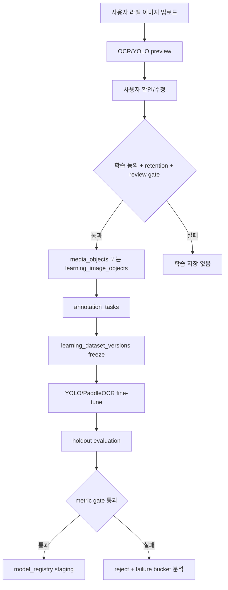
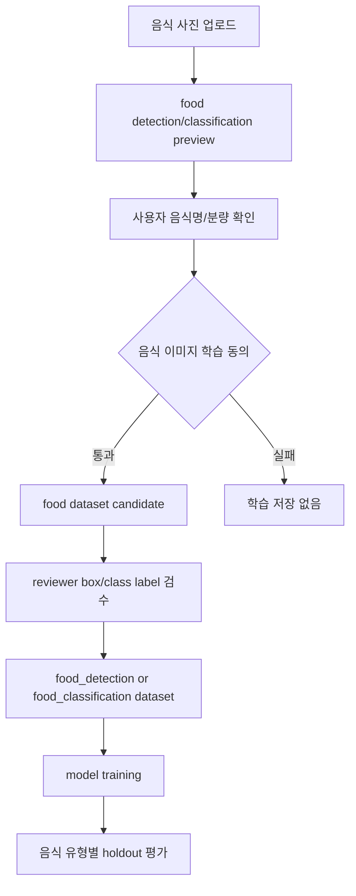

# 53. PostgreSQL 멀티모달 건강 데이터 저장소 및 재학습 설계 플랜

작성일: 2026-05-27
범위: Lemon-Aid PostgreSQL/Supabase Storage에 영양제 이미지, 음식 이미지, 신체정보, 진료 기록, 환자 상태, 모델 재학습 데이터를 저장하기 위한 설계 브레인스토밍 및 구현 계획

## 1. 목적

현재 Lemon-Aid는 영양제 라벨 OCR preview, 사용자 확인 영양제 등록, HealthKit/Health Connect 일일 요약, 처방전/검사표 OCR intake, consent-gated learning image/vector pipeline의 골격을 이미 갖고 있다. 다음 단계는 이를 단일 저장 전략으로 확장해 아래 데이터를 안전하게 저장하고, 동의된 영양제/음식 이미지를 모델 재학습 데이터셋으로 순환시키는 것이다.

- 영양제 및 보충제 라벨/포장 이미지
- 음식/식단 사진 이미지
- 각 사용자의 신체정보 및 건강 metric
- 진료 기록, 처방전, 검사 결과 등 사용자 확인 의료 기록
- 현재 환자 상태 snapshot
- YOLO, PaddleOCR, image embedding, food classifier 재학습용 데이터셋 lineage

핵심 원칙은 명확하다. 원본 이미지는 PostgreSQL row에 넣지 않고 private object storage에만 보관한다. PostgreSQL에는 해시, private object reference, 상태, 보유 기한, 사용자 확인 structured metadata, 학습 dataset/version lineage만 저장한다. raw OCR text, provider raw payload, image bytes, secret, 실제 public tunnel URL은 저장하거나 문서화하지 않는다.

## 2. 현재 구현 상태 요약

### 2.1 이미 있는 구조

| 영역 | 현재 구현 파일 | 현재 저장 내용 |
| --- | --- | --- |
| 영양제 OCR preview | `backend/Nutrition-backend/src/models/db/supplement.py` | `supplement_analysis_runs`에 이미지 hash, MIME, size, OCR provider/confidence, OCR text hash, parser snapshot, match snapshot |
| 사용자 확인 영양제 | `backend/Nutrition-backend/src/models/db/supplement.py` | `user_supplements`, `user_supplement_ingredients`에 사용자가 확인한 제품/성분/복용 schedule |
| Health 요약 | `backend/Nutrition-backend/src/models/db/health.py` | `health_sync_batches`, `health_daily_summaries`에 걸음수, 체중, 안정시 심박, active energy |
| regulated OCR intake | `backend/Nutrition-backend/src/models/db/regulated.py` | `regulated_documents`, `prescription_items`, `lab_result_items`에 preview/confirmed item. 원본 이미지는 memory-only |
| 학습 이미지 object | `backend/Nutrition-backend/src/models/db/learning.py` | `learning_image_objects`에 owner hash, analysis FK, image hash, object reference, provider, version, 보유기한, consent snapshot |
| embedding queue/vector | `backend/Nutrition-backend/src/models/db/learning.py` | `image_embedding_jobs`, `image_embedding_records`에 job 상태와 pgvector embedding |
| Supabase hardening | `backend/alembic/versions/0009_harden_learning_vector_supabase_access.py` | learning/vector table RLS enable, public/client role grant revoke |
| private bucket | `backend/alembic/versions/0012_configure_learning_private_storage_bucket.py` | `learning-images` private bucket, 20 MiB, JPEG/PNG/WebP |

### 2.2 현재 빠진 범위

| 요구 범위 | 현재 gap |
| --- | --- |
| 음식 사진 저장 | `meal_records`, `food_image_analysis_runs`, `food_image_evidence` 같은 DB 모델이 아직 없음 |
| 음식 인식 학습 | 음식 이미지 dataset version, annotation, model training run registry가 없음 |
| 사용자 신체정보 이력 | `users`는 최소 profile만 저장. profile versioning과 time-series metric 원본 table이 부족 |
| 진료 기록 장기 저장 | 처방전/검사표 OCR intake는 있지만 longitudinal medical record model은 아직 없음 |
| 현재 환자 상태 | dashboard summary는 있으나 `patient_status_snapshots` 같은 상태 snapshot 저장소가 없음 |
| 재학습 governance | dataset version, train/val/test split, revoke 반영, model registry/eval 결과 table이 없음 |

## 3. 공식 근거

설계 전 확인한 공식 문서 기준이다. 기능 구현 시점에는 다시 최신 문서를 확인한다.

| 주제 | 공식 근거 | 설계 반영 |
| --- | --- | --- |
| Supabase Storage access control | https://supabase.com/docs/guides/storage/security/access-control | Storage 접근은 `storage.objects` RLS policy로 제어하고, service key는 공개 클라이언트에 노출하지 않는다. |
| Supabase private buckets | https://supabase.com/docs/guides/storage/buckets/fundamentals | 사용자 이미지와 의료 문서는 public bucket이 아니라 private bucket에 둔다. |
| Supabase RLS | https://supabase.com/docs/guides/database/postgres/row-level-security | exposed schema table은 RLS를 켜고 필요한 role grant만 둔다. 내부 학습 table은 client role grant를 fail-closed로 유지한다. |
| Supabase vector columns | https://supabase.com/docs/guides/ai/vector-columns | vector dimension은 embedding model 출력 차원을 실제 probe로 확인한 뒤 고정한다. |
| Supabase vector indexes | https://supabase.com/docs/guides/ai/vector-indexes | HNSW/IVFFlat index는 데이터량과 benchmark 후 별도 migration으로 도입한다. |
| PostgreSQL RLS | https://www.postgresql.org/docs/current/ddl-rowsecurity.html | RLS enabled table에 policy가 없으면 default-deny가 적용된다. 내부 table은 이 특성을 방어층으로 사용한다. |
| PostgreSQL partitioning | https://www.postgresql.org/docs/current/ddl-partitioning.html | time-series/대용량 event table은 월 단위 range partition 후보로 둔다. |
| Ultralytics YOLO train | https://docs.ultralytics.com/modes/train/ | YOLO ROI 모델은 custom dataset과 검증 metric 없이는 accuracy 개선을 주장하지 않는다. |
| Ultralytics detection dataset | https://docs.ultralytics.com/datasets/detect/ | detection annotation은 YOLO dataset format으로 export 가능한 lineage를 DB에 남긴다. |
| PaddleOCR recognition training | https://www.paddleocr.ai/v2.10.0/en/ppocr/model_train/recognition.html | OCR 인식 fine-tuning에는 image path + text label 파일, train/test split이 필요하다. |
| PaddleOCR OCR pipeline/fine-tune | https://www.paddleocr.ai/main/en/version3.x/pipeline_usage/OCR.html | detection/recognition module별 fine-tune과 local model path 지정이 가능하므로 dataset item은 module task를 분리한다. |
| Google Cloud Vision OCR | https://cloud.google.com/vision/docs/ocr | Google Vision은 OCR provider 비교 기준으로 쓰되 provider raw payload는 저장하지 않는다. |
| Ollama vision | https://docs.ollama.com/capabilities/vision | Ollama vision은 보조 검증/설명 채널로 두고 원본 의료/이미지 데이터 외부 전송 금지를 유지한다. |
| Supabase changelog | https://supabase.com/changelog | Supabase Storage/RLS/vector 동작은 자주 바뀔 수 있어 schema 구현 전 changelog를 재확인한다. |

## 4. 저장 설계 원칙

1. DB에는 원본 이미지 bytes를 저장하지 않는다.
2. 원본 이미지는 private object storage에 저장하고 PostgreSQL에는 hash, MIME, size, private object reference, 보유 기한만 둔다.
3. raw OCR text와 provider raw payload는 저장하지 않는다. 필요한 경우 hash 또는 사용자 확인 structured field만 둔다.
4. 사용자-facing confirmed record와 internal learning candidate를 분리한다.
5. 학습 재사용은 별도 동의, retention, review gate, revoke path가 모두 있어야 한다.
6. 의료/진료 기록은 사용자가 확인한 기록 저장에 한정하고, 앱이 진단/처방을 생성하지 않는다.
7. 재학습 성능 개선은 benchmark dataset과 metric으로만 주장한다. 모델 정확도 수치는 임의로 만들지 않는다.
8. Supabase Data API에 노출할 table과 direct backend-only table을 분리한다.
9. 모든 sensitive table은 `delete all user data`, consent revoke, retention expiry에서 정리 대상이어야 한다.

## 5. 목표 저장소 구조

### 5.1 공통 media layer

새 테이블 후보: `media_objects`

| 컬럼 | 타입 후보 | 설명 |
| --- | --- | --- |
| `id` | UUID PK | 내부 media object id |
| `owner_subject_hash` | string(64) | 사용자 subject HMAC. raw subject 저장 금지 |
| `domain` | enum/string | `supplement_label`, `food_meal`, `regulated_document`, `profile_attachment` |
| `source_run_id` | UUID nullable | supplement/food/regulated analysis run 연결용 |
| `object_storage_provider` | string | `supabase_s3`, `s3`, `local`, `disabled` |
| `object_ref` | string | private object reference. 실제 URL이 아니라 provider-internal reference |
| `object_version_id` | string nullable | versioned storage 삭제 정확도 |
| `image_sha256` | string(64) | image bytes hash |
| `image_mime_type` | string | JPEG/PNG/WebP 우선 |
| `image_size_bytes` | integer | upload size |
| `width_px`, `height_px` | integer nullable | image dimension |
| `exif_stripped` | boolean | EXIF 제거 여부 |
| `retained_until` | timestamptz | 자동 삭제 기준 |
| `status` | enum/string | `temporary`, `retained`, `pending_review`, `approved`, `deleted`, `failed` |
| `consent_snapshot` | JSONB | consent type/version only |
| `created_at`, `updated_at`, `deleted_at` | timestamptz | lifecycle |

초기 구현에서는 기존 `learning_image_objects`를 바로 대체하지 않는다. Phase 1에서 `media_objects`를 추가하고, `learning_image_objects`는 supplement learning 호환 table로 유지한다. 안정화 후 `learning_image_objects.media_object_id`를 nullable FK로 추가해 점진적으로 연결한다.

새 테이블 후보: `media_processing_runs`

| 컬럼 | 타입 후보 | 설명 |
| --- | --- | --- |
| `id` | UUID PK | processing run id |
| `media_object_id` | UUID FK | source media |
| `pipeline_type` | enum/string | `supplement_ocr`, `food_detection`, `vision_roi`, `regulated_ocr`, `quality_check` |
| `provider` | string nullable | `paddleocr_local`, `google_vision`, `clova_ocr`, `yolo`, `ollama_vision` 등 sanitized label |
| `model_version` | string nullable | model registry id 또는 runtime model tag |
| `status` | enum/string | `pending`, `running`, `succeeded`, `requires_review`, `failed` |
| `confidence` | numeric nullable | provider confidence, 없으면 null |
| `output_hash` | string nullable | raw output hash. raw output 저장 금지 |
| `sanitized_snapshot` | JSONB | 사용자 표시 가능한 bounded structured summary |
| `warning_codes` | JSONB | stable code list |
| `error_code` | string nullable | safe error code |
| `started_at`, `finished_at` | timestamptz nullable | runtime audit |

### 5.2 영양제/보충제 이미지 domain

기존 `supplement_analysis_runs`는 유지한다. 이 table은 normal preview path에서 raw image를 저장하지 않는 현재 privacy contract를 보존한다.

추가 테이블 후보: `supplement_image_evidence`

| 컬럼 | 설명 |
| --- | --- |
| `id` | UUID PK |
| `analysis_run_id` | `supplement_analysis_runs.id` FK |
| `media_object_id` | `media_objects.id` FK nullable. learning consent가 없으면 null 가능 |
| `image_role` | `front`, `supplement_facts`, `barcode`, `side_panel`, `other` |
| `quality_status` | `usable`, `retake_recommended`, `rejected` |
| `quality_codes` | blur/glare/crop/low-resolution 등 safe code |
| `roi_snapshot` | YOLO box/label/confidence summary. 원본 crop bytes 저장 금지 |
| `created_at` | 생성 시각 |

흐름:

1. `/api/v1/supplements/analyze`가 이미지 validation, OCR, parser, match를 수행한다.
2. 기본 path는 현재처럼 `supplement_analysis_runs`에 hash와 sanitized snapshot만 저장한다.
3. 사용자가 image retention/learning consent를 가진 경우에만 `media_objects` 또는 기존 `learning_image_objects`에 원본 image reference를 만든다.
4. 사용자 확인 후 `user_supplements`와 `user_supplement_ingredients`가 authoritative record가 된다.
5. 학습 후보는 사용자 확인 structured field만 dataset item label 후보가 된다.

### 5.3 음식/식단 이미지 domain

새 테이블 후보: `meal_records`

| 컬럼 | 설명 |
| --- | --- |
| `id` | UUID PK |
| `owner_subject` 또는 `owner_subject_hash` | API 노출 여부에 따라 결정. client-facing이면 raw owner subject, internal이면 hash |
| `eaten_at` | 사용자가 선택한 식사 시각 |
| `meal_type` | `breakfast`, `lunch`, `dinner`, `snack`, `unknown` |
| `source` | `camera`, `gallery`, `manual`, `imported` |
| `status` | `requires_confirmation`, `confirmed`, `deleted`, `failed` |
| `nutrition_summary` | kcal, carb/protein/fat/sodium 등 사용자 확인 summary |
| `confidence` | 자동 분석 confidence nullable |
| `confirmed_at` | 사용자 확인 시각 |
| `created_at`, `updated_at`, `deleted_at` | lifecycle |

새 테이블 후보: `meal_food_items`

| 컬럼 | 설명 |
| --- | --- |
| `id` | UUID PK |
| `meal_id` | `meal_records.id` FK |
| `food_name_text` | 사용자 확인 음식명 |
| `canonical_food_id` | 향후 식약처/curated food master 연결 |
| `portion_amount`, `portion_unit` | 사용자 확인 분량 |
| `kcal`, `carb_g`, `protein_g`, `fat_g`, `sodium_mg` | 계산된 영양값 nullable |
| `source` | `vision`, `manual`, `database_match` |
| `confidence` | 자동 추정 confidence nullable |
| `sort_order` | 표시 순서 |

새 테이블 후보: `food_image_analysis_runs`

| 컬럼 | 설명 |
| --- | --- |
| `id` | UUID PK |
| `media_object_id` | `media_objects.id` FK nullable |
| `meal_id` | `meal_records.id` FK nullable |
| `detector_model` | YOLO/food detector model tag |
| `classifier_model` | food classifier model tag |
| `status` | `requires_confirmation`, `confirmed`, `failed` |
| `detected_items_snapshot` | sanitized labels/boxes/confidences. raw image 없음 |
| `nutrition_estimate_snapshot` | bounded estimate, 사용자 확인 전 추정값 |
| `warning_codes` | portion uncertainty, non-food image 등 |
| `created_at`, `updated_at` | lifecycle |

2026-05-27 구현 결정:

- `meal_records`, `meal_food_items`, `food_image_analysis_runs` ORM과 Alembic migration을 추가한다.
- Phase 2 초기 구현은 Flutter/backend API가 직접 PostgreSQL session으로 접근하는 backend-only 구조로 둔다.
- Supabase Data API로 바로 노출하지 않도록 세 table 모두 RLS enable 후 `PUBLIC`, `anon`, `authenticated`, `service_role` 권한을 revoke한다.
- 원본 음식 사진은 별도 동의 전에는 DB에 저장하지 않고, `food_image_analysis_runs`에는 hash, MIME, size, detector/classifier tag, sanitized snapshot, warning code만 둔다.
- `media_object_id`는 사용자가 별도 image retention consent를 가진 경우 future private object reference로만 연결되며, public URL 또는 object URI를 이 table에 저장하지 않는다.
- delete-all은 `food_image_analysis_runs`, `meal_food_items`, `meal_records`를 owner scope로 삭제하며 audit metadata에는 count만 남긴다.

식단 사진은 영양제 라벨보다 재식별 위험이 높을 수 있다. 접시 주변의 사람, 위치, 문서, 얼굴, 집 내부가 포함될 수 있으므로 음식 이미지 학습 동의는 기존 `image_learning_dataset` 동의와 별도 bucket으로 분리한다.

추천 consent bucket 후보:

- `food_image_processing`
- `food_history_retention`
- `food_image_learning_dataset`

### 5.4 사용자 신체정보 및 health metric

기존 `users` table은 Phase 1 알고리즘에 필요한 최소값만 담는다. 변경 이력을 보존하려면 versioned snapshot을 추가한다.

새 테이블 후보: `body_profile_snapshots`

| 컬럼 | 설명 |
| --- | --- |
| `id` | UUID PK |
| `owner_subject` | current-user API 조회용 |
| `effective_at` | 적용 시작 시각 |
| `source` | `manual`, `healthkit`, `health_connect`, `clinician_document` |
| `sex` | 기존 지원값 유지, 향후 algorithm 확장 전까지 제한 |
| `birth_year` 또는 `birth_date` | 최소 필요 수준으로 저장 |
| `height_cm`, `weight_kg`, `waist_cm` | nullable numeric |
| `pregnancy_status`, `lactation_status` | KDRIs lookup 필요 시 |
| `activity_level` | algorithm input |
| `consent_snapshot` | health data consent version |
| `created_at`, `superseded_at` | version lifecycle |

새 테이블 후보: `health_metric_samples`

| 컬럼 | 설명 |
| --- | --- |
| `id` | UUID PK |
| `owner_subject` | current-user query key |
| `metric_type` | `steps`, `weight_kg`, `resting_hr_bpm`, `active_energy_kcal`, `blood_pressure_systolic`, `blood_pressure_diastolic`, `glucose_mg_dl` 등 |
| `measured_at` | 실제 측정 시각 |
| `value_numeric` | 측정값 |
| `unit` | 단위 |
| `source_platform` | `ios_healthkit`, `android_health_connect`, `manual`, `document` |
| `source_record_hash` | client duplicate detection |
| `quality_flags` | JSONB safe code |
| `created_at` | 저장 시각 |

초기에는 `health_daily_summaries`를 read model로 유지하고, `health_metric_samples`는 필요한 metric부터 추가한다. 데이터량이 커지면 월 단위 range partition 또는 Timescale hypertable 후보로 둔다.

2026-05-27 구현 결정:

- `body_profile_snapshots`, `health_metric_samples` ORM과 Alembic migration을 추가한다.
- `body_profile_snapshots`는 `birth_date`보다 덜 식별적인 `birth_year`를 사용하고, 신체 profile versioning에 필요한 bounded numeric/status code만 저장한다.
- `health_metric_samples`는 raw HealthKit/Health Connect payload, request header, access token, provider payload를 저장하지 않고 metric type, 측정 시각, numeric value, unit, source hash, quality flag만 저장한다.
- 기존 `users`, `health_sync_batches`, `health_daily_summaries` 역시 민감 health/profile 데이터이므로 Supabase Data API client-role 접근을 fail-closed로 보강한다.
- Phase 3 초기 구현은 backend API direct PostgreSQL 접근만 허용하고, Supabase client role `PUBLIC`, `anon`, `authenticated`, `service_role` grant는 revoke한다.
- delete-all은 `body_profile_snapshots`, `health_metric_samples`를 owner scope로 삭제하며 audit metadata에는 count만 남긴다.

### 5.5 진료 기록/처방/검사 결과 domain

현재 `regulated_documents`, `prescription_items`, `lab_result_items`는 OCR intake와 confirmation에 초점이 있다. 장기 저장을 하려면 intake preview와 사용자 확인 의료 기록을 분리한다.

새 테이블 후보: `medical_record_collections`

| 컬럼 | 설명 |
| --- | --- |
| `id` | UUID PK |
| `owner_subject_hash` | sensitive domain은 hash 우선 |
| `record_type` | `condition`, `medication`, `allergy`, `lab_result`, `prescription`, `visit_note` |
| `source` | `user_manual`, `regulated_ocr_confirmed`, `clinic_import`, `health_platform` |
| `source_document_id` | `regulated_documents.id` nullable |
| `status` | `active`, `archived`, `deleted`, `requires_review` |
| `consent_snapshot` | 민감정보 동의 snapshot |
| `created_at`, `updated_at`, `deleted_at` | lifecycle |

새 테이블 후보: `patient_conditions`

| 컬럼 | 설명 |
| --- | --- |
| `id` | UUID PK |
| `medical_collection_id` | FK |
| `condition_text` | 사용자가 입력/확인한 질환명. 앱이 생성한 진단 아님 |
| `condition_code_system` | 향후 표준 코드 연결 시 |
| `condition_code_hash` | 코드 저장이 필요한 경우 가명화/hash 검토 |
| `clinical_status` | `active`, `inactive`, `resolved`, `unknown` |
| `onset_date_text` | 문서/사용자 입력 그대로의 bounded text |
| `source` | `user_confirmed`, `clinician_document` |
| `confirmed_at` | 사용자 확인 시각 |

새 테이블 후보: `patient_medications`

| 컬럼 | 설명 |
| --- | --- |
| `id` | UUID PK |
| `medical_collection_id` | FK |
| `medication_name_text` | 사용자 확인 약명 |
| `dose_text`, `frequency_text`, `route_text`, `period_text` | 사용자 확인 복약 정보 |
| `active_status` | `active`, `stopped`, `unknown` |
| `source_document_id` | 처방전 OCR 문서 연결 nullable |
| `confirmed_at` | 확인 시각 |

이 domain은 추천/판단보다 기록 저장과 사용자 확인이 먼저다. "현재 환자의 상태"를 자동 진단으로 만들면 안 된다.

2026-05-27 구현 결정:

- `medical_record_collections`, `patient_conditions`, `patient_medications` ORM과 Alembic migration을 추가한다.
- `regulated_documents`, `prescription_items`, `lab_result_items`는 intake preview table이지만 의료 기록과 연결되는 민감 table이므로 같은 migration에서 RLS enable과 Supabase client-role grant revoke를 재확인한다.
- 의료 기록 table에는 사용자 확인 structured field만 저장하고 raw document image, raw OCR text, provider raw payload, request header, access token, secret column을 추가하지 않는다.
- `condition_text`, `medication_name_text`, 복약 text는 앱 생성 진단/처방이 아니라 사용자 입력 또는 사용자 확인 문서 필드로만 취급한다.
- `condition_code_hash`는 민감 code를 원문으로 저장하지 않기 위한 one-way hash 슬롯으로 둔다.
- `delete all user data`는 의료 기록 collection, condition, medication을 owner hash 기준으로 삭제하며 audit metadata에는 count만 남긴다.

### 5.6 현재 환자 상태 snapshot

새 테이블 후보: `patient_status_snapshots`

| 컬럼 | 설명 |
| --- | --- |
| `id` | UUID PK |
| `owner_subject_hash` | sensitive owner key |
| `status_at` | snapshot 기준 시각 |
| `summary_type` | `self_report`, `device_summary`, `confirmed_record_summary`, `system_derived` |
| `input_window_start`, `input_window_end` | 사용된 데이터 기간 |
| `symptom_categories` | JSONB safe code list. 자유진술 원문 저장 금지 |
| `metric_summary` | weight trend, steps trend 등 bounded numeric summary |
| `medication_summary` | active medication count/category 등 민감도 낮춘 summary |
| `risk_flags` | `requires_professional_consult`, `data_insufficient` 등 non-diagnostic code |
| `data_quality` | `complete`, `partial`, `insufficient` |
| `generated_by` | `user`, `backend_rule`, `llm_summary` |
| `expires_at` | 상태 snapshot stale 시각 |
| `created_at` | 생성 시각 |

이 table의 출력은 "진단"이 아니라 "현재 앱이 가진 데이터 상태"다. 예: "최근 7일 데이터 부족", "사용자 확인 복약 기록 있음", "전문가 상담 권장 flag"처럼 rule/code 중심으로 제한한다.

2026-05-27 구현 결정:

- `patient_status_snapshots` ORM과 Alembic migration을 추가한다.
- snapshot은 `summary_type`, input window, category/code list, bounded metric/medication summary, non-diagnostic `risk_flags`, `data_quality`, `generated_by`, `expires_at`만 저장한다.
- symptom 자유진술 원문, raw medical document, raw OCR/provider payload, 진단명/치료 지시 생성 결과는 저장하지 않는다.
- LLM이 관여하는 경우에도 `generated_by='llm_summary'`와 code/bounded summary만 저장하며, 사용자-facing 설명 원문은 별도 저장 대상이 아니다.
- `delete all user data`는 `patient_status_snapshots`를 owner hash 기준으로 삭제하며 audit metadata에는 count만 남긴다.

## 6. 학습/재학습 저장소 설계

### 6.1 dataset version

새 테이블 후보: `learning_dataset_versions`

| 컬럼 | 설명 |
| --- | --- |
| `id` | UUID PK |
| `dataset_key` | `supplement_roi_detection`, `supplement_ocr_recognition`, `food_detection`, `food_classification`, `image_embedding` |
| `version` | semantic version 또는 날짜 기반 version |
| `status` | `draft`, `frozen`, `training`, `evaluated`, `approved`, `retired` |
| `source_window_start`, `source_window_end` | 포함 후보 기간 |
| `manifest_hash` | export manifest hash |
| `train_count`, `val_count`, `test_count` | split count |
| `privacy_review_status` | `pending`, `approved`, `rejected` |
| `created_by_hash` | operator hash |
| `created_at`, `frozen_at` | lifecycle |

### 6.2 dataset item

새 테이블 후보: `learning_dataset_items`

| 컬럼 | 설명 |
| --- | --- |
| `id` | UUID PK |
| `dataset_version_id` | FK |
| `media_object_id` | `media_objects.id` nullable |
| `learning_image_object_id` | 기존 supplement learning row 연결 nullable |
| `source_domain` | `supplement`, `food` |
| `task_type` | `yolo_detection`, `paddleocr_detection`, `paddleocr_recognition`, `food_classification`, `embedding` |
| `label_status` | `auto_labeled`, `human_reviewed`, `rejected`, `revoked` |
| `split` | `train`, `val`, `test`, `holdout` |
| `label_snapshot` | bbox/text label/class label 등 sanitized label |
| `label_hash` | label snapshot hash |
| `quality_score` | review-derived bounded score nullable |
| `consent_snapshot` | dataset inclusion consent version |
| `retained_until` | retention deadline |
| `created_at`, `revoked_at` | lifecycle |

주의:

- PaddleOCR recognition 학습 item은 cropped text-line image reference와 text label이 필요하다. text label은 OCR raw output이 아니라 사람 또는 사용자 확인을 거친 label이어야 한다.
- YOLO detection item은 image reference와 normalized box/class label이 필요하다.
- 음식 classification item은 음식명/카테고리 label이 필요하지만, portion/calorie label은 별도 task로 분리한다.

2026-05-27 구현 결정:

- `learning_dataset_versions`, `learning_dataset_items` ORM과 Alembic migration을 추가한다.
- `learning_dataset_items`에는 계획 표에 없던 `owner_subject_hash`를 추가한다. raw subject가 아니라 HMAC이며, delete-all/consent revoke 시 user-linked dataset item을 source join 없이 빠짐없이 scrub하기 위한 보안 필드다.
- dataset item revoke 시 row를 바로 삭제하지 않고 `label_status='revoked'`, source FK null, `label_snapshot={}`, `label_hash=NULL`, `consent_snapshot={}`, `revoked_at` 설정으로 학습 lineage는 남기되 사용자 유래 label/source 연결을 제거한다.
- label snapshot은 normalized bbox/class/text label 같은 sanitized structured field만 허용하고 raw OCR output, provider payload, signed URL, public URL, local path, secret은 저장하지 않는다.

### 6.3 annotation/review queue

새 테이블 후보: `annotation_tasks`

| 컬럼 | 설명 |
| --- | --- |
| `id` | UUID PK |
| `media_object_id` | FK |
| `task_type` | `supplement_roi_box`, `ocr_textline_label`, `food_box`, `food_class` |
| `status` | `pending`, `in_review`, `accepted`, `rejected`, `cancelled` |
| `assignee_role` | `operator`, `nutrition_reviewer`, `data_reviewer` |
| `label_snapshot` | reviewer가 입력한 sanitized label |
| `review_notes_code` | 자유 텍스트 대신 code 중심 |
| `reviewer_hash` | reviewer subject hash |
| `completed_at` | 완료 시각 |

2026-05-27 구현 결정:

- `annotation_tasks` ORM과 Alembic migration을 추가한다.
- `annotation_tasks`에도 `owner_subject_hash`를 추가한다. review queue는 user media에서 파생되므로 consent revoke/delete-all에서 pending/accepted task를 안전하게 취소하고 label/reviewer link를 scrub해야 한다.
- annotation task revoke 시 `status='cancelled'`, `media_object_id=NULL`, `label_snapshot={}`, `review_notes_code=NULL`, `reviewer_hash=NULL`, `completed_at` 설정으로 reviewer 입력 label과 user media 연결을 제거한다.
- `review_notes_code`는 자유 텍스트가 아니라 stable code만 저장한다.

### 6.4 model training run 및 registry

새 테이블 후보: `model_training_runs`

| 컬럼 | 설명 |
| --- | --- |
| `id` | UUID PK |
| `model_family` | `yolo`, `paddleocr_det`, `paddleocr_rec`, `food_classifier`, `image_embedding` |
| `base_model` | 시작 checkpoint/model tag |
| `dataset_version_id` | FK |
| `hyperparam_snapshot` | epoch, image size, batch 등 sanitized config |
| `metrics_snapshot` | validation metric. 검증된 값만 |
| `artifact_ref` | private model artifact reference |
| `status` | `queued`, `running`, `succeeded`, `failed`, `approved_for_deploy`, `rejected` |
| `started_at`, `ended_at` | lifecycle |

새 테이블 후보: `model_registry`

| 컬럼 | 설명 |
| --- | --- |
| `id` | UUID PK |
| `task_type` | `supplement_roi_detection`, `supplement_ocr_recognition`, `food_detection` 등 |
| `model_version` | deployable version |
| `training_run_id` | FK |
| `artifact_ref` | private artifact reference |
| `deployment_status` | `candidate`, `staging`, `production`, `rolled_back`, `retired` |
| `metric_gate_snapshot` | 승인 기준과 결과 |
| `rollback_model_id` | rollback target nullable |
| `approved_by_hash` | reviewer hash |
| `approved_at` | 승인 시각 |

새 테이블 후보: `model_eval_results`

| 컬럼 | 설명 |
| --- | --- |
| `id` | UUID PK |
| `model_id` | FK |
| `eval_dataset_version_id` | FK |
| `metric_name` | `precision`, `recall`, `mAP50`, `cer`, `wer`, `exact_match`, `f1` 등 |
| `metric_value` | numeric |
| `subgroup_key` | `korean_label`, `english_label`, `dense_supplement_facts`, `home_meal` 등 |
| `failure_bucket` | `glare`, `low_resolution`, `multi_column`, `handwritten` 등 |
| `created_at` | 생성 시각 |

성능 수치는 이 table에 실제 평가 run으로 저장된 후에만 문서/릴리즈 노트에서 주장한다.

2026-05-27 구현 결정:

- `model_training_runs`, `model_registry`, `model_eval_results` ORM과 Alembic migration을 추가한다.
- model artifact는 `artifact_ref` private reference만 저장하며 URL scheme, absolute path, traversal pattern을 DB constraint로 금지한다.
- hyperparameter, metrics, metric gate는 JSONB object로 제한하고 raw training manifest, raw provider payload, signed URL, secret은 저장하지 않는다.
- `model_eval_results.metric_value`는 검증된 numeric result만 저장한다. precision/recall처럼 0-1 metric도 있지만 CER/WER는 1을 넘을 수 있으므로 nonnegative만 강제한다.
- registry/model/eval table은 user-specific source row를 직접 들고 있지 않고 dataset version/training run lineage만 참조한다.

## 7. 재학습 루프

### 7.1 영양제 OCR/YOLO 루프



영양제 라벨의 우선순위:

1. YOLO ROI detector: supplement facts 영역, barcode 영역, product front 영역 검출.
2. PaddleOCR detector/recognizer: cropped ROI별 text detection/recognition 개선.
3. Parser/domain correction: OCR이 이미 충분하면 model fine-tune보다 parser schema/normalizer 개선이 먼저일 수 있다.
4. Google Vision/CLOVA 비교: live provider 결과는 benchmark 기준으로만 사용하고 raw payload를 저장하지 않는다.

### 7.2 음식 이미지 루프



음식 사진은 주변 환경 노출 가능성이 크므로 학습 동의와 retention을 영양제 라벨보다 더 엄격하게 둔다. 얼굴/신분증/문서/위치 정보가 감지되면 학습 후보에서 자동 제외한다.

### 7.3 동의 철회와 이미 학습된 모델

동의 철회 시:

1. `media_objects`/`learning_image_objects`를 삭제 또는 tombstone 처리한다.
2. pending/running job을 cancel한다.
3. 아직 freeze되지 않은 dataset item은 `revoked`로 전환한다.
4. 이미 freeze되어 training에 사용된 dataset은 lineage에 revoke count를 기록한다.
5. 다음 training cycle에서 revoked source를 제외하고 재학습한다.
6. 법무/팀 정책이 요구하면 해당 model version을 retired로 전환하고 rollback한다.

이미 배포된 모델에서 특정 개별 샘플의 영향을 즉시 제거할 수 있다고 주장하지 않는다. 대신 lineage, revoke audit, 다음 재학습 제외, 필요 시 model retirement 절차를 명시한다.

## 8. Storage bucket 설계

| bucket 후보 | public | 대상 | 초기 정책 |
| --- | --- | --- | --- |
| `learning-images` | false | 기존 영양제 학습 후보 | 이미 구현된 private bucket 유지 |
| `supplement-source-images` | false | 사용자 동의로 보존되는 영양제 원본 | Phase 1 이후 검토 |
| `food-source-images` | false | 음식 사진 원본 | Phase 2에서 별도 동의 후 추가 |
| `regulated-document-images` | false | 장기 저장 동의된 의료 문서 원본 | 기본은 만들지 않음. 법무/발주처 승인 후 |
| `model-artifacts` | false | 학습된 model artifact | operator-only direct backend access |

object key 규칙:

- owner subject, 사용자 이름, 제품명, 음식명, 진료 정보가 key에 들어가면 안 된다.
- 권장 패턴: `domain/yyyy/mm/<uuid>.<ext>`
- signed URL은 사용자 표시/검수에 필요한 짧은 TTL에서만 발급한다.

## 9. RLS 및 API 노출 전략

| table | API 노출 | RLS/권한 전략 |
| --- | --- | --- |
| `meal_records`, `meal_food_items` | current-user API 필요 | RLS enable, owner policy, authenticated minimal grant |
| `body_profile_snapshots`, `health_metric_samples` | current-user API 필요 | RLS enable, owner policy, 민감정보 consent check는 backend에서도 수행 |
| `medical_record_collections`, `patient_conditions`, `patient_medications` | 매우 제한적 current-user API | RLS enable, owner policy, backend scope/consent gate 필수 |
| `patient_status_snapshots` | current-user read 가능 | RLS enable, owner policy, stale/quality flag 포함 |
| `media_objects` | 직접 client 노출 금지 권장 | backend-only direct Postgres. 필요 시 signed URL API만 제공 |
| `learning_dataset_versions`, `learning_dataset_items`, `annotation_tasks` | client 노출 금지 | RLS enable + client role grant revoke |
| `model_training_runs`, `model_registry`, `model_eval_results` | operator/internal only | private schema 또는 public fail-closed + grant revoke |

현재 `learning_image_objects`, `image_embedding_jobs`, `image_embedding_records`처럼 내부 학습 table은 Supabase Data API grant를 제거하고 direct backend connection으로만 접근한다.

## 10. API 설계 후보

### 10.1 음식 이미지

- `POST /api/v1/meals/analyze-image`
  - multipart field: `image`
  - form fields: `client_request_id`, `meal_type`, optional `eaten_at`
  - response: `requires_confirmation` preview
  - 2026-05-27 구현: 별도 `food_image_processing` consent가 필요하며, 초기 응답은 원본 음식 이미지나 provider payload를 저장하지 않는 manual-entry preview로 제한한다.
- `POST /api/v1/meals/{meal_id}/confirm`
  - 사용자가 음식명/분량/영양값을 확인하거나 수정
- `GET /api/v1/meals`
  - current-user 식단 기록 조회
- `DELETE /api/v1/meals/{meal_id}`
  - soft delete + linked media retention policy 적용

### 10.2 신체정보/건강 metric

- `POST /api/v1/health/profile-snapshots`
- `GET /api/v1/health/profile-snapshots/latest`
- `POST /api/v1/health/metric-samples`
- `GET /api/v1/health/daily-summary`

### 10.3 의료 기록/상태

- `POST /api/v1/medical-records`
- `GET /api/v1/medical-records`
- `POST /api/v1/medical-records/{id}/confirm`
- `GET /api/v1/patient/status/latest`

의료 기록 endpoint는 진단/처방 생성 endpoint가 아니다. 사용자 확인 기록 저장과 상담 권장 flag 조회로 한정한다.

### 10.4 학습/운영

학습 dataset/model registry는 public API보다 operator CLI/script를 우선한다.

- `backend/scripts/create_learning_dataset_version.py`
- `backend/scripts/export_training_manifest.py`
- `backend/scripts/import_annotation_review.py`
- `backend/scripts/register_model_training_run.py`
- `backend/scripts/promote_model_candidate.py`

운영 UI가 필요해도 backend-only operator scope와 audit log를 먼저 만든 뒤 노출한다.

## 11. 단계별 구현 계획

### Phase 0: 설계/위협 모델 확정

- 본 문서를 팀 리뷰 문서로 사용한다.
- `docs/Nutrition-docs/17-image-collection-consent-plan.md`에 음식 이미지/의료 기록 장기 저장 consent matrix 보강 여부를 결정한다.
- Supabase changelog, RLS, Storage, vector docs를 구현 직전에 다시 확인한다.
- 산출물: schema ADR, threat model, consent copy 초안.

### Phase 1: 공통 media layer 도입

- Alembic migration: `media_objects`, `media_processing_runs`.
- SQLAlchemy ORM 및 schema 추가.
- `media_objects`는 기본 backend-only로 두고 Supabase client role grant를 revoke한다.
- existing supplement flow에는 behavior change 없이 optional evidence link만 추가한다.
- 테스트:
  - raw image bytes/raw OCR/provider payload 컬럼 금지 schema test
  - RLS enable/grant revoke test
  - consent off일 때 media row 미생성 test
  - delete-all이 media row/object를 정리하는 test

### Phase 2: 음식 사진 저장 및 분석 preview

- `meal_records`, `meal_food_items`, `food_image_analysis_runs` 추가.
- Flutter `mealShot`이 `POST /api/v1/meals/analyze-image`로 연결되도록 backend contract 제공.
- 초기 모델은 disabled/mock이 아니라 "analysis unavailable/requires manual entry" 상태를 명확히 반환한다.
- 음식 이미지는 별도 consent가 없으면 원본 보존하지 않는다.

### Phase 3: 신체정보 versioning 및 health metric sample

- `body_profile_snapshots`, `health_metric_samples` 추가.
- 기존 `users`와 `health_daily_summaries`는 유지한다.
- profile latest view/service를 만들고, dashboard는 latest snapshot + daily summary를 조합한다.
- 대용량 metric은 partition/hypertable 전환 기준을 별도 benchmark로 둔다.

### Phase 4: 의료 기록/현재 환자 상태 저장

- `medical_record_collections`, `patient_conditions`, `patient_medications`, `patient_status_snapshots` 추가.
- regulated OCR confirmation 결과를 longitudinal record로 승격하는 service를 만든다.
- AI/LLM summary는 `risk_flags`와 `data_quality` 중심으로 제한한다.
- 테스트:
  - 진단/처방 금지 표현 guard
  - 민감정보 consent 없을 때 저장 차단
  - delete-all/revoke 반영

### Phase 5: dataset version/annotation/model registry

- `learning_dataset_versions`, `learning_dataset_items`, `annotation_tasks`, `model_training_runs`, `model_registry`, `model_eval_results` 추가.
- 기존 `learning_image_objects`와 `image_embedding_records`를 dataset item source로 연결한다.
- export manifest에는 private object reference와 label hash만 포함하고 secret/actual signed URL은 포함하지 않는다.
- dataset freeze 전 privacy review status가 `approved`인지 검증한다.

### Phase 6: 재학습 automation 및 promotion gate

- YOLO training export: Ultralytics detect dataset format.
- PaddleOCR recognition export: image path + text label split manifest.
- PaddleOCR detection export: detection annotation format은 공식 train doc 기준으로 별도 converter 작성.
- holdout eval script를 만들고 model registry metric gate에 저장한다.
- staging smoke 후 feature flag로 model version을 전환한다.

## 12. 검증 계획

### 12.1 migration/schema

```bash
cd backend
PYTHONPATH=Nutrition-backend:.. /private/tmp/lemon-p1-quality-venv/bin/python -m pytest \
  Nutrition-backend/tests/unit/models \
  Nutrition-backend/tests/unit/learning \
  -q --no-cov
```

필수 테스트:

- raw image bytes 컬럼 없음
- raw OCR text/provider payload 컬럼 없음
- sensitive/internal table RLS enabled
- Supabase `anon`, `authenticated`, `service_role` grant revoke 확인
- object storage deletion failure retry/tombstone 보존
- consent revoke/delete-all이 media, learning, dataset item에 반영

### 12.2 API contract

필수 테스트:

- `POST /api/v1/supplements/analyze` 기존 contract regression
- `POST /api/v1/meals/analyze-image` multipart field `image` 검증
- consent 없을 때 음식/영양제 원본 image retention 미발생
- `GET /api/v1/patient/status/latest`가 진단 표현 없이 quality/status code만 반환

### 12.3 learning/retraining

필수 테스트:

- dataset freeze는 `privacy_review_status=approved` 전 실패
- revoked item은 새 dataset version에 포함되지 않음
- YOLO export manifest에 owner/raw OCR/secret 없음
- PaddleOCR export manifest에 provider raw payload 없음
- model registry promotion은 metric gate 통과 전 실패
- metric value는 eval script 결과에서만 입력

### 12.4 security gates

```bash
git diff --check
detect-secrets scan docs/Nutrition-docs/53-postgresql-multimodal-health-storage-retraining-plan.md
PYTHONPATH=Nutrition-backend:.. /private/tmp/lemon-p1-quality-venv/bin/python \
  backend/scripts/check_learning_vector_db_security.py --strict
```

구현 PR에서는 Supabase advisors 또는 동등한 local SQL security check를 추가한다.

## 13. 커밋 분리 제안

1. `docs(db): 멀티모달 건강 저장소 설계 추가`
   - 이유: schema 변경 전 저장 대상, 동의, RLS, 재학습 lineage를 팀이 먼저 리뷰하기 위함.
2. `feat(db): 공통 media object 저장소 추가`
   - 이유: 영양제/음식/의료 문서 이미지 참조 방식을 통일하되 기존 supplement flow를 깨지 않기 위함.
3. `feat(meals): 음식 이미지 preview 저장소 추가`
   - 이유: Flutter 식단 촬영 flow를 real backend endpoint로 연결하기 위함.
4. `feat(health): 신체정보 snapshot 저장소 추가`
   - 이유: 사용자 profile 변경 이력과 dashboard 계산 근거를 분리하기 위함.
5. `feat(medical): 사용자 확인 진료 기록 저장소 추가`
   - 이유: regulated OCR intake 결과를 장기 기록으로 승격하되 진단/처방 생성을 피하기 위함.
6. `feat(learning): dataset version과 모델 registry 추가`
   - 이유: 재학습 데이터, 평가 metric, 배포 model version의 추적성을 확보하기 위함.

## 14. 하지 않을 것

- `.env`, secret, ngrok token, provider credential을 commit하지 않는다.
- raw OCR text, provider raw payload, raw image bytes를 DB나 문서에 남기지 않는다.
- public bucket에 사용자 영양제/음식/진료 이미지를 넣지 않는다.
- 음식/영양제 이미지가 쌓였다는 이유만으로 정확도 향상을 주장하지 않는다.
- 의료 기록에서 진단/처방/치료 지시를 생성하지 않는다.
- 모델 학습에 진료기록/처방전/검사표 원본 이미지를 사용하지 않는다. 별도 법무/발주처 승인과 명시 동의 전까지 학습 대상은 영양제 라벨과 음식 사진으로 제한한다.

## 15. 우선순위 결론

가장 안전한 구현 순서는 `공통 media layer -> 음식 이미지/식단 기록 -> 신체정보 snapshot -> 의료 기록 장기 저장 -> dataset/model registry`다. 이미 구현된 `learning_image_objects`와 pgvector skeleton은 영양제 학습의 출발점으로 유지하되, 음식 사진과 환자 상태까지 확장하려면 domain별 confirmed record와 internal learning dataset을 분리해야 한다.

재학습 관점에서는 YOLO/PaddleOCR를 바로 fine-tune하기보다, 먼저 dataset version, annotation review, revoke 반영, holdout evaluation을 저장할 DB 구조가 필요하다. 이 구조가 있어야 "모델 정확도가 올랐다"는 말을 benchmark와 lineage로 증명할 수 있다.

## 16. 2026-05-27 Phase 1 착수 기록

Phase 1의 첫 구현 단위로 backend-only 공통 media layer를 추가했다.

구현 파일:

- `backend/Nutrition-backend/src/models/db/media.py`
- `backend/Nutrition-backend/src/media/object_storage.py`
- `backend/Nutrition-backend/src/media/factory.py`
- `backend/Nutrition-backend/src/media/retention.py`
- `backend/alembic/versions/0014_create_backend_only_media_tables.py`
- `backend/scripts/check_learning_vector_db_security.py`
- `backend/scripts/delete_expired_media_objects.py`
- `backend/scripts/retry_failed_media_object_deletions.py`

구현 범위:

- `media_objects`, `media_processing_runs`, `supplement_image_evidence` ORM 모델 추가
- Alembic head를 `0014_create_backend_only_media_tables`로 확장
- `media_objects.object_ref`는 public URL이나 storage URL scheme이 아닌 provider-internal reference만 허용
- `supplement_image_evidence`는 `analysis_run_id`, optional `media_object_id`, image role, quality code, ROI summary만 저장하고 raw OCR text/provider payload/object ref를 저장하지 않음
- `media_objects`, `media_processing_runs`, `supplement_image_evidence`는 RLS enable 및 `PUBLIC`, `anon`, `authenticated`, `service_role` 권한 revoke로 Supabase Data API 경로를 fail-closed 처리
- security preflight가 기존 learning/vector table에 더해 `media_objects`, `media_processing_runs`, `supplement_image_evidence`도 검사하도록 확장
- media object storage adapter를 추가해 local/S3/Supabase S3 private object 삭제를 backend-only 경로로 제한
- `MEDIA_OBJECT_STORAGE_PROVIDER`는 기본값 `disabled`이며 production에서는 docs/53 retention sign-off 전 활성화 불가
- `delete all user data` 경로가 `supplement_image_evidence`, `media_processing_runs`, `media_objects`, private media object 삭제를 처리하도록 확장
- private object 삭제 실패 시 `media_objects` row를 삭제하지 않고 `status=failed`로 보존해 audit metadata에 private ref를 남기지 않은 채 재시도 가능하게 함
- 만료된 media object 정리와 실패 삭제 재시도 CLI는 sanitized count와 exception class name만 출력하고 object ref, URL, token, provider payload를 출력하지 않음

검증:

- DB model/Alembic/security preflight/media/privacy/config focused tests: 142 passed
- `black --check`: passed
- `ruff check`: passed
- `git diff --check`: passed
- `detect-secrets scan`: no findings

다음 구현 후보:

1. consent revoke 중 음식/영양제 image retention 동의 bucket이 추가되면 해당 revoke 경로에도 `media_objects` 정리를 연결한다.
2. 음식 preview confirm/list/delete endpoint를 추가한다.
3. dataset version/model registry 구현 전 `media_objects`와 `learning_image_objects` 연결 FK 전략을 확정한다.

### 16.2 Phase 2 부분 구현 기록: 음식/식단 preview table

구현 범위:

- `meal_records`, `meal_food_items`, `food_image_analysis_runs` ORM 모델 추가
- Alembic head를 `0015_create_food_meal_tables`로 확장
- 세 table은 RLS enable 및 `PUBLIC`, `anon`, `authenticated`, `service_role` 권한 revoke로 Supabase Data API 경로를 fail-closed 처리
- `food_image_analysis_runs`는 image hash/MIME/size와 detector/classifier tag, sanitized detection/nutrition snapshot, warning code만 저장
- raw image bytes, raw OCR text, provider payload, request headers, token/secret column은 추가하지 않음
- `delete all user data` 경로가 음식 이미지 분석 preview, 음식 item, 식단 record를 owner scope로 삭제하도록 확장
- security preflight가 기존 learning/vector/media table에 더해 `meal_records`, `meal_food_items`, `food_image_analysis_runs`도 검사하도록 확장
- `POST /api/v1/meals/analyze-image` endpoint/service/schema skeleton 추가
- 음식 이미지 분석 endpoint는 `food_image_processing` consent와 `meal:write` scope를 요구
- 초기 endpoint는 detector/classifier를 실행한 척하지 않고 `analysis_unavailable`, `manual_entry_required` warning code를 반환

검증:

- Meal API contract + DB model/Alembic/security preflight/media/privacy/config focused tests: 171 passed
- `black --check`: passed
- `ruff check`: passed
- `git diff --check`: passed
- `detect-secrets scan`: no findings

### 16.3 Phase 3 부분 구현 기록: 신체정보/health metric 저장소

구현 범위:

- `body_profile_snapshots`, `health_metric_samples` ORM 모델 추가
- Alembic head를 `0016_create_health_profile_metric_tables`로 확장
- 새 table과 기존 `users`, `health_sync_batches`, `health_daily_summaries`는 RLS enable 및 `PUBLIC`, `anon`, `authenticated`, `service_role` 권한 revoke로 Supabase Data API 경로를 fail-closed 처리
- `body_profile_snapshots`는 `birth_year`, bounded body metrics, pregnancy/lactation/activity status code, consent snapshot만 저장
- `health_metric_samples`는 metric type, measured_at, numeric value, unit, source platform, source record hash, quality flag만 저장
- raw device payload, request header, access token, provider payload, secret column은 추가하지 않음
- `delete all user data` 경로가 body profile snapshot과 health metric sample을 owner scope로 삭제하도록 확장
- security preflight가 기존 learning/vector/media/meal table에 더해 profile/health table도 검사하도록 확장

검증:

- Meal API contract + DB model/Alembic/security preflight/media/privacy/config focused tests: 175 passed
- `black --check`: passed
- `ruff check`: passed
- `git diff --check`: passed
- `detect-secrets scan`: no findings

### 16.4 Phase 4 부분 구현 기록: 의료 기록/환자 상태 저장소

구현 범위:

- `medical_record_collections`, `patient_conditions`, `patient_medications`, `patient_status_snapshots` ORM 모델 추가
- Alembic head를 `0017_create_medical_record_status_tables`로 확장
- 새 의료 기록 table과 기존 regulated OCR intake table인 `regulated_documents`, `prescription_items`, `lab_result_items`는 RLS enable 및 `PUBLIC`, `anon`, `authenticated`, `service_role` 권한 revoke로 Supabase Data API 경로를 fail-closed 처리
- `medical_record_collections`는 owner hash, record type/source/status, optional regulated document link, consent snapshot, lifecycle timestamp만 저장
- `patient_conditions`와 `patient_medications`는 사용자 입력 또는 사용자 확인 문서 필드만 저장하고 앱 생성 진단/처방 결과를 저장하지 않음
- `patient_status_snapshots`는 non-diagnostic code와 bounded summary 중심으로 저장하고 symptom 자유진술 원문, raw medical document, raw OCR text, provider payload를 저장하지 않음
- security preflight가 기존 learning/vector/media/meal/profile table에 더해 regulated/medical/patient status table도 검사하도록 확장
- forbidden column scan에 `diagnosis`, `diagnosis_text`, `raw_document`, `raw_document_text`, `provider_raw_payload`, `treatment_instruction(s)`, `prescription_instruction` 계열을 추가
- `delete all user data` 경로가 의료 기록 collection, condition, medication, patient status snapshot을 owner hash 기준으로 삭제하도록 확장
- audit metadata sanitizer가 raw image/OCR/provider/object reference/secret/diagnosis/treatment instruction 계열 key를 제거하도록 보강

검증:

- Phase 4 DB model/Alembic/security preflight/privacy focused tests: 64 passed
- Phase 1-4 regression slice covering meal/media/medical/privacy/security/config/API contract: 179 passed
- Backend unit collection preflight with repo-root `PYTHONPATH=backend/Nutrition-backend:backend`: 1068 tests collected

### 16.5 Phase 5 부분 구현 기록: 재학습 dataset/model registry 저장소

구현 범위:

- `learning_dataset_versions`, `learning_dataset_items`, `annotation_tasks`, `model_training_runs`, `model_registry`, `model_eval_results` ORM 모델 추가
- Alembic head를 `0018_create_learning_dataset_model_registry_tables`로 확장
- 새 재학습 lineage table은 모두 RLS enable 및 `PUBLIC`, `anon`, `authenticated`, `service_role` 권한 revoke로 Supabase Data API 경로를 fail-closed 처리
- `learning_dataset_items`와 `annotation_tasks`에 raw subject 대신 `owner_subject_hash`를 추가해 delete-all/consent revoke 시 user-linked retraining row를 빠짐없이 scrub 가능하게 함
- dataset item은 sanitized label snapshot, label hash, split, quality score, consent snapshot만 저장하고 raw OCR text, provider payload, raw image bytes, signed/public URL을 저장하지 않음
- annotation task는 stable `review_notes_code`와 sanitized label snapshot만 저장하고 자유 텍스트 review note, raw provider payload, signed/public URL을 저장하지 않음
- model training/registry는 private `artifact_ref`만 저장하고 URL scheme/absolute path/traversal pattern을 DB constraint로 금지
- security preflight가 기존 learning/vector/media/meal/profile/medical table에 더해 retraining lineage table도 검사하도록 확장
- forbidden column scan에 `public_url`, `signed_url` 계열을 추가
- image learning consent revoke 및 delete-all 경로가 user-linked `learning_dataset_items`를 `revoked`로 scrub하고 `annotation_tasks`를 `cancelled`로 scrub하도록 확장
- audit metadata에는 retraining revoke/cancel count만 남기고 label snapshot, object ref, owner hash는 남기지 않음

검증:

- Phase 5 DB model/Alembic/security preflight/privacy focused tests: 68 passed
- Phase 1-5 regression slice covering meal/media/medical/retraining/privacy/security/config/API contract: 183 passed

### 16.6 Phase 6 부분 구현 기록: 재학습 export/promotion gate

구현 범위:

- `backend/Nutrition-backend/src/learning/retraining.py` 추가
- `learning_dataset_items`를 학습 export 후보로 바꿀 때 `media:<uuid>` 또는 `learning_image:<uuid>` 형태의 backend-only private token만 허용
- export manifest는 raw image bytes, raw OCR text, provider payload, signed/public URL, local path, owner subject/hash, secret 계열 key/value를 재귀적으로 차단
- dataset export는 `privacy_review_status='approved'` 및 frozen/evaluated/approved lifecycle 전에는 실패
- rejected/revoked item은 export에서 제외하고, trainable item 중 `human_reviewed` label만 실제 export row로 포함
- YOLO detection export는 normalized box/class label만 포함하고 filesystem path를 만들지 않음
- PaddleOCR detection export는 normalized text-line box만 포함하고 provider payload/raw OCR을 포함하지 않음
- PaddleOCR recognition export는 사용자/리뷰어 확인 text label만 허용하며 URL/path/secret/PII-like text를 차단
- model promotion gate는 `model_eval_results`로 저장된 metric row와 명시 threshold rule이 없으면 실패
- promotion snapshot에는 model/training id와 metric pass/fail만 남기고 artifact ref, storage ref, operator hash, raw eval payload를 포함하지 않음

검증:

- Phase 6 retraining export/promotion gate focused tests: 9 passed
- `ruff check backend/Nutrition-backend/src/learning/retraining.py backend/Nutrition-backend/tests/unit/learning/test_retraining.py`: passed
- Phase 1-6 regression slice covering meal/media/medical/retraining/privacy/security/config/API contract: 192 passed
- Backend unit collection preflight with repo-root `PYTHONPATH=backend/Nutrition-backend:backend`: 1081 tests collected
- `black --check` on 42 changed Python files: passed
- `ruff check` on 42 changed Python files: passed
- `git diff --check`: passed
- `detect-secrets scan` on changed Python/doc files: no findings

### 16.7 Phase 7 부분 구현 기록: health/medical current-user API

구현 범위:

- `POST /api/v1/health/profile-snapshots`, `GET /api/v1/health/profile-snapshots/latest` 추가
- `POST /api/v1/health/metric-samples`, `GET /api/v1/health/daily-summary` 추가
- `POST /api/v1/medical-records`, `GET /api/v1/medical-records`, `POST /api/v1/medical-records/{record_id}/confirm` 추가
- `POST /api/v1/patient/status`, `GET /api/v1/patient/status/latest` 추가
- `medical:read`, `medical:write` scope를 중앙 scope registry와 auth dependency에 추가
- health profile/metric service와 medical record/patient status service 추가
- health profile API는 `sensitive_health_analysis` consent를 요구하고 owner subject와 consent snapshot을 response에서 제외
- health metric/daily summary API는 `health_device_data` consent를 요구하고 source record hash와 owner subject를 response에서 제외
- medical record API는 `sensitive_health_analysis` consent와 `medical:*` scope를 요구하며 owner hash, consent snapshot, source document id, condition code hash를 response에서 제외
- patient status snapshot은 진단/치료 지시가 아니라 `summary_type`, bounded summary, `risk_flags`, `data_quality`, `generated_by` code 중심으로 제한
- patient status request validator가 `diagnosis`, `treatment_instruction`, `raw_ocr_text`, `provider_payload` 계열 key를 거부하도록 보강
- 최신 patient status가 없으면 DB에 새 row를 쓰지 않고 `status=not_ready`, `risk_flags=['data_insufficient']` synthetic response만 반환

보안 결정:

- Supabase Data API를 직접 여는 대신 모든 신규 current-user API는 backend auth/scope/consent gate 뒤에서만 PostgreSQL에 접근한다.
- audit metadata에는 값 자체가 아니라 count, field-present boolean, code만 기록한다.
- raw image, raw OCR text, provider payload, object URI, source hash, owner hash, source document id는 response와 audit metadata에 노출하지 않는다.
- 의료 기록 API는 사용자 입력 또는 사용자 확인 문서 필드 저장까지만 담당하고, 앱 생성 진단/처방/치료 지시는 저장하지 않는다.

검증:

- Health/medical API 및 service focused tests: 22 passed
- 신규 route/service/schema/scope `ruff check`: passed

### 16.8 Phase 8 부분 구현 기록: regulated confirmation 의료 기록 승격

구현 범위:

- `confirm_regulated_document()`가 사용자 확인 처방전/검사표를 기존 regulated intake row에만 남기지 않고 longitudinal medical record로도 승격하도록 보강
- 처방전 confirmation은 확인된 prescription item마다 `medical_record_collections(record_type='prescription')`와 `patient_medications`를 추가
- 검사표 confirmation은 `medical_record_collections(record_type='lab_result')`를 추가하고, 검사 상세 structured field는 기존 `lab_result_items`에 유지
- 승격 row의 source는 `regulated_ocr_confirmed`, `source_document_id`는 regulated document id로 연결
- owner는 raw subject가 아니라 기존 regulated document의 `owner_subject_hash`를 재사용
- medical collection consent snapshot에는 consent type/source code만 저장

보안 결정:

- raw document image, raw OCR text, provider payload, object URI, signed/public URL은 medical record 승격 row에 복사하지 않는다.
- 처방전 승격은 사용자가 확인한 약명/용량/빈도/경로/기간 text만 `patient_medications`에 저장한다.
- 검사표 상세값은 새 medical table로 중복 복사하지 않고 기존 confirmed `lab_result_items`와 collection source link만 유지한다.
- confirm route의 직접 dose-change/진단/치료 지시 차단 guard를 그대로 먼저 통과해야 medical record 승격이 일어난다.

검증:

- Regulated OCR intake service/API focused tests: 9 passed
- `black --check backend/Nutrition-backend/src/regulated/ocr_intake.py backend/Nutrition-backend/tests/unit/regulated/test_ocr_intake.py`: passed
- `ruff check backend/Nutrition-backend/src/regulated/ocr_intake.py backend/Nutrition-backend/tests/unit/regulated/test_ocr_intake.py`: passed

### 16.9 Phase 9 부분 구현 기록: operator training manifest export CLI

구현 범위:

- `backend/scripts/export_training_manifest.py`를 추가해 privacy-reviewed `learning_dataset_versions`와 `learning_dataset_items`를 operator 전용 학습 manifest로 export
- 기본 dataset manifest와 task-specific export를 모두 지원:
  - `dataset`
  - `yolo_detection`
  - `paddleocr_detection`
  - `paddleocr_recognition`
- 기존 `src.learning.retraining`의 fail-closed export gate를 재사용해 frozen/privacy-approved dataset만 export
- CLI stdout과 summary file에는 dataset id, export kind, item count, manifest hash, artifact hash만 남기고 source ref와 label text는 출력하지 않음

보안 결정:

- output artifact는 operator-only 파일로 취급하며 backend-only `media:<uuid>` 또는 `learning_image:<uuid>` source ref만 포함한다.
- stdout/summary에는 private source ref, OCR label text, owner hash, output path, object URL/path, provider payload를 남기지 않는다.
- label snapshot에 raw OCR/provider payload, public/signed URL, local path, secret-like value가 들어오면 기존 retraining security gate에서 export를 중단한다.
- 실패 시에도 error class와 output filename/path hash만 남기고 raw path나 label value는 출력하지 않는다.

검증:

- Operator training manifest export/retraining focused tests: 13 passed
- `black --check backend/scripts/export_training_manifest.py backend/Nutrition-backend/tests/unit/scripts/test_export_training_manifest.py`: passed
- `ruff check backend/scripts/export_training_manifest.py backend/Nutrition-backend/tests/unit/scripts/test_export_training_manifest.py`: passed

### 16.10 Phase 10 부분 구현 기록: operator model promotion CLI

구현 범위:

- `backend/scripts/promote_model_candidate.py`를 추가해 operator가 candidate model의 promotion gate를 dry-run 또는 apply 할 수 있게 함
- `model_training_runs`, `model_registry`, `model_eval_results`를 읽고 기존 `evaluate_model_promotion_gate()`를 재사용
- `--metric-rule METRIC COMPARATOR THRESHOLD`를 하나 이상 받아 persisted eval metric row 기준으로만 promotion 가능 여부를 판단
- `--apply`가 있을 때 gate 통과 시에만 `model_registry.deployment_status='staging'`, `model_training_runs.status='approved_for_deploy'`로 변경

보안 결정:

- CLI 출력은 allowed/applied/reason, model id, training run id, rule count만 포함한다.
- artifact ref, storage ref, operator hash, raw eval payload, provider payload, dataset labels는 stdout에 출력하지 않는다.
- metric rule이 없거나 persisted eval result가 없으면 fail-closed로 promotion을 거부한다.
- production 승격은 이 CLI에서 처리하지 않고 별도 release/signoff 단계로 분리한다.

검증:

- Operator model promotion/retraining focused tests: 13 passed
- `black --check backend/scripts/promote_model_candidate.py backend/Nutrition-backend/tests/unit/scripts/test_promote_model_candidate.py`: passed
- `ruff check backend/scripts/promote_model_candidate.py backend/Nutrition-backend/tests/unit/scripts/test_promote_model_candidate.py`: passed

### 16.11 Phase 11 부분 구현 기록: operator model training run registration CLI

구현 범위:

- `backend/scripts/register_model_training_run.py`를 추가해 operator가 학습 실행 row를 sanitized metadata로 등록할 수 있게 함
- `model_family`, `base_model`, `dataset_version_id`, `hyperparam_snapshot`, `metrics_snapshot`, optional private `artifact_ref`, initial `status`를 저장
- hyperparams는 기존 retraining label snapshot sanitizer를 재사용해 raw/path/secret 계열 key/value를 차단
- metrics snapshot은 flat numeric nonnegative value만 허용하고, artifact ref는 private relative reference만 허용

보안 결정:

- CLI stdout에는 training run id, model family, dataset version id, key count, artifact 등록 여부만 출력한다.
- artifact ref, hyperparam 본문, metric 이름/값, storage URL/path, secret-like value는 stdout에 출력하지 않는다.
- raw config 또는 public/absolute/traversing artifact ref가 들어오면 DB write 전에 fail-closed로 중단한다.
- 실제 model registry candidate 생성과 promotion은 Phase 10 promotion CLI로 분리한다.

검증:

- Operator model training run registration/retraining focused tests: 14 passed
- `black --check backend/scripts/register_model_training_run.py backend/Nutrition-backend/tests/unit/scripts/test_register_model_training_run.py`: passed
- `ruff check backend/scripts/register_model_training_run.py backend/Nutrition-backend/tests/unit/scripts/test_register_model_training_run.py`: passed

### 16.12 Phase 12 부분 구현 기록: operator learning dataset version creation CLI

구현 범위:

- `backend/scripts/create_learning_dataset_version.py`를 추가해 operator가 dataset version shell을 생성할 수 있게 함
- `dataset_key`, `version`, initial `status`, `privacy_review_status`, split count, optional source window, optional operator hash를 저장
- CLI 생성 범위는 `draft` 또는 `frozen` dataset version으로 제한하고, export 가능 여부는 기존 export gate에서 다시 검증
- `status='frozen'`이면 `frozen_at`을 서버 시간으로 기록

보안 결정:

- CLI stdout에는 dataset id/key/version/status/count와 source window 등록 여부만 출력한다.
- created_by_hash, source item ref, label snapshot, raw OCR/provider payload, object URL/path는 stdout에 출력하지 않는다.
- source window가 역전되었거나 operator hash 길이가 맞지 않으면 DB write 전에 fail-closed로 중단한다.
- dataset item 생성/import는 별도 review import CLI로 분리한다.

검증:

- Operator dataset version creation/retraining focused tests: 14 passed
- `black --check backend/scripts/create_learning_dataset_version.py backend/Nutrition-backend/tests/unit/scripts/test_create_learning_dataset_version.py`: passed
- `ruff check backend/scripts/create_learning_dataset_version.py backend/Nutrition-backend/tests/unit/scripts/test_create_learning_dataset_version.py`: passed

### 16.13 Phase 13 부분 구현 기록: operator annotation review import CLI

구현 범위:

- `backend/scripts/import_annotation_review.py`를 추가해 operator가 JSONL review decision을 기존 `annotation_tasks`에 반영할 수 있게 함
- 입력 record는 `annotation_task_id`, `decision`, `reviewer_hash`, optional `review_notes_code`, `label_snapshot`으로 제한
- `accept`는 sanitized non-empty label snapshot을 요구하고, `reject`는 label snapshot을 빈 object로 scrub
- 모든 입력 record와 대상 task 상태를 검증한 뒤 한 번에 commit하여 부분 적용을 피함
- update 가능 상태는 `pending`, `in_review`로 제한하고 `cancelled`, 이미 완료된 task는 fail-closed 처리

보안 결정:

- CLI stdout에는 record/accepted/rejected count와 boolean guard만 출력한다.
- reviewer hash, label snapshot, media ref, input path, raw OCR/provider payload, object URL/path는 stdout에 출력하지 않는다.
- label snapshot은 기존 retraining sanitizer를 재사용해 raw OCR/provider payload, URL/path, secret-like value를 차단한다.
- `review_notes_code`는 자유 텍스트가 아니라 `^[a-z0-9_]{1,80}$` stable code만 허용한다.

검증:

- Operator annotation review import/retraining focused tests: 14 passed
- `black --check backend/scripts/import_annotation_review.py backend/Nutrition-backend/tests/unit/scripts/test_import_annotation_review.py`: passed
- `ruff check backend/scripts/import_annotation_review.py backend/Nutrition-backend/tests/unit/scripts/test_import_annotation_review.py`: passed
