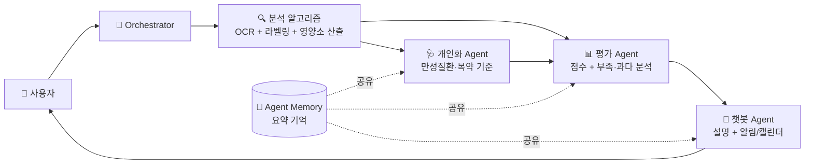
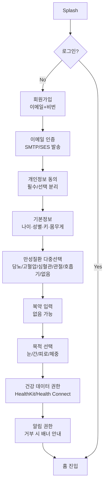
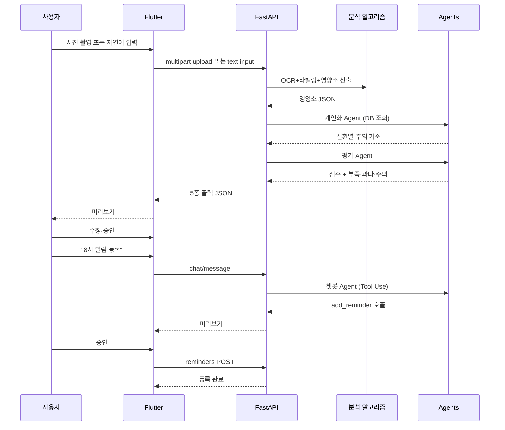

# Product Spec

> Source: PROJECT_GUIDE.md §3
> 원본 대형 기획서는 [PROJECT_GUIDE.md](../../PROJECT_GUIDE.md)에 보존되어 있습니다.

## 3. 핵심 기능 명세

### 3.1 분석 알고리즘 + 3개 Agent 통합 구조

단일 LLM 호출이 아니라, 분석 알고리즘이 이미지·자연어·파일 입력을 먼저 구조화하고 개인화·평가·챗봇 3개 Agent가 하나의 통합 흐름으로 만성질환자의 영양·복약 관리를 해석한다.



| 구성 | 책임 | 입력 | 출력 |
|-------|------|------|------|
| 분석 알고리즘 | 음식·영양제 사진 인식, OCR, CSV DB/API 매칭, 영양소 산출 | 사진, 자연어 입력, 파일, 사용자 수정 입력 | 음식명·섭취량·영양소·영양제 성분/함량 (Pydantic) |
| 개인화 Agent | 만성질환·검사값·복약 기준 제공 | 사용자 프로필, 멘토 확인 전 시연용 데이터 | 질환별 주의 영양소, 권장 기준, 약물 주의 |
| 챗봇 Agent | 결과 설명 + 사용자 요청 기반 실행 | 자연어 질문, 분석 결과, Agent 요약 기억 | 자연어 답변 + (선택) Tool Call |
| 평가 Agent | 식단관리 점수 + 개선 피드백 | 분석 알고리즘 결과 + 개인화 Agent 기준 | 점수, 부족 영양소, 과다 위험, 좋은 선택, 개선 필요 |

> 분석 알고리즘은 `backend/src/algorithms/`, `ocr/`, `supplements/`가 담당하고, 3개 Agent의 코드 책임 매핑은 §14 파일 구조의 `backend/src/agents/` 참조.

### 3.2 Agent 간 데이터 전달 포맷

3개 Agent는 다음 Pydantic 모델로 통신한다. 오케스트레이터가 분석 알고리즘 결과를 받아 직렬/병렬 호출을 결정한다.

```
class AgentInput(BaseModel):
    user_id: int
    request_id: str            # 한 사용자 요청 단위로 동일
    payload: dict              # 분석 결과, 파일/텍스트/숫자, Agent별 입력
    context: AgentMemorySnap   # 최근 검사값/만성질환/복약 요약

class AgentOutput(BaseModel):
    request_id: str
    agent_name: Literal['personalization','chat','evaluation']
    result: BaseModel          # Agent별 전용 결과 모델
    used_tools: list[str]      # Tool Use 호출 이름 목록
    latency_ms: int
    cost_usd: float            # 비용 추적
```

오케스트레이터는 각 호출을 `agent_runs` 테이블에 로깅하여 비용·지연·실패율을 추적한다. Agent 요약 기억(`agent_memory`) 갱신은 평가 Agent가 끝난 직후 `backend/src/agents/memory.py` 모듈이 담당한다.

### 3.3 Tool 정의 (LLM Tool Use 함수 목록)

`backend/src/llm/tools.py`에 정의되며 챗봇 Agent와 분석 알고리즘 흐름이 호출한다.

| Tool 이름 | 호출 주체 | 인자 | 효과 |
|-----------|-----------|------|------|
| extract_supplement_facts | 분석 알고리즘 | { ocr_text } | OCR 텍스트를 SupplementParseResult Pydantic으로 강제 파싱 |
| add_reminder | 챗봇 | { type, name, time, recurrence, weekdays? } | DB INSERT 후 flutter_local_notifications에 등록 |
| add_calendar_event | 챗봇 | { date, time, title, hospital?, note? } | DB INSERT 후 add_2_calendar로 시스템 캘린더 반영 |
| log_supplement_intake | 챗봇 | { supplement_id, taken_at } | 영양제 섭취 기록 + 응모권 카운트 |
| explain_deficiency | 챗봇 | { nutrient, ratio } | 부족 영양소 설명을 자연어로 (의료법 표현 검수 후) |

모든 Tool 호출은 `backend/src/utils/regex_filter.py`의 `check_forbidden_terms()`를 거쳐 사용자에게 전달된다.

### 3.4 인증·온보딩 흐름



이메일 인증 메일 발송은 백엔드의 `backend/src/services/email.py` 모듈에서 SMTP(개발) 또는 AWS SES/NCP Cloud Outbound Mailer(운영)로 처리. 환경변수 `EMAIL_PROVIDER`로 분기.

### 3.5 주요 화면

| 화면 | 핵심 인터랙션 | 담당 Agent |
|------|--------------|-----------|
| 온보딩 / 프로필 | 만성질환·복약·기본정보 입력 (§3.4 흐름) | 개인화 |
| 카메라 (음식·영양제) | 사진 촬영, AI 인식, 사용자 수정 | 분석 알고리즘 |
| 5종 출력 대시보드 | 부족 영양소 / 권장 섭취량 / 체중 예측 / 활동 권고 / 목적별 분석 | 분석 알고리즘+개인화+평가 |
| 챗봇 화면 | 자연어 대화, 설명, 알림/캘린더 등록 | 챗봇 |
| 식단관리 점수 | 끼니별·하루별 점수 + 개선 피드백 | 평가 |
| 응모권 현황 | 사진 기록 참여 일수 + 누적 응모권 | (Agent X, 규칙 기반) |
| 건강 데이터 | 걸음수·체중·심박 시계열 차트 | (Agent X, 시각화) |
| 설정 (로그아웃·탈퇴·동의 관리) | 동의 철회·계정 삭제·데이터 내보내기 | — |

### 3.6 MVP 핵심 흐름



### 3.7 영양제 분석 보완 흐름

1. 영양제 제품명·라벨·성분표 촬영
2. 분석 알고리즘: 제품명·성분명·함량·1회 섭취량·권장 횟수 OCR 분석
3. 사용자가 실제 섭취량·빈도·복용 시간 수정
4. 분석 알고리즘: 영양제 성분을 표준명으로 정리하고 영양소 단위로 환산한 뒤 음식 영양소와 합산
5. 개인화 Agent: 권장 기준·질환·검사값·복약 정보 참고
6. 평가 Agent: 부족·과다·중복·주의 성분 설명
7. 챗봇 Agent: 눈건강·간기능·피로회복 등 목적별 관리 방향 제시 (특정 제품 추천 X)

### 3.8 사진 기록 응모권 UX

점수 기반이 아니라 **참여 기반**. 식단관리 점수가 낮은 날에도 사진을 찍으면 응모권은 받는다.

| 조건 | 응모권 |
|------|--------|
| 하루 음식·영양제 사진 기록 완료 | 1개 |
| 1주일 연속 기록 완료 | +1개 |
| 1개월 전체 기록 완료 | +3개 |

예시 보상: 1등 1명 2박 3일 숙박권 / 2등 3명 국내 호텔 숙박권 / 3등 10명 건강식품 5만원권.

부정 사용 방지:
- 같은 사진 SHA-256 중복은 카운트 X
- 하루 최대 1개 + 계정당 월 8개 상한
- 응모권 발급은 서버 측 멱등키(`user_id + date`)로 강제

식단관리 점수는 응모권 지급 조건이 아니라, 사용자가 자신의 식단을 이해하고 개선하기 위한 피드백 지표다.

### 3.9 Agent 요약 기억

Agent는 전체 원본 데이터를 모두 저장하지 않고, 개인화에 필요한 핵심 정보만 요약 기억한다. 갱신 시점은 평가 Agent 종료 직후 + 명시적 프로필 변경 직후 (`backend/src/agents/memory.py`의 `update_memory()` 호출).

요약 기억 대상: 최근 검사값 요약 / 만성질환 태그 / 복약 정보 요약 / 음식·영양제 기록 요약 / 건강 데이터 요약 / 식단관리 점수 / 영양제 섭취 달성 이력 / 응모권 누적 이력 / 최근 주의사항.

### 3.10 에러·예외 화면 정책

| 에러 유형 | 사용자 화면 | 액션 |
|-----------|-------------|------|
| 네트워크 오프라인 | "인터넷 연결을 확인해 주세요" 토스트 | [수동 입력] [재시도] |
| OCR 실패 (저정확도) | 미리보기에 "라벨이 흐릿해요" 배너 | [다시 촬영] [수동 입력] |
| LLM 타임아웃 (12초) | "분석에 시간이 걸리고 있어요" 스피너 | [기본 분석으로 진행] |
| 의료법 표현 차단 (재시도 3회 실패) | "분석 결과를 만들 수 없어요. 수동으로 입력해 주세요" | [수동 입력] |
| Cloud Vision 한도 초과 | 자동으로 CLOVA 폴백, 사용자 알림 없음 | (서버 측 처리) |
| 알림 권한 거부 | "챗봇이 등록한 알림이 동작하지 않아요" 배너 | [설정으로 이동] |

### 3.11 오프라인 정책

- 사진 촬영은 항상 가능. 오프라인이면 Isar `pending_uploads` 큐에 저장
- 네트워크 복귀 감지 시 자동 업로드(연결 유형 무관)
- 충돌(서버에 같은 시각 분석 존재): 서버 우선, 로컬은 "병합 필요" 라벨
- 챗봇·5종 출력은 온라인 전용 — 오프라인 시 "분석은 인터넷 연결이 필요해요" 안내

### 3.12 멀티디바이스 동기화

서버가 단일 진실. 클라이언트는 last-write-wins + ETag로 충돌을 감지. 응모권 발급은 서버 측 멱등키(`user_id + date`)로 두 기기 동시 사용 시에도 중복 발급 방지.


