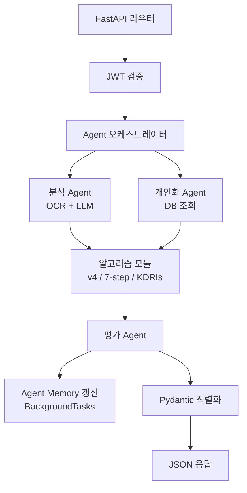

# Backend API Guide

> Source: PROJECT_GUIDE.md §5, §10
> 원본 대형 기획서는 [PROJECT_GUIDE.md](../../PROJECT_GUIDE.md)에 보존되어 있습니다.

## 5. 기술 스택 — 백엔드

### 5.1 프레임워크 · 언어

| 분류 | 기술 | 선정 이유 | 앱에서의 역할 |
|------|------|-----------|---------------|
| 언어 | Python 3.11+ | 팀 익숙도, 데이터·AI 라이브러리 풍부, Type Hint 성숙 | 모든 비즈니스 로직과 알고리즘 |
| 프레임워크 | FastAPI 0.110+ | Pydantic 기반 자동 OpenAPI/Swagger, async/await가 OCR/LLM I/O 바운드에 강점, Uvicorn workers로 병렬 | REST API 서빙, 인증, AI 호출 오케스트레이션 |
| 검증 | Pydantic v2 | LLM 응답·외부 API 응답 강제 검증 | Claude 응답 스키마 강제, 요청 바디 검증 |
| 인증 | JWT + python-jose | Stateless 인증, 모바일 친화 | 사용자 로그인 토큰, idToken 검증 |
| 비동기 작업 | asyncio + asyncio.gather | 영양제 사진 여러 장 병렬 OCR, LLM 호출 동시성 | run_full_analysis에서 영양제 N장 동시 처리 |
| 백그라운드 작업 | FastAPI BackgroundTasks | Agent 메모리 갱신·이메일 발송·통계 집계 | 응답 후 비차단 처리 |
| 메일 발송 | aiosmtplib (개발) / boto3 SES 또는 NCP API (운영) | 환경변수 EMAIL_PROVIDER로 분기 | 회원가입 이메일 인증 |
| 테스트 | pytest + pytest-cov + httpx + pytest-asyncio | 50+ 단위 테스트, 알고리즘 결과를 가이드 PPT 예시값과 일치 검증 | v1~v4·7-step·KDRIs 수치 정확성 보장 |
| 품질 | Black + Ruff + mypy + pre-commit | 협업 일관성, 타입 안정성 | 모든 PR 자동 검증 |

### 5.2 핵심 모듈 책임

```
backend/src/
├─ algorithms/          # v1~v4 활동점수, 7-step 체중예측, BMR/TDEE, 결핍 진단, 목적별
├─ ocr/                 # Cloud Vision OCR + CLOVA 폴백
├─ llm/                 # Claude/OpenAI 클라이언트, 시스템 프롬프트, Tool 정의, 스키마
├─ nutrition/           # KDRIs 룩업 + 영양소 합산
├─ prediction/          # 체중 예측 보정·시계열 분석
├─ activity/            # 걸음수·심박 → 활동점수 산출
├─ supplements/         # 영양제 파서 + 식약처 DB 매처
├─ agents/              # 4개 Agent + 오케스트레이터 + agent_runs 로깅 + memory.py
├─ services/            # email.py(메일 발송), storage.py(이미지 저장)
├─ api/                 # FastAPI 라우터
├─ models/              # SQLAlchemy ORM
├─ schemas/             # Pydantic 요청·응답
├─ db/                  # 세션·init.sql
├─ cache/               # Redis 래퍼
└─ utils/               # 해시·정규식 검수·로거
```

### 5.3 API 엔드포인트 (전체 목록)

| 엔드포인트 | 메서드 | 설명 |
|------------|--------|------|
| /api/v1/auth/signup | POST | 회원가입 (이메일+비밀번호), 인증 메일 발송 |
| /api/v1/auth/verify-email | GET | 이메일 인증 토큰 검증 |
| /api/v1/auth/login | POST | 로그인 → access + refresh JWT |
| /api/v1/auth/refresh | POST | 토큰 갱신 |
| /api/v1/auth/logout | POST | 로그아웃 (refresh 무효화) |
| /api/v1/auth/account | DELETE | 탈퇴 (30일 grace 후 완전 삭제) |
| /api/v1/profile | GET / PUT | 사용자 프로필·만성질환·복약 |
| /api/v1/profile/consent | POST | 동의 항목 별도 저장·철회 |
| /api/v1/supplements/analyze | POST (multipart) | 영양제 사진 → 분석 결과 |
| /api/v1/supplements | GET / DELETE | 등록된 영양제 목록·삭제 |
| /api/v1/meals/analyze | POST (multipart) | 음식 사진 → 분석 결과 |
| /api/v1/meals/manual | POST | 식단 텍스트 입력 |
| /api/v1/meals | GET / DELETE | 식단 기록 CRUD |
| /api/v1/analysis/full | POST | 5종 출력 통합 분석 |
| /api/v1/chat/message | POST | 챗봇 메시지 → 응답 + (선택) 액션 |
| /api/v1/reminders | GET / POST / DELETE | 복약·식단 알림 CRUD |
| /api/v1/calendar/events | GET / POST / DELETE | 진료 일정 CRUD |
| /api/v1/health/sync | POST | HealthKit/Health Connect 데이터 동기화 |
| /api/v1/score/daily | GET | 식단관리 점수 조회 |
| /api/v1/raffle/status | GET | 응모권 누적 현황 |
| /api/v1/agent/memory | GET | Agent 요약 기억 조회 (디버깅·투명성용) |
| /api/v1/data/export | GET | 사용자 데이터 전체 내보내기 (개인정보 권리) |

### 5.4 알고리즘 모듈 동작 흐름




---

## 10. 데이터 활용 & 외부 API

### 10.1 공공 데이터 (모두 무료/저비용)

| 데이터 | 출처 | 용도 |
|--------|------|------|
| KDRIs 2020 | 한국영양학회 / 보건복지부 | 30종 영양소 권장 섭취량, BMI별 칼로리 조정 |
| 식품영양성분 Open API | 식약처 | 음식별 영양소 매칭 |
| 건강기능식품 원료 DB | 식약처 | 영양제 성분 매칭, 기능성 표현 |
| 국가표준식품성분표 | 농촌진흥청 국립농업과학원 | 식품 영양소 보강 |
| AI Hub 한국 음식 이미지 | NIA | 음식 인식 모델 학습 (Phase 3, 비상업 학술) |

### 10.2 시연용 병원성 데이터

| 데이터 | 출처 | 용도 |
|--------|------|------|
| Kaggle 만성질환 데이터셋 | Kaggle | 시연용 검사값·질환·복약 데이터 |

실제 병원 연동은 불가능하므로 MVP에서는 Kaggle 데이터를 사용한다. 다만 레몬헬스케어가 LDB로 병원 연동 데이터를 활용할 수 있다는 강점을 고려해, 실제 서비스 적용 시 병원 데이터가 들어갈 자리를 시연용으로 대체하는 역할을 한다.

### 10.3 건강 데이터 연동

| 플랫폼 | 데이터 | 우선순위 | 권한 셋업 |
|--------|--------|---------|----------|
| Apple HealthKit (iOS) | 걸음수, 체중, 심박 | 우선 연동 | Info.plist에 NSHealthShareUsageDescription 사유 명시, App Store 심사 정당화 |
| Google Health Connect (Android) | 걸음수, 체중, 심박 | 우선 연동 | Play Console에서 Health Connect 데이터 타입 신청 (승인 5~10영업일) |
| 혈압 | (양 OS 모두) | 가능하면 자동, 안 되면 수동 입력 | — |

### 10.4 외부 API

| API | 용도 | 비고 |
|-----|------|------|
| Anthropic Claude API | 4개 Agent 추론 | 주력 LLM, 모델 ID는 환경변수 |
| Google Cloud Vision API | 영양제·음식 OCR | 첫 1,000건/월 무료 |
| Naver CLOVA OCR (백업) | 한국어 라벨 폴백 | Adapter 패턴 |
| OpenAI API (백업) | LLM 폴백 | Claude 장애 대비 |
| AWS SES 또는 NCP Outbound Mailer | 이메일 인증 발송 | 운영 환경 |


