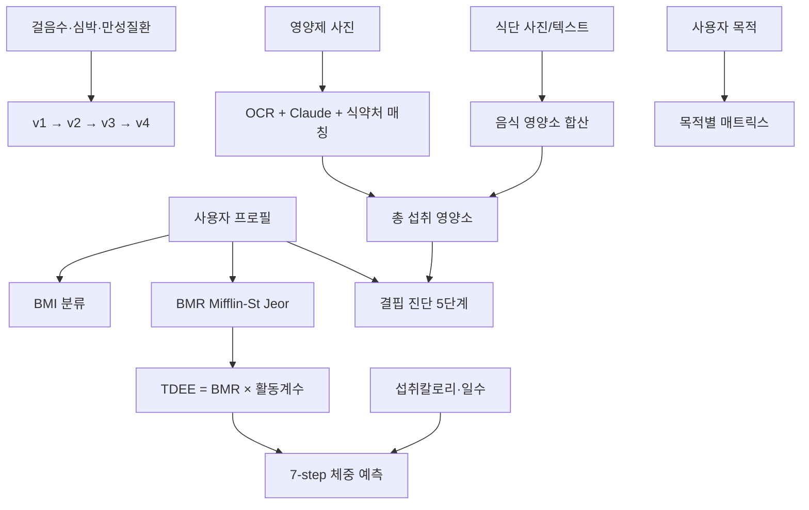

# Algorithms Guide

> Source: PROJECT_GUIDE.md §8
> 원본 대형 기획서는 [PROJECT_GUIDE.md](../../PROJECT_GUIDE.md)에 보존되어 있습니다.

## 8. 핵심 알고리즘

회사 가이드 8개(BMI·v1~v4·BMR·TDEE·7-step) + 우리가 직접 설계한 4개(영양제 OCR·식단 변환·결핍 진단·목적별 분석).

### 8.1 알고리즘 지도



### 8.2 BMI 분류 (한국·아시아 기준)

| 구분 | BMI |
|------|-----|
| 저체중 | < 18.5 |
| 정상 | 18.5 ~ 22.9 |
| 과체중 | 23.0 ~ 24.9 |
| 비만 1단계 | 25.0 ~ 29.9 |
| 비만 2단계 | ≥ 30.0 |

### 8.3 활동점수 v1 ~ v4

```
v1 = min(실제걸음 / 권장걸음, 1.2) × 83.33
   권장걸음 = 8000 × 성별계수(여 0.95 / 남 1.0)
                  × 나이계수(<40: 1.0 / 40~59: 0.9 / 60+: 0.8)
                  × BMI계수(저 0.9 / 정 1.0 / 과 1.05 / 비1: 1.1 / 비2: 1.15)

v2 = v1 × (0.7 + 0.3 × 심박계수)
   심박계수 = min(목표심박 유지분 / 30, 1.0)
   웨어러블 미착용 시 0.7
   목표심박 = (220 - 나이) × 0.5 ~ 0.7

v3 = min(100, v2 + 백분위 보너스)
   상위 10% / 20% / 30% → +10 / +5 / +3
   표본 < 30명이면 0

v4 = min(100, v3 × 만성질환가중)
   가중 = 1.0 + Σ(당뇨/고혈압 +0.10 / 심혈관/관절 +0.15 / 호흡기 +0.10)
   최대 1.3
```

검증 예시 (50대 여성, 비만 1단계, 7,000보, 당뇨+고혈압): v1 = 77.5 → v2 ≈ 69.7 → v3 = 72.7 → v4 = 87.2

### 8.4 7-step 체중 예측

```
1. BMR (Mifflin-St Jeor)
   남: 10W + 6.25H − 5A + 5
   여: 10W + 6.25H − 5A − 161

2. TDEE = BMR × 활동계수 (걸음수 기반)
   < 5,000:    1.2  (좌식)
   ~ 7,500:    1.375 (가벼운 활동)
   ~ 10,000:   1.55  (중간)
   ~ 12,500:   1.725 (활발)
   ≥ 12,500:   1.9   (매우 활발)

3. 일일 수지 = 섭취칼로리 − TDEE
4. N일 누적 = Σ(일일 수지)
5. 이론 변화 = 누적 / 7,700 kcal/kg
6. 현실 보정: 감량 ×0.85 / 증량 ×0.95
7. 예측 체중 = 시작 체중 + 보정 변화
```

검증 예시 (50세 여성 160cm/68kg, 6,500보, 1,500kcal, 30일): BMR 1,269 → TDEE 1,745 → 일일 −245 → 누적 −7,350 → 이론 −0.955 → 보정 −0.81 → **67.19 kg**

### 8.5 영양제 OCR → LLM → 식약처 매칭 파이프라인

```
1. 이미지 검증·전처리 (5MB↓, JPEG, 회전 보정)
2. SHA-256 해시 → Redis 캐시 조회 (TTL 30일)
   ├─ 히트 → 즉시 반환
   └─ 미스 ↓
3. Google Cloud Vision DOCUMENT_TEXT_DETECTION → raw 텍스트
4. Claude Tool Use (extract_supplement_facts, Pydantic 스키마 강제)
   → {product_name, serving_size,
       ingredients[{name_ko, name_en, amount, unit, daily_value_pct}]}
5. 식약처 건강기능식품 원료 DB 매칭
   - 성분명 정규화 ("비타민 C" = "Vitamin C" = "ascorbic acid")
   - DB 미매칭 시 LLM이 영어 성분명을 한국어로 변환 + "비공식 매칭" 라벨
   - 식약처 기능성 인정 정보 보강
6. PostgreSQL INSERT + Redis SET (TTL 30일)
7. JSON 응답
```

### 8.6 결핍 진단 로직

```
실제 섭취량 = Σ(음식 영양소) + Σ(영양제 영양소)
RDI = KDRIs 룩업 (나이·성별·BMI·만성질환 보정)
비율 = 실제 / RDI

비율 분류:
  < 0.35   → DEFICIENT  (결핍)
  0.35~0.7 → LOW        (낮음)
  0.7~1.3  → ADEQUATE   (적정)
  1.3~UL   → EXCESSIVE  (과다)
  > UL     → RISKY      (위험)

결핍 영양소는 비율 낮은 순으로 priority 정렬
```

### 8.7 목적별 분석 매트릭스 (식약처 기능성 인정 원료만)

| 목적 | 핵심 영양소 | 권장량 | 근거 |
|------|------------|--------|------|
| 눈건강 | 루테인+지아잔틴 | 10~20 mg/일 | AREDS2 황반변성 임상 |
| 눈건강 | 오메가-3 (DHA) | 1~2 g | 망막·안구건조 |
| 간기능 | 밀크씨슬 (실리마린) | ≥130 mg | 식약처 "간 건강" 인정 |
| 간기능 | NAC | 600~1,800 mg | 글루타티온 전구체 |
| 피로회복 | 비타민 B1/B2/B12 | KDRIs 기준 | 에너지 대사 |
| 피로회복 | CoQ10 | 90~200 mg | 미토콘드리아 ATP |
| 피로회복 | 마그네슘 | KDRIs 기준 | ATP 합성·근육 |

> 경고 분기: 흡연자 + 눈건강 → 루테인 폐암 위험 경고 자동 표시

### 8.8 검증 4단계

| 레벨 | 방법 |
|------|------|
| L1 | 단위 테스트 50+개, 가이드 PPT 예시값과 ±0.1 이내 일치 |
| L2 | 알고리즘 모듈 통합 테스트 |
| L3 | 의료자문위 검토 (의사 1+약사 1+영양사 1) |
| L4 | 내부 테스터 5명 + 멘토·자문위 3명 정성 피드백 (정량 SUS는 v2) |


