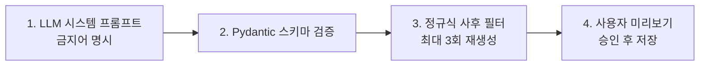

# Compliance & Safety Guide

> Source: PROJECT_GUIDE.md §19
> 원본 대형 기획서는 [PROJECT_GUIDE.md](../../PROJECT_GUIDE.md)에 보존되어 있습니다.

## 19. 컴플라이언스 & 안전선

본 서비스는 진단·치료 서비스가 아니라 웰니스 기반 건강관리 보조 서비스로 정의한다. 의료법·약사법·건강기능식품법·개인정보보호법 5개 법령을 준수.

### 19.1 표현 가이드 — 절대 금지 vs 허용

#### 절대 금지 (의료법·약사법)

1. "OO질환입니다" — 진단
2. "OO약을 드세요" — 처방
3. 특정 의료기관 알선
4. 의사·약사 오인 표현
5. 치료 효과 단정 보장
6. 특정 의약품 추천·이름 명시
7. 의약품의 건기식화 광고

#### 허용

1. KDRIs 권장량 안내
2. 일반 식이·운동 권고
3. 영양소 결핍 가능성 (질병명 X)
4. "전문가와 상담을 권장합니다"
5. 일반인 대상 영양·운동·체중 정보
6. 식약처 기능성 인정 원료 안내
7. 영양제 라벨 단순 표시
8. "약사와 상의" 안내

### 19.2 표현 가이드 — 위반 → 대체

| 위반 | 대체 |
|---------|---------|
| "당신은 빈혈입니다" | "철분 섭취량이 권장량보다 낮습니다" |
| "비타민 D가 결핍되었습니다" | "비타민 D 섭취가 권장량의 35% 수준입니다" |
| "당뇨 위험군입니다" | "혈당 관련 영양소 관리에 주의가 필요할 수 있습니다" |
| "OO 비타민C를 드세요" | "비타민 C 섭취량을 늘리는 것이 권장됩니다" |
| "이대로면 비만이 됩니다" | "현재 추세 시 1개월 후 체중이 약 1.2 kg 증가할 수 있습니다" |
| "운동 부족으로 병이 옵니다" | "권장 걸음수의 60% 수준으로 활동하고 계십니다" |

### 19.3 면책 고지 표준 문구 3종

#### 메인 (모든 권고 화면 하단)

> "본 서비스에서 제공하는 정보는 일반적인 건강 관리를 위한 참고 자료이며, 의사·약사·영양사의 전문적 진단이나 처방을 대체하지 않습니다. 증상이 있거나 만성질환을 앓고 계신 경우, 반드시 전문가와 상담하시기 바랍니다."

#### 영양제

> "영양제는 의약품이 아니며, 질병의 예방이나 치료를 보장하지 않습니다. 약을 복용 중이신 경우, 영양제와의 상호작용에 대해 의료진과 상담하세요."

#### 체중 예측

> "체중 변화 예측은 평균적인 수치를 바탕으로 산출되며, 개인의 대사·체질·생활습관에 따라 결과가 달라질 수 있습니다. 급격한 체중 변화는 건강에 해로울 수 있으니 의료진과 상담하세요."

### 19.4 자동 검수 장치 (4단계)

### 19.5 개인정보보호법 — 민감정보 처리

| 분류 | 항목 | 동의 |
|------|------|------|
| 민감정보 (별도 동의 필수) | 만성질환·복약·검진기록·걸음수·심박수 | 항목별 체크 |
| 일반정보 | 이름·이메일·나이·성별·키·몸무게·식단/영양제 사진 | 통합 동의 |

처리 원칙:
- 별도 동의 UI (필수/선택 구분 + 사용 목적 표시)
- 가명정보 처리
- 데이터 주체 5권리 (열람 / 정정·삭제 / 처리정지 / 동의 철회 / 탈퇴 즉시 삭제 + 백업 90일 폐기)
- AES-256 + TLS 1.3 + 감사 로그

### 19.6 DTx 해당 여부

결론: 비의료 건강관리서비스, 식약처 허가 불필요.

3가지 DTx 요건 모두 X:
- 임상 근거 X (KDRIs 기반 일반 권고)
- 질병 치료 목적 X (관리·참고)
- 특정 질환자 프로토콜 X (일반인 대상)

가드: "치료" 표현 X, "관리·참고" 통일.

### 19.7 데이터 출처 명시 (앱 내 필수)

- 한국영양학회 KDRIs 2020 (보건복지부)
- 식약처 식품영양성분 Open API
- 식약처 건강기능식품 원료 DB
- 농촌진흥청 국가표준식품성분표
- AI Hub 음식 이미지 (NIA, 비상업 학술)

### 19.8 Phase별 컴플라이언스 체크리스트

| Phase | 체크 |
|-------|------|
| Phase 0~1 | 표준 디스클레이머 / LLM 시스템 프롬프트 + 금지어 검출 |
| Phase 2 | 별도 동의 UI / 디스클레이머 / AES-256 / TLS 1.3 / PHI 감사 로그 |
| Phase 3 | 의료자문위 / 식약처 표현 검수 / DTx 사전 검토 / 위급 신호 감지 |
| Phase 4 | 법무 검수 진단·처방 0건 / 출처 페이지 / App Privacy 라벨 / Data Safety / 개인정보처리방침 |

