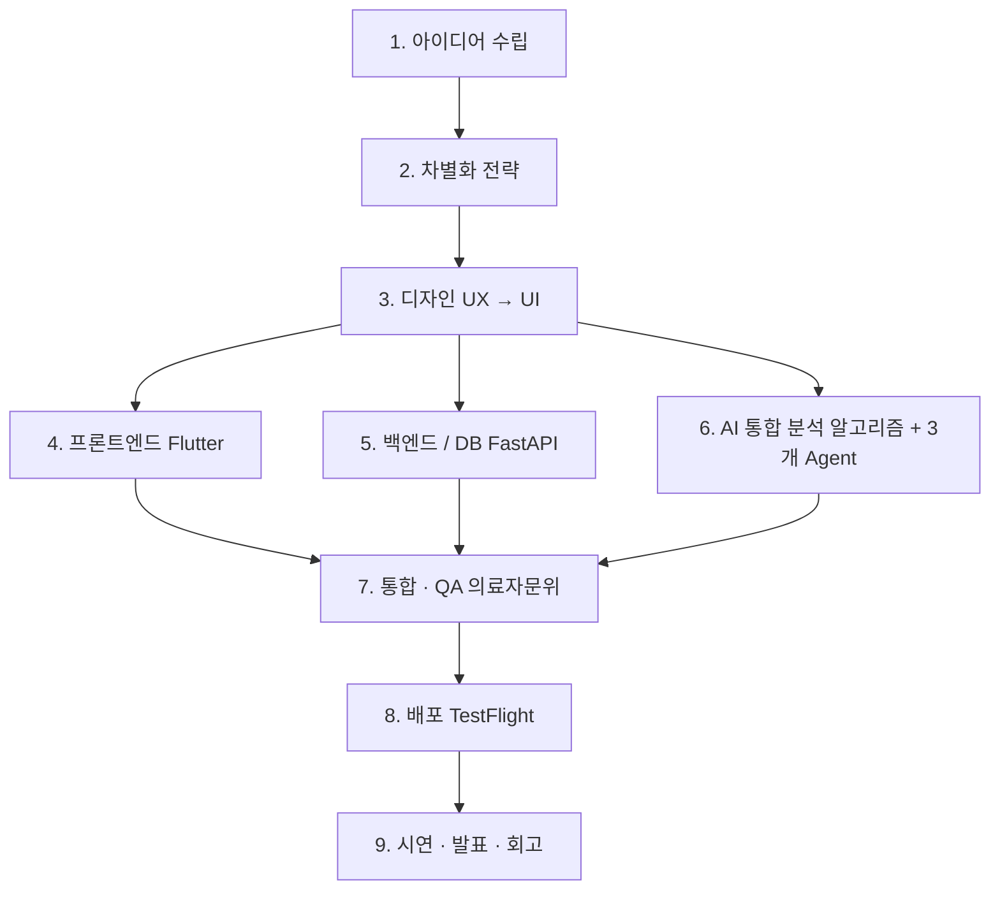
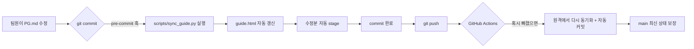
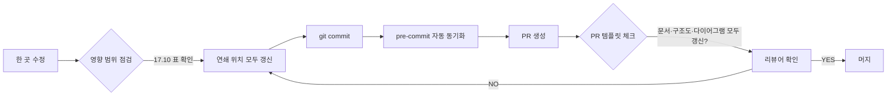

# Team Workflow Guide

> Source: PROJECT_GUIDE.md §12-§17
> 원본 대형 기획서는 [PROJECT_GUIDE.md](../../PROJECT_GUIDE.md)에 보존되어 있습니다.

## 12. 작업 파이프라인

### 12.1 단계별 흐름 (한눈에)



### 12.2 단계별 상세

#### 1단계 — 아이디어 수립
- 목적: 만성질환자의 어떤 불편을 해결할지 한 문장으로
- 활동: 시중 영양제 앱 비교, 페르소나 인터뷰, 갭 분석
- 산출물: 한 줄 요약, 페르소나 2명, 차별화 5가지
- 체크포인트: 30초 안에 컨셉 설명 가능?

#### 2단계 — 차별화 전략 수립
- 목적: 분석 알고리즘 + 3개 Agent 협력 + 응모권 참여 UX + 의료기관 연계 가능성
- 활동: Agent 책임 분담, 응모권 규칙 합의, LDB 연계 인터페이스 설계
- 산출물: §3 핵심 기능 명세, §7 AI 스택, §9 호출 흐름
- 체크포인트: 경쟁사가 못 따라하는 자산 명확?

#### 3단계 — 디자인 (UX → UI)
- 목적: 만성질환자(50대+)도 쉽게 쓸 화면
- 활동: 7화면 와이어프레임, 디자인 토큰, Figma 시안
- 산출물: Figma 파일, tokens.dart 초안
- 체크포인트: 50대 사용자 테스트 통과?

#### 4단계 — 프론트엔드 개발 (Flutter)
- 목적: Figma 시안을 실동작 앱으로
- 활동: 환경 셋업, 라우팅, 토큰 적용, 7화면 구현, health 패키지 연동, 알림·캘린더
- 산출물: mobile/ 디렉터리 전체
- 체크포인트: iOS+Android 양쪽 동작?

#### 5단계 — 백엔드 / DB 구축
- 목적: 알고리즘 + API + 데이터 영속
- 활동: Docker Compose, Alembic, 알고리즘 단위, 50+ 테스트, 인증·RLS·암호화
- 산출물: backend/ 디렉터리
- 체크포인트: 가이드 예시 케이스 통과?

#### 6단계 — AI 통합 (4·5와 병렬)
- 목적: §7 AI 스택을 분석 알고리즘 + 3개 Agent로 실동작
- 활동: Claude SDK 래퍼, 3개 Agent 프롬프트, Tool 정의, OCR 어댑터, 의료법 검수, 미리보기
- 산출물: backend/src/llm/, agents/
- 체크포인트: 같은 입력 → 캐시 적중? 금지 표현 0건?

#### 7단계 — 통합 · QA · 의료자문위 검토
- 목적: 4·5·6 결과 합쳐 끝까지 동작하는 한 흐름
- 활동: 시연 시나리오 3개, 디바이스 테스트, 접근성, 성능, 에러 핸들링, 카피, 의료자문위, TestFlight 첫 빌드
- 산출물: QA 체크리스트, 의료자문위 의견서
- 체크포인트: 시나리오 3개 끊김 없이 시연 가능?

#### 8단계 — 배포
- 목적: 발표장에서 실기기 시연
- 활동: 백엔드 클라우드, TestFlight/Play Internal, 환경 변수, 도메인, 데모 데이터 시드
- 산출물: 라이브 API URL, TestFlight 링크
- 체크포인트: 발표장 와이파이로 3초 내 응답?

#### 9단계 — 시연 · 발표 · 회고
- 목적: 8주 결과를 명확한 메시지로 전달
- 활동: 시연 대본, 데모 데이터, 슬라이드, 백업 플랜, 회고
- 산출물: 슬라이드, 시연 영상, 회고 문서
- 체크포인트: 청중에게 30초 안에 차별화 설명 가능?

### 12.3 일정 매핑 (8주)

| 주차 | 단계 | 주요 작업 |
|------|------|-----------|
| W1 | 1·2 | 아이디어/차별화 합의, 본 가이드 작성, Health Connect 데이터 타입 신청 제출 |
| W2 | 3 | Figma + 디자인 토큰 + 7화면 와이어프레임, 환경 셋업 시작 |
| W3 | 4·5 | Flutter 환경 + 백엔드 환경 + 알고리즘 단위 + Alembic init |
| W4 | 4·5·6 | 카메라·OCR·분석 알고리즘 통합 |
| W5 | 4·5·6 | 5종 출력 대시보드 + 평가 Agent + KDRIs 결핍 진단 |
| W6 | 4·6 | 챗봇 Agent + Tool Use 알림/캘린더 + 응모권 |
| W7 | 7 | 통합 QA + 의료자문위 검토 + TestFlight 첫 빌드 업로드 |
| W8 | 8·9 | 배포 + 데모 데이터 + 시연 리허설 + 슬라이드 |

### 12.4 단계 간 의존성과 위험 신호

- 3단계 1주 이상 지연 → 4단계는 와이어프레임 PNG로 시작, UI 다듬기는 W6로
- 5단계 막힘 → 시계열 데이터는 v2로 미루고 PostgreSQL 단독 운영
- 6단계 막힘 → 챗봇 Agent를 평가 흐름과 통합, 알림 등록은 수동 폼으로 폴백
- 7단계 TestFlight 외부 그룹 심사 미통과 → 내부 테스터(최대 100명) 그룹으로 폴백
- 8단계 막힘 → 발표 PC에서 로컬 백엔드 + 시뮬레이터 직접 시연

> 원칙: AI 4개 중 1~2개가 빠져도 코어(영양제 분석 + 5종 출력)는 살아남는다. 그래서 발표는 무조건 성립한다.


## 13. 사용 툴 정리

본 프로젝트에 실제로 사용하는 도구·서비스·라이브러리를 한 곳에 모아 정리.

### 13.1 디자인 도구

| 도구 | 용도 | 비고 |
|------|------|------|
| Figma | UI 시안, 디자인 토큰 정의, 팀 리뷰 | Pro 팀 워크스페이스 |
| Figma MCP 서버 | Claude(Cowork)가 Figma 파일 직접 분석 | 디자인-기획 자동 연결 |
| Pretendard | 한글 본문/제목 단일 폰트 | jsDelivr CDN, 무료 오픈 폰트 |
| Material Symbols | 아이콘 세트 | Flutter 기본 |

### 13.2 AI · LLM 도구

| 도구 | 용도 | 비고 |
|------|------|------|
| Anthropic Claude (개발 보조) | 본 가이드 작성, 3개 Agent 프롬프트 설계, 코드 보조 | Cowork (데스크톱) 환경 |
| Anthropic Claude (런타임) | 3개 Agent 추론 + 분석 구조화 보조 | 모델 ID는 환경변수 |
| OpenAI API | LLM 폴백 | Claude 장애 시 Adapter 교체 |
| Google Cloud Vision API | 영양제·음식 OCR | DOCUMENT_TEXT_DETECTION |
| Naver CLOVA OCR | OCR 폴백 | 한국어 SOTA |

### 13.3 프론트엔드 (Flutter)

| 라이브러리 | 용도 | 비고 |
|-----------|------|------|
| Flutter 3.24+ | UI 프레임워크 | iOS+Android 단일 코드 |
| Riverpod | 상태 관리 | 컴파일 타임 안전 |
| go_router | 라우팅 | 7화면 전환 |
| Dio + Retrofit | HTTP 클라이언트 | 인터셉터·재시도 |
| image_picker / camera | 카메라·갤러리 | 영양제·음식 촬영 |
| health | HealthKit + Health Connect | 단일 패키지로 양 OS |
| Isar / Hive | 로컬 NoSQL | 캐시·오프라인 큐 |
| fl_chart | 차트 | 체중 예측·점수 시각화 |
| flutter_local_notifications | 로컬 알림 | 복약·식단 리마인더 |
| add_2_calendar | 시스템 캘린더 등록 | 진료 일정 |
| freezed | 불변 데이터 클래스 | 모델 정의 |
| json_serializable | JSON 직렬화 | API 응답 파싱 |

### 13.4 백엔드 · 데이터

| 도구 | 용도 | 비고 |
|------|------|------|
| Python 3.11+ | 백엔드 언어 | Type Hint 성숙 |
| FastAPI 0.110+ | 웹 프레임워크 | async, Swagger 자동 |
| Uvicorn | ASGI 서버 | workers로 병렬 |
| Pydantic v2 | 스키마 검증 | LLM 응답·요청 강제 |
| SQLAlchemy 2.x | ORM | async 지원 |
| Alembic | DB 마이그레이션 | 버전 관리 |
| PostgreSQL 16 | 메인 DB | JSONB·GIN·암호화 |
| TimescaleDB 2.x | 시계열 확장 | Hypertable |
| Redis 7 | 캐시·rate limit | OCR/LLM 캐싱 |
| anthropic SDK | Claude API | 공식 Python SDK |
| google-cloud-vision SDK | OCR | 공식 Python SDK |
| aiosmtplib / boto3 SES | 이메일 발송 | EMAIL_PROVIDER 분기 |
| httpx | HTTP 클라이언트 | async 지원 |
| python-jose | JWT | Stateless 인증 |
| passlib + bcrypt | 비밀번호 해싱 | 표준 |
| pytest + pytest-cov + httpx + pytest-asyncio | 테스트 | 50+ 단위 테스트 |

### 13.5 개발 환경

| 도구 | 용도 | 비고 |
|------|------|------|
| VS Code / Cursor / Windsurf | 코드 에디터 | 개인 선택 |
| Claude Code / Codex / Cline | 바이브 코딩 툴 | 개인 선택 (PROJECT_GUIDE.md 공통 참조) |
| Git + GitHub | 버전 관리 | Lemon-Aid-KDT/Lemon-sin |
| Black + Ruff + mypy | Python 품질 | pre-commit hooks |
| dart format + flutter analyze | Dart 품질 | CI 자동 |
| Docker + Docker Compose | 로컬 환경 | timescale + redis |
| Postman / Insomnia | API 테스트 | Swagger와 함께 |

### 13.6 협업 · 운영

| 도구 | 용도 | 비고 |
|------|------|------|
| Notion / 구글 닥스 | 회의록 · 아이디어 | 팀 커뮤니케이션 |
| 카카오톡 / Slack | 실시간 소통 + 작업 잠금 공지 | 충돌 예방 |
| GitHub Actions | CI (backend / mobile / docs) | 자동 검증 |
| GitHub Projects | 칸반 보드 | 이슈 트래킹 |
| GitHub Secrets | API 키·환경변수 보관 | CI에서 사용 |
| NCP / AWS / GCP | 백엔드 배포 | 학생 크레딧 |
| TestFlight (iOS) | 베타 배포 | 무료, 외부 심사 24~48h |
| Google Play Internal Testing | 베타 배포 | 무료 |
| OBS Studio (선택) | 시연 영상 녹화 | 백업 |
| QR Generator | 발표 시 라이브 URL → QR | 청중 즉시 접속 |

### 13.7 향후 도입 검토

| 도구 | 시점 | 용도 |
|------|------|------|
| Sentry | 베타 이후 | 프로덕션 에러 모니터링 |
| Playwright + Patrol | 안정화 | E2E 테스트 자동화 |
| i18n | 글로벌 확장 | 영문·일문 |
| FHIR KR Core | LDB 통합 | 표준 의료 데이터 교환 |


## 14. 파일 구조

전체 디렉터리 트리. 5명이 git clone 직후 빌드·실행 가능한 구조.

```
Lemon_Aid/
├─ 📄 README.md
├─ 📄 PROJECT_GUIDE.md              # 본 문서 (마크다운 단일 진실)
├─ 📄 guide.html                    # 같은 내용의 브라우저 뷰어
│
├─ 📁 mobile/                       # Flutter 앱
│  ├─ lib/
│  │  ├─ main.dart
│  │  ├─ app.dart                   # 라우팅 · 부트스트랩
│  │  │
│  │  ├─ screens/
│  │  │  ├─ splash_screen.dart
│  │  │  ├─ auth/
│  │  │  │  ├─ login_screen.dart
│  │  │  │  ├─ signup_screen.dart
│  │  │  │  ├─ verify_email_screen.dart
│  │  │  │  └─ consent_screen.dart
│  │  │  ├─ onboarding_screen.dart
│  │  │  ├─ camera_screen.dart
│  │  │  ├─ dashboard_screen.dart
│  │  │  ├─ chat_screen.dart
│  │  │  ├─ score_screen.dart
│  │  │  ├─ raffle_screen.dart
│  │  │  ├─ health_screen.dart
│  │  │  └─ settings_screen.dart
│  │  │
│  │  ├─ widgets/
│  │  │  ├─ supplement_preview.dart
│  │  │  ├─ ai_input_sheet.dart
│  │  │  ├─ insight_card.dart
│  │  │  ├─ disclaimer_banner.dart
│  │  │  └─ error_view.dart
│  │  │
│  │  ├─ services/
│  │  │  ├─ api_client.dart         # Dio + Retrofit
│  │  │  ├─ auth_service.dart
│  │  │  ├─ health_service.dart
│  │  │  ├─ notification_service.dart
│  │  │  ├─ calendar_service.dart
│  │  │  └─ offline_queue.dart
│  │  │
│  │  ├─ providers/
│  │  │  ├─ auth_provider.dart
│  │  │  ├─ profile_provider.dart
│  │  │  ├─ analysis_provider.dart
│  │  │  ├─ chat_provider.dart
│  │  │  └─ raffle_provider.dart
│  │  │
│  │  ├─ models/
│  │  │  ├─ user.dart
│  │  │  ├─ supplement.dart
│  │  │  ├─ meal.dart
│  │  │  ├─ analysis_result.dart
│  │  │  └─ chat_message.dart
│  │  │
│  │  └─ utils/
│  │     ├─ tokens.dart
│  │     ├─ date_utils.dart
│  │     └─ formatter.dart
│  │
│  ├─ test/
│  │  ├─ widget_test.dart
│  │  └─ unit/
│  ├─ ios/
│  │  ├─ Podfile
│  │  └─ Runner/Info.plist          # NSHealthShareUsageDescription 등
│  ├─ android/
│  │  ├─ build.gradle
│  │  └─ app/
│  │     ├─ build.gradle
│  │     └─ src/main/AndroidManifest.xml
│  ├─ pubspec.yaml
│  └─ analysis_options.yaml
│
├─ 📁 backend/
│  ├─ src/
│  │  ├─ main.py                    # FastAPI 진입점
│  │  ├─ config.py                  # 환경변수 로딩 (CLAUDE_MODEL_ID, EMAIL_PROVIDER 등)
│  │  │
│  │  ├─ api/
│  │  │  ├─ auth.py
│  │  │  ├─ profile.py
│  │  │  ├─ supplements.py
│  │  │  ├─ meals.py
│  │  │  ├─ analysis.py
│  │  │  ├─ chat.py
│  │  │  ├─ reminders.py
│  │  │  ├─ calendar.py
│  │  │  ├─ health.py
│  │  │  ├─ score.py
│  │  │  ├─ raffle.py
│  │  │  └─ data_export.py
│  │  │
│  │  ├─ algorithms/
│  │  │  ├─ bmi.py
│  │  │  ├─ activity.py             # v1~v4
│  │  │  ├─ weight_prediction.py    # 7-step
│  │  │  ├─ kdris.py                # KDRIs 룩업
│  │  │  ├─ deficiency.py           # 결핍 진단
│  │  │  └─ goal_matrix.py          # 목적별 분석
│  │  │
│  │  ├─ ocr/
│  │  │  ├─ vision_adapter.py       # Cloud Vision
│  │  │  └─ clova_adapter.py        # 백업
│  │  │
│  │  ├─ llm/
│  │  │  ├─ claude_client.py
│  │  │  ├─ openai_client.py        # 백업
│  │  │  ├─ prompts.py              # 시스템 프롬프트 + 버전 태그
│  │  │  ├─ schemas.py              # Pydantic 출력 스키마
│  │  │  └─ tools.py                # Tool Use 함수 정의 모음
│  │  │
│  │  ├─ agents/
│  │  │  ├─ analysis_agent.py
│  │  │  ├─ personalization_agent.py
│  │  │  ├─ chat_agent.py
│  │  │  ├─ evaluation_agent.py
│  │  │  ├─ orchestrator.py         # 4 Agent 분기 + agent_runs 로깅
│  │  │  └─ memory.py               # agent_memory 갱신 로직
│  │  │
│  │  ├─ supplements/
│  │  │  ├─ parser.py
│  │  │  └─ matcher.py              # 식약처 DB 매칭
│  │  │
│  │  ├─ services/                  # 외부 서비스 어댑터
│  │  │  ├─ email.py                # SMTP / SES / NCP
│  │  │  └─ storage.py              # 이미지 파일 저장
│  │  │
│  │  ├─ models/                    # SQLAlchemy ORM
│  │  ├─ schemas/                   # Pydantic 요청·응답
│  │  ├─ db/
│  │  │  ├─ session.py
│  │  │  └─ init.sql                # CREATE EXTENSION timescaledb
│  │  ├─ cache/                     # Redis 래퍼
│  │  └─ utils/
│  │     ├─ hash.py                 # SHA-256
│  │     ├─ regex_filter.py         # 의료법 표현 사후 검수
│  │     └─ logger.py
│  │
│  ├─ alembic.ini
│  ├─ alembic/
│  │  ├─ env.py
│  │  └─ versions/
│  ├─ tests/
│  │  ├─ conftest.py
│  │  ├─ unit/
│  │  ├─ integration/
│  │  └─ fixtures/
│  ├─ requirements.txt
│  ├─ requirements-dev.txt
│  ├─ .env.example
│  ├─ pyproject.toml
│  └─ Dockerfile
│
├─ 📁 data/                         # 정적 데이터
│  ├─ kdris_2020.csv
│  ├─ goal_matrix.json
│  └─ README.md                     # 출처·라이선스
│
├─ 📁 docs/                         # 목적별 문서 묶음
│  ├─ guide/                        # 제품·개발 기준 가이드
│  ├─ domain/                       # 팀 내부 도메인 학습 자료
│  ├─ research/                     # 논문·API·외부 근거 정리
│  ├─ reports/                      # 검토 보고서·의사결정 기록
│  ├─ appendices/                   # 본문에서 분리한 실행 부록
│  ├─ presentations/                # 멘토 미팅·발표 산출물
│  └─ harness/                      # 문서 라우팅 규칙과 템플릿
│
├─ 📁 .github/
│  ├─ CODEOWNERS                    # §16 GitHub 협업 규칙 참조
│  ├─ PULL_REQUEST_TEMPLATE.md
│  ├─ ISSUE_TEMPLATE/
│  │  ├─ bug_report.yml
│  │  ├─ feature_request.yml
│  │  └─ chore.yml
│  ├─ dependabot.yml
│  └─ workflows/
│     ├─ ci-backend.yml
│     ├─ ci-mobile.yml
│     ├─ ci-docs.yml
│     └─ sync-guide.yml             # §17 PG.md → guide.html 자동 동기화
│
├─ 📁 scripts/                      # 운영·자동화 스크립트
│  └─ sync_guide.py                 # §17 PG.md ↔ guide.html 동기화 (6중 검증)
│
├─ 🔧 docker-compose.yml             # timescale + redis
├─ 🔧 .gitignore
├─ 🔧 .pre-commit-config.yaml        # §17 로컬 commit 자동 동기화 + 위험 패턴 차단
└─ 🔧 .editorconfig
```

### 핵심 파일 책임

| 파일 | 책임 |
|------|------|
| PROJECT_GUIDE.md | 팀 단일 진실 |
| guide.html | 브라우저 뷰어 (HTML 틀 고정) |
| mobile/lib/app.dart | 라우팅, 전역 상태 |
| mobile/lib/utils/tokens.dart | 디자인 토큰 |
| mobile/ios/Runner/Info.plist | HealthKit 권한 사유 |
| mobile/android/app/src/main/AndroidManifest.xml | Health Connect 권한 |
| backend/src/main.py | FastAPI 진입점 |
| backend/src/config.py | 환경변수 로딩 |
| backend/src/agents/orchestrator.py | 4 Agent 분기 + agent_runs 로깅 |
| backend/src/agents/memory.py | agent_memory 갱신 |
| backend/src/llm/prompts.py | 시스템 프롬프트 + 버전 태그 |
| backend/src/llm/schemas.py | Pydantic 출력 스키마 |
| backend/src/llm/tools.py | Tool Use 함수 정의 모음 |
| backend/src/services/email.py | 이메일 인증 발송 |
| backend/src/utils/regex_filter.py | 의료법 표현 검수 |
| backend/src/db/init.sql | TimescaleDB 확장 자동 설치 |
| data/kdris_2020.csv | 30종 영양소 권장 섭취량 |
| scripts/sync_guide.py | §17 PG.md → guide.html 자동 동기화 + 6중 검증 |
| .pre-commit-config.yaml | §17 로컬 commit 시 자동 동기화 훅 |
| .github/workflows/sync-guide.yml | §17 push 시 서버 동기화·자동 커밋, PR 시 검증 |


## 15. 팀원 작업 분담

팀원 5명. 각자 본인에게 맞는 바이브 코딩 툴(Claude Code, Codex, Cursor, Cline 등)을 자유롭게 사용한다. 단일 진실 = `PROJECT_GUIDE.md`.

### 15.1 역할 분담 (5명)

| 역할 | 담당 영역 | 주로 만지는 폴더 |
|------|----------|-----------------|
| A. 프론트 리드 | Flutter 라우팅·디자인 토큰·화면 통합·health 패키지 | mobile/lib/app.dart, screens/, utils/tokens.dart |
| B. UI/UX | 만성질환자 친화 UI·미리보기·챗봇 UI·응모권 화면·에러 화면 | mobile/lib/widgets/, screens/chat_screen.dart, screens/raffle_screen.dart |
| C. AI 엔지니어 | Claude API·3개 Agent·프롬프트·Tool 정의·OCR·의료법 검수 | backend/src/llm/, agents/, ocr/, utils/regex_filter.py |
| D. 백엔드 | FastAPI·알고리즘·DB·인증·캐싱·**보안(JWT·RLS·AES-256)**·이메일 발송 | backend/src/algorithms/, api/, models/, schemas/, db/, cache/, services/email.py |
| E. 데이터·도메인 | KDRIs/식약처/농진청 데이터 임포트·Kaggle 시연 데이터·의료자문위 협업·컴플라이언스 검토 | data/, docs/, backend/src/algorithms/kdris.py, goal_matrix.py |

### 15.2 협업 기본 원칙 (상세 규칙은 §16)

- 일일 스탠드업: 10분 (어제·오늘·블로커)
- 같은 파일 동시 작업 X, 시작 시 채팅에 한 줄 공지
- 모든 코드 변경은 PROJECT_GUIDE.md 변경과 동기화
- **한 곳을 바꾸면 다른 곳도 같이 바뀐다 — §17.10 변경 파급 효과 표를 항상 본다**

> **중요**: 새 API 1개 추가는 단순히 `backend/src/api/foo.py` 한 파일이 아니다. §5.3 API 표, §9 호출 흐름, §14 파일 구조, §11 데이터 모델, §16.5 CODEOWNERS — 최소 5곳이 같이 바뀌어야 한다. PR 템플릿의 "📋 변경 파급 효과 점검" 체크리스트가 이를 강제한다.

### 15.3 바이브 코딩 툴 사용 원칙

팀원 5명이 각자 다른 툴(Claude Code, Codex, Cursor, Cline, Windsurf 등)을 써도 결과물은 같다.

| 원칙 | 설명 |
|------|------|
| 단일 진실 = PROJECT_GUIDE.md | 모든 툴이 이 한 마크다운 파일을 우선 참조 |
| HTML 틀은 깨지 않는다 | guide.html은 `<script id="md-source">` 안의 마크다운만 수정 |
| 마크다운 문법 준수 | 헤딩(#), 표(\|), 코드블록, 인용문(>), 리스트(-, 1.) |
| Mermaid 다이어그램 OK | ` ```mermaid `로 시작하는 코드블록은 그림으로 자동 렌더링 |
| SPLIT 구분자 보존 | 세 줄짜리 SPLIT 마커(대시 3개 + SPLIT + 대시 3개)는 페이지 분할 표식. 함부로 추가/삭제 X |
| 코드 변경 시 가이드도 갱신 | 알고리즘·API·스키마 바뀌면 가이드도 같이 PR |
| 프롬프트 영역(prompts.py)은 C 담당 | 다른 사람은 PR 리뷰만 |

### 15.4 PROJECT_GUIDE.md 동기화 흐름

```
[변경 발생]
   ↓
[담당자] PROJECT_GUIDE.md 수정 (마크다운만)
   ↓
[자동] guide.html은 같은 md-source를 읽으므로 자동 반영
   ↓
[PR] 코드 변경 PR + 가이드 변경 PR을 같이 묶음
   ↓
[리뷰] 1명 이상 + 가이드 일관성 확인
   ↓
[머지]
```

### 15.5 각 툴별 사용 팁

| 툴 | 권장 워크플로 |
|----|--------------|
| Claude Code | `claude` CLI에서 PROJECT_GUIDE.md 첨부 후 `/clear` 자주 사용 |
| Codex (CLI) | `codex` 시작 시 PROJECT_GUIDE.md 컨텍스트로 먼저 로드 |
| Cursor | `.cursorrules`에 "always read PROJECT_GUIDE.md first" 명시 |
| Cline / Continue | 작업 시작 시 가이드 문서 첨부 |
| Windsurf | 워크스페이스 인덱싱에 PROJECT_GUIDE.md 포함 |


## 16. GitHub 협업 규칙

5명이 같은 저장소에서 충돌 없이 작업하기 위한 GitHub 운영 규칙. 모든 항목이 `.github/` 폴더 또는 저장소 설정에 반영된다.

### 16.1 브랜치 전략 (Trunk + Short-lived feature)

| 브랜치 | 용도 | 보호 |
|--------|------|------|
| `main` | 배포용 (TestFlight / Play Internal에 자동 배포) | 직접 push 금지, PR + 1명 리뷰 + CI 통과 필수 |
| `dev` | 통합 브랜치 (모든 feature가 먼저 머지) | 직접 push 금지, PR + 1명 리뷰 + CI 통과 |
| `feat/<영역>-<짧은이름>` | 개인 작업 | 자유. 작업 끝나면 `dev`로 PR |
| `fix/<영역>-<짧은이름>` | 버그 수정 | feat와 동일 |
| `hotfix/<설명>` | 운영 중 긴급 수정 | `main`에서 분기, `main`·`dev` 양쪽 머지 |

영역 약어: `mobile`, `backend`, `ai`, `data`, `infra`, `docs`.

### 16.2 커밋 메시지 (Conventional Commits)

```
<type>(<scope>): <subject>

<body (선택)>

<footer (선택, BREAKING CHANGE / Closes #)>
```

| type | 의미 | 예 |
|------|------|-----|
| feat | 새 기능 | `feat(ai): 챗봇 Agent add_reminder Tool 추가` |
| fix | 버그 수정 | `fix(backend): JWT refresh 토큰 만료 처리` |
| refactor | 동작 변경 없는 리팩토링 | `refactor(mobile): screens/auth 폴더로 이동` |
| docs | 문서만 변경 | `docs(guide): §16 GitHub 규칙 추가` |
| test | 테스트만 추가 | `test(algo): v4 만성질환 가중 케이스 5개` |
| chore | 빌드/설정 | `chore(ci): ruff 0.5로 업그레이드` |
| style | 포맷·세미콜론 등 | `style(backend): black 적용` |
| perf | 성능 개선 | `perf(cache): KDRIs 룩업 메모리 캐시` |

규칙:
- subject 50자 이내, 한국어 OK
- body는 "왜" 중심 (코드를 보면 "무엇"은 알 수 있음)
- BREAKING CHANGE는 footer에 명시 → 메이저 버전 올림

### 16.3 Pull Request 규칙

#### PR 템플릿 (`.github/PULL_REQUEST_TEMPLATE.md`)

```
## 무엇을 했나요
<!-- 한 문장 요약 + 변경 사항 bullet -->

## 왜 했나요
<!-- 배경, 이유, 관련 이슈 (Closes #N) -->

## 어떻게 검증했나요
- [ ] 단위 테스트 추가/통과
- [ ] 로컬에서 동작 확인 (스크린샷 또는 로그)
- [ ] CI 통과

## 영향 범위
- [ ] mobile
- [ ] backend
- [ ] ai
- [ ] data
- [ ] docs / infra

## 📋 변경 파급 효과 점검 (§17.10 표 참조)
이 변경으로 같이 갱신해야 할 곳을 모두 체크했나요?
- [ ] PROJECT_GUIDE.md 본문 갱신 (해당 섹션)
- [ ] §14 파일 구조 (새 파일/폴더 추가 시)
- [ ] §11 데이터 모델 (스키마/테이블 변경 시)
- [ ] §9 호출 흐름 다이어그램 (API/Agent 추가 시)
- [ ] §15.1 팀원 분담 / §16.5 CODEOWNERS (담당 영역 변경 시)
- [ ] §부록 A.7 pubspec.yaml 또는 requirements.txt (의존성 추가 시)
- [ ] §부록 A.2 .env 템플릿 + §16.8 시크릿 (환경변수 추가 시)
- [ ] guide.html (자동 동기화 — pre-commit이 처리, 검증만)
- [ ] 해당 없음 (코드 수정 없는 docs-only PR)

## 리뷰어가 봐야 할 곳
<!-- 핵심 파일·라인 안내 -->

## 스크린샷 / 로그 (선택)
```

#### PR 크기 제한

- **Small (300줄 이하 변경)**: 우선. 1명 리뷰 24시간 이내
- **Medium (300~800줄)**: 1명 리뷰 + 머지 전 동기 리뷰 콜 권장
- **Large (800줄 초과)**: 가능하면 분할. 분할 어려우면 사전 합의 후 2명 리뷰

#### 머지 정책

- **Squash and merge** 기본 (히스토리 깔끔)
- 단, `dev` → `main` 통합 시는 **Merge commit** (히스토리 보존)
- 머지 전 자동 검증: CI 그린 + 1명 이상 Approve + Conversation 모두 resolved

### 16.4 코드 리뷰 정책

| 항목 | 기준 |
|------|------|
| 응답 시간 | 평일 24시간 이내, 주말은 다음 영업일 |
| 리뷰어 지정 | CODEOWNERS로 자동 지정 + 본인이 추가 지정 가능 |
| Comment vs Request changes | 의견은 Comment, 머지 막는 변경은 Request changes |
| Nit (사소한 의견) | `nit:` prefix → 머지 가능 |
| 큰 의견 충돌 | 동기 콜 또는 채팅 → 결론을 PR comment로 기록 |
| 자기 코드 리뷰 | merge 전 본인이 한 번 더 diff 훑기 |

### 16.5 CODEOWNERS (`.github/CODEOWNERS`)

GitHub 사용자명은 팀 합의 후 채워 넣는다. 예시:

```
# Lemon Aid CODEOWNERS

# 기본: 모든 파일은 dev 리드(A)가 1차 리뷰
*                                     @lemon-aid/dev-leads

# 모바일
/mobile/                              @member-A @member-B

# 백엔드 (알고리즘·DB·API)
/backend/src/algorithms/              @member-D
/backend/src/api/                     @member-D
/backend/src/models/                  @member-D
/backend/src/schemas/                 @member-D
/backend/src/db/                      @member-D
/backend/src/cache/                   @member-D
/backend/src/services/                @member-D

# AI (Agent / 프롬프트 / OCR / 의료법 검수)
/backend/src/llm/                     @member-C
/backend/src/agents/                  @member-C
/backend/src/ocr/                     @member-C
/backend/src/utils/regex_filter.py    @member-C

# 데이터 / 도메인
/data/                                @member-E
/docs/                                @member-E
/backend/src/algorithms/kdris.py      @member-E
/backend/src/algorithms/goal_matrix.py @member-E

# 가이드 문서 (모든 팀원이 함께 관리, 1명 리뷰면 OK)
/PROJECT_GUIDE.md                     @lemon-aid/all
/guide.html                           @lemon-aid/all

# 인프라 (CI / Docker)
/.github/                             @member-D
/docker-compose.yml                   @member-D
/Dockerfile                           @member-D
```

### 16.6 Issue 템플릿

#### Bug Report (`.github/ISSUE_TEMPLATE/bug_report.yml`)

- 제목: `[Bug] 한 줄 요약`
- 필드: 재현 단계, 기대 동작, 실제 동작, 환경(OS·기기·브라우저), 스크린샷·로그, 영향 범위 라벨

#### Feature Request (`.github/ISSUE_TEMPLATE/feature_request.yml`)

- 제목: `[Feat] 한 줄 요약`
- 필드: 사용자 시나리오, 기대 효과, 대안, 우선순위 (P0/P1/P2)

#### Chore (`.github/ISSUE_TEMPLATE/chore.yml`)

- 제목: `[Chore] 한 줄 요약`
- 필드: 작업 내용, 완료 기준

### 16.7 라벨 정책

| 카테고리 | 라벨 |
|----------|------|
| 우선순위 | `P0-blocker`, `P1-high`, `P2-normal`, `P3-low` |
| 영역 | `area:mobile`, `area:backend`, `area:ai`, `area:data`, `area:docs`, `area:infra` |
| 유형 | `type:bug`, `type:feat`, `type:refactor`, `type:test`, `type:chore` |
| 상태 | `status:in-progress`, `status:blocked`, `status:waiting-review`, `status:wontfix` |
| 도움 | `good first issue`, `help wanted` |

### 16.8 시크릿 관리

| 비밀 | 보관 위치 | 사용처 |
|------|----------|--------|
| ANTHROPIC_API_KEY | GitHub Secrets + 운영 서버 환경변수 | 백엔드 Claude 호출 |
| OPENAI_API_KEY | GitHub Secrets + 운영 환경변수 | 백업 LLM |
| GOOGLE_APPLICATION_CREDENTIALS | GCP 서비스 어카운트 JSON, 1Password 또는 운영 서버 마운트 | Cloud Vision OCR |
| MFDS_API_KEY | GitHub Secrets + 환경변수 | 식약처 |
| JWT_SECRET / ENCRYPTION_KEY | 운영 서버 환경변수 (Secrets에는 staging만) | 인증·암호화 |
| Firebase / Vercel 키 | (해당 시) GitHub Secrets | CI 배포 |
| TestFlight / Play Console 자격증명 | Apple / Google 별도 보관 | 수동 배포 |

규칙:
- `.env` 파일은 절대 커밋 X (`.gitignore` 등록 + pre-commit으로 자동 검출)
- API 키 회전 주기: 분기 1회 또는 누출 의심 즉시
- GitHub Secrets는 `staging-*` / `prod-*` prefix로 환경 분리
- CI에서 키 사용 시 `${{ secrets.NAME }}` 형식, 절대 echo 금지

### 16.9 CI 워크플로 (요약, 전체 yaml은 부록 참조)

| 워크플로 | 트리거 | 핵심 단계 |
|----------|--------|----------|
| ci-backend.yml | `backend/**` 변경 | pip install → ruff → black --check → mypy → pytest --cov |
| ci-mobile.yml | `mobile/**` 변경 | flutter pub get → dart format --set-exit-if-changed → flutter analyze → flutter test |
| ci-docs.yml | `*.md`, `guide.html` 변경 | markdown lint + SPLIT 카운트 검증 + guide.html script 태그 열림/닫힘 균형 체크 |
| dependabot.yml | 매주 월요일 | 의존성 PR 자동 생성 (mobile/backend/actions) |

### 16.10 main 브랜치 보호 규칙 (저장소 설정)

GitHub Settings → Branches → Branch protection rules → `main`:

- Require pull request before merging (1 approval)
- Require status checks to pass before merging (ci-backend, ci-mobile, ci-docs)
- Require branches to be up to date before merging
- Require conversation resolution before merging
- Do not allow bypassing the above settings

### 16.11 릴리스 / 버전 태그

```
v0.1.0  Phase 0 종료 (W2)
v0.2.0  Phase 1 종료 (W4)  — 영양제 OCR + 분석 알고리즘 동작
v0.3.0  Phase 2 종료 (W6)  — 3개 Agent 통합
v1.0.0  Phase 3 종료 (W8)  — 시연 가능 MVP
```

각 태그는 GitHub Release 생성 (Changelog 자동 생성), TestFlight 새 빌드 1개 = 새 태그.

### 16.12 보안 사고 / 시크릿 누출 절차

1. 즉시 해당 키 회전 (Anthropic / Google / NCP 콘솔)
2. `git filter-repo` 또는 `bfg`로 히스토리에서 제거 (push --force)
3. 팀 채팅 공지 + 영향 범위 평가
4. audit_logs / GitHub Audit log 조회 → 비정상 호출 확인
5. 24시간 내 retrospective 메모 (`docs/reports/incident-YYYY-MM-DD.md`)


## 17. 기획서 자동 동기화

`PROJECT_GUIDE.md`(원본 마크다운)와 `guide.html`(브라우저 뷰어) 두 파일은 **항상 같은 내용**이어야 한다. 팀원이 PG.md만 고치고 push하면 GitHub에서 보이는 guide.html은 옛날 그대로다. 이를 막기 위해 자동 동기화 시스템을 두 단계로 둔다.

### 17.1 동작 원리



### 17.2 핵심 파일

| 파일 | 역할 |
|------|------|
| `scripts/sync_guide.py` | PG.md 본문을 guide.html의 md-source 스크립트 블록에 주입. PG.md 안에 스크립트 닫는 태그 같은 위험 패턴이 있으면 거부 |
| `.pre-commit-config.yaml` | 로컬 commit 시 자동 동기화 + 변경분 자동 stage |
| `.github/workflows/sync-guide.yml` | push 시 서버에서 다시 동기화·자동 커밋 / PR 시 검증만 |

### 17.3 팀원 1회 셋업 (D1)

```
# Python 3.11+ 설치 후
pip install pre-commit
pre-commit install
```

이후 `git commit` 할 때마다 자동 실행. 별도 명령 필요 없음.

### 17.4 일상 워크플로

```
1. PROJECT_GUIDE.md 마크다운만 수정
2. git add PROJECT_GUIDE.md
3. git commit -m "docs: §7 AI 스택에 Tool 추가 설명"
   → pre-commit 훅이 자동으로 sync_guide.py 실행
   → guide.html 변경분이 자동으로 stage·커밋에 포함됨
4. git push
   → GitHub Actions가 한 번 더 검증·재동기화 (안전망)
```

### 17.5 수동 실행 (필요 시)

```
# 동기화 실행
python scripts/sync_guide.py

# 동기화 안 된 상태인지 검증만
python scripts/sync_guide.py --check
```

### 17.6 자동 검증 항목

`sync_guide.py`는 다음을 검증한다.

| 검증 | 실패 시 |
|------|---------|
| PG.md 안에 스크립트 닫는 태그 텍스트 | 거부 (HTML 깨짐 방지) |
| 표나 인라인 코드 안에 SPLIT 마커 (대시 3개 + SPLIT + 대시 3개) 직접 표기 | 거부 |
| guide.html에 NULL 바이트 | 자동 제거 |
| 동기화 후 SPLIT 카운트 양쪽 일치 | 거부 |
| guide.html의 닫는 스크립트 태그가 정확히 3개 | 거부 |
| guide.html이 닫는 html 태그로 끝남 | 거부 |

### 17.7 GitHub Actions 동작 시나리오

| 트리거 | 동작 |
|--------|------|
| `main`/`dev`에 PG.md push | 서버에서 `sync_guide.py` 실행 → guide.html 변경 시 `chore(docs): sync guide.html ... [skip ci]` 자동 커밋 |
| PR 생성 (PG.md 또는 guide.html 변경) | `--check` 모드로 검증만, 동기화 안 된 PR은 CI 실패 |
| `[skip ci]` 메시지 | 자동 커밋이 무한 루프 트리거하지 않도록 차단 |

### 17.8 흔한 문제 해결

| 증상 | 원인 | 해결 |
|------|------|------|
| `pre-commit` 훅이 안 돈다 | `pre-commit install` 안 함 | 한 번 실행 |
| commit이 거부됨 (스크립트 닫는 태그 발견 메시지) | PG.md 본문에 닫는 스크립트 태그 텍스트가 들어감 | 다른 표현으로 우회 (예: "스크립트 닫는 태그") |
| commit이 거부됨 ("인라인 코드에 SPLIT 마커") | 표나 본문에 ` ``` `를 직접 적음 | "세 줄짜리 SPLIT 마커" 같은 풀어쓰기로 변경 |
| GitHub Actions가 자동 커밋을 못 함 | `permissions: contents: write` 누락 | 워크플로 yaml에 권한 추가 (현재 설정됨) |
| Actions가 무한 루프 | `[skip ci]` 빠짐 | 자동 커밋 메시지에 `[skip ci]` 포함 (현재 설정됨) |
| 두 파일이 머지 충돌 | dev↔feat 머지 시 양쪽 동기화 어긋남 | PG.md만 수동 머지 → `python scripts/sync_guide.py` 한 번 → commit |

### 17.9 핵심 원칙

> **PROJECT_GUIDE.md를 수정한다. guide.html은 절대 직접 손대지 않는다.**
>
> guide.html을 직접 편집하면 다음 PG.md 변경 시 덮어써진다.
> 마크다운만 단일 진실로 유지하면 두 파일이 항상 같은 내용을 보장한다.

### 17.10 ⚠️ 변경 = 파급 효과 (반드시 같이 갱신)

기획서의 한 곳을 바꾸면 **다른 여러 페이지가 동시에 영향을 받는다.** 부분 수정만 하고 끝내면 페이지끼리 모순이 생기고, 5명이 서로 다른 가정으로 작업하게 된다. 다음 표를 보고 **연쇄적으로 갱신할 위치를 항상 의식하라.**

| 무엇을 바꿨나 | 같이 갱신해야 할 위치 |
|---------------|---------------------|
| **새 API 엔드포인트 추가** | §5.3 API 표 + §9 호출 흐름 다이어그램 + §14 파일구조 (`backend/src/api/<name>.py`) + §11 데이터 모델 (요청·응답 스키마) + §16.5 CODEOWNERS |
| **새 Agent 또는 Tool 추가** | §3.1 Agent 표 + §3.3 Tool 표 + §7.3 Agent별 흐름 + §9 시퀀스 다이어그램 + §14 파일구조 (`backend/src/agents/`, `llm/tools.py`) |
| **새 화면 추가** | §3.5 주요 화면 표 + §3.4 인증·온보딩 흐름 다이어그램 (해당 시) + §14 파일구조 (`mobile/lib/screens/`) + §15 팀원 분담 (담당) + §16.5 CODEOWNERS |
| **새 DB 테이블/컬럼** | §6.2 핵심 테이블 + §11 데이터 모델 스키마 + §6.3 보안 (민감정보면 AES-256 표) + Alembic 마이그레이션 |
| **새 외부 라이브러리/SDK** | §4·§5·§6 기술 스택 표 + §13 사용 툴 + §부록 A.7 (pubspec.yaml) 또는 requirements.txt + §17 자동 검증 추가 시 sync_guide.py |
| **새 환경 변수** | §부록 A.2 (.env 템플릿) + §16.8 시크릿 관리 + §14 파일구조 (`.env.example`) + §21.3 (배포 환경 변수 표) |
| **새 GitHub Actions 워크플로** | §14 파일구조 (`.github/workflows/`) + §16.9 CI 워크플로 표 + §16.10 main 보호 규칙 (status checks) + §부록 A.8 |
| **새 데이터 출처** | §10 데이터·외부 API + §19.7 (앱 내 출처 명시) + §14 (`data/`) + §22 참고 자료 |
| **새 의료법 표현 케이스** | §19.1·20.2 표현 가이드 + `backend/src/utils/regex_filter.py` 단위 테스트 + §3.10 에러 화면 |
| **일정 변경** | §1.7 일정 개요 + §12.3 주차별 매핑 + §부록 A.9 D1~D5 액션 카드 |
| **팀원 역할 변경** | §15.1 역할 분담 + §16.5 CODEOWNERS + §부록 A.9 액션 카드 |
| **알고리즘 산식 변경** | §8 핵심 알고리즘 + §9 호출 흐름 + 단위 테스트 (50+개) + 검증 예시값 |
| **새 페이지 신설** | PG.md에 SPLIT 마커 (대시 3개 + SPLIT + 대시 3개) 추가 + guide.html 사이드바 toc-item + page-N 매핑 + 후속 페이지 번호 시프트 |

#### 변경 → 영향 → 갱신 흐름



#### 황금 원칙 3가지

1. **"코드만 바뀌고 문서가 안 바뀐 PR"은 머지하지 않는다** — 다음 사람이 잘못된 가정으로 작업한다.
2. **"한 페이지만 바뀌고 나머지가 그대로"는 위험 신호다** — 17.10 표를 다시 본다.
3. **확신이 없으면 채팅에 "§N 바꾸려는데 어디 같이 봐야 할까?" 물어본다** — 5분 질문이 5시간 디버깅을 막는다.


