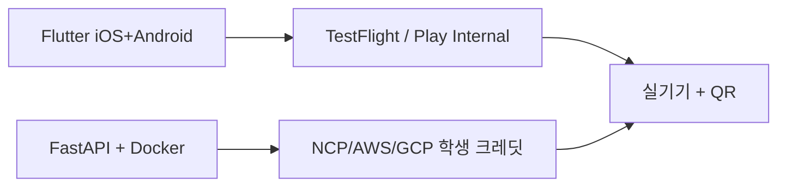

# Demo & Release Guide

> Source: PROJECT_GUIDE.md §18, §20-§23
> 원본 대형 기획서는 [PROJECT_GUIDE.md](../../PROJECT_GUIDE.md)에 보존되어 있습니다.

## 18. 리스크 & 대응

### 18.1 8대 리스크 (R1~R8)

| ID | 리스크 | 영향도 | 대응 |
|----|--------|-------|------|
| R1 | 만성질환자 디지털 친화도 ↓ | 중 | 큰 글씨·3탭 이내·쉬운 말 카피 |
| R2 | 의료법·약사법 위반 | 매우 높음 | 면책 표준 문구 3종 / 금지 표현 사전+사후 검수 / 의료자문위 검토 |
| R3 | 경쟁자 진입 (필라이즈 후속) | 중 | 의료기관 연계(LDB) + 만성질환 v4 가중 |
| R4 | 만성질환 데이터 부족 | 중 | Kaggle 시연, 향후 LDB 인터페이스 설계서 |
| R5 | OCR 정확도 미달 (<85%) | 중 | Cloud Vision + CLOVA 백업 / 사용자 수정 입력 |
| R6 | 산출식 임상 한계 | 중 | Phase 3에 Hall 동적 모델 검토 |
| R7 | 개인정보 유출 | 매우 높음 | AES-256 / RLS / TLS 1.3 / 감사 로그 / 즉시 삭제 (D 담당) |
| R8 | DTx 오인 | 낮음 | "치료" 표현 X, "관리·참고"로 통일 |

### 18.2 운영 리스크

| 리스크 | 대응 |
|--------|------|
| LLM 응답 시간 | Streaming + 로딩 스켈레톤 + 캐시 3단계 |
| LLM 응답 부정확 | 항상 미리보기 후 사용자 수정 |
| LLM 비용 폭주 | 캐싱 + 분당 5회/일당 50회 + max_tokens |
| API 키 노출 | 모바일 빌드물에 키 X, 백엔드 환경변수만 |
| Cloud Vision 무료 한도 초과 | 캐싱 50%+ 절감 + CLOVA 폴백 |
| Health Connect 신청 미승인 | W1 즉시 신청, 미승인 시 mock 데이터 |
| TestFlight 외부 심사 24~48시간 | W7 첫 빌드 사전 업로드, 내부 테스터 폴백 |
| 8주 일정 타이트 | 4 Agent 중 분석·평가에 집중, 챗봇·개인화는 단순화 가능 |

### 18.3 비상 대응 시나리오

| 상황 | 대응 |
|------|------|
| 자해/자살 의도 감지 | 109/1577-0199 안내, 다이어트 권고 즉시 비표시 |
| 식이장애 의심 | 한국섭식장애협회 안내 |
| 심각 건강 이상 | 1339 응급의료, 일반 권고 일시 중단 |
| 데이터 유출 | 1시간 차단 → 24시간 신고 → 72시간 분석 → 1개월 보고 |

> 원칙: AI Agent 4개 중 1~2개가 빠져도 코어(영양제 분석 + 5종 출력)는 살아남는다. 발표는 무조건 성립한다.


---

## 20. 시연 시나리오

### 20.1 시나리오 1 — 김건강 (만성질환자, 핵심 어필)

```
[상황]
52세 남성, 고혈압 진단 2년차, 당뇨 전단계.
혈압약 1종 + 영양제 4종 복용. BMI 26.5.

[시연 흐름]
1. 앱 진입 → 김건강 프로필 자동 로드 (만성질환·복약 표시)
2. 카메라 → 영양제 4종 라벨 차례로 촬영
   → 분석 Agent가 약 30~60초 안에 4종 모두 분석
   ※ 발표 전 캐시 워밍 완료 시 30초 이내
3. 5종 출력 대시보드 진입
   - 부족: "비타민D 35%" / 과다: "비타민B6 1.4배 (UL 근접)"
   - 권장: KDRIs 50대 남성 + 고혈압 보정값
   - 체중 예측: 30일 후 82.8 kg (-1.2 kg)
   - 활동 권고: "당뇨+고혈압 가중으로 7,000보가 9,000보 가치"
   - 목적별: "간기능에 밀크씨슬 적정, 추가 보충 불필요"
4. 평가 Agent 점수: "오늘 점심 78점 — 단백질 충분, 나트륨 약간 높음"
5. 챗봇 진입 → "이 영양제 계속 먹어도 돼?"
   → "비타민B6가 권장량의 1.4배입니다. 종합비타민에도 B6가 들어 있어
       중복일 수 있습니다. 약사와 상담을 권장드립니다."
6. 챗봇에 "내일부터 매일 아침 8시에 혈압약 알림" 입력
   → Tool Use로 알림 등록 → 미리보기 → 사용자 승인 → 저장
7. 응모권 화면: "오늘 사진 4장 등록 완료, 응모권 1개 추가"
```

### 20.2 시나리오 2 — 박직장 (예방 단계)

```
[상황]
38세 남성, 콜레스테롤·공복혈당 경계.
영양제 2종, 평일 5,000보 미만.

[시연 흐름]
1. 점심 사진 촬영 → 분석 Agent: "김치찌개·공깃밥·계란말이"
2. 5종 출력: "탄수화물 충분, 단백질 부족, 식이섬유 부족"
3. 체중 예측: "지금 추세 시 3개월 후 85 kg" → 경고
4. 챗봇: "다이어트하려면 어떻게 해야 돼?"
   → "현재 활동량이 권장의 60% 수준입니다. 하루 8,000보 목표,
       저녁 식사에 채소 1접시 추가를 권장드립니다."
5. 사용자가 "내일부터 저녁 7시 산책 알림" 등록
6. 응모권 + 점수 화면
```

### 20.3 시나리오 3 — 챗봇 알림 등록 (Tool Use 어필)

```
1. "매일 아침 8시 혈압약, 저녁 8시 종합비타민 알림 맞춰줘"
   → 챗봇 Agent가 의도 파악, 2개 알림 동시 등록
   → 미리보기 화면 → 승인
2. "다음 진료가 6월 3일 화요일 오후 2시야. 캘린더에 넣어줘"
   → 캘린더 등록 미리보기 → 승인 → 시스템 캘린더 반영
3. "오늘 비타민D 먹었어"
   → 영양제 섭취 기록 추가 + 응모권 카운트
```

### 20.4 시연 안전장치

| 리스크 | 대응 |
|--------|------|
| 발표장 와이파이 불안정 | 사전 데모 데이터 시드 + 김건강 영양제 4종 사진 캐시 워밍 |
| LLM 응답 지연 | 캐시 히트 시연 우선, 미스는 백업 영상 |
| 카메라 인식 실패 | 미리 준비한 라벨 사진 + 수동 입력 폴백 |
| 백엔드 장애 | 발표 PC에서 로컬 docker-compose 직접 시연 |
| TestFlight 외부 그룹 심사 미통과 | 내부 테스터(최대 100명) 그룹 폴백 |
| 청중 참여 | QR 코드 → TestFlight 링크 + 베타 가입 |


## 21. 앱 배포 & 시연

### 21.1 배포 전략



### 21.2 모바일 배포

| 플랫폼 | 채널 | 비용 | 비고 |
|--------|------|------|------|
| iOS | TestFlight (베타) | $99/년 | 외부 테스터 1만 명, 심사 24~48h |
| Android | Google Play Internal Testing | $25 (1회) | 100명 내부 테스터 |
| 시연용 | 발표자 폰 직접 빌드 | 0원 | adb install / Xcode |

### 21.3 백엔드 배포

```
[1] Docker Compose 로컬 검증
[2] 클라우드 (NCP / AWS / GCP) 학생 크레딧
[3] HTTPS + 도메인 (api.lemonaid.dev 등)
[4] 환경 변수 (백엔드 환경에만):
    - ANTHROPIC_API_KEY
    - CLAUDE_MODEL_ID
    - GOOGLE_APPLICATION_CREDENTIALS
    - MFDS_API_KEY
    - DATABASE_URL
    - REDIS_URL
    - JWT_SECRET (openssl rand -hex 32)
    - ENCRYPTION_KEY (openssl rand -base64 32)
    - EMAIL_PROVIDER (smtp / ses / ncp)
    - SMTP_HOST, SMTP_PORT, SMTP_USER, SMTP_PASS (개발 시)
[5] 모바일 앱은 API 도메인만 알면 됨, 키는 백엔드에만
```

### 21.4 발표장 시연 시나리오

```
1. PC 빔프로젝터: 슬라이드 (한 줄 요약 + 차별화 5개)
2. 본인 iPhone 꺼냄 → "TestFlight 베타입니다"
3. 김건강 페르소나 시연 (3분):
   - 영양제 4종 카메라 (캐시 워밍 → 30초 이내)
   - 5종 출력 대시보드
   - 챗봇 알림 등록
   - 응모권 누적
4. 청중 참여 — QR 코드 → TestFlight 링크
5. 마무리: 차별화 5개 + LDB 연계 가능성
```

### 21.5 시연 안전장치

| 리스크 | 대응 |
|--------|------|
| 발표장 와이파이 불안정 | 사전 시드 + 캐시 워밍 + 모바일 데이터 백업 |
| 백엔드 장애 (희박) | 발표 30분 전 헬스 체크, 로컬 백엔드 + 시뮬레이터 폴백 |
| AI 응답 지연 | 캐시 히트 시연 우선, 미스는 백업 영상 |
| iOS 풀스크린 안 됨 | TestFlight 정식 빌드 |
| 도메인 타이핑 | QR 코드 |
| 카메라 인식 실패 | 미리 촬영한 라벨 사진 갤러리 선택 |
| TestFlight 심사 미통과 | 내부 테스터(100명) 폴백 |

### 21.6 v2 — 정식 출시 단계

| 단계 | 작업 |
|------|------|
| MVP+ | 베타 30~100명, 정량 SUS, OCR 정확도 검증, 의료자문위 정식 검토 |
| 정식 출시 | App Store / Google Play 정식 등록, ISMS-P 인증 추진 |
| LDB 통합 | 5~10개 의료기관 시범, FHIR KR Core 표준 |
| 글로벌 | 일본·동남아 i18n |


## 22. 참고 자료

### 22.1 데이터 · 가이드라인

- KDRIs 2020 (한국영양학회) — https://www.kns.or.kr
- 식약처 식품영양성분 Open API — https://various.foodsafetykorea.go.kr
- 식약처 건강기능식품 원료 DB — https://www.foodsafetykorea.go.kr
- 농촌진흥청 국가표준식품성분표 — https://koreanfood.rda.go.kr
- AI Hub 한국 음식 이미지 — https://aihub.or.kr
- 보건복지부 비의료 건강관리서비스 가이드라인 (2차)
- KISA ISMS-P 인증 기준 — https://isms.kisa.or.kr

### 22.2 AI · LLM

- Anthropic Claude API — https://docs.claude.com
- OpenAI API — https://platform.openai.com/docs
- Google Cloud Vision API — https://cloud.google.com/vision/docs
- Naver CLOVA OCR — https://www.ncloud.com

### 22.3 기술 스택

- Flutter — https://flutter.dev/docs
- Riverpod — https://riverpod.dev
- Dio — https://pub.dev/packages/dio
- health 패키지 — https://pub.dev/packages/health
- fl_chart — https://pub.dev/packages/fl_chart
- FastAPI — https://fastapi.tiangolo.com
- Pydantic — https://docs.pydantic.dev
- SQLAlchemy — https://docs.sqlalchemy.org
- PostgreSQL — https://www.postgresql.org/docs
- TimescaleDB — https://docs.timescale.com
- Redis — https://redis.io/docs
- Alembic — https://alembic.sqlalchemy.org

### 22.4 법규 · 컴플라이언스

- 의료법·약사법·건강기능식품법·개인정보보호법 — https://www.law.go.kr
- 개인정보보호위원회 가명정보 처리 가이드라인 — https://www.pipc.go.kr

### 22.5 발주처

- (주)레몬헬스케어 — https://www.lemonhealthcare.com


## 23. 최종 메시지

우리 프로젝트는 **음식과 영양제 분석을 출발점**으로 한다.

하지만 최종적으로는 만성질환자의 **병원성 데이터·복약 정보·식단·건강 데이터를 연결해 개인화된 식단관리 판단과 영양제 관리 피드백을 제공하는 AI Agent 서비스**를 제안한다.

이는 레몬헬스케어가 목표로 하는 **생애 전 주기 개인화 헬스케어**로 가기 위한 작은 MVP이자, **건강의신에 적용 가능한 서비스 참조 모델**이다.

### 23.1 한 문장 요약

> 사진 한 장으로 시작해, 병원 기록을 기억하는 AI Agent로 끝난다.
> 음식·영양제 분석은 입구일 뿐, 진짜 가치는 만성질환자의 일상과 의료 데이터를 잇는 자리에 있다.

### 23.2 발주처에게 — 이 프로젝트가 남기는 것

| 항목 | 결과물 |
|------|--------|
| 검증된 알고리즘 | v1~v4 활동점수 / 7-step 체중 예측 / KDRIs 결핍 진단 / 영양제 OCR-LLM 파이프라인 |
| 재사용 가능한 코드 | FastAPI 모듈 / Pydantic 스키마 / 4개 Agent 시스템 프롬프트 / Flutter 화면 위젯 |
| 컴플라이언스 가드 | 의료법 표현 검수 함수 / 면책 표준 문구 3종 / 민감정보 동의 UI |
| LDB 통합 인터페이스 설계 | 향후 건강의신과 LDB 의료기관 데이터를 연결할 출발점 |
| 정성 사용성 결과 | 내부 테스터 5명 + 멘토·자문위 3명 의견서 |

### 23.3 팀에게 — 우리가 만든 것

5명이 각자 다른 바이브 코딩 툴을 쓰면서도 **하나의 가이드 문서(`PROJECT_GUIDE.md`)** 로 같은 그림을 보고 작업할 수 있게 했다. 코드는 Flutter + FastAPI + Claude Agent의 합작이지만, 그 시작과 끝은 마크다운 문서 한 장에서 출발한다.

> 다음 팀이 와도 이 가이드만 읽으면 우리가 어디에서 출발했고, 어디로 가려 했는지 알 수 있다.
> 그게 이 문서의 목적이다.


