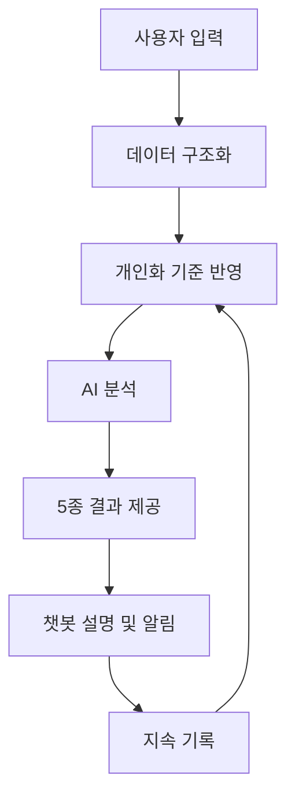

# Lemon Aid 서비스 콘셉트 제안서

> 첫 미팅 목적: Lemon Aid가 어떤 문제를 해결하려는 서비스인지, 사용자가 어떤 흐름으로 가치를 느끼는지 간단히 설명한다.

## 1. 기획 배경

만성질환자는 식단, 영양제, 복약, 활동량, 건강검진 정보를 따로 관리하는 경우가 많다. 음식은 음식 앱에, 영양제는 제품 정보나 메모에, 복약은 알림 앱에, 활동량은 헬스 앱에 흩어져 있어 하루 전체 건강관리 흐름을 한 번에 이해하기 어렵다.

기존 건강관리 앱은 음식 기록, 칼로리 계산, 영양제 정보 제공처럼 단일 기능에 집중하는 경우가 많다. 하지만 만성질환 관리를 위해서는 단순히 "무엇을 먹었는가"보다 "내 건강 상태와 복약 상황을 고려했을 때 어떤 점을 주의해야 하는가"가 더 중요하다.

Lemon Aid는 음식과 영양제 기록을 출발점으로 삼아, 사용자의 건강 상태를 함께 고려한 영양·복약 관리 방향을 알려주는 AI 건강관리 보조 서비스를 목표로 한다.

## 2. 문제 정의

만성질환자와 건강관리가 필요한 사용자는 다음과 같은 어려움을 겪는다.

| 문제 | 설명 |
|------|------|
| 데이터 분산 | 음식, 영양제, 복약, 활동량, 건강검진 정보가 서로 다른 곳에 흩어져 있다. |
| 통합 섭취량 파악 어려움 | 음식과 영양제를 따로 관리해 하루 전체 영양소 섭취량을 알기 어렵다. |
| 중복·과다 가능성 확인 어려움 | 여러 영양제를 함께 복용할 때 같은 성분이 중복되는지 확인하기 어렵다. |
| 개인화 부족 | 일반 권장량이나 칼로리 정보만으로는 만성질환, 복약, 건강 목적을 반영하기 어렵다. |
| 실천 방향 부족 | 정보는 많지만 오늘 무엇을 줄이고 무엇을 보완해야 하는지 이해하기 어렵다. |

## 3. 서비스 목적

Lemon Aid는 사용자가 복잡한 건강 정보를 직접 해석하지 않아도, 일상 기록을 바탕으로 건강관리 방향을 이해할 수 있게 돕는다.

- 음식과 영양제를 사진 기반으로 쉽게 기록한다.
- 음식과 영양제 정보를 영양소와 성분 단위로 정리한다.
- 만성질환, 복약 정보, 건강 목적을 반영해 부족·과다 가능성을 안내한다.
- 식단관리 점수, 활동 권고, 목적별 분석을 통해 실천 가능한 피드백을 제공한다.
- 모든 결과는 진단·치료·처방이 아닌 건강관리 참고 정보로 제공한다.

## 4. 한 줄 설명

> 사진 한 장으로 음식과 영양제를 기록하고, AI가 내 건강 상태에 맞게 영양·복약 관리 방향을 알려주는 서비스

## 5. 핵심 사용자

Lemon Aid의 핵심 사용자는 특정 연령대가 아니라 **만성질환 관리 또는 예방적 건강관리가 필요한 사용자**다.

| 사용자 유형 | 설명 | 필요한 가치 |
|-------------|------|-------------|
| 만성질환 관리 사용자 | 고혈압, 당뇨, 이상지질혈증 등 지속 관리가 필요한 사용자 | 식단, 영양제, 복약 정보를 함께 고려한 관리 방향 |
| 복약·영양제 병행 사용자 | 약과 영양제를 함께 복용하며 중복 성분이나 주의 가능성을 확인하고 싶은 사용자 | 성분 합산, 중복 가능성, 전문가 상담이 필요한 지점 안내 |
| 예방 관리 사용자 | 건강검진 수치가 경계에 있거나 생활습관 개선이 필요한 사용자 | 음식·활동 기록 기반의 실천 피드백 |

## 6. 핵심 기능

| 기능 | 사용자에게 보이는 가치 |
|------|------------------------|
| 음식·영양제 사진 기록 | 긴 입력 없이 사진으로 기록을 시작할 수 있다. |
| 영양소·성분 분석 | 음식과 영양제를 하나의 섭취 데이터로 정리할 수 있다. |
| 부족·과다 가능성 안내 | 권장 기준 대비 낮거나 높은 영양소를 쉽게 확인할 수 있다. |
| 식단관리 점수 | 오늘의 식단을 한눈에 이해하고 개선 방향을 알 수 있다. |
| 활동 권고 | 섭취와 활동 데이터를 연결해 실천 가능한 행동을 제안받는다. |
| 챗봇 설명·알림 | 분석 결과를 쉬운 말로 묻고, 복약·식단 알림까지 연결할 수 있다. |

## 7. 서비스 전체 파이프라인

### 7.1 사용자 입력

사용자는 음식 사진, 영양제 라벨 사진, 기본 프로필, 만성질환·복약 정보, 활동 데이터를 입력한다. 입력은 처음부터 완벽하지 않아도 되며, 분석 결과는 사용자가 확인하고 수정할 수 있어야 한다.

### 7.2 데이터 구조화

AI는 사진과 텍스트에서 음식명, 섭취량, 영양제 성분, 함량, 복용 빈도 후보를 추출한다. 이후 분석 가능한 형태로 정리해 음식과 영양제를 같은 기준에서 비교할 수 있게 만든다.

### 7.3 개인화 기준 반영

나이, 성별, 체중, 건강 목적, 만성질환, 복약 정보를 분석 기준에 반영한다. 이 단계는 사용자의 상태를 진단하는 것이 아니라, 결과를 설명할 때 주의 가능성과 참고 기준을 조정하기 위한 과정이다.

### 7.4 AI 분석

음식과 영양제 섭취량을 합산하고 권장 섭취 기준과 비교한다. 이를 바탕으로 부족 가능성, 과다 가능성, 목적별 관리 방향, 활동 권고를 생성한다.

### 7.5 결과 제공

사용자는 한 화면에서 다음 5종 결과를 확인한다.

1. 부족 영양소
2. 권장 섭취량
3. 체중 변화 예측
4. 활동 권고
5. 목적별 분석

결과는 어려운 의학 용어보다 "권장량 대비 낮음", "주의가 필요할 수 있음", "전문가 상담 권장"처럼 이해하기 쉬운 표현으로 제공한다.

### 7.6 지속 관리

챗봇은 분석 결과를 쉬운 문장으로 설명하고, 사용자가 원하면 복약·식단 알림 등록을 돕는다. 기록 리마인드와 응모권 UX를 통해 사용자가 부담 없이 반복 기록하도록 유도한다.

## 8. 기대효과

| 대상 | 기대효과 |
|------|----------|
| 사용자 | 흩어진 건강 정보를 한 흐름으로 이해하고, 오늘의 실천 방향을 확인할 수 있다. |
| 레몬헬스케어 | 건강의신과 병원 데이터 연계 가능성을 검토할 수 있는 참조 서비스 모델을 확보할 수 있다. |
| Lemon Aid 팀 | 8주 안에 시연 가능한 AI 헬스케어 MVP를 만들고, 후속 확장 방향을 제안할 수 있다. |

## 9. 안전한 표현 원칙

Lemon Aid는 의료 서비스를 대체하지 않는다. 분석 결과는 사용자가 건강관리를 이해하기 위한 참고 정보이며, 질환 진단, 치료, 처방, 복용량 변경 지시로 표현하지 않는다.

문서와 화면 문구는 다음 기준을 따른다.

- "결핍 확정" 대신 "권장량 대비 낮음" 또는 "낮을 가능성"으로 표현한다.
- "위험합니다" 대신 "주의가 필요할 수 있습니다"로 표현한다.
- 복약이나 영양제 상호작용 가능성은 "전문가 상담을 권장합니다"로 안내한다.
- 입력 정보가 불완전하거나 OCR 결과가 틀릴 수 있음을 사용자가 확인할 수 있게 한다.
