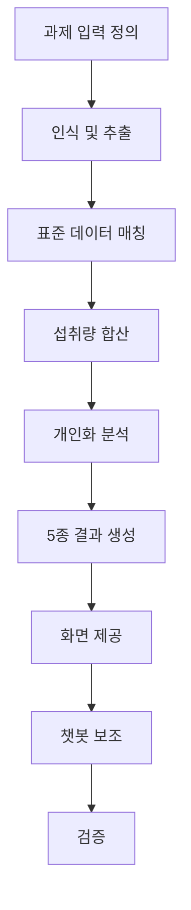
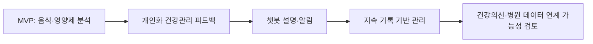

# 멘토 과제 기반 MVP 구현 제안서

> 첫 미팅 목적: 멘토님이 주신 과제를 Lemon Aid가 어떤 MVP 기능으로 풀어갈지 설명한다.

## 1. 과제 이해

멘토님이 제시한 과제는 크게 두 축으로 볼 수 있다.

| 과제 축 | 핵심 내용 | Lemon Aid에서의 해석 |
|---------|-----------|----------------------|
| 영양제 분석 | 복용 중인 영양제의 성분, 함량, 섭취량, 부족 영양소, 목적별 분석 제공 | 영양제 라벨을 분석해 사용자의 전체 영양소 섭취 데이터에 반영한다. |
| 음식·식단 분석 | 음식 섭취 영양소와 활동 정보를 바탕으로 체중 변화, 활동 권고, 부족 영양소 제공 | 음식 기록과 활동 데이터를 연결해 식단관리 피드백으로 제공한다. |

두 과제는 별개의 기능처럼 보이지만, 서비스 관점에서는 하나의 흐름으로 연결된다. 영양제와 음식은 모두 사용자의 섭취 데이터이고, 이 데이터를 사용자 프로필과 건강 상태에 맞게 해석해야 개인화 건강관리 서비스가 된다.

## 2. MVP 목표

MVP의 목표는 모든 기능을 완성하는 것이 아니라, 멘토 과제가 서비스로 발전할 수 있음을 한 흐름으로 보여주는 것이다.

- 사진 또는 텍스트 입력을 분석 가능한 데이터로 바꾼다.
- 음식과 영양제 데이터를 영양소 단위로 합산한다.
- 사용자 프로필과 시연용 만성질환·복약 정보를 분석 기준에 반영한다.
- 부족 영양소, 권장 섭취량, 체중 예측, 활동 권고, 목적별 분석을 한 화면에서 보여준다.
- 챗봇은 결과 설명과 알림 등록을 중심으로 사용자가 결과를 이해하도록 돕는다.

## 3. MVP 기능 범위

| 기능 | 설명 |
|------|------|
| 영양제 라벨 사진 분석 | 제품명, 성분명, 함량, 1회 섭취량 후보를 추출한다. |
| 음식 사진 또는 텍스트 분석 | 음식명과 섭취량 후보를 추출하고 영양소 데이터와 연결한다. |
| 사용자 기본 프로필 | 나이, 성별, 키, 몸무게, 건강 목적을 분석 기준으로 사용한다. |
| 시연용 만성질환·복약 정보 | 실제 병원 연동 없이 시연 프로필로 개인화 흐름을 보여준다. |
| 5종 결과 대시보드 | 부족 영양소, 권장 섭취량, 체중 예측, 활동 권고, 목적별 분석을 제공한다. |
| 챗봇 설명·알림 | 분석 결과를 쉬운 문장으로 설명하고, 복약·식단 알림 등록을 돕는다. |

## 4. 5종 출력 구조

| 출력 | 설명 | 표현 방식 |
|------|------|-----------|
| 부족 영양소 | 권장 기준 대비 낮은 영양소를 안내 | "비타민D가 권장량 대비 낮은 편입니다." |
| 권장 섭취량 | 사용자 기준에 맞춘 섭취 참고 기준 제시 | "현재 입력 정보 기준 권장량은 다음과 같습니다." |
| 체중 변화 예측 | 식단과 활동 기준의 참고 예측 | "현재 기록이 유지된다고 가정한 참고 예측입니다." |
| 활동 권고 | 걸음수와 활동량 기반 실천 제안 | "오늘은 20분 걷기를 추가하면 도움이 될 수 있습니다." |
| 목적별 분석 | 눈, 간, 피로, 체중 등 목적별 관리 방향 | "간 건강 목적 성분은 현재 충분한 편으로 보입니다." |

## 5. MVP 구현 파이프라인

### 5.1 과제 입력 정의

MVP에서 다루는 입력은 영양제 라벨 사진, 음식 사진 또는 음식명 텍스트, 사용자 프로필, 활동 데이터다. 만성질환과 복약 정보는 실제 병원 연동이 아니라 시연용 프로필로 구성한다.

### 5.2 인식 및 추출

OCR 또는 이미지 분석을 통해 영양제 제품명, 성분명, 함량, 음식명, 섭취량 후보를 추출한다. 결과는 바로 확정하지 않고, 사용자가 확인하고 수정할 수 있는 후보로 제공한다.

### 5.3 표준 데이터 매칭

영양제 성분은 건강기능식품 원료·제품 데이터와 매칭하고, 음식은 식품영양성분 데이터와 연결한다. 명칭과 단위는 분석에 사용할 수 있도록 표준화한다.

### 5.4 섭취량 합산

음식에서 얻은 영양소와 영양제에서 얻은 영양소를 하루 기준으로 합산한다. 이 합산 결과가 부족 영양소, 과다 가능성, 목적별 분석의 기본 데이터가 된다.

### 5.5 개인화 분석

사용자 나이, 성별, 체중, 건강 목적, 시연용 만성질환·복약 정보를 반영한다. 권장 섭취 기준과 비교해 어떤 영양소가 낮거나 높은지, 어떤 부분에 주의가 필요할 수 있는지 판단한다.

### 5.6 5종 결과 생성

분석 결과는 멘토 과제의 요구사항에 맞춰 5종 출력으로 정리한다.

1. 부족 영양소
2. 권장 섭취량
3. 체중 변화 예측
4. 활동 권고
5. 목적별 분석

### 5.7 화면 제공

사용자가 결과를 한 번에 이해할 수 있도록 요약 카드와 상세 설명으로 구성한다. 첫 화면에는 가장 중요한 결과를 짧게 보여주고, 세부 근거는 아래에서 확인할 수 있게 한다.

### 5.8 챗봇 보조

사용자가 "이 영양제 계속 먹어도 돼?", "오늘 식단에서 뭘 보완해야 해?"처럼 물어보면 챗봇이 분석 결과를 쉬운 문장으로 설명한다. 복약·식단 알림 등록은 사용자가 확인한 뒤 저장하는 흐름으로 구성한다.

### 5.9 검증

MVP 검증은 기술 완성도보다 시연 가능성과 안전한 표현을 중심으로 본다.

| 검증 항목 | 확인 내용 |
|-----------|-----------|
| 영양제 라벨 인식 | 제품명, 성분명, 함량 후보를 사용자가 이해할 수 있게 추출하는가 |
| 음식·영양제 합산 | 음식과 영양제 섭취량이 하나의 결과로 연결되는가 |
| 5종 출력 이해도 | 멘토와 사용자가 결과 의미를 빠르게 이해할 수 있는가 |
| 건강 표현 안전성 | 진단, 치료, 처방처럼 보이는 표현이 없는가 |
| 8주 시연 가능성 | 사진 입력부터 결과 확인까지 한 흐름으로 보여줄 수 있는가 |

## 6. 서비스 발전 흐름

MVP는 영양제와 음식 분석을 출발점으로 한다. 이후에는 사용자의 건강 기록, 복약 정보, 활동 데이터, 병원 데이터 연계 가능성을 단계적으로 확장할 수 있다.

이 흐름에서 MVP는 완성된 의료 서비스가 아니라, 멘토 과제가 실제 서비스로 발전할 수 있음을 보여주는 참조 모델이다.

## 7. 작성 및 발표 기준

- 기능을 많이 나열하기보다 "입력 → 분석 → 결과 → 검증" 흐름으로 설명한다.
- 멘토 과제의 요구사항과 Lemon Aid의 서비스 방향이 어떻게 연결되는지 보여준다.
- 실제 병원 데이터 연동은 방향성으로만 설명하고, MVP는 시연용 데이터 기반으로 설명한다.
- 건강 관련 결과는 "가능성", "참고", "권장량 대비", "전문가 상담 권장" 중심으로 표현한다.
