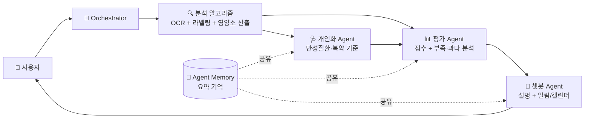
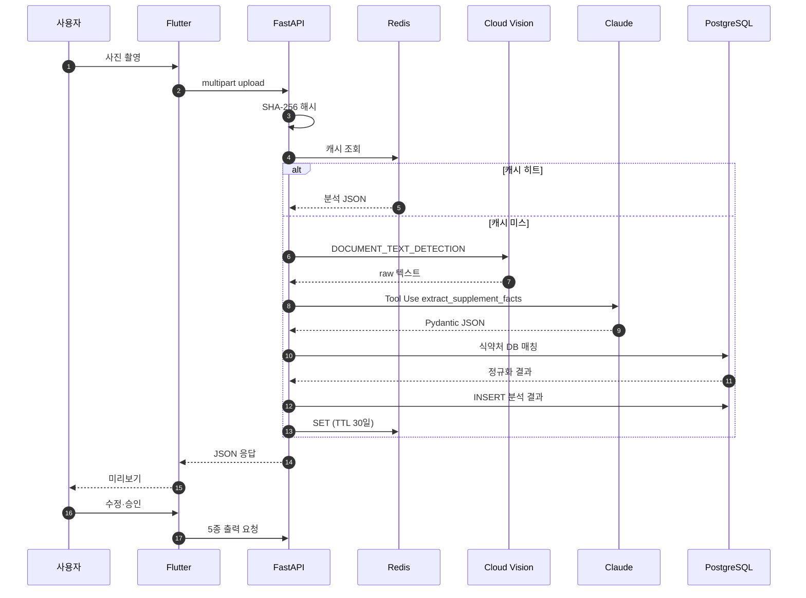
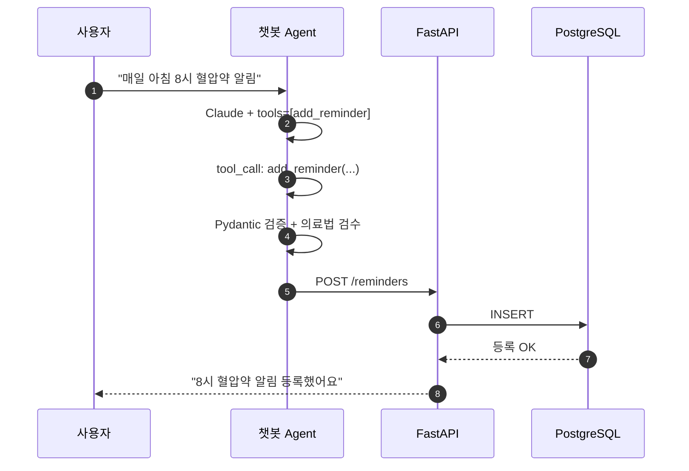

# AI Agents Guide

> Source: PROJECT_GUIDE.md §3.1-§3.3, §7, §9
> 원본 대형 기획서는 PROJECT_GUIDE.md에 보존되어 있습니다.

### 3.1 분석 알고리즘 + 3개 Agent 통합 구조

단일 LLM 호출이 아니라, 분석 알고리즘이 이미지·자연어·파일 입력을 먼저 구조화하고 개인화·평가·챗봇 3개 Agent가 하나의 통합 흐름으로 만성질환자의 영양·복약 관리를 해석한다.



| 구성 | 책임 | 입력 | 출력 |
|-------|------|------|------|
| 분석 알고리즘 | 음식·영양제 사진 인식, OCR, CSV DB/API 매칭, 영양소 산출 | 사진, 자연어 입력, 파일, 사용자 수정 입력 | 음식명·섭취량·영양소·영양제 성분/함량 (Pydantic) |
| 개인화 Agent | 만성질환·검사값·복약 기준 제공 | 사용자 프로필, 멘토 확인 전 시연용 데이터 | 질환별 주의 영양소, 권장 기준, 약물 주의 |
| 챗봇 Agent | 결과 설명 + 사용자 요청 기반 실행 | 자연어 질문, 분석 결과, Agent 요약 기억 | 자연어 답변 + (선택) Tool Call |
| 평가 Agent | 식단관리 점수 + 개선 피드백 | 분석 알고리즘 결과 + 개인화 Agent 기준 | 점수, 부족 영양소, 과다 위험, 좋은 선택, 개선 필요 |

> 분석 알고리즘은 `backend/src/algorithms/`, `ocr/`, `supplements/`가 담당하고, 3개 Agent의 코드 책임 매핑은 §14 파일 구조의 `backend/src/agents/` 참조.

### 3.2 Agent 간 데이터 전달 포맷

3개 Agent는 다음 Pydantic 모델로 통신한다. 오케스트레이터가 분석 알고리즘 결과를 받아 직렬/병렬 호출을 결정한다.

```
class AgentInput(BaseModel):
    user_id: int
    request_id: str            # 한 사용자 요청 단위로 동일
    payload: dict              # 분석 결과, 파일/텍스트/숫자, Agent별 입력
    context: AgentMemorySnap   # 최근 검사값/만성질환/복약 요약

class AgentOutput(BaseModel):
    request_id: str
    agent_name: Literal['personalization','chat','evaluation']
    result: BaseModel          # Agent별 전용 결과 모델
    used_tools: list[str]      # Tool Use 호출 이름 목록
    latency_ms: int
    cost_usd: float            # 비용 추적
```

오케스트레이터는 각 호출을 `agent_runs` 테이블에 로깅하여 비용·지연·실패율을 추적한다. Agent 요약 기억(`agent_memory`) 갱신은 평가 Agent가 끝난 직후 `backend/src/agents/memory.py` 모듈이 담당한다.

### 3.3 Tool 정의 (LLM Tool Use 함수 목록)

`backend/src/llm/tools.py`에 정의되며 챗봇 Agent와 분석 알고리즘 흐름이 호출한다.

| Tool 이름 | 호출 주체 | 인자 | 효과 |
|-----------|-----------|------|------|
| extract_supplement_facts | 분석 알고리즘 | { ocr_text } | OCR 텍스트를 SupplementParseResult Pydantic으로 강제 파싱 |
| add_reminder | 챗봇 | { type, name, time, recurrence, weekdays? } | DB INSERT 후 flutter_local_notifications에 등록 |
| add_calendar_event | 챗봇 | { date, time, title, hospital?, note? } | DB INSERT 후 add_2_calendar로 시스템 캘린더 반영 |
| log_supplement_intake | 챗봇 | { supplement_id, taken_at } | 영양제 섭취 기록 + 응모권 카운트 |
| explain_deficiency | 챗봇 | { nutrient, ratio } | 부족 영양소 설명을 자연어로 (의료법 표현 검수 후) |

모든 Tool 호출은 `backend/src/utils/regex_filter.py`의 `check_forbidden_terms()`를 거쳐 사용자에게 전달된다.

---

## 7. AI · 인공지능 스택

본 프로젝트의 AI 보조 기능을 구현하기 위한 모든 기술을 한 곳에 정리한 섹션. 사용자의 주도권을 해치지 않는 선에서, 음식·영양제 인식은 분석 알고리즘이 담당하고 개인화 판단·챗봇 설명·식단 평가는 3개 Agent가 분담한다.

### 7.1 모델 (LLM Provider)

| 모델 | 용도 | 선정 이유 |
|------|------|-----------|
| Anthropic Claude (모델 ID는 `CLAUDE_MODEL_ID` 환경변수, 기본값은 최신 Sonnet) | 3개 Agent 추론 + 분석 구조화 보조 — OCR 텍스트 구조화, 개인화 판단, 챗봇 응답, 평가 코멘트 | OCR 비정형 텍스트 → JSON 구조화에 강점, 한국어 우수, 200K 컨텍스트, Tool Use가 Pydantic 스키마와 직접 통합, 의료 표현 안전성 |
| OpenAI GPT (백업) | Claude 장애 시 폴백 | OpenAI SDK 동일 패턴, Adapter 패턴으로 교체 |
| text-embedding-3-small (선택) | 식품·영양제 유사도 검색 | 사용자 입력 "비타민C" → 마스터 DB 매칭 |

### 7.2 OCR

| 도구 | 용도 | 선정 이유 |
|------|------|-----------|
| Google Cloud Vision API | 영양제 라벨·음식 메뉴판 OCR | DOCUMENT_TEXT_DETECTION이 영양제 라벨 정확도 92~98%, 첫 1,000건/월 무료, 한국어+영어 동시 지원 |
| Naver CLOVA OCR (백업) | 한국어 라벨 폴백 | 한국어 SOTA, Cloud Vision 장애 또는 저정확도 케이스 대응 |

### 7.3 분석 알고리즘과 3개 Agent별 역할 · 동작

3개 Agent는 Claude 단일 모델로 동작한다. 분석은 별도 Agent가 아니라 OCR, 라벨링, CSV DB/API 매칭, 영양소 산출 흐름이 담당하며 필요할 때만 구조화 보조 Tool을 호출한다. Agent 코드 위치는 `backend/src/agents/<agent_name>_agent.py`.

#### 7.3.1 분석 알고리즘 (`algorithms/`, `ocr/`, `supplements/`)

| 항목 | 내용 |
|------|------|
| 책임 | 음식·영양제 사진 → 영양소 산출 |
| 입력 | 사진(multipart), 사용자 수정 입력 |
| 출력 | MealAnalysisResult / SupplementParseResult Pydantic 스키마 |
| 흐름 | OCR → Claude Tool Use(extract_supplement_facts) → 식약처 DB 매칭 → 영양소 환산 |
| Tool 호출 | extract_supplement_facts |
| 기법 | OCR, 라벨링, CSV DB/API 매칭, Structured Output 보조 |
| 사용자 효과 | 영양제 라벨 한 장으로 30~60초 안에 성분 자동 정리 |

#### 7.3.2 개인화 Agent (`personalization_agent.py`)

| 항목 | 내용 |
|------|------|
| 책임 | 사용자 만성질환·검사값·복약 정보를 해석 기준으로 변환 |
| 입력 | 사용자 프로필 (DB), Kaggle 검사값, 복약 정보 |
| 출력 | PersonalizationContext (질환별 주의 영양소, 권장 기준, 약물 주의) |
| 흐름 | DB 조회 → Claude로 "이 사용자가 주의할 영양소·약물 상호작용" 요약 → 캐시 |
| 기법 | Few-shot Prompting + Context Summarization |
| 사용자 효과 | "당뇨가 있으니 탄수화물 주의" 같은 맞춤 권고가 자동 적용 |

#### 7.3.3 챗봇 Agent (`chat_agent.py`)

| 항목 | 내용 |
|------|------|
| 책임 | 분석 결과를 쉬운 말로 설명 + 사용자 요청 기반 알림·캘린더 등록 |
| 입력 | 자연어 질문, 분석 결과, Agent 요약 기억 |
| 출력 | 자연어 답변 + (선택) Tool Call (add_reminder, add_calendar_event, log_supplement_intake, explain_deficiency) |
| 흐름 | 의도 분류 → 설명 vs 실행 분기 → Tool Use로 알림/캘린더 등록 |
| Tool 호출 | add_reminder, add_calendar_event, log_supplement_intake, explain_deficiency |
| 기법 | Function Calling, Streaming, Chain-of-Thought |
| 사용자 효과 | "매일 아침 8시에 혈압약 알림 맞춰줘" 한 줄로 알림 등록 |

#### 7.3.4 평가 Agent (`evaluation_agent.py`)

| 항목 | 내용 |
|------|------|
| 책임 | 끼니별/하루별 식단관리 점수 + 부족·과다·주의 분석 |
| 입력 | 분석 알고리즘 결과 + 개인화 Agent 기준 |
| 출력 | EvaluationResult (점수, 부족 영양소, 과다 위험, 좋은 선택, 개선 필요) |
| 흐름 | 영양소 합산 → KDRIs/UL 비교 → Claude로 자연어 코멘트 생성 → BackgroundTask로 agent_memory 갱신 |
| 기법 | Structured Output + Few-shot |
| 사용자 효과 | "점심은 단백질이 부족했어요. 저녁에 닭가슴살 어떠세요?" |

### 7.4 적용 LLM 기법

| 기법 | 적용 Agent | 앱에서의 역할 | 사용자 효과 |
|------|-----------|--------------|--------------|
| Tool Use / Function Calling | 분석 알고리즘, 챗봇 | LLM 출력을 우리 함수(extract_supplement_facts, add_reminder)로 직접 매핑. 텍스트가 아닌 앱 액션 실행 | "비타민D 매일 9시 알림"으로 즉시 등록 |
| Structured Output (JSON Schema) | 분석 알고리즘, 평가 | 응답을 정해진 Pydantic 스키마로 강제, 누락·오타 자동 거부 | 영양제 분석이 빈칸·오타 없이 항상 동일 형식 |
| Few-shot Prompting | 개인화, 평가 | 시스템 프롬프트에 만성질환자 사례 2~3개를 박아 톤·구체성 학습 | "단백질 부족"이 아니라 "당뇨가 있으니 닭가슴살·두부 추천"처럼 구체적 |
| Chain-of-Thought | 챗봇 | "복약 안내 → 부작용 주의 → 전문가 상담 권유"처럼 단계 사고 지시 | 복잡한 영양제 질문도 빠짐없이 답변 |
| Context Summarization | 개인화 | Agent 요약 기억 사용, 매번 전체 데이터 안 보냄 | 비용·지연 ↓, 같은 사용자에게 일관된 답변 |
| Streaming | 챗봇, 평가 | 응답을 토큰 단위로 흘려 보여줌 | 5~8초 대기를 타이핑 애니메이션으로 체감 단축 |
| Forbidden Term Filter | 모든 Agent | LLM 응답을 정규식으로 후처리, 진단·처방·치료 등장 시 차단·재생성 | 의료법 위반 표현 0건 |

### 7.5 보조 알고리즘 (Non-LLM)

| 알고리즘 | 적용 기능 | 앱에서의 역할 | 사용자 효과 |
|----------|-----------|--------------|--------------|
| KDRIs 룩업 테이블 | 권장 섭취량 | 나이·성별·BMI 키로 30종 영양소 RDI를 즉시 반환 (LLM 불필요) | 화면 진입 즉시 권장량 표시 |
| 결핍 진단 비율 분류 | 부족 영양소 추천 | 실제/RDI 비율로 5단계(결핍/낮음/적정/과다/위험) 분류 | "비타민D 35%" 같은 객관적 수치 |
| v1~v4 활동점수 | 운동 권고 | 결정론 공식, 만성질환 가중 ×1.3까지 | "당신의 7,000보는 일반인의 9,000보 가치" |
| 7-step 체중 예측 | 체중 변화 | Mifflin-St Jeor BMR + 활동계수 + 7,700 kcal/kg | 1주/1개월/3개월 후 체중 미리보기 |
| 충돌 감지 규칙 | 영양제 중복·과다 경고 | 같은 성분이 합산되어 UL(상한) 초과 시 경고 | 종합비타민과 단일 비타민 동시 복용 시 경고 |
| 응모권 누적 규칙 | 사진 기록 참여 | 일별 기록 카운트, 1/7/30일 조건 충족 시 자동 발급. SHA-256 중복 사진 차단 | 점수 부담 없이 참여만으로 응모권 |

### 7.6 비용 · 성능 가드레일

| 항목 | 목표 |
|------|------|
| 모델 | Claude 단일 (장애 시 OpenAI 폴백) |
| 비용 산식 | 분석 1건 = OCR $0.0015 + LLM 입력 ~3K 토큰 + 출력 ~1K 토큰 ≈ $0.024 |
| PoC 비용 가정 | 베타 5명 × 분석 5회/주 × 4주 = 100건 → 약 $2.4 + 챗봇 일평균 3회 ≈ 월 $10 |
| 정식 비용 가정 | MAU 1만 × 평균 5분석 + 3챗봇 → 약 $1,200/월 (캐시 적중률 50% 가정) |
| 캐싱 3단계 | Redis(OCR 30일) / Redis(KDRIs 영구) / PostgreSQL(사용자별 분석 결과) |
| 레이트 리밋 | 사용자당 분당 5회, 일당 50회 |
| 타임아웃 | OCR 8초, LLM 12초, 합산 응답 6초 이내 (캐시 미스 기준) |
| max_tokens | 분석 1024 / 평가 800 / 챗봇 600 / 개인화 400 |
| 장애 대응 | LLM 실패 시 친절한 에러 + 수동 입력 폴백 (§3.10) |

### 7.7 프롬프트 거버넌스

- 모든 시스템 프롬프트는 `backend/src/llm/prompts.py` 한 곳
- 각 프롬프트마다 버전 태그 (analysis_v1, chat_v2 등)
- 한국어 출력만 허용 (영어 섞임 방지)
- 의료법 금지 표현 사전 차단 시스템 프롬프트 + 사후 정규식 필터 이중화
- AI는 결과를 직접 저장하지 않는다, 항상 사용자 미리보기 후 승인 필수


---

## 9. AI 호출 흐름

### 9.1 영양제 사진에서 결과까지



합계: 캐시 미스 2.5~6초 / 캐시 히트 1초 미만

### 9.2 챗봇으로 알림 등록 (Tool Use)



핵심 원칙:
- API 키는 백엔드 환경변수에만 (모바일 앱 빌드물에 노출 X)
- LLM 응답은 항상 Pydantic 검증 + 의료법 표현 검수 후 사용자 미리보기
- AI는 결과를 바로 저장하지 않는다, 항상 사용자 승인 후 실행

### 9.3 시스템 프롬프트 예시 (분석 구조화 보조)

```
당신은 영양제 라벨 분석 전문가입니다.
입력으로 OCR 텍스트를 받아 extract_supplement_facts() 함수를
정확한 JSON 인자로 호출하세요.

규칙:
1. 한국어 성분명을 우선으로 하되 영어명도 함께 기록.
2. 함량 단위 통일 (mg, mcg, IU).
3. "1일 권장량 대비 %"가 명시된 경우 daily_value_pct 채움.
4. 인식 불가능한 항목은 빈 값. 추측 금지.
5. "복용해도 됩니다" 같은 단정적 표현 사용 금지.
6. 의료법 위반 표현(진단·처방·치료) 사용 금지.
```


