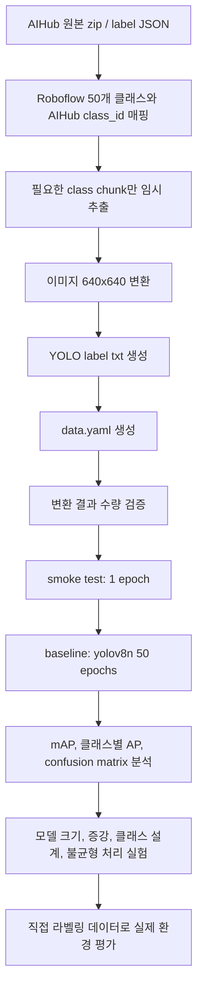

# 2026-05-21 AIHub YOLO Food Detection Study Guide

## 1. 지금 프로젝트가 하려는 일

현재 목표는 AIHub 음식 이미지 데이터를 Roboflow 50개 음식 클래스 기준으로 맞춘 뒤, YOLO 객체 탐지 모델을 학습하는 것이다.

중요한 방향은 단순히 "YOLO를 돌렸다"가 아니라, 다음 흐름을 남기는 것이다.

1. 어떤 데이터를 썼는지 정리한다.
2. 어떤 기준으로 클래스를 맞췄는지 남긴다.
3. baseline 모델을 먼저 학습한다.
4. 결과를 숫자로 분석한다.
5. 약한 부분을 찾아 다음 실험을 설계한다.
6. 개선 전후를 비교한다.

포트폴리오에서 중요한 부분은 최종 점수 하나가 아니라, 성능이 왜 그렇게 나왔고 어떤 판단으로 개선했는지를 설명하는 기록이다.

## 2. 현재 진행 상황

작성 시점: 2026-05-21

| 항목 | 상태 |
| --- | --- |
| 주요 작업 폴더 | `C:\Lemon-sin\backend\food_image_analysis`, `C:\Lemon-sin\data\food_images` |
| AIHub 원본 데이터 | `D:\Deeplearning\lemon\data\raw\aihub\data` |
| YOLO 변환 결과 | `D:\Deeplearning\lemon\data\processed\aihub_yolo_50` |
| 클래스 기준 | Roboflow 50개 클래스 |
| AIHub 매핑 파일 | `C:\Lemon-sin\data\food_images\manifests\roboflow_aihub_class_map_50.csv` |
| Roboflow 업로드용 새 CSV | `C:\Lemon-sin\data\food_images\manifests\roboflow_autolabel_food_prompts_50_aihub_aligned.csv` |
| 변환 스크립트 | `C:\Lemon-sin\data\food_images\scripts\convert_aihub_50_to_yolo.py` |
| 목표 train 수 | 108,580장 |
| 목표 val 수 | 13,780장 |
| 현재 train 변환 수 | 88,465장 |
| 현재 val 변환 수 | 0장 |

현재 숫자는 변환 중간 스냅샷이다. 변환이 계속 진행되면 이 값은 바뀐다.

## 3. 전체 파이프라인



## 4. 폴더와 파일의 역할

### `data/food_images/manifests`

데이터 목록, 클래스 매핑, 변환 기준처럼 "어떤 데이터를 어떻게 쓸지"를 설명하는 파일을 둔다.

현재 중요한 파일은 두 개다.

| 파일 | 역할 |
| --- | --- |
| `roboflow_aihub_class_map_50.csv` | Roboflow 50개 클래스와 AIHub 세부 class_id를 연결 |
| `roboflow_autolabel_food_prompts_50_aihub_aligned.csv` | 원본 Roboflow CSV를 수정하지 않고 만든 AIHub 매칭 완료 버전 |

### `data/food_images/scripts`

데이터 변환 스크립트를 둔다.

현재 핵심 파일은 `convert_aihub_50_to_yolo.py`다.

이 스크립트는 다음 일을 한다.

1. Roboflow 50개 클래스 매핑을 읽는다.
2. AIHub label JSON을 훑어서 50개 클래스에 해당하는 데이터만 고른다.
3. TS/VS zip에서 필요한 class 폴더만 임시로 푼다.
4. 이미지를 640x640 JPG로 저장한다.
5. bbox 좌표를 YOLO 형식으로 바꾼다.
6. `train/images`, `train/labels`, `val/images`, `val/labels` 구조를 만든다.
7. 학습에 필요한 `data.yaml`을 만든다.
8. `--resume`으로 중간부터 다시 이어받을 수 있다.
9. 임시 추출 파일은 `--cleanup-mode delete`로 정리한다.

주의할 점: 여기서 삭제되는 것은 원본 AIHub zip이 아니라, zip에서 잠깐 꺼낸 임시 복사본이다. 원본 데이터와 최종 변환 결과는 유지된다.

## 5. YOLO 데이터 형식

YOLO 객체 탐지 데이터는 보통 다음 구조를 가진다.

```text
dataset/
  data.yaml
  train/
    images/
    labels/
  val/
    images/
    labels/
```

이미지 하나마다 같은 이름의 label txt가 하나 생긴다.

예시:

```text
train/images/sample_001.jpg
train/labels/sample_001.txt
```

label txt 한 줄은 다음 형식이다.

```text
class_index x_center y_center width height
```

예시:

```text
3 0.512 0.481 0.642 0.533
```

뜻은 다음과 같다.

| 값 | 의미 |
| --- | --- |
| `3` | 0부터 시작하는 클래스 번호 |
| `0.512` | bbox 중심 x 위치 |
| `0.481` | bbox 중심 y 위치 |
| `0.642` | bbox 너비 |
| `0.533` | bbox 높이 |

YOLO label 좌표는 픽셀 좌표가 아니라 0부터 1 사이로 정규화된 값이다. 예를 들어 이미지 너비가 640이고 bbox 중심 x가 320이면 `x_center=0.5`가 된다.

Ultralytics 공식 문서도 YOLO detection label을 `class x_center y_center width height` 형식, 0~1 정규화 좌표, 0부터 시작하는 클래스 번호로 설명한다.

참고: [Ultralytics Object Detection Datasets](https://docs.ultralytics.com/datasets/detect)

## 6. `data.yaml`의 역할

`data.yaml`은 YOLO에게 데이터 위치와 클래스 이름을 알려주는 설정 파일이다.

예상 형태:

```yaml
path: D:/Deeplearning/lemon/data/processed/aihub_yolo_50
train: train/images
val: val/images
nc: 50
names:
  0: salad
  1: mixed-rice-bowl
  ...
```

중요한 검증 포인트:

| 항목 | 확인 이유 |
| --- | --- |
| `path` | 데이터셋 루트가 맞아야 함 |
| `train` | train 이미지 폴더를 가리켜야 함 |
| `val` | val 이미지 폴더를 가리켜야 함 |
| `nc: 50` | 클래스 수가 50이어야 함 |
| `names` | Roboflow 클래스 순서와 같아야 함 |

## 7. 현재 이미지 변환 방식

현재 AIHub 변환 스크립트는 이미지를 640x640으로 직접 resize한다.

즉:

- 이미지를 자르는 crop 방식이 아니다.
- 여백을 붙이는 letterbox 방식도 아니다.
- 원본 가로세로 비율이 다르면 이미지가 약간 눌리거나 늘어날 수 있다.

이 방식을 유지하는 이유:

1. AIHub 음식 이미지는 비교적 통제된 형태라 큰 문제가 적을 가능성이 있다.
2. 이미 변환이 많이 진행된 상태다.
3. 지금 단계의 목표는 빠르게 baseline을 확보하는 것이다.

하지만 직접 라벨링한 실제 사진은 별도로 다루는 것이 좋다. 실제 사진은 비율과 촬영 상황이 제각각이므로, 강제 640x640 resize보다 원본 크기 label을 유지하고 YOLO가 내부에서 letterbox 처리하게 두는 쪽이 더 안전하다.

Ultralytics predict 문서에서는 `imgsz=640`이 square target이 되고, `imgsz`가 letterbox target으로 쓰인다고 설명한다. training에서는 단일 정수 `imgsz`를 받는다는 점도 같이 확인할 수 있다.

참고: [Ultralytics Predict Mode](https://docs.ultralytics.com/modes/predict)

## 8. AIHub bbox 해석

샘플 이미지 확인 결과, AIHub bbox는 음식 알맹이만 아주 타이트하게 잡는 방식이라기보다 접시, 그릇, 포장 용기까지 포함한 "제공 단위"에 가깝다.

따라서 현재 모델의 성격은 다음과 같이 잡는 것이 맞다.

| 구분 | 현재 모델 방향 |
| --- | --- |
| 탐지 대상 | 음식 제공 단위 |
| bbox 의미 | 음식 + 그릇/접시/용기 포함 가능 |
| 적합한 사용 | 사진 안에서 어떤 음식이 어디에 있는지 찾기 |
| 부적합한 사용 | 음식 픽셀만 정밀 분리하기 |

음식 부분만 픽셀 단위로 분리하려면 detection이 아니라 segmentation 데이터와 모델이 필요하다.

## 9. 직접 라벨링 데이터의 역할

직접 라벨링한 사진은 학습 데이터로 바로 섞기보다, 우선 검증/테스트 데이터로 쓰는 것이 더 낫다.

이유:

1. AIHub는 단일 음식 중심 사진이 많다.
2. 직접 찍은 사진은 메인 음식과 반찬이 같이 있는 실제 환경 사진일 가능성이 높다.
3. 두 데이터를 무작정 섞으면 모델이 무엇을 기준으로 배워야 하는지 흐려질 수 있다.
4. baseline을 먼저 만든 뒤, 실제 사진에서 얼마나 깨지는지 보는 것이 분석에 더 좋다.

추천 분리:

| 세트 | 용도 |
| --- | --- |
| AIHub train | 모델 학습 |
| AIHub val | 학습 중 기본 검증 |
| 직접 라벨링 main-only test | 메인 음식만 명확한 실제 사진 평가 |
| 직접 라벨링 real-world mixed test | 반찬/여러 음식이 같이 있는 실제 환경 평가 |

직접 라벨링 사진에서 메인 음식만 박싱했다면, 일반적인 mAP 해석은 조심해야 한다. 사진 안에 라벨링하지 않은 반찬이 있는데 모델이 그 반찬을 찾아내면, 평가 방식에 따라 false positive로 잡힐 수 있기 때문이다.

## 10. 학습 단계

### 10.1 Smoke test

목적은 성능이 아니라 학습 파이프라인이 정상 작동하는지 확인하는 것이다.

설정:

| 항목 | 값 |
| --- | --- |
| model | `yolov8n.pt` |
| epochs | 1 |
| workers | 0 |
| 목적 | 데이터 경로, label 형식, GPU 실행, 저장 경로 확인 |

Windows에서는 먼저 `workers=0`으로 돌리는 것이 안전하다. 문제가 생기면 원인을 찾기 쉽다.

### 10.2 Baseline

목적은 앞으로의 실험과 비교할 기준선을 만드는 것이다.

설정:

| 항목 | 값 |
| --- | --- |
| model | `yolov8n.pt` |
| epochs | 50 |
| imgsz | 640 |
| batch | 16 |
| workers | 2 |
| seed | 42 |
| deterministic | true |
| run name | `exp01_yolov8n_baseline` |

Ultralytics 공식 문서는 pretrained `.pt` 모델을 custom dataset에 fine-tuning할 때 backbone/neck의 많은 가중치가 이어지고, 클래스 수가 달라지는 detection head 일부는 새로 초기화된다고 설명한다. 그래서 처음부터 random initialization으로 학습하는 것보다 pretrained 모델로 시작하는 것이 일반적으로 유리하다.

참고: [Ultralytics Fine-Tuning Guide](https://docs.ultralytics.com/guides/finetuning-guide)

## 11. Windows에서 `workers`를 조심하는 이유

`workers`는 데이터를 읽고 전처리하는 보조 프로세스 수다.

| 값 | 의미 |
| --- | --- |
| `workers=0` | 메인 프로세스가 직접 데이터를 읽음 |
| `workers=2` | 보조 프로세스 2개가 데이터를 읽음 |
| `workers=4` | 보조 프로세스 4개가 데이터를 읽음 |

값이 높으면 데이터 로딩이 빨라질 수 있지만, Windows에서는 Python multiprocessing 방식 때문에 문제가 생기기 쉽다. PyTorch 공식 문서에 따르면 Windows와 macOS는 worker를 만들 때 `spawn()` 방식을 쓰며, 별도의 Python interpreter가 실행되고 객체가 직렬화되어 전달된다. 이 때문에 script 구조와 worker 설정에 민감하다.

현재 추천:

| 상황 | 추천 |
| --- | --- |
| 처음 실행 | `workers=0` |
| baseline 학습 | `workers=2` |
| 안정성 확인 전 | `workers=4`는 보류 |

참고: [PyTorch DataLoader Documentation](https://docs.pytorch.org/docs/2.12/data.html)

## 12. 성능 지표 읽는 법

YOLO 학습 결과에서 중요한 지표는 다음과 같다.

| 지표 | 의미 |
| --- | --- |
| Precision | 모델이 찾았다고 한 것 중 실제로 맞은 비율 |
| Recall | 실제 객체 중 모델이 찾아낸 비율 |
| mAP50 | IoU 0.50 기준 평균 AP |
| mAP50-95 | IoU 0.50부터 0.95까지 여러 기준을 평균낸 더 엄격한 지표 |
| Confusion Matrix | 어떤 클래스를 어떤 클래스로 헷갈리는지 보는 표 |
| Inference speed | 이미지 1장 처리 속도 |
| Model size | 배포 시 모델 파일 크기 |

간단히 보면:

- Precision이 낮다: 모델이 너무 많이 찍는다.
- Recall이 낮다: 모델이 놓치는 음식이 많다.
- mAP50은 괜찮고 mAP50-95가 낮다: 대략 위치는 맞지만 bbox가 정밀하지 않을 수 있다.
- 특정 클래스 AP만 낮다: 데이터 수 부족, 클래스 경계 애매함, 라벨 품질 문제를 의심한다.

Ultralytics 문서는 mAP50, mAP50-95, confusion matrix, F1/precision/recall curve 등을 validation 결과에서 확인할 수 있다고 설명한다.

참고:

- [Ultralytics Performance Metrics](https://docs.ultralytics.com/guides/yolo-performance-metrics)
- [Ultralytics Validation Mode](https://docs.ultralytics.com/modes/val)

## 13. Baseline 이후 분석 순서

baseline이 끝나면 바로 다음 실험으로 넘어가지 말고 먼저 분석한다.

### 13.1 데이터 수 분석

클래스별 train 이미지 수를 확인한다.

주의할 클래스:

| 상태 | 의미 |
| --- | --- |
| 300장 미만 | 성능 불안정 가능성 큼 |
| 300~500장 | watchlist |
| 1,000장 이상 | 비교적 안정적 |

현재 사전 분석에서 300장 미만으로 본 클래스:

| 클래스 | train 수 |
| --- | ---: |
| `squid-dish` | 100 |
| `stir-fried-pork` | 240 |
| `mala-hot-pot` | 270 |
| `sweet-and-sour-pork` | 290 |

이 클래스들은 baseline 결과에서 AP를 반드시 확인해야 한다.

### 13.2 bbox 품질 분석

확인할 항목:

| 항목 | 봐야 하는 이유 |
| --- | --- |
| bbox 면적 분포 | 너무 작은 박스가 많으면 학습이 불안정할 수 있음 |
| bbox 비율 | 음식 종류별로 길쭉한 박스/둥근 박스 차이가 있음 |
| 이미지당 객체 수 | 단일 객체 데이터에 치우치면 실제 다중 음식 사진에 약할 수 있음 |
| bbox 시각화 샘플 | 라벨이 실제 음식 위치와 맞는지 확인 |

### 13.3 confusion matrix 분석

가장 많이 헷갈린 클래스 쌍을 뽑는다.

예상 예시:

| 혼동 가능 쌍 | 이유 |
| --- | --- |
| `rice-bowl` vs `mixed-rice-bowl` | 밥 위에 토핑이 올라간 형태가 비슷함 |
| `noodle-soup` vs `udon` | 국물+면 구조가 비슷함 |
| `grilled-beef` vs `barbecue-ribs` | 고기류의 시각적 차이가 약할 수 있음 |
| `fried-food-platter` vs `fish-cake` | 튀김류와 어묵튀김이 비슷할 수 있음 |

이 분석을 통해 클래스 통합, 제거, 데이터 보강 여부를 판단한다.

## 14. 실험 계획

| 실험 | 목적 | 판단 기준 |
| --- | --- | --- |
| `exp00_smoke_yolov8n` | 학습 실행 가능 여부 확인 | 에러 없이 1 epoch 완료 |
| `exp01_yolov8n_baseline` | 기준 성능 확보 | mAP, 클래스별 AP 저장 |
| `exp02_yolov8s_model_size` | 모델 크기 증가 효과 확인 | mAP 상승 폭 vs 속도/크기 |
| `exp03_aug_stronger` | 증강 강화 효과 확인 | 실제 사진 성능 개선 여부 |
| `exp04_class_design` | 애매한 클래스 통합/제거 효과 확인 | 혼동 감소 여부 |
| `exp05_imbalance_sampling` | 소수 클래스 보완 | 소수 클래스 AP 변화 |
| `exp06_realworld_finetune` | 직접 라벨링 데이터 일부 반영 | 실제 환경 test 성능 |

실험을 할 때는 한 번에 여러 요소를 바꾸지 않는 것이 중요하다. 그래야 어떤 변경이 성능에 영향을 줬는지 설명할 수 있다.

## 15. 데이터 증강을 왜 실험하는가

데이터 증강은 원본 이미지를 조금씩 바꿔서 모델이 다양한 상황을 배우게 하는 방법이다.

예:

| 증강 | 의미 |
| --- | --- |
| HSV 조정 | 조명과 색감 변화에 강해짐 |
| Translation | 음식 위치가 조금 달라도 찾도록 학습 |
| Scale | 음식 크기 변화에 대응 |
| Mosaic | 여러 이미지를 합쳐 다양한 위치와 크기 학습 |
| MixUp | 두 이미지를 섞어 과적합 완화 |

Ultralytics 공식 문서는 augmentation이 데이터 다양성을 늘리고, 일반화 성능을 높이며, 과적합을 줄이는 데 도움을 준다고 설명한다.

참고: [Ultralytics Data Augmentation Guide](https://docs.ultralytics.com/guides/yolo-data-augmentation)

## 16. 실험 기록 템플릿

학습이 끝날 때마다 아래 형식으로 기록한다.

| 항목 | 값 |
| --- | --- |
| experiment | `exp01_yolov8n_baseline` |
| date | 2026-05-21 |
| dataset | AIHub YOLO 50 |
| train images | 108,580 |
| val images | 13,780 |
| model | `yolov8n.pt` |
| epochs | 50 |
| imgsz | 640 |
| batch | 16 |
| workers | 2 |
| mAP50 | TODO |
| mAP50-95 | TODO |
| precision | TODO |
| recall | TODO |
| model size | TODO |
| speed | TODO |
| weak classes | TODO |
| next action | TODO |

## 17. 변환 완료 후 체크리스트

변환이 끝나면 아래를 확인한다.

- [ ] train images 108,580장
- [ ] train labels 108,580개
- [ ] val images 13,780장
- [ ] val labels 13,780개
- [ ] `data.yaml` 존재
- [ ] `nc: 50`
- [ ] 클래스 이름 50개
- [ ] 이미지와 label 파일명이 1:1로 맞음
- [ ] label 좌표가 0~1 범위를 벗어나지 않음
- [ ] 샘플 bbox 시각화에서 박스가 음식 제공 단위를 잘 감쌈
- [ ] 임시 추출 폴더가 과도하게 남아 있지 않음

## 18. 지금 공부할 순서

1. YOLO label 형식을 이해한다.
2. `data.yaml`이 왜 필요한지 이해한다.
3. train/val/test의 역할을 구분한다.
4. bbox가 무엇을 감싸는지 확인한다.
5. mAP50과 mAP50-95 차이를 이해한다.
6. baseline을 왜 먼저 해야 하는지 이해한다.
7. confusion matrix로 클래스 혼동을 보는 법을 익힌다.
8. 실험 하나에서 변수 하나만 바꾸는 이유를 이해한다.

## 19. 현재 결정 사항 요약

| 결정 | 이유 |
| --- | --- |
| Roboflow 50개 클래스를 기준으로 학습 | 직접 라벨링 기준과 모델 출력 클래스를 맞추기 위해 |
| AIHub에서 매칭되는 class_id만 사용 | 불필요한 800개 전체 클래스를 학습하지 않기 위해 |
| AIHub는 학습 중심 데이터로 사용 | 양이 많고 라벨이 이미 존재하기 때문 |
| 직접 라벨링 데이터는 우선 검증/테스트로 사용 | 실제 환경 성능을 따로 보기 위해 |
| AIHub 변환은 현재 640x640 직접 resize 유지 | 이미 진행 중이고 baseline 확보가 우선이기 때문 |
| 직접 라벨링 이미지는 별도 변환 방식 고려 | 강제 resize로 왜곡될 가능성이 있기 때문 |
| smoke test는 `workers=0` | Windows multiprocessing 문제를 줄이기 위해 |
| baseline은 `workers=2` | 안정성과 속도의 균형 |

## 20. 읽어볼 공식 자료

| 자료 | 볼 부분 |
| --- | --- |
| [Ultralytics Object Detection Datasets](https://docs.ultralytics.com/datasets/detect) | YOLO 데이터 폴더 구조, label txt 형식, 정규화 좌표 |
| [Ultralytics CLI](https://docs.ultralytics.com/usage/cli) | `yolo detect train`, `yolo val`, `arg=value` 명령 형식 |
| [Ultralytics Fine-Tuning Guide](https://docs.ultralytics.com/guides/finetuning-guide) | pretrained 모델로 custom dataset 학습하는 이유 |
| [Ultralytics Training Mode](https://docs.ultralytics.com/modes/train) | `model`, `data`, `epochs`, `batch`, `imgsz`, `device` 설정 |
| [Ultralytics Validation Mode](https://docs.ultralytics.com/modes/val) | mAP, 클래스별 metric, confusion matrix 확인 |
| [Ultralytics Performance Metrics](https://docs.ultralytics.com/guides/yolo-performance-metrics) | precision, recall, mAP50, mAP50-95 해석 |
| [Ultralytics Data Augmentation](https://docs.ultralytics.com/guides/yolo-data-augmentation) | Mosaic, MixUp, HSV, scale 등 증강 실험 |
| [PyTorch DataLoader](https://docs.pytorch.org/docs/2.12/data.html) | `num_workers`, Windows multiprocessing 동작 |
| [AIHub food image dataset page](https://www.aihub.or.kr/aihubdata/data/view.do?aihubDataSe=&currMenu=&dataSetSn=71711&topMenu=) | AIHub 음식 이미지 데이터 원천 정보 |

## 21. 다음 작업에서 확인할 질문

baseline 이후에는 아래 질문에 답해야 한다.

1. 전체 mAP보다 낮은 클래스는 무엇인가?
2. 낮은 클래스는 데이터 수가 부족한가, 라벨이 애매한가, 시각적으로 비슷한 클래스가 있는가?
3. bbox가 음식 제공 단위를 일관되게 감싸고 있는가?
4. 직접 라벨링한 실제 사진에서 어떤 실패가 많은가?
5. 모델을 키우면 정확도는 얼마나 오르고 속도는 얼마나 느려지는가?
6. 클래스 통합이 필요한 음식군이 있는가?
7. 최종 서비스 관점에서 정확도와 속도의 균형점은 어디인가?

이 질문에 대한 답이 쌓이면 프로젝트는 단순 학습 결과가 아니라 모델 개선 과정으로 설명할 수 있다.
