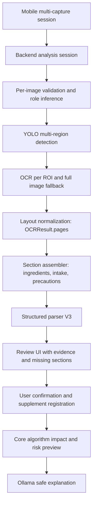

# 2026-05-28 OCR + YOLO + Ollama 기능 재점검 및 보완 계획

## 기준 정보

- 작업 브랜치: `feat/db-internal-learning-pipeline`
- 대상 앱/백엔드: `mobile/`, `backend/Nutrition-backend/`
- 목표:
  - 영양제 통/라벨을 여러 장 촬영한다.
  - YOLO가 유의미한 라벨/성분표/섭취방법 영역을 잡는다.
  - OCR(PaddleOCR, Google Vision, CLOVA)이 해당 영역의 글자를 텍스트로 변환한다.
  - 성분/함량뿐 아니라 섭취 방법, 주의사항, 기능성 문구까지 구조화한다.
  - Ollama multimodal/LLM은 사용자에게 사진 속 보충제를 쉽게 설명하고, 저장된 사용자 정보와 `docs/Nutrition-docs/core-algorithm/` 알고리즘을 바탕으로 추천/권장 설명까지 이어준다.
- 공식 참고:
  - FastAPI는 `list[UploadFile]` 형태로 동일 form field의 여러 파일 업로드를 받을 수 있다: <https://fastapi.tiangolo.com/tutorial/request-files/>
  - Flutter `camera` 플러그인은 camera preview, image capture, video capture, image stream을 지원한다: <https://pub.dev/packages/camera>
  - Ultralytics object detector 출력은 bounding box, class label, confidence로 구성되며 custom model은 `YOLO("path/to/best.pt")` 형태로 로드/검증할 수 있다: <https://docs.ultralytics.com/tasks/detect/>
  - Google Cloud Vision `DOCUMENT_TEXT_DETECTION`은 dense text/document에 최적화되어 page/block/paragraph/word/break 정보를 제공한다: <https://cloud.google.com/vision/docs/ocr>
  - Ollama vision model은 text와 image를 함께 받아 describe/classify/question answering을 수행하며 REST API는 base64 image를 `images` 배열로 받는다: <https://docs.ollama.com/capabilities/vision>
  - PaddleOCR 공식 OCR pipeline은 detection, orientation, recognition 모델과 threshold/side-length 설정을 분리한다: <https://www.paddleocr.ai/main/en/version3.x/pipeline_usage/OCR.html>

## 현재 구현 확인 결과

### 1. 모바일은 단일 이미지 분석 흐름이다

- `mobile/lib/screens/camera_screen.dart`는 `_captured: File?` 하나만 보관한다.
- `분석하기`는 `widget.onAnalyzeSupplementImage(captured.path, ocrProvider: _ocrProvider)`만 호출한다.
- `mobile/lib/features/supplements/supplement_repository.dart`는 `POST /supplements/analyze`에 multipart field `image` 하나만 보낸다.
- 17 Pro 스타일 UI는 적용되어 있지만, 여러 장 촬영/역할 지정/묶음 분석 UI는 아직 없다.

### 2. 백엔드 endpoint도 단일 이미지 계약이다

- `backend/Nutrition-backend/src/api/v1/supplements.py`의 `/api/v1/supplements/analyze`는 `image: UploadFile` 하나만 받는다.
- `client_request_id`, `ocr_provider`, optional barcode fields는 있지만 `images[]`, `image_role`, `multi_image_group_id`, `finalize` 계약은 없다.
- `SupplementAnalysisPreview` 스키마에는 `image_role`, `multi_image_group_id`, `label_sections`, `intake_method`, `evidence_spans` 등이 있지만, 현재 분석 endpoint는 이 필드들을 실제 다중 이미지 흐름으로 채우지 않는다.

### 3. YOLO는 "ROI 1개" 보조 기능이지 구조 추출 기능이 아니다

- `backend/Nutrition-backend/src/vision/yolo.py`의 `YoloLabelDetector`는 `detect_label_region()` 하나를 반환한다.
- `backend/Nutrition-backend/src/services/supplement_image_analysis.py`는 `vision_region: BoundingBox | None` 하나만 OCR input metadata 또는 crop에 사용한다.
- `ENABLE_VISION_CLASSIFIER=false`, `OCR_ROI_PREPROCESSING_POLICY=disabled`가 기본값이다.
- 현재 구조는 `supplement_facts`, `intake_method`, `precautions`, `functional_info` 같은 섹션별 ROI 목록을 만들지 않는다.

### 4. OCR provider는 실행될 수 있지만 layout/section 활용이 약하다

- `src/ocr/base.py`에는 `OCRResult.pages` 기반 layout contract가 있다.
- 현재 PaddleOCR, CLOVA, Google Vision adapter는 주로 flat `OCRResult.text`와 provider confidence 중심으로 동작한다.
- Google Vision provider도 현재 코드에서는 `fullTextAnnotation.text`를 flat text로 꺼내고 confidence 평균만 계산한다. Google 공식 응답이 제공하는 page/block/paragraph/word 구조를 normalized `OCRPage`로 매핑하지 않는다.
- 따라서 parser는 "성분표/섭취방법/주의사항 위치"를 안정적으로 구분하지 못하고, 사진 품질이 낮거나 라벨이 여러 면에 나뉘면 후보가 비기 쉽다.

### 5. Ollama는 현재 사용자 설명 단계가 아니라 OCR 보조/텍스트 parser 단계다

- `src/llm/ollama_vision.py`는 `ollama_vision_assist` OCR-like fallback이다. 시스템 프롬프트도 "visible text fragments only"이며 성분/효과/섭취량을 추론하지 못하게 제한한다.
- `src/llm/ollama.py`의 `OllamaSupplementParser`는 `parsed_product`, `ingredient_candidates`, `low_confidence_fields`, `warnings`만 반환한다.
- `intake_method`, `precautions`, `functional_claims`, `label_sections`, `evidence_spans`를 생성하는 parser contract가 아직 실제 사용 경로에 없다.
- 사용자 친화적 설명은 `/supplements/recommendations/explain`로 별도 존재하지만, 촬영 직후 사진/라벨 기반 설명과 직접 연결되어 있지 않다.

### 6. 알고리즘 추천은 등록 이후 경로에만 붙어 있다

- `AppController.registerSupplement()` 이후 `previewSupplementImpact()`가 `/nutrition/supplement-impact/preview`를 호출한다.
- `explainSupplementRecommendation(useLocalLlm: true)`는 impact preview가 있어야 실행된다.
- OCR/parser가 ingredient 후보를 만들지 못하면 등록이 안 되고, core-algorithm 기반 추천/권장 설명까지 도달하지 못한다.
- `src/nutrition/comprehensive.py`와 `src/services/supplement_recommendation.py`는 사용자 프로필/영양 분석/상호작용 로직을 일부 갖고 있지만, "다중 사진 분석 결과 -> 구조화 확인 -> 사용자 맞춤 설명"이라는 한 흐름으로 묶이지 않았다.

## 목표 대비 Gap

| 목표 | 현재 상태 | Gap |
|---|---|---|
| 여러 장 촬영 | 단일 `_captured` 파일 | multi-image session, role, merge endpoint 없음 |
| YOLO 위치 인식 | ROI 1개 optional | 섹션별/다중 ROI, role classification, missing section 판단 없음 |
| OCR 텍스트 변환 | flat text 중심 | provider layout normalization, 섹션별 OCR result, evidence mapping 부족 |
| 성분/함량 추출 | ingredient candidates만 | 섭취 방법/주의사항/기능성 문구 schema가 parser 경로에 없음 |
| Ollama multimodal 설명 | OCR fallback 또는 parser | 사용자 설명용 multimodal/photo explanation contract 없음 |
| 알고리즘 기반 권장 | 등록 이후 impact preview | parse 실패 시 끊김, 다중 사진 evidence와 사용자 데이터 연결 부족 |

## 원인 분류

### 1차 원인: endpoint와 도메인 계약이 원래 목표보다 좁다

현재 `/supplements/analyze`는 "사진 1장 업로드 후 OCR 후보 preview" 수준이다. 원래 목표는 "여러 장의 이미지에서 라벨 섹션을 수집하고 병합한 뒤 사용자 확인을 거쳐 추천까지 이어지는 분석 세션"이다. 이 차이가 가장 크다.

### 2차 원인: parser schema가 legacy 수준에 머물러 있다

`SupplementAnalysisPreview`와 `SupplementParsedSnapshotV3`에는 섭취 방법/주의사항/evidence 필드가 있지만, `SupplementStructuredParseResult`는 아직 product + ingredient 중심이다. 스키마가 있어도 실제 parser가 채우지 않으면 UI에는 비어 보인다.

### 3차 원인: YOLO를 OCR처럼 기대하고 있다

YOLO는 bounding box/class/confidence를 내는 detector다. 글자를 읽는 OCR 엔진이 아니다. YOLO는 OCR 입력을 더 좋게 만드는 ROI preprocessor로 써야 하고, 실제 텍스트 품질은 OCR provider 및 crop 품질에 달려 있다.

### 4차 원인: 모델 학습보다 orchestration/evaluation이 먼저 부족하다

PaddleOCR fine-tuning이나 YOLO 재학습은 필요할 수 있지만, 현재는 다중 이미지/섹션 parser/평가 지표가 먼저 비어 있다. 학습부터 하면 어떤 문제가 좋아졌는지 측정하기 어렵다.

## 목표 아키텍처

## 상세 구현 계획

### Phase 0. 현재 실패 원인 관측성 보강

- 분석 응답에 raw OCR text 없이 다음 안전 metadata만 추가한다.
  - `image_count`
  - `image_role`
  - `ocr_provider`
  - `ocr_text_present`
  - `ocr_confidence_bucket`
  - `roi_count`
  - `section_count`
  - `parser_contract_version`
  - `missing_required_sections`
- `OCR Auto: Intake` 상태와 `provider=... but ingredients=0` 상태를 UI에서 분리한다.
- 목표:
  - endpoint 미연결
  - OCR empty
  - parser empty
  - review required
  - algorithm data missing
  를 사용자와 개발자가 구분할 수 있게 한다.

### Phase 1. 다중 이미지 backend 계약 추가

- 새 endpoint 후보:
  - `POST /api/v1/supplements/analysis-sessions`
  - `POST /api/v1/supplements/analysis-sessions/{session_id}/images`
  - `POST /api/v1/supplements/analysis-sessions/{session_id}/finalize`
- 단기 호환 endpoint 후보:
  - `POST /api/v1/supplements/analyze-multi`
  - multipart `images: list[UploadFile]`
  - form `image_roles: list[str]`
  - form `ocr_provider`
- 유지할 점:
  - 기존 `/supplements/analyze`는 단일 이미지 smoke와 이전 앱 호환용으로 유지한다.
  - raw image/OCR text는 저장하지 않는다.
  - idempotency key는 `session_id + image_index + image_sha256` 기준으로 설계한다.
- 예상 roles:
  - `front_label`
  - `supplement_facts`
  - `intake_method`
  - `precautions`
  - `barcode`
  - `unknown`

### Phase 2. YOLO ROI를 다중 섹션 detector로 확장

- `VisionAdapter.detect_label_region()` 단일 반환을 보존하되, 새 contract를 추가한다.
  - `detect_regions(image_bytes) -> list[DetectedRegion]`
  - fields: `region_id`, `x`, `y`, `width`, `height`, `label`, `confidence`, `model`
- label taxonomy를 분리한다.
  - supplement container: `supplement_bottle`, `supplement_box`, `blister_pack`
  - label sections: `supplement_facts`, `ingredients`, `intake_method`, `precautions`, `functional_info`, `barcode`
- 현재 팀원이 준 음식 YOLO `best.pt`는 음식 탐지 모델로 분리하고, supplement-label ROI 모델로 오인하지 않는다.
- supplement ROI model이 없을 때는 detector 없이 full image + layout parser로 진행하고, UI에 `YOLO ROI: not configured`를 명확히 표시한다.

### Phase 3. OCR provider layout normalization

- Google Vision:
  - `fullTextAnnotation.pages.blocks.paragraphs.words`를 `OCRResult.pages`로 변환한다.
  - page/block/word bounding box와 confidence를 보존한다.
- PaddleOCR:
  - PaddleOCR result의 box/text/score를 `OCRWord` 또는 line-level block으로 변환한다.
  - PaddleOCR 설정에서 text detection threshold, side length, Korean/English model 설정을 명시한다.
- CLOVA:
  - provider 응답의 bounding information이 있으면 normalized layout으로 변환한다.
- 공통:
  - provider raw payload는 저장하지 않는다.
  - OCR text 전체를 DB에 저장하지 않고, evidence excerpt만 bounded length로 저장한다.

### Phase 4. section assembler + parser V3

- deterministic section assembler를 먼저 둔다.
  - layout heading 후보: `Supplement Facts`, `Nutrition Facts`, `섭취`, `복용`, `주의`, `원재료`, `기능정보`
  - y-band/x-column grouping으로 table row를 구성한다.
  - 섹션별 text bundle을 만든다.
- `SupplementStructuredParseResult`를 V3로 확장한다.
  - `parsed_product`
  - `ingredient_candidates`
  - `label_sections`
  - `intake_method`
  - `precautions`
  - `functional_claims`
  - `evidence_spans`
  - `missing_required_sections`
  - `warnings`
- Ollama parser prompt도 V3 schema에 맞춘다.
  - "visible OCR/layout evidence에 있는 내용만 구조화"
  - "의학적 조언/용량 변경/치료 표현 금지"
  - "섭취 방법은 label-supported field로만 반환"
- parser output은 `SupplementParsedSnapshotV3`로 저장하고, 기존 legacy preview는 upcast 경로로만 유지한다.

### Phase 5. 모바일 multi-capture review UX

- `CameraScreen`은 단일 `_captured` 대신 capture session을 관리한다.
  - `List<CapturedSupplementImage>`
  - 각 image: `path`, `role`, `thumbnail`, `analysisStatus`
- 촬영 후 바로 analyze가 아니라 "사진 추가 / 분석 시작" UX로 바꾼다.
- UI 섹션:
  - 필수 사진 체크리스트: 앞면, 성분표, 섭취방법
  - provider selector: configured, Paddle, Google Vision, CLOVA
  - missing section 안내
  - evidence 기반 review cards
  - manual correction fields
- 기존 `SupplementFlowScreen`에 있던 review/confirmation 기능을 17 Pro 스타일 result screen과 통합한다.

### Phase 6. 등록 이후 알고리즘/추천 연결

- user confirmation 후 `UserSupplementCreate`에 다음을 정확히 매핑한다.
  - `displayName`
  - `manufacturer`
  - `ingredients`
  - `serving`
  - `intakeSchedule`
  - `evidenceRefs`
- 등록 성공 후 자동으로:
  - dashboard refresh
  - `/nutrition/supplement-impact/preview`
  - `/supplements/recommendations/explain`
- explanation 입력은 raw OCR text가 아니라 confirmed supplement facts + deterministic impact preview로 제한한다.
- core algorithm 연결 우선순위:
  - 약물/만성질환/임신/흡연/음주 가드레일
  - KDRIs/UL/중복 성분 검토
  - 목적별 matrix
  - 부족 영양소 보완 가능성
- 사용자 메시지는 "진단/치료/복용량 변경" 표현을 금지하고 "확인/상담/참고" 표현으로 제한한다.

### Phase 7. OCR/YOLO/Ollama 평가 체계

- labeled fixture set을 만든다.
  - 각 제품별 여러 사진: front, facts, intake, warnings
  - 기대 JSON: ingredient, amount, unit, intake text, precautions
- provider별 평가:
  - text presence rate
  - ingredient recall
  - amount/unit exact match
  - intake-method extraction rate
  - section classification accuracy
  - false hallucination rate
- 비교 순서:
  1. full image OCR
  2. YOLO crop + OCR
  3. OCR fallback provider
  4. Ollama vision fallback
  5. parser V3
- PaddleOCR fine-tuning은 이 평가가 생긴 뒤 결정한다.

## 우선순위

### P0

- 단일 이미지/다중 이미지 gap을 명확히 표시하는 metadata/UI 보강
- parser V3 설계 및 `intake_method`, `precautions`, `label_sections`, `evidence_spans` 연결
- Google Vision/PaddleOCR/CLOVA layout normalization 계획 수립 및 최소 1 provider부터 구현
- 모바일에서 여러 장 촬영 세션과 missing section UX 추가

### P1

- multi-image backend endpoint/session 도입
- YOLO multi-region detector contract 추가
- supplement-label ROI model 경로/label taxonomy 분리
- 17 Pro result screen에 review/confirmation 세부 UI 통합

### P2

- provider benchmark 자동화
- PaddleOCR fine-tuning 여부 판단
- Ollama multimodal 설명 전용 contract 추가
- core algorithm explanation을 verified supplement facts 기반으로 고도화

## 검증 계획

- Backend contract:
  - 단일 이미지 기존 endpoint 회귀
  - multi-image endpoint collection/validation
  - image role/missing section 결정
  - provider override 값 `configured`, `paddleocr`, `google_vision`, `clova`
- OCR/vision:
  - YOLO off이면 full-image OCR로 진행
  - YOLO on이고 ROI 있음이면 ROI metadata/crop 사용
  - OCR provider raw payload 저장 금지
  - evidence excerpt bounded 저장
- Parser:
  - 성분/함량뿐 아니라 섭취 방법/주의사항/기능성 문구 추출
  - empty OCR이면 parser 미실행과 사용자 안내 분리
  - low-confidence OCR이면 fallback provider/Ollama assist 정책 실행
- Mobile:
  - 여러 장 추가/삭제/역할 지정
  - 분석 시작 전 필수 사진 안내
  - review screen에서 manual correction
  - 등록 후 impact preview와 local LLM explanation까지 도달
- Quality/security:
  - `flutter analyze`
  - `flutter test`
  - focused backend supplement/OCR tests
  - `git diff --check`
  - `detect-secrets scan`

## 결론

현재 문제는 단순 endpoint 미연결이나 PaddleOCR 학습 부족만으로 보기 어렵다. 더 큰 원인은 현재 구현이 원래 목표보다 좁은 "단일 이미지 OCR preview" 계약으로 되어 있고, YOLO/멀티모달/알고리즘 추천이 하나의 완성된 multi-image supplement analysis flow로 묶이지 않은 것이다.

따라서 다음 구현은 모델 학습보다 먼저 다음 순서로 진행해야 한다.

1. 다중 이미지 세션 계약
2. 섹션별 ROI/OCR/layout normalization
3. parser V3와 evidence 기반 review
4. 사용자 확인 후 등록
5. core-algorithm 기반 impact/recommendation/explanation
6. provider benchmark 이후 필요한 모델 학습
