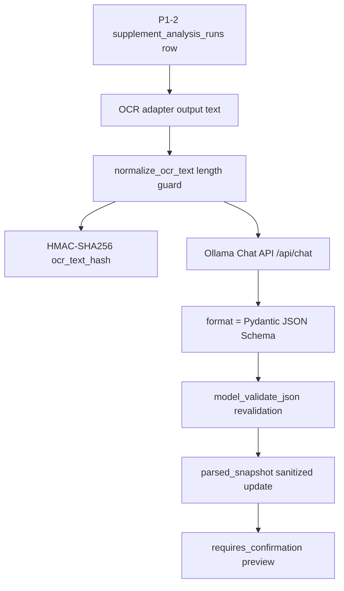

# 21. P1-3 Ollama Structured Parser

> 상태: 구현 완료 | 기준일: 2026-05-12 | 범위: OCR 텍스트 구조화 파싱, preview snapshot 저장

## 1. 목적

P1-3은 P1-2에서 생성한 `supplement_analysis_runs` preview row에 OCR 텍스트 기반 구조화 결과를 저장하는 단계다. 실제 이미지 intake endpoint의 public 계약은 유지하고, OCR adapter가 추출한 텍스트를 내부 service가 받아 로컬 Ollama Structured Outputs로 파싱한다.

이 단계는 사용자 확인 전 preview 생성만 수행한다. 영양제 섭취 기록의 최종 저장은 P1-4에서 `user_supplements`와 `user_supplement_ingredients`로 승격한다.

## 2. 구현 범위

- Pydantic 기반 `SupplementStructuredParseResult` JSON Schema 추가
- Ollama Chat API adapter 추가
- `format`에 Pydantic JSON Schema 전달
- Ollama 응답을 다시 Pydantic으로 재검증
- `analysis_id + owner_subject` 기반 preview row 접근 제어
- OCR text 원문 미저장
- OCR text HMAC-SHA256 fingerprint 저장
- `parsed_snapshot`에 구조화 후보만 저장
- parser model raw response 미저장
- parser 결과는 항상 `requires_confirmation` preview로 유지

## 3. 제외 범위

- public raw OCR text endpoint 추가
- 실제 OCR provider 연동
- 식약처/운영 영양제 DB 매칭
- `nutrient_code` 자동 확정
- 영양제 섭취 기록 최종 저장
- 복용량 변경 또는 의학적 조언 생성

## 4. 구현 파일

| 파일 | 역할 |
|---|---|
| `backend/src/models/schemas/supplement_parser.py` | LLM 구조화 출력 전용 Pydantic schema |
| `backend/src/llm/ollama.py` | Ollama Chat API Structured Outputs adapter |
| `backend/src/services/supplement_parser.py` | owned preview row 검증, OCR hash, snapshot 저장 |
| `backend/src/config.py` | OCR text 길이, parser algorithm version, ingredient 수 제한 설정 |
| `backend/tests/unit/models/test_supplement_parser_schema.py` | schema 검증 테스트 |
| `backend/tests/unit/llm/test_ollama_parser.py` | Ollama adapter mock 테스트 |
| `backend/tests/unit/services/test_supplement_parser.py` | preview 저장 및 보안 가드 테스트 |

## 5. 저장 데이터

| 컬럼 | 저장값 |
|---|---|
| `ocr_provider` | OCR provider label |
| `ocr_confidence` | OCR confidence, 0.0~1.0 |
| `ocr_text_hash` | OCR text HMAC-SHA256 fingerprint |
| `parsed_snapshot.parsed_product` | 제품명, 제조사, serving 후보 |
| `parsed_snapshot.ingredient_candidates` | 성분명, amount, unit, confidence, source |
| `parsed_snapshot.low_confidence_fields` | 사용자 확인이 필요한 field path |
| `parsed_snapshot.parser_metadata` | provider, source, model, algorithm version, raw 저장 여부 |
| `warnings` | 사용자 확인 필요 warning |
| `algorithm_version` | `supplement-ollama-parser-v1.0.0` |

`parsed_snapshot`에는 OCR 원문, prompt, Ollama raw response를 저장하지 않는다.

## 6. 보안 결정

1. **로컬 Ollama만 사용한다.**
   `ALLOW_EXTERNAL_LLM=false`일 때 `OLLAMA_BASE_URL`은 `localhost`, `127.0.0.1`, `::1`만 허용한다.

2. **OCR text는 원문 저장하지 않는다.**
   짧은 OCR 문장은 단순 SHA-256만으로 재식별 위험이 있으므로 `PRIVACY_HASH_SECRET` 기반 HMAC-SHA256 fingerprint만 저장한다.

3. **LLM이 내부 nutrient code를 만들지 못하게 한다.**
   `nutrient_code`는 structured parser schema에서 `null`만 허용한다. KDRIs/nutrient catalog mapping은 후속 deterministic mapping 단계에서 수행한다.

4. **Prompt injection을 데이터로만 취급한다.**
   OCR text는 user message 안의 `<ocr_text>` block으로 전달하고, system prompt는 extraction-only 역할과 의학 조언 금지를 명시한다.

5. **응답은 이중 검증한다.**
   Ollama `format`에 JSON Schema를 전달하더라도 응답 `message.content`는 반드시 `SupplementStructuredParseResult.model_validate_json()`으로 재검증한다.

6. **사용자 확인 전 확정 저장하지 않는다.**
   parser 결과는 `requires_confirmation` preview에만 저장한다. 최종 저장은 P1-4에서 `user_confirmed=true` 요청만 허용한다.

## 7. 알고리즘 흐름



## 8. 설정값

| 설정 | 기본값 | 목적 |
|---|---:|---|
| `SUPPLEMENT_OCR_TEXT_MAX_CHARS` | 12000 | Ollama로 보낼 OCR text 길이 제한 |
| `SUPPLEMENT_PARSER_ALGORITHM_VERSION` | `supplement-ollama-parser-v1.0.0` | parser snapshot version |
| `SUPPLEMENT_PARSER_MAX_INGREDIENTS` | 80 | 성분 후보 수 제한 |
| `OLLAMA_BASE_URL` | `http://127.0.0.1:11434` | 로컬 Ollama API |
| `OLLAMA_MODEL` | `qwen3.5:9b` | 텍스트 구조화 모델 |
| `OLLAMA_TEMPERATURE` | 0 | 구조화 출력 안정성 |

## 9. 검증

```bash
cd yeong-Vision-Nutrition/backend
python -m pytest -o addopts='' \
  tests/unit/models/test_supplement_parser_schema.py \
  tests/unit/llm/test_ollama_parser.py \
  tests/unit/services/test_supplement_parser.py
```

검증 결과: 11개 테스트 통과.

## 10. 후속 단계

1. P1-3b에서 실제 OCR adapter가 `parse_supplement_analysis_ocr_text()`를 호출하도록 연결한다.
2. P1-4에서 사용자 확인 저장 API를 구현하고 preview를 `user_supplements`로 승격한다. 이 단계는 구현 완료되었으며 상세 설계는 `docs/22-p1-4-supplement-registration-matching.md`를 기준으로 한다.
3. P1-5에서 운영 영양제 reference DB import 품질과 deterministic nutrient alias mapping을 확장한다.
4. 운영 전 실제 Ollama 서버 smoke test를 별도 opt-in 테스트로 분리한다.

## 11. 참고한 공식 문서/보안 기준

- Ollama Chat API: https://docs.ollama.com/api/chat
- Ollama Structured Outputs: https://docs.ollama.com/capabilities/structured-outputs
- Pydantic JSON Schema: https://docs.pydantic.dev/latest/concepts/json_schema/
- Pydantic BaseModel API: https://docs.pydantic.dev/latest/api/base_model/
- Python hmac: https://docs.python.org/3/library/hmac.html
- Python hashlib: https://docs.python.org/3/library/hashlib.html
- OWASP LLM01 Prompt Injection: https://genai.owasp.org/llmrisk/llm01-prompt-injection/
