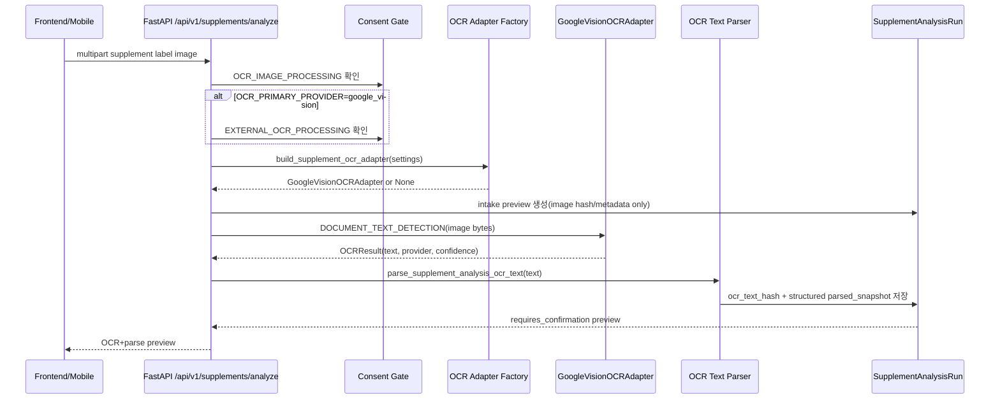

# 35. Google Vision OCR Provider 상세 설계 및 구현 플랜

작성일: 2026-05-14
상태: 상세 설계 완료 전 문서화 / 구현 전 플랜
대상 브랜치: `team/yeong-tech` 반영 전용, `main` 직접 커밋/푸시 제외
범위: `POST /api/v1/supplements/analyze`에서 Google Cloud Vision OCR + OCR text parse preview를 한 번에 동작시키기 위한 구현 설계

## 0. 현재 결정 사항

프로젝트 방향은 **성능 우선 OCR**이다. 따라서 영양제 라벨 이미지의 1차 OCR provider는 로컬 OCR이 아니라 **Google Cloud Vision `DOCUMENT_TEXT_DETECTION`** 으로 설계한다.

이미 완료된 사전 작업:

- Google Cloud Project 생성
- Billing 연결
- Cloud Vision API 활성화

아직 구현 전에 끝내야 하는 사전 작업:

- OCR 호출 전용 service account 생성 또는 배포환경 attached service account 결정
- local 개발용 인증 방식 확정: `GOOGLE_APPLICATION_CREDENTIALS` 또는 local ADC
- credential JSON 파일을 repo, docs, fixture, issue/PR 본문에 남기지 않는 운영 규칙 확정
- Google Vision 사용량 budget/quota alert 설정
- 외부 OCR 이미지 전송에 대한 별도 동의 문구 리뷰
- 한국어+영어 혼합 영양제 라벨 fixture 수집 및 benchmark 기준 확정

## 1. 공식 문서 확인 기준

| 항목 | 공식 문서에서 확인한 내용 | 본 프로젝트 적용 |
| --- | --- | --- |
| OCR feature | Cloud Vision OCR는 `TEXT_DETECTION`과 `DOCUMENT_TEXT_DETECTION`을 제공한다. `DOCUMENT_TEXT_DETECTION`은 dense text와 문서형 구조 OCR에 맞다. | 영양성분표, 원료명, 섭취량처럼 밀집 텍스트가 많은 영양제 라벨은 `DOCUMENT_TEXT_DETECTION`을 기본 feature로 사용한다. |
| REST API | `images:annotate`는 batch image annotation API이며 `POST https://vision.googleapis.com/v1/images:annotate`로 호출한다. `parent=projects/{project-id}/locations/{location-id}`는 선택값이며 `us`, `eu` location을 지원한다. | MVP는 Python client로 online image annotation만 사용한다. 비동기 batch/GCS output 방식은 raw image 보관 복잡도가 커서 제외한다. |
| Python client | `ImageAnnotatorClient`는 credentials를 명시하지 않으면 환경에서 credentials를 찾고, `batch_annotate_images`는 `timeout` parameter를 받는다. | adapter는 client/fake client를 주입 가능하게 만들고, 실제 호출은 timeout을 설정한다. FastAPI async 경로에서는 sync client 호출을 thread offload로 감싼다. |
| 인증 | Application Default Credentials는 `GOOGLE_APPLICATION_CREDENTIALS`, local ADC file, attached service account 순서로 credentials를 찾는다. Google은 service account key를 보안 리스크로 명시한다. | local dev는 service account key path를 허용하되 git 금지. production은 attached service account 또는 federation 우선. |
| 데이터 사용 | online immediate operation인 `BatchAnnotateImages`/`BatchAnnotateFiles`는 image data를 memory에서 처리하고 disk에 persist하지 않는다고 설명한다. Google은 Vision API에 보낸 content를 Vision 기능 학습/개선에 사용하지 않는다고 설명한다. | 그럼에도 외부 provider 전송이므로 별도 consent와 audit gate를 둔다. raw image와 raw OCR text는 우리 DB에 저장하지 않는다. |
| 과금 | Vision pricing은 image 단위, feature 단위 과금이며 `Text Detection`과 `Document Text Detection` 항목이 따로 공시된다. | 운영 전 pricing page 기준으로 예산 알림을 설정한다. 문서에는 내부 cost 절감 수치를 만들지 않는다. |

참조 URL:

- Cloud Vision OCR: https://cloud.google.com/vision/docs/ocr
- Cloud Vision REST `images:annotate`: https://cloud.google.com/vision/docs/reference/rest/v1/images/annotate
- Cloud Vision Python `ImageAnnotatorClient`: https://cloud.google.com/python/docs/reference/vision/latest/google.cloud.vision_v1.services.image_annotator.ImageAnnotatorClient
- Cloud Vision Data Usage FAQ: https://cloud.google.com/vision/docs/data-usage
- Application Default Credentials: https://cloud.google.com/docs/authentication/application-default-credentials
- ADC setup: https://cloud.google.com/docs/authentication/provide-credentials-adc
- Create service accounts: https://cloud.google.com/iam/docs/service-accounts-create
- Service account security best practices: https://cloud.google.com/iam/docs/best-practices-service-accounts
- Cloud Vision pricing: https://cloud.google.com/vision/pricing

확인 한계:

- I cannot find the official documentation for a Vision-specific predefined runtime caller role for `images:annotate`. 공식 OCR guide는 API 활성화 권한, OAuth scopes, ADC/least-privilege 원칙은 명시하지만 `roles/vision.*` 형태의 전용 호출자 role을 구현 조건으로 제시하지 않는다. 따라서 구현 전 실제 service account smoke test로 최소 권한을 확인하고, `Owner`/`Editor` 권한 부여는 금지한다.

## 2. 기존 문서와의 관계

| 문서 | 이번 문서에서 갱신하는 점 |
| --- | --- |
| [docs/25](./25-ocr-text-supplement-analysis-plan.md) | OCR text를 structured parse preview로 넘기는 흐름은 유지한다. |
| [docs/26](./26-ot-s2-ocr-provider-adapter-implementation-plan.md) | OT-S2 1차 provider 후보가 CLOVA 중심이었으나, 현재 프로젝트 결정은 Google Vision primary이다. adapter 계약은 그대로 사용한다. |
| [docs/27](./27-ot-s2b-google-vision-ocr-review-plan.md) | Google Vision이 "검토 후보"였던 상태를 "1차 구현 대상"으로 승격한다. |
| [docs/31](./31-backend-feature-specifications.md) | 현재 구현 상태는 여전히 `NoopOCRAdapter`만 export한다. Google Vision 구현 후 현행 상태 표를 갱신한다. |
| [docs/33](./33-three-tier-ocr-pipeline-implementation-guide.md) | 3-tier 목표 구조 중 Tier 2를 먼저 구현한다. YOLO ROI와 Ollama vision assist는 2차 단계로 둔다. |

## 3. 브레인스토밍 결론

검토한 선택지는 세 가지다.

| 선택지 | 장점 | 리스크 | 결론 |
| --- | --- | --- | --- |
| Google Vision 단독 MVP | 가장 빨리 `/supplements/analyze`에서 실제 OCR+parse preview를 확인할 수 있다. 현재 `OCRAdapter` 경계와 잘 맞는다. | ROI crop이 없어 배경/반사/작은 글씨에서 비용과 품질 편차가 생길 수 있다. | 1차 구현으로 채택 |
| YOLO ROI 후 Google Vision | 라벨 영역만 보내 OCR 노이즈를 줄일 수 있다. docs/33 목표 구조와 일치한다. | YOLO gate, model file, ROI crop 검증이 추가되어 첫 provider 연결이 늦어진다. | 2차 최적화 |
| Google Vision 후 Ollama vision fallback/cross-check | OCR empty/low-confidence 상황에서 사용자 확인 품질을 높일 수 있다. | fallback 판단, 모델 설치 상태, hallucination guard가 추가된다. | 2차 안정화 |

이번 구현 플랜의 1차 목표는 **Google Vision full-image OCR + 기존 OCR text parser preview**다. 즉, `POST /api/v1/supplements/analyze`가 이미 검증한 이미지 intake를 만들고, Google Vision text를 받아 `parse_supplement_analysis_ocr_text`로 이어지게 한다.

## 4. 목표 실행 흐름



핵심 원칙:

- API response는 preview이며, 사용자가 확인하기 전에는 건강 조언이나 복용량 변경 안내로 취급하지 않는다.
- 원본 이미지는 DB에 저장하지 않는다. 현재 `SupplementAnalysisRun`은 `image_sha256`, image metadata, `ocr_text_hash`, structured snapshot을 저장하는 구조다.
- raw OCR text는 DB에 저장하지 않는다. parser 단계에서 HMAC hash만 남기는 현행 정책을 유지한다.
- OCR provider 장애는 사용자 확인 가능한 실패/수동 입력 흐름으로 degrade한다.

## 5. 설정 설계

현재 backend `Settings`에는 `google_application_credentials`만 있고 provider 선택값과 외부 OCR gate는 없다. 구현 시 다음 필드를 추가한다.

```python
ocr_primary_provider: Literal["none", "google_vision"] = "none"
allow_external_ocr: bool = False
google_cloud_project: str | None = None
google_vision_location: Literal["global", "us", "eu"] = "global"
google_vision_feature: Literal["document_text_detection"] = "document_text_detection"
google_vision_language_hints: list[str] = Field(default_factory=list)
google_vision_timeout_seconds: int = Field(default=15, ge=1, le=60)
```

환경변수 예시:

```dotenv
OCR_PRIMARY_PROVIDER=google_vision
ALLOW_EXTERNAL_OCR=true
GOOGLE_APPLICATION_CREDENTIALS=/absolute/path/to/local-dev-service-account.json
GOOGLE_CLOUD_PROJECT=your-project-id
GOOGLE_VISION_LOCATION=global
GOOGLE_VISION_FEATURE=document_text_detection
GOOGLE_VISION_LANGUAGE_HINTS=[]
GOOGLE_VISION_TIMEOUT_SECONDS=15
```

검증 규칙:

- 기본값은 `OCR_PRIMARY_PROVIDER=none`, `ALLOW_EXTERNAL_OCR=false`다.
- `OCR_PRIMARY_PROVIDER=google_vision`인데 `ALLOW_EXTERNAL_OCR=false`이면 startup 또는 dependency 생성 단계에서 fail closed한다.
- local dev에서 service account JSON을 사용할 수 있지만 repo 안에 두지 않는다.
- production에서는 `GOOGLE_APPLICATION_CREDENTIALS` path만 강제하지 않는다. attached service account/Workload Identity 계열을 사용할 수 있기 때문이다. 대신 `google.auth.default()` 기반 preflight 또는 실제 smoke test로 credentials가 유효한지 확인한다.
- `GOOGLE_VISION_LOCATION=us|eu`를 쓰려면 `GOOGLE_CLOUD_PROJECT`가 필요하다. MVP 기본값은 `global`이다.
- `GOOGLE_VISION_LANGUAGE_HINTS`는 기본 빈 배열이다. `["ko", "en"]`은 fixture benchmark에서 개선이 확인된 경우에만 켠다.

`config/implementation-readiness.settings.json` 보정 방향:

- 현재 `OCR_PRIMARY_PROVIDER.default=google_vision`은 안전 기본값과 맞지 않는다. 코드 구현 시 config manifest는 `none` 기본값, Google Vision은 명시 opt-in으로 맞춘다.
- `OCR_FALLBACK_PROVIDER=clova`는 아직 구현되지 않은 fallback이므로 후속 구현 상태가 명확해질 때까지 기본 OFF로 낮춘다.

## 6. Consent / Privacy 설계

현행 `/supplements/analyze`는 `ConsentType.OCR_IMAGE_PROCESSING`만 요구한다. Google Vision은 외부 provider로 이미지 bytes를 전송하므로 기존 OCR 동의와 분리하는 편이 낫다.

권장 변경:

```python
class ConsentType(StrEnum):
    OCR_IMAGE_PROCESSING = "ocr_image_processing"
    EXTERNAL_OCR_PROCESSING = "external_ocr_processing"
```

정책 문구 방향:

- `OCR_IMAGE_PROCESSING`: "영양제 라벨 이미지를 텍스트 추출 및 분석 preview 생성을 위해 처리합니다."
- `EXTERNAL_OCR_PROCESSING`: "텍스트 추출 성능 향상을 위해 영양제 라벨 이미지가 Google Cloud Vision API로 전송될 수 있습니다. 원본 이미지는 서비스 DB에 저장하지 않으며, 분석 결과는 사용자가 확인하기 전까지 preview입니다."

DB 영향:

- `ConsentPolicy.consent_type`과 `ConsentRecord.consent_type`은 `String(64)` 컬럼이므로 enum value 추가 자체는 DB schema migration 없이 가능할 가능성이 높다.
- 다만 active policy seed/sync, consent state response, API contract test는 반드시 추가한다.

API gate:

- `OCR_PRIMARY_PROVIDER=none`: 기존처럼 `OCR_IMAGE_PROCESSING`만 확인한다.
- `OCR_PRIMARY_PROVIDER=google_vision`: `OCR_IMAGE_PROCESSING`과 `EXTERNAL_OCR_PROCESSING`을 모두 확인한 뒤 adapter를 호출한다.
- missing consent response는 `403 consent_required`와 `required_consents` 배열에 누락 동의를 모두 담는다.

Audit:

- provider 호출 전 consent 부족: `supplement_external_ocr_blocked`
- provider 성공: `supplement_ocr_provider_completed`
- provider 실패: `supplement_ocr_provider_failed`
- metadata에는 provider, confidence presence, raw image/text 저장 여부만 남긴다.
- credential path, raw OCR text, raw image bytes, Google response 원문은 audit/log에 남기지 않는다.

## 7. Adapter 설계

추가 파일:

- `backend/src/ocr/providers/google_vision.py`
- `backend/src/ocr/factory.py`
- `backend/tests/unit/ocr/test_google_vision_provider.py`
- `backend/tests/unit/ocr/test_ocr_factory.py`
- `backend/tests/integration/api/test_supplement_analyze_google_vision.py`

adapter contract:

```python
class GoogleVisionOCRAdapter(OCRAdapter):
    """Google Cloud Vision OCR adapter for supplement label images."""

    async def extract_text(self, image: OCRImageInput) -> OCRResult:
        """Extract dense supplement label text with Google Vision.

        Args:
            image: Validated supplement label image payload.

        Returns:
            OCR text, provider label, and optional normalized confidence.

        Raises:
            OCRError: If Google Vision authentication, quota, timeout, or response parsing fails.
        """
```

request strategy:

- `google-cloud-vision` Python client를 사용한다.
- feature는 `DOCUMENT_TEXT_DETECTION`만 MVP에 포함한다.
- image bytes는 online `BatchAnnotateImages` 계열 호출로 전달한다.
- async batch, GCS input/output은 MVP에서 제외한다.
- `ImageAnnotatorClient`는 adapter 생성자에서 주입받을 수 있게 한다. 테스트는 fake client만 사용한다.
- sync client 호출은 `anyio.to_thread.run_sync`로 감싼다.

response normalization:

1. `response.error`가 있으면 sanitized `OCRError`로 변환한다.
2. `full_text_annotation.text`를 우선 사용한다.
3. 없으면 `text_annotations[0].description`을 fallback 후보로 사용한다.
4. 둘 다 없으면 `OCRResult(text="", provider="google_vision_document", confidence=None)`을 반환한다.
5. confidence는 word/page/block confidence가 실제 response에 존재할 때만 평균 후보로 계산한다. 값이 없으면 `None`으로 둔다. 임의 confidence를 만들지 않는다.

provider label:

- `google_vision_document`

factory:

```python
def build_supplement_ocr_adapter(settings: Settings) -> OCRAdapter | None:
    if settings.ocr_primary_provider == "none":
        return None
    if settings.ocr_primary_provider == "google_vision":
        if not settings.allow_external_ocr:
            raise OCRConfigurationError("ALLOW_EXTERNAL_OCR=true is required for Google Vision.")
        return GoogleVisionOCRAdapter(...)
```

## 8. API 연결 설계

현재 `analyze_supplement_image(..., adapters=None)`는 adapter가 없으면 intake-only로 동작한다. 따라서 API route는 다음 dependency를 추가하는 방식이 가장 작다.

```python
def get_supplement_image_analysis_adapters(
    settings: Annotated[Settings, Depends(get_settings)],
) -> SupplementImageAnalysisAdapters:
    return SupplementImageAnalysisAdapters(
        ocr=build_supplement_ocr_adapter(settings),
    )
```

route 변경:

- `analyze_supplement_label`에서 settings 기준으로 필요한 consent 목록을 계산한다.
- Google Vision provider가 선택된 경우 `EXTERNAL_OCR_PROCESSING`도 확인한다.
- `analyze_supplement_image(..., adapters=adapters)`로 adapter를 전달한다.
- `OCRError`와 provider 설정 오류를 안정적인 HTTP error로 mapping한다.

HTTP error 후보:

| 상황 | HTTP | code |
| --- | --- | --- |
| 외부 OCR 동의 없음 | 403 | `consent_required` |
| Google Vision 설정 누락 또는 gate 불일치 | 503 | `ocr_provider_unconfigured` |
| Google auth/quota/timeout/5xx | 502 | `ocr_provider_unavailable` |
| OCR text empty | 202 | preview 유지, warning 추가 |
| OCR text parse 실패 | 202 또는 422 | 현재 parser error 정책과 맞춰 결정 |

## 9. 프론트/모바일 UX 문구

Google Vision 연결 후에도 결과는 확정 정보가 아니라 preview다.

상태별 문구:

| 상태 | 사용자 표시 문구 |
| --- | --- |
| OCR 진행 중 | `라벨에서 텍스트를 추출하고 있어요.` |
| OCR 성공 + parse preview | `추출된 성분과 섭취 정보를 확인해 주세요.` |
| low confidence | `일부 글자가 불확실해요. 저장 전 라벨과 비교해 주세요.` |
| OCR empty | `텍스트를 자동으로 읽지 못했어요. 직접 입력하거나 다시 촬영해 주세요.` |
| provider unavailable | `현재 자동 텍스트 추출을 사용할 수 없어요. 직접 입력으로 계속할 수 있습니다.` |
| external consent missing | `외부 OCR 처리를 허용하면 더 정확한 텍스트 추출을 사용할 수 있습니다.` |

표시 금지:

- "정확히 판독했습니다"
- "복용량을 변경하세요"
- "의학적으로 안전합니다"
- Google Vision confidence를 의료적 신뢰도로 해석하는 문구

## 10. 학습 데이터 저장 정책

Google Vision 도입과 학습 데이터 저장은 분리한다.

- `ENABLE_IMAGE_LEARNING_PIPELINE=false` 기본값 유지
- `ConsentType.IMAGE_LEARNING_DATASET` 별도 opt-in 유지
- Google Vision OCR 호출 성공 여부와 관계없이 원본 이미지 학습 저장은 하지 않는다.
- 학습 데이터 저장은 동의/익명화/보관기간/삭제 요청 정책 리뷰 후 별도 PR로만 활성화한다.

## 11. 단계별 구현 플랜

### GVO-0. 문서 확정

- 이 문서를 팀 리뷰 기준 문서로 사용한다.
- docs/26의 CLOVA 우선순위와 docs/27의 Google 후보 상태를 이번 결정으로 갱신한다.
- `main` 병합은 제외하고 `team/yeong-tech` 기준으로 리뷰한다.

### GVO-1. Settings / config gate

- `Settings`에 OCR provider 필드 추가
- `.env.example`에 Google Vision opt-in 예시 추가
- `implementation-readiness.settings.json` 기본값을 fail-closed로 보정
- `test_config.py`에 기본 OFF, gate mismatch, production preflight 정책 테스트 추가

### GVO-2. Consent contract

- `ConsentType.EXTERNAL_OCR_PROCESSING` 추가
- `ACTIVE_CONSENT_POLICIES`에 외부 OCR 정책 추가
- `/api/v1/privacy/consents` response 테스트 보강
- `/supplements/analyze` missing consent response에 required consent 배열 검증

### GVO-3. GoogleVisionOCRAdapter

- `backend/src/ocr/providers/google_vision.py` 추가
- fake client 기반 unit test 작성
- response parsing, empty result, provider error, timeout mapping 테스트
- confidence가 없을 때 `None`을 유지하는 테스트 추가

### GVO-4. Adapter factory + API route wiring

- `backend/src/ocr/factory.py` 추가
- `providers/__init__.py` export 업데이트
- `/supplements/analyze` dependency에서 adapter 주입
- `analyze_supplement_image`는 기존 adapter contract 그대로 사용
- OCR 성공 시 parser가 호출되어 preview가 `requires_confirmation`으로 반환되는 integration test 추가

### GVO-5. Manual Google smoke test

실제 Google 호출은 CI 기본 job에서 실행하지 않는다.

```bash
GOOGLE_APPLICATION_CREDENTIALS=/absolute/path/to/local-dev-service-account.json \
OCR_PRIMARY_PROVIDER=google_vision \
ALLOW_EXTERNAL_OCR=true \
RUN_GOOGLE_VISION_SMOKE=1 \
pytest yeong-Vision-Nutrition/backend/tests/integration/ocr/test_google_vision_smoke.py -q
```

필수 확인:

- sample label image에서 non-empty OCR text 반환
- raw image file이 repo/DB에 저장되지 않음
- raw OCR text가 DB에 저장되지 않고 `ocr_text_hash`만 저장됨
- `/api/v1/supplements/analyze`가 OCR+parse preview를 한 번에 반환
- Google credential path가 log/audit에 남지 않음

### GVO-6. Team review and branch strategy

- 작업 브랜치: `codex/google-vision-ocr-provider` 또는 현재 안정화 브랜치에서 분리
- 반영 대상: `team/yeong-tech`
- 제외: `main` 직접 커밋/푸시/merge
- PR/리뷰 기준:
  - settings fail-closed
  - consent 없이 provider 호출 불가
  - raw image/raw OCR text 미저장
  - fake client 테스트가 기본 CI에서 통과
  - real Google smoke는 opt-in manual job만 실행

## 12. 테스트 수용 기준

unit:

- `OCR_PRIMARY_PROVIDER=none`이면 factory가 `None` 반환
- `OCR_PRIMARY_PROVIDER=google_vision` + `ALLOW_EXTERNAL_OCR=false`이면 설정 오류
- Google fake response full text -> `OCRResult.text`
- empty response -> empty text + `confidence=None`
- provider error/timeout -> `OCRError`
- response confidence가 없으면 임의 점수 생성 금지

integration:

- 외부 OCR 동의 없으면 Google fake client가 호출되지 않음
- 동의 2종이 모두 있으면 `/supplements/analyze`가 OCR adapter와 parser를 호출
- OCR text가 있으면 `ocr_provider`, `ocr_confidence`, `ocr_text_hash`, `parsed_snapshot`이 저장됨
- raw OCR text는 저장되지 않음
- raw image bytes는 저장되지 않음
- Google provider 장애 시 사용자에게 수동 확인/입력 가능한 오류 또는 warning 반환

manual smoke:

- 실제 Google credential로 최소 1장 sample image에서 non-empty text 확인
- sample image와 credential은 repo에 커밋하지 않음
- 사용량/과금은 Cloud Console에서 확인

## 13. 구현 전 체크리스트

- [ ] service account 또는 attached service account 방식 결정
- [ ] local credential 파일 위치 결정 및 `.gitignore` 재확인
- [ ] Google Cloud budget/quota alert 설정
- [ ] `EXTERNAL_OCR_PROCESSING` consent 문구 팀 리뷰
- [ ] OCR sample fixture 5장 이상 준비
- [ ] `OCR_PRIMARY_PROVIDER=none` fail-closed 기본값 확정
- [ ] fake client test 설계 완료
- [ ] real Google smoke test는 opt-in으로만 실행되도록 marker/env gate 설계
- [ ] `team/yeong-tech` 리뷰 후 반영, `main` 작업 제외
